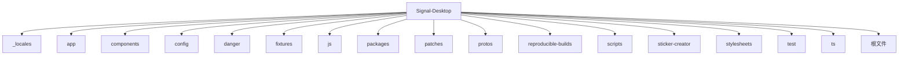
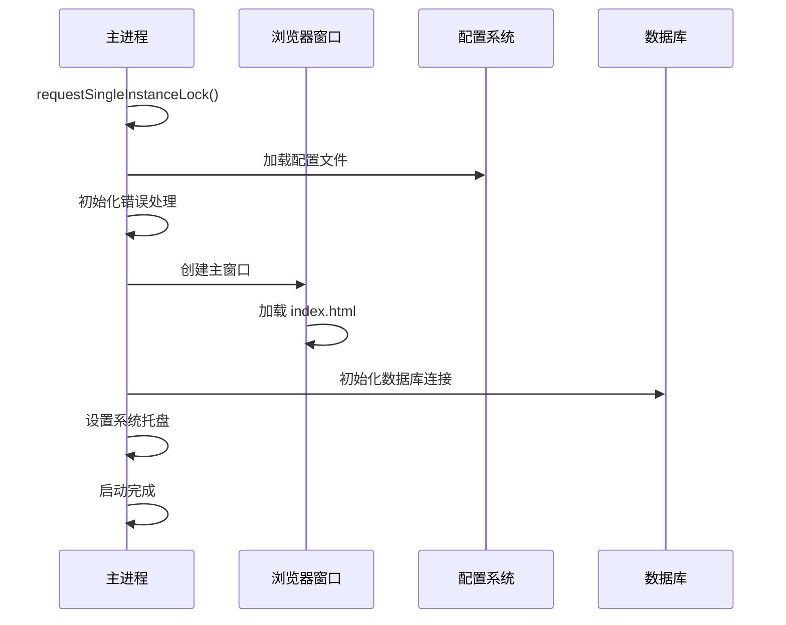
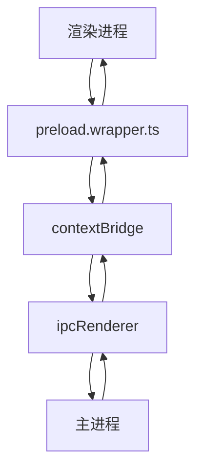
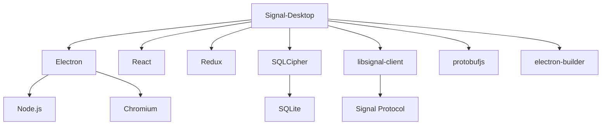

# 架构设计

<cite>
**本文档引用的文件**   
- [main.main.ts](file://app/main.main.ts)
- [package.json](file://package.json)
- [README.md](file://README.md)
- [config.main.ts](file://app/config.main.ts)
- [main.main.js](file://ts/sql/main.main.js)
- [preload.wrapper.ts](file://preload.wrapper.ts)
- [RendererConfig.std.ts](file://ts/types/RendererConfig.std.ts)
- [default.json](file://config/default.json)
</cite>

## 目录
1. [引言](#引言)
2. [项目结构](#项目结构)
3. [核心组件](#核心组件)
4. [架构概述](#架构概述)
5. [详细组件分析](#详细组件分析)
6. [依赖分析](#依赖分析)
7. [性能考虑](#性能考虑)
8. [故障排除指南](#故障排除指南)
9. [结论](#结论)

## 引言
Signal-Desktop 是一个基于 Electron 框架的桌面应用程序，为用户提供与 Signal 移动应用链接的私密消息服务。该应用支持 Windows、macOS 和 Linux 平台，通过主进程和渲染进程的分离架构实现系统集成、数据库访问和用户界面展示。本架构文档旨在描述 Signal-Desktop 的高层设计、架构模式、系统边界以及主进程与渲染进程之间的交互。

## 项目结构
Signal-Desktop 项目采用模块化结构，主要分为以下几个目录：
- `_locales/`: 国际化语言文件
- `app/`: 主进程代码，包含应用初始化、系统托盘、通知等
- `components/`: 第三方组件库
- `config/`: 应用配置文件
- `danger/`: 代码质量检查工具
- `fixtures/`: 测试数据
- `js/`: JavaScript 工具库
- `packages/`: 自定义 npm 包
- `patches/`: 第三方库补丁
- `protos/`: Protocol Buffer 定义文件
- `reproducible-builds/`: 可重现构建配置
- `scripts/`: 构建和准备脚本
- `sticker-creator/`: 贴纸创建器
- `stylesheets/`: 样式表文件
- `test/`: 测试文件
- `ts/`: TypeScript 源代码
- 其他根目录文件：package.json、README.md 等



**Diagram sources**
- [package.json](file://package.json#L1-L714)

**Section sources**
- [package.json](file://package.json#L1-L714)

## 核心组件
Signal-Desktop 的核心组件包括主进程、渲染进程、数据库访问层和配置管理系统。主进程负责应用生命周期管理、系统集成和数据库访问，而渲染进程处理用户界面和业务逻辑。应用使用 Electron 框架实现跨平台功能，通过 IPC（进程间通信）机制在主进程和渲染进程之间传递数据。

**Section sources**
- [main.main.ts](file://app/main.main.ts#L1-L3387)
- [package.json](file://package.json#L1-L714)

## 架构概述
Signal-Desktop 采用典型的 Electron 应用架构，分为主进程和渲染进程。主进程运行在 Node.js 环境中，负责系统级操作和数据库访问；渲染进程运行在 Chromium 浏览器环境中，负责用户界面展示。两个进程通过 IPC 机制进行通信，确保安全性和性能。

```mermaid
graph LR
subgraph "主进程"
A[App Main] --> B[系统托盘]
A --> C[通知服务]
A --> D[数据库访问]
A --> E[配置管理]
A --> F[加密服务]
end
subgraph "渲染进程"
G[用户界面] --> H[React 组件]
G --> I[Redux 状态管理]
G --> J[业务逻辑]
end
A < --> |IPC| G
D --> |SQLCipher| K[(加密数据库)]
```

**Diagram sources**
- [main.main.ts](file://app/main.main.ts#L1-L3387)
- [package.json](file://package.json#L1-L714)

## 详细组件分析

### 主进程分析
主进程是 Signal-Desktop 的核心，负责应用的初始化、生命周期管理和系统集成。`main.main.ts` 文件是主进程的入口点，处理应用启动、窗口创建、系统托盘集成和 IPC 通信。

#### 应用初始化
主进程在启动时执行以下步骤：
1. 设置用户数据目录
2. 初始化错误处理和崩溃报告
3. 加载配置文件
4. 创建主窗口
5. 设置系统托盘和通知服务



**Diagram sources**
- [main.main.ts](file://app/main.main.ts#L1-L3387)

**Section sources**
- [main.main.ts](file://app/main.main.ts#L1-L3387)

### 渲染进程分析
渲染进程负责用户界面的展示和交互，基于 React 和 Redux 构建。通过预加载脚本（preload script）与主进程通信，实现安全的数据交换。

#### 预加载脚本
`preload.wrapper.ts` 文件是渲染进程的预加载脚本，负责在渲染进程和主进程之间建立安全的通信通道。它使用 Electron 的 `contextBridge` API 暴露有限的接口给渲染进程。



**Diagram sources**
- [preload.wrapper.ts](file://preload.wrapper.ts#L1-L83)

**Section sources**
- [preload.wrapper.ts](file://preload.wrapper.ts#L1-L83)

### 数据库访问分析
Signal-Desktop 使用 SQLCipher 加密的 SQLite 数据库存储消息和用户数据。数据库访问通过工作线程池实现，确保主线程不被阻塞。

#### 数据库架构
```mermaid
classDiagram
class MainSQL {
+initialize(options)
+sqlRead(method, ...args)
+sqlWrite(method, ...args)
+close()
+removeDB()
}
class WorkerPool {
-workers : Worker[]
-load : number[]
}
class DatabaseWorker {
+onMessage(request)
+respond(seq, response)
}
MainSQL --> WorkerPool : "使用"
WorkerPool --> DatabaseWorker : "包含"
DatabaseWorker --> "SQLite" : "访问"
```

**Diagram sources**
- [main.main.js](file://ts/sql/main.main.js#L1-L536)

**Section sources**
- [main.main.js](file://ts/sql/main.main.js#L1-L536)

## 依赖分析
Signal-Desktop 依赖多个第三方库和框架，通过 pnpm 进行包管理。主要依赖包括 Electron、React、Redux、SQLCipher 和 libsignal-client。



**Diagram sources**
- [package.json](file://package.json#L1-L714)

**Section sources**
- [package.json](file://package.json#L1-L714)

## 性能考虑
Signal-Desktop 在性能方面做了多项优化：
1. 使用工作线程池处理数据库操作，避免阻塞主线程
2. 实现预加载脚本缓存，减少启动时间
3. 使用 esbuild 进行快速构建
4. 优化渲染性能，减少不必要的重渲染
5. 实现消息分页加载，避免内存占用过高

## 故障排除指南
### 常见问题
1. **应用无法启动**：检查用户数据目录权限，确保没有其他实例在运行
2. **数据库损坏**：尝试删除数据库文件并重新链接设备
3. **网络连接问题**：检查代理设置和防火墙配置
4. **渲染进程崩溃**：更新显卡驱动，检查系统兼容性

### 调试工具
- 开发者工具：通过 `--enable-dev-tools` 参数启用
- 调试日志：查看 `debug_log.html` 文件
- 性能分析：使用内置的性能监控工具

**Section sources**
- [main.main.ts](file://app/main.main.ts#L1-L3387)
- [package.json](file://package.json#L1-L714)

## 结论
Signal-Desktop 采用成熟的 Electron 架构，通过主进程和渲染进程的分离实现了安全性和性能的平衡。应用使用现代前端技术栈（React、Redux）构建用户界面，通过 SQLCipher 加密数据库确保数据安全。架构设计考虑了跨平台兼容性、可扩展性和安全性，为用户提供可靠的私密消息服务。