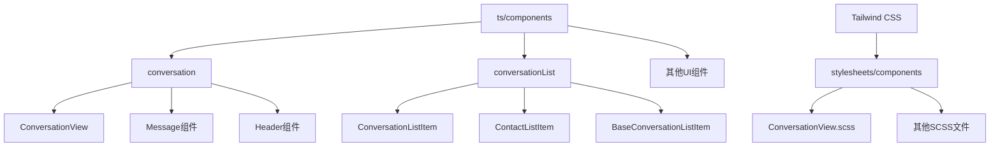
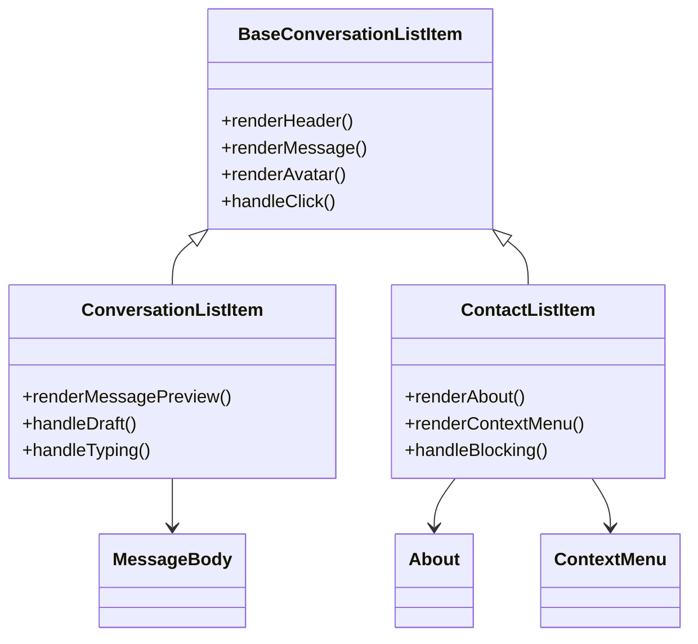
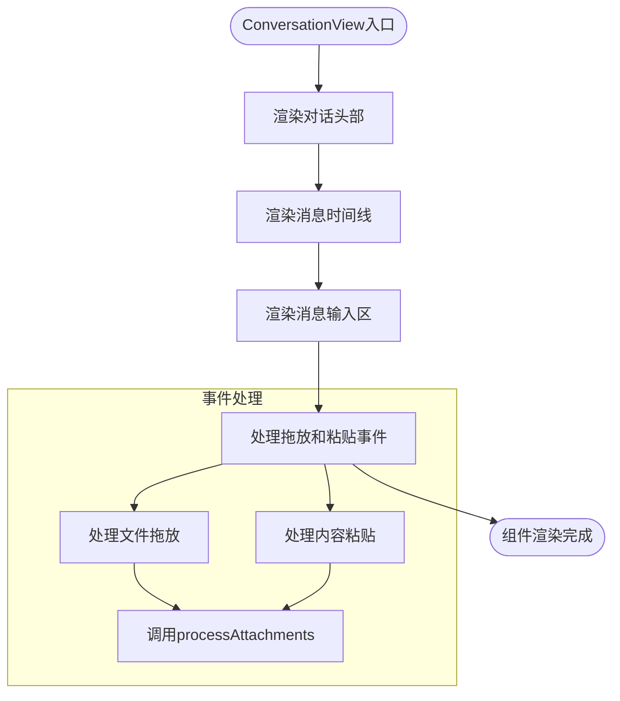
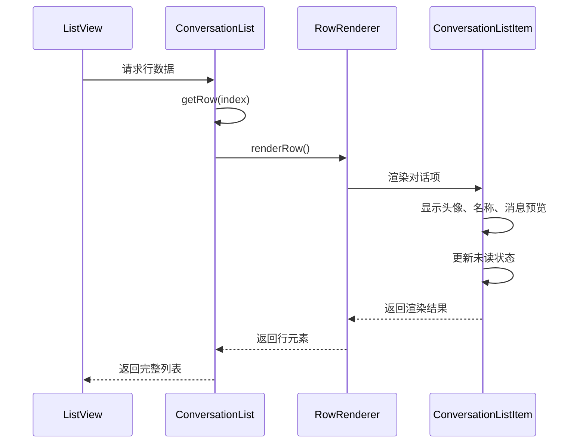
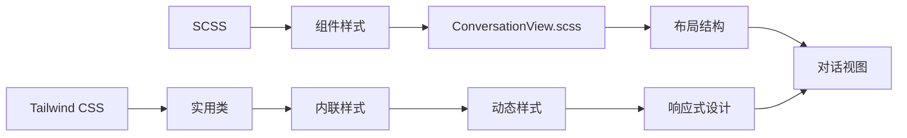
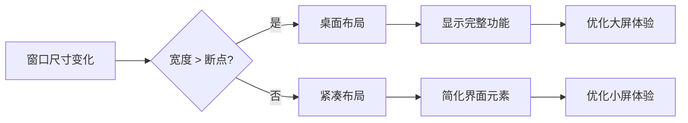
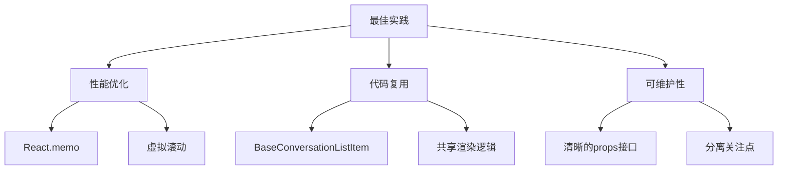

# UI组件架构

<cite>
**本文档中引用的文件**  
- [ConversationList.dom.tsx](file://ts/components/ConversationList.dom.tsx)
- [ConversationView.dom.tsx](file://ts/components/conversation/ConversationView.dom.tsx)
- [ConversationListItem.dom.tsx](file://ts/components/conversationList/ConversationListItem.dom.tsx)
- [ContactListItem.dom.tsx](file://ts/components/conversationList/ContactListItem.dom.tsx)
- [BaseConversationListItem.dom.tsx](file://ts/components/conversationList/BaseConversationListItem.dom.tsx)
- [ConversationView.scss](file://stylesheets/components/ConversationView.scss)
- [conversationList](file://ts/components/conversationList)
- [conversation](file://ts/components/conversation)
</cite>

## 目录
1. [项目结构](#项目结构)
2. [核心UI组件](#核心ui组件)
3. [组件层次结构与设计模式](#组件层次结构与设计模式)
4. [ConversationView组件分析](#conversationview组件分析)
5. [ConversationList组件分析](#conversationlist组件分析)
6. [样式系统集成](#样式系统集成)
7. [响应式设计实现](#响应式设计实现)
8. [组件Props接口与事件处理](#组件props接口与事件处理)
9. [最佳实践与复用策略](#最佳实践与复用策略)

## 项目结构

Signal-Desktop的UI组件主要组织在`ts/components`目录下，采用功能模块化的方式进行组织。核心UI组件分为多个子目录，包括`conversation`（对话相关组件）、`conversationList`（对话列表组件）等。样式文件位于`stylesheets/components`目录，采用SCSS与Tailwind CSS混合的样式系统。



**Diagram sources**  
- [ts/components](file://ts/components)
- [stylesheets/components](file://stylesheets/components)

**Section sources**  
- [ts/components](file://ts/components)
- [stylesheets/components](file://stylesheets/components)

## 核心UI组件

Signal-Desktop的UI架构基于React构建，采用容器组件与展示组件分离的设计模式。核心UI组件包括`ConversationView`（对话视图）和`ConversationList`（对话列表），它们构成了应用的主要用户界面。这些组件通过props传递数据和回调函数，实现了清晰的职责分离。

**Section sources**  
- [ts/components/conversation/ConversationView.dom.tsx](file://ts/components/conversation/ConversationView.dom.tsx)
- [ts/components/ConversationList.dom.tsx](file://ts/components/ConversationList.dom.tsx)

## 组件层次结构与设计模式

UI组件采用分层架构设计，包含容器组件、展示组件和高阶组件。`BaseConversationListItem`作为基础组件被`ConversationListItem`和`ContactListItem`继承和复用，体现了组件复用的设计原则。这种层次结构使得组件职责清晰，易于维护和扩展。



**Diagram sources**  
- [ts/components/conversationList/BaseConversationListItem.dom.tsx](file://ts/components/conversationList/BaseConversationListItem.dom.tsx)
- [ts/components/conversationList/ConversationListItem.dom.tsx](file://ts/components/conversationList/ConversationListItem.dom.tsx)
- [ts/components/conversationList/ContactListItem.dom.tsx](file://ts/components/conversationList/ContactListItem.dom.tsx)

**Section sources**  
- [ts/components/conversationList/BaseConversationListItem.dom.tsx](file://ts/components/conversationList/BaseConversationListItem.dom.tsx)
- [ts/components/conversationList/ConversationListItem.dom.tsx](file://ts/components/conversationList/ConversationListItem.dom.tsx)
- [ts/components/conversationList/ContactListItem.dom.tsx](file://ts/components/conversationList/ContactListItem.dom.tsx)

## ConversationView组件分析

`ConversationView`组件是对话界面的核心容器，负责组织对话头部、消息时间线和消息输入区域。该组件通过props接收`renderConversationHeader`、`renderTimeline`和`renderCompositionArea`等渲染函数，实现了高度的灵活性和可配置性。组件还处理拖放和粘贴事件，支持文件附件的快速发送。



**Diagram sources**  
- [ts/components/conversation/ConversationView.dom.tsx](file://ts/components/conversation/ConversationView.dom.tsx)

**Section sources**  
- [ts/components/conversation/ConversationView.dom.tsx](file://ts/components/conversation/ConversationView.dom.tsx)

## ConversationList组件分析

`ConversationList`组件实现了高效的对话列表渲染，使用`react-virtualized`进行虚拟滚动以优化性能。组件通过`RowType`枚举定义了多种列表项类型，包括普通对话、联系人、标题和空状态等。`ConversationListItem`组件负责渲染单个对话项，显示头像、名称、最后消息预览和未读计数等信息。



**Diagram sources**  
- [ts/components/ConversationList.dom.tsx](file://ts/components/ConversationList.dom.tsx)
- [ts/components/conversationList/ConversationListItem.dom.tsx](file://ts/components/conversationList/ConversationListItem.dom.tsx)

**Section sources**  
- [ts/components/ConversationList.dom.tsx](file://ts/components/ConversationList.dom.tsx)
- [ts/components/conversationList/ConversationListItem.dom.tsx](file://ts/components/conversationList/ConversationListItem.dom.tsx)

## 样式系统集成

Signal-Desktop采用Tailwind CSS与传统SCSS样式的混合方案。`ConversationView.scss`文件定义了对话视图的主要布局样式，而组件内部使用Tailwind的实用类进行细粒度的样式控制。这种集成方式既保持了样式的可维护性，又提供了灵活的样式定制能力。



**Diagram sources**  
- [stylesheets/components/ConversationView.scss](file://stylesheets/components/ConversationView.scss)

**Section sources**  
- [stylesheets/components/ConversationView.scss](file://stylesheets/components/ConversationView.scss)

## 响应式设计实现

UI组件通过CSS媒体查询和Tailwind的响应式前缀实现多设备适配。`ConversationView`组件根据窗口宽度动态调整布局，确保在不同屏幕尺寸下都有良好的用户体验。组件还考虑了标题栏拖拽区域的高度，实现了与操作系统的无缝集成。



**Section sources**  
- [ts/components/conversation/ConversationView.dom.tsx](file://ts/components/conversation/ConversationView.dom.tsx)
- [stylesheets/components/ConversationView.scss](file://stylesheets/components/ConversationView.scss)

## 组件Props接口与事件处理

核心UI组件通过明确定义的props接口与父组件通信。`ConversationView`接收`conversationId`、`renderTimeline`等props，而`ConversationList`通过`onSelectConversation`、`onPreloadConversation`等回调函数处理用户交互。这种设计模式实现了组件间的松耦合。

```mermaid
classDiagram
class ConversationViewProps {
+conversationId : string
+hasOpenModal : boolean
+hasOpenPanel : boolean
+isSelectMode : boolean
+onExitSelectMode() : void
+processAttachments(options) : void
+renderCompositionArea(id) : JSX.Element
+renderConversationHeader(id) : JSX.Element
+renderTimeline(id) : JSX.Element
+renderPanel(id) : JSX.Element | undefined
}
class ConversationListProps {
+dimensions : {width, height}
+rowCount : number
+getRow(index) : Row
+scrollToRowIndex : number
+onSelectConversation(id, messageId) : void
+onPreloadConversation(id, messageId) : void
+renderConversationListItemContextMenu(props) : JSX.Element
}
class Row {
+type : RowType
+conversation : ConversationType
+headerText : string
+messageId : string
}
```

**Diagram sources**  
- [ts/components/conversation/ConversationView.dom.tsx](file://ts/components/conversation/ConversationView.dom.tsx)
- [ts/components/ConversationList.dom.tsx](file://ts/components/ConversationList.dom.tsx)

**Section sources**  
- [ts/components/conversation/ConversationView.dom.tsx](file://ts/components/conversation/ConversationView.dom.tsx)
- [ts/components/ConversationList.dom.tsx](file://ts/components/ConversationList.dom.tsx)

## 最佳实践与复用策略

Signal-Desktop的UI架构体现了多个最佳实践：使用`React.memo`优化性能、通过基础组件实现代码复用、采用虚拟滚动处理大量数据。`BaseConversationListItem`作为共享基类，减少了重复代码，而`ListView`组件封装了复杂的滚动逻辑，提高了开发效率。



**Section sources**  
- [ts/components/conversationList/BaseConversationListItem.dom.tsx](file://ts/components/conversationList/BaseConversationListItem.dom.tsx)
- [ts/components/ConversationList.dom.tsx](file://ts/components/ConversationList.dom.tsx)
- [ts/components/conversation/ConversationView.dom.tsx](file://ts/components/conversation/ConversationView.dom.tsx)