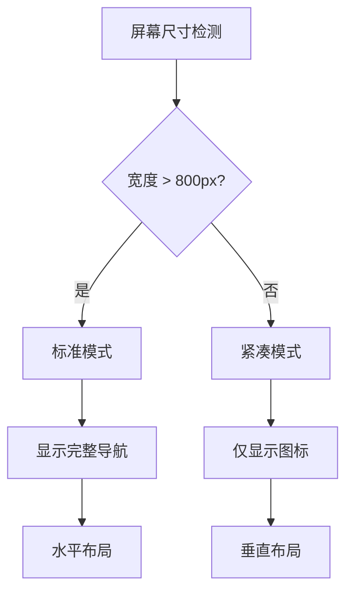
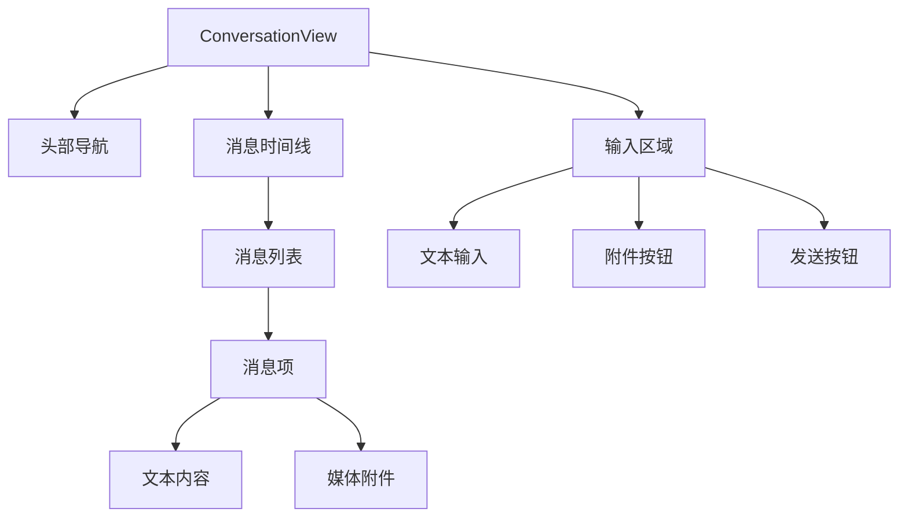
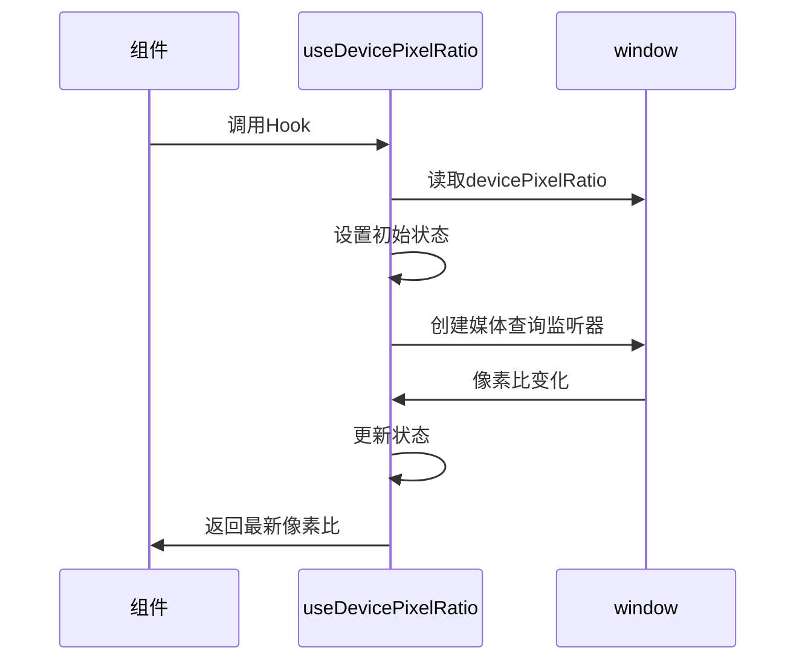

# 响应式设计

<cite>
**本文档中引用的文件**  
- [useDevicePixelRatio.dom.ts](file://ts/hooks/useDevicePixelRatio.dom.ts)
- [tailwind-config.css](file://stylesheets/tailwind-config.css)
- [ConversationPanel.scss](file://stylesheets/components/ConversationPanel.scss)
- [ConversationView.scss](file://stylesheets/components/ConversationView.scss)
- [NavSidebar.scss](file://stylesheets/components/NavSidebar.scss)
- [useReducedMotion.dom.ts](file://ts/hooks/useReducedMotion.dom.ts)
- [_variables.scss](file://stylesheets/_variables.scss)
- [sticker-creator/src/mixins.scss](file://sticker-creator/src/mixins.scss)
</cite>

## 目录
1. [简介](#简介)
2. [响应式断点系统](#响应式断点系统)
3. [主界面分栏布局](#主界面分栏布局)
4. [对话视图响应式设计](#对话视图响应式设计)
5. [设备像素比处理](#设备像素比处理)
6. [媒体查询与自定义Hook](#媒体查询与自定义Hook)
7. [响应式组件开发最佳实践](#响应式组件开发最佳实践)
8. [性能优化建议](#性能优化建议)

## 简介
Signal-Desktop应用实现了全面的响应式设计，能够适应不同屏幕尺寸和设备像素比的显示需求。该系统结合了Tailwind CSS的响应式断点和JavaScript媒体查询，为用户提供一致的跨设备体验。本文档详细分析了其响应式设计的实现机制，包括布局调整策略、高DPI显示处理以及相关最佳实践。

## 响应式断点系统
Signal-Desktop基于Tailwind CSS构建了系统的响应式断点体系，通过CSS自定义属性和媒体查询实现精确的布局控制。系统定义了多个响应式断点，主要通过`max-width`条件来适配不同屏幕尺寸。

在`sticker-creator/src/mixins.scss`文件中定义了`small-screen`混合宏，使用`max-width: 800px`作为小屏幕的断点阈值。这种基于CSS混合宏的断点管理方式使得响应式规则可以被多个组件复用，确保了设计的一致性。

Tailwind CSS的响应式前缀系统（如`sm:`、`md:`、`lg:`）被广泛应用于组件样式中，允许开发者在不同断点下定义不同的布局属性。这种基于实用程序的CSS方法使得响应式设计更加直观和可维护。

**Section sources**
- [sticker-creator/src/mixins.scss](file://sticker-creator/src/mixins.scss#L42-L46)

## 主界面分栏布局
Signal-Desktop的主界面采用分栏布局设计，通过`NavSidebar`组件实现导航侧边栏。该组件根据屏幕尺寸动态调整其显示模式，提供优化的用户体验。

在桌面大屏幕上，`NavSidebar`显示完整的导航选项和搜索功能，提供高效的导航体验。当屏幕宽度较小时，组件会自动调整为紧凑模式，隐藏部分文本标签，仅显示图标，以节省水平空间。

`NavSidebar`组件的CSS类`NavSidebar--narrow`用于标识窄屏模式，通过媒体查询自动应用。在窄屏模式下，布局方向从水平变为垂直，按钮排列方式也相应调整，确保在小屏幕上仍具有良好的可用性。

**Diagram sources**
- [NavSidebar.scss](file://stylesheets/components/NavSidebar.scss#L37-L40)
- [NavSidebar.scss](file://stylesheets/components/NavSidebar.scss#L55-L57)

**Section sources**
- [NavSidebar.scss](file://stylesheets/components/NavSidebar.scss#L7-L277)

## 对话视图响应式设计
对话视图（ConversationView）采用灵活的弹性布局（Flexbox），确保在不同屏幕尺寸下都能提供良好的阅读体验。布局设计考虑了头部导航、消息时间线和输入区域的协调关系。

`ConversationView`组件使用`flex-direction: column`创建垂直堆叠布局，确保内容按逻辑顺序排列。消息时间线区域（`ConversationView__timeline`）设置为`flex-grow: 1`，使其能够填充剩余的垂直空间，最大化消息显示区域。

对于分栏布局，`ConversationPanel`组件实现了可动画的面板切换效果。在移动设备或小屏幕上，面板以堆叠方式显示，用户可以通过滑动或点击返回按钮在不同面板间导航。这种设计模式符合移动设备的交互习惯。

**Diagram sources**
- [ConversationView.scss](file://stylesheets/components/ConversationView.scss#L7-L73)
- [ConversationPanel.scss](file://stylesheets/components/ConversationPanel.scss#L7-L61)

**Section sources**
- [ConversationView.scss](file://stylesheets/components/ConversationView.scss#L1-L73)
- [ConversationPanel.scss](file://stylesheets/components/ConversationPanel.scss#L1-L61)

## 设备像素比处理
Signal-Desktop通过`useDevicePixelRatio`自定义Hook精确处理高DPI显示设备，确保在不同像素密度的屏幕上都能提供清晰的视觉效果。

`useDevicePixelRatio` Hook封装了`window.devicePixelRatio`的访问和监听逻辑，返回当前设备的像素比值。该Hook使用`useState`管理像素比状态，并通过`useEffect`设置媒体查询监听器，当设备像素比发生变化时自动更新状态。

关键实现细节包括：
- 初始化时获取当前`window.devicePixelRatio`值
- 创建基于当前像素比的媒体查询`screen and (resolution: ${result}dppx)`
- 添加事件监听器，在像素比变化时更新状态
- 在组件卸载时正确清理事件监听器，避免内存泄漏

**Diagram sources**
- [useDevicePixelRatio.dom.ts](file://ts/hooks/useDevicePixelRatio.dom.ts#L6-L27)

**Section sources**
- [useDevicePixelRatio.dom.ts](file://ts/hooks/useDevicePixelRatio.dom.ts#L6-L27)

## 媒体查询与自定义Hook
Signal-Desktop通过自定义Hook抽象化媒体查询的复杂性，提供简洁的API供组件使用。`useMediaQuery`和`useReducedMotion`等Hook是这一设计模式的典型代表。

`useMediaQuery` Hook利用React 18的`useSyncExternalStore` API，创建了一个高效的外部状态订阅系统。它将媒体查询的`matches`状态作为可订阅的外部存储，确保组件能够及时响应媒体查询条件的变化。

`useReducedMotion` Hook专门用于检测用户是否启用了减少动画的偏好设置。这对于无障碍访问至关重要，允许应用根据用户的系统设置调整动画效果，提供更舒适的用户体验。

这些自定义Hook的设计遵循了React的最佳实践：
- 使用`useMemo`缓存媒体查询API对象
- 正确处理事件监听器的添加和移除
- 确保在组件重新渲染时不会创建重复的监听器
- 提供稳定的API接口，便于组件复用

**Section sources**
- [useReducedMotion.dom.ts](file://ts/hooks/useReducedMotion.dom.ts#L6-L28)

## 响应式组件开发最佳实践
Signal-Desktop的响应式组件开发遵循一系列最佳实践，确保代码的可维护性和用户体验的一致性。

首先，组件设计采用移动优先（Mobile-First）原则，从最小屏幕尺寸开始设计，然后逐步增强在大屏幕上的体验。这种渐进式增强的方法确保了在所有设备上都能提供基本功能。

其次，使用语义化的CSS类名和BEM命名规范，如`ConversationPanel__header__back-button`，提高了样式的可读性和可维护性。这种命名约定清晰地表达了组件的层次结构和功能。

再者，通过CSS变量（Custom Properties）集中管理设计系统中的颜色、间距和字体等设计令牌。在`_variables.scss`文件中定义了完整的颜色系统，包括不同灰度、主题颜色和透明度变体，确保了视觉一致性。

最后，充分利用CSS的现代特性，如Flexbox、Grid和CSS容器查询，创建灵活且自适应的布局。避免使用固定像素值，优先使用相对单位（如rem、em、%）来定义尺寸。

**Section sources**
- [_variables.scss](file://stylesheets/_variables.scss#L24-L328)

## 性能优化建议
为了确保响应式设计的性能，Signal-Desktop采用了多项优化策略。

首先，合理使用`useMemo`和`useCallback`等React优化Hook，避免不必要的计算和渲染。对于复杂的响应式逻辑，使用记忆化技术缓存计算结果。

其次，优化媒体查询的使用，避免创建过多的媒体查询监听器。通过合并相关的媒体查询条件，减少浏览器的计算负担。

再者，对于高频率更新的响应式状态（如窗口大小、设备像素比），实施防抖（debounce）或节流（throttle）策略，避免过于频繁的状态更新导致性能问题。

最后，利用CSS的硬件加速特性，对于需要动画的响应式转换，使用`transform`和`opacity`属性，这些属性可以由GPU高效处理，提供流畅的动画体验。

**Section sources**
- [useDevicePixelRatio.dom.ts](file://ts/hooks/useDevicePixelRatio.dom.ts#L9-L24)
- [useReducedMotion.dom.ts](file://ts/hooks/useReducedMotion.dom.ts#L7-L22)