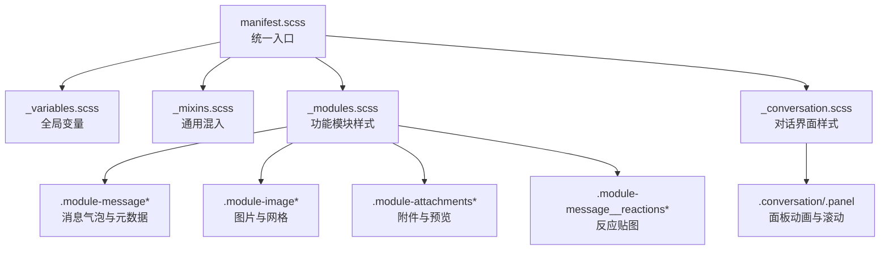
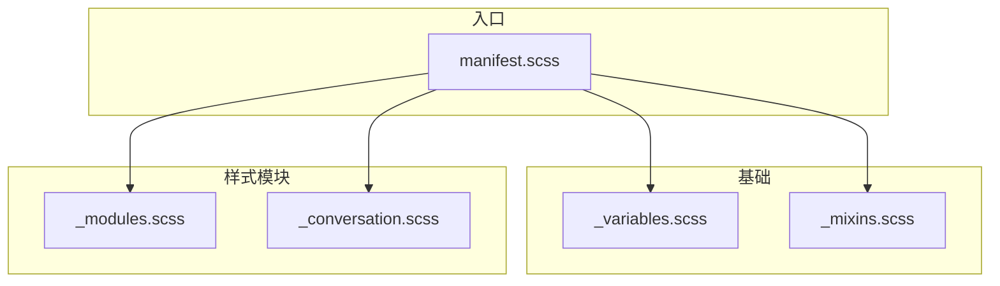
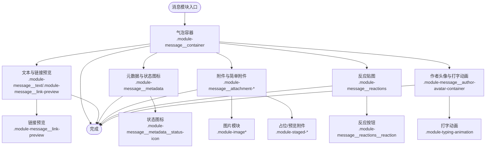
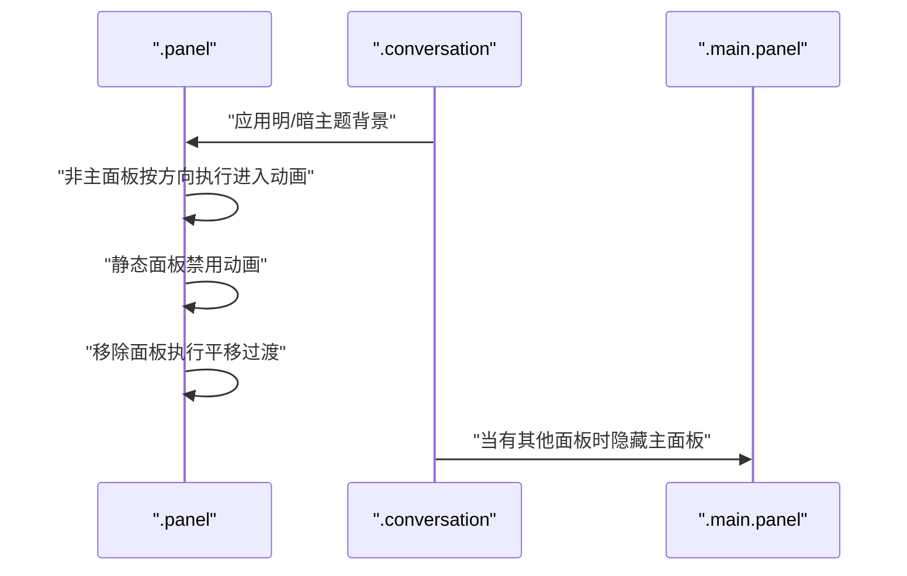
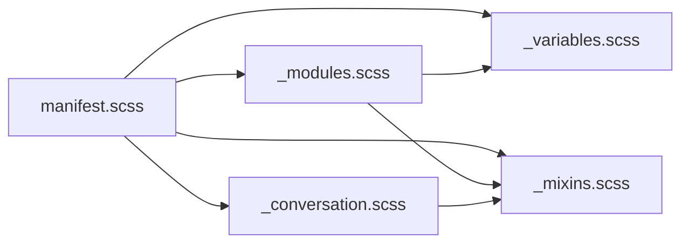

# SCSS架构

<cite>
**本文引用的文件**
- [stylesheets/_variables.scss](file://stylesheets/_variables.scss)
- [stylesheets/_mixins.scss](file://stylesheets/_mixins.scss)
- [stylesheets/_modules.scss](file://stylesheets/_modules.scss)
- [stylesheets/_conversation.scss](file://stylesheets/_conversation.scss)
- [stylesheets/manifest.scss](file://stylesheets/manifest.scss)
</cite>

## 目录
1. [简介](#简介)
2. [项目结构](#项目结构)
3. [核心组件](#核心组件)
4. [架构总览](#架构总览)
5. [详细组件分析](#详细组件分析)
6. [依赖关系分析](#依赖关系分析)
7. [性能考量](#性能考量)
8. [故障排查指南](#故障排查指南)
9. [结论](#结论)

## 简介
本文件系统性梳理 Signal-Desktop 的 SCSS 架构，重点覆盖以下方面：
- 变量体系：颜色、字体、布局与层级等变量的组织方式与命名规范
- 混合宏（Mixins）：响应式、主题、图标着色、按钮、弹层、工具类等可复用样式片段
- 模块化样式（Modules）：按功能域组织的消息气泡、附件、图片、输入框、反应贴图等模块样式
- 对话界面（Conversation）：面板切换动画、滚动区域、占位与权限弹窗等样式
- 导入与组织：通过 manifest.scss 统一引入全局变量、混入与各组件样式，确保构建顺序与作用域隔离

本指南兼顾技术深度与可读性，既适合前端工程师深入理解实现细节，也便于非专业读者把握整体结构。

## 项目结构
Signal-Desktop 的 SCSS 采用“变量/混入/模块/对话/入口”分层组织：
- 全局变量与混入：集中于 _variables.scss 与 _mixins.scss
- 功能模块样式：集中在 _modules.scss，按业务模块拆分（消息、图片、附件、反应等）
- 对话界面样式：独立于模块样式，聚焦面板与时间线等对话视图
- 样式入口：通过 manifest.scss 统一 @use 引入，保证变量与混入在各模块中可用

图表来源
- [stylesheets/manifest.scss](file://stylesheets/manifest.scss#L1-L208)
- [stylesheets/_variables.scss](file://stylesheets/_variables.scss#L1-L328)
- [stylesheets/_mixins.scss](file://stylesheets/_mixins.scss#L1-L1156)
- [stylesheets/_modules.scss](file://stylesheets/_modules.scss#L1-L3200)
- [stylesheets/_conversation.scss](file://stylesheets/_conversation.scss#L1-L95)

章节来源
- [stylesheets/manifest.scss](file://stylesheets/manifest.scss#L1-L208)

## 核心组件
本节从变量、混入、模块与对话四个维度，概述 SCSS 架构的核心能力与组织方式。

- 变量体系（_variables.scss）
  - 字体族与本地化字体：提供跨语言字体回退链，确保日语、波斯语、乌尔都语等语言下的可读性
  - 颜色体系：包含品牌色、灰阶、透明度变体、渐变色、头像色板与会话配色映射
  - 布局与层级：标题栏高度、缓动曲线、调用背景、滚动条尺寸、z-index 分层等
  - 主题适配：为暗/亮主题提供一致的变量名与默认值

- 混入库（_mixins.scss）
  - 字体与主题：本地化字体、标题/正文/副标题/注释等字号体系；明暗主题混入
  - 无障碍与交互：键盘模式/鼠标模式、仅页面可见时动画、强制高对比度支持
  - 图标与SVG：SVG mask 着色、RTL图标映射、图标容器与箭头样式
  - 布局与阴影：圆角、平滑滚动、弹层阴影、定位居中、滚动条悬停隐藏
  - 按钮与表单：主/次/轻/破坏/绿色按钮风格，输入框风格，工具按钮重置
  - 特定场景：调用文本阴影、本地视频预览镜像、链接预览、消息气泡颜色等

- 模块样式（_modules.scss）
  - 消息模块：消息容器、外发/内收气泡、文本、元数据（时间戳、状态图标）、作者头像、表情反应、附件与简单附件、链接预览、未下载附件、Tap-to-view 提示、礼物徽章等
  - 图片模块：图片容器、加载/播放/下载/不可下载遮罩、边框叠加、底部渐变、覆盖按钮、网格布局
  - 附件模块：已预览附件、占位附件、编辑态图标、横向滚动轨道
  - 输入与发送：发送按钮样式与圆角裁剪
  - 通知与错误边界：内联通知包装器、错误边界提示
  - 其他：打字动画、过期计时器、联系人卡片等

- 对话界面（_conversation.scss）
  - 面板进入/移除动画（LTR/RTL），静态面板禁用动画
  - 主面板与其它面板的显示控制
  - 时间线滚动容器、打字气泡容器、联系人详情面板滚动与内边距

章节来源
- [stylesheets/_variables.scss](file://stylesheets/_variables.scss#L1-L328)
- [stylesheets/_mixins.scss](file://stylesheets/_mixins.scss#L1-L1156)
- [stylesheets/_modules.scss](file://stylesheets/_modules.scss#L1-L3200)
- [stylesheets/_conversation.scss](file://stylesheets/_conversation.scss#L1-L95)

## 架构总览
下图展示 SCSS 架构的顶层依赖关系与模块职责划分，体现“入口统一、变量先行、混入复用、模块解耦”的设计原则。

图表来源
- [stylesheets/manifest.scss](file://stylesheets/manifest.scss#L1-L208)
- [stylesheets/_variables.scss](file://stylesheets/_variables.scss#L1-L328)
- [stylesheets/_mixins.scss](file://stylesheets/_mixins.scss#L1-L1156)
- [stylesheets/_modules.scss](file://stylesheets/_modules.scss#L1-L3200)
- [stylesheets/_conversation.scss](file://stylesheets/_conversation.scss#L1-L95)

## 详细组件分析

### 变量体系（_variables.scss）
- 字体族与本地化
  - Inter 作为主要无衬线字体，并针对日语、波斯语、乌尔都语提供本地化回退字体链
  - 等宽字体列表用于粘贴场景与代码渲染
- 颜色体系
  - 品牌色：蓝色系、绿色、红色、黄色等
  - 灰阶与透明度：从纯黑到纯白的多级灰阶及透明度变体，满足不同主题与层级需求
  - 渐变色：多种方向与起止色的渐变配置，用于会话背景或装饰
  - 头像色板：12 色头像配色，含背景/前景色映射
  - 会话配色：12 种外发气泡配色与对应的渐变色映射
  - 安全号变更警示、进度条与 Toast 使用的辅助色
- 布局与层级
  - 头部高度、缓动曲线、调用背景、本地预览比例、滚动条尺寸
  - z-index 分层：负层级、基础层级、Toast、窗口控件等，避免层级冲突
- 主题适配
  - 与混入中的明/暗主题混入配合，确保同一变量在不同主题下呈现一致语义

章节来源
- [stylesheets/_variables.scss](file://stylesheets/_variables.scss#L1-L328)

### 混入库（_mixins.scss）
- 字体与主题
  - 本地化字体混入：根据语言设置选择合适的字体链
  - 标题/正文/副标题/注释等字号体系，统一排版节奏
  - 明/暗主题混入：在组件中以 @include light-theme 或 dark-theme 包裹样式
- 无障碍与交互
  - 键盘/鼠标模式混入：区分键盘导航与鼠标交互的焦点与悬停样式
  - 页面可见时动画：仅在页面可见时播放动画，减少不必要的重绘
  - 强制高对比度：在高对比度模式下使用系统文本色绘制图标
- 图标与SVG
  - SVG mask 着色：通过 -webkit-mask 与 background-color 实现图标着色
  - RTL 图标映射：自动将左右方向图标映射到 RTL 场景
  - 图标容器与箭头：tooltip 箭头的底色与边框根据主题动态调整
- 布局与阴影
  - 圆角、平滑滚动、弹层阴影、定位居中、滚动条悬停隐藏
- 按钮与表单
  - 主/次/轻/破坏/绿色按钮风格：统一的 hover/active/focus 行为
  - 输入框风格：明/暗主题下的边框、背景、禁用态与焦点态
- 特定场景
  - 调用文本阴影、本地视频预览镜像、链接预览、消息气泡颜色等

章节来源
- [stylesheets/_mixins.scss](file://stylesheets/_mixins.scss#L1-L1156)

### 模块样式（_modules.scss）
- 消息模块（.module-message*）
  - 气泡容器：内外收方向、圆角裁剪、选中态、删除态、附件过大提示等
  - 文本与元数据：正文、错误文案、删除文案、时间戳、状态图标（发送/送达/已读/查看）
  - 作者头像与打字动画：头像容器、打字者头像堆叠、遮挡与轮廓
  - 附件与简单附件：图片附件、简单文件附件、文件名与大小、不可下载提示
  - 链接预览：标题、描述、页脚、图标容器与文字样式
  - Tap-to-view 提示与礼物徽章：外发/内收样式、边框、文字与装饰元素
  - 反应贴图：内外收位置、计数与自已的高亮色
- 图片模块（.module-image*）
  - 图片容器与遮罩：加载/播放/下载/不可下载状态、边框叠加、底部渐变
  - 覆盖按钮：播放/停止/下载/不可下载图标，居中定位
  - 网格布局：行列排列、间距、下载提示胶囊
- 附件模块（.module-attachments*）
  - 已预览附件：关闭按钮、编辑态图标、横向滚动
  - 占位附件：加号图标、焦点态描边
- 输入与发送（.module-message__send-message-button）
  - 发送按钮样式：圆角裁剪、明/暗主题边框与背景、焦点态描边
- 通知与错误边界（.module-inline-notification-wrapper, .module-error-boundary-notification）
  - 内联通知包装器：键盘导航高亮
  - 错误边界通知：图标与信息文本、主题色
- 其他模块
  - 打字动画：三点缩放动画、明/暗主题色
  - 过期计时器：定时图标集合、内外收与贴图场景下的颜色差异

图表来源
- [stylesheets/_modules.scss](file://stylesheets/_modules.scss#L1-L3200)

章节来源
- [stylesheets/_modules.scss](file://stylesheets/_modules.scss#L1-L3200)

### 对话界面（_conversation.scss）
- 面板动画
  - LTR/RTL 面板进入动画，静态面板禁用动画，移除面板使用平移过渡
- 主面板与其它面板
  - 当存在其他面板时隐藏主面板，避免重叠与交互冲突
- 时间线滚动容器
  - 计算高度差并启用垂直滚动，提升长消息时间线的可浏览性
- 打字气泡与联系人详情
  - 打字气泡容器留出底部间距
  - 联系人详情面板启用纵向滚动并设置上下内边距

图表来源
- [stylesheets/_conversation.scss](file://stylesheets/_conversation.scss#L1-L95)

章节来源
- [stylesheets/_conversation.scss](file://stylesheets/_conversation.scss#L1-L95)

## 依赖关系分析
- 入口依赖
  - manifest.scss 通过 @use 引入全局变量、混入、全局样式与模块样式，确保变量与混入在所有模块中可用
- 模块内部依赖
  - _modules.scss 中大量使用 _mixins.scss 中的字体、主题、SVG、按钮、定位等混入
  - _modules.scss 中通过 @use 'variables' 引用变量，统一颜色与层级
- 对话样式依赖
  - _conversation.scss 通过 @import 引入混入，以便在对话面板中复用图标着色与主题混入
- 组件样式组织
  - 项目还维护了 components 目录下的各组件样式文件，由 manifest.scss 统一 @use 引入，形成新旧样式并存的组织方式

图表来源
- [stylesheets/manifest.scss](file://stylesheets/manifest.scss#L1-L208)
- [stylesheets/_mixins.scss](file://stylesheets/_mixins.scss#L1-L1156)
- [stylesheets/_modules.scss](file://stylesheets/_modules.scss#L1-L3200)
- [stylesheets/_conversation.scss](file://stylesheets/_conversation.scss#L1-L95)

章节来源
- [stylesheets/manifest.scss](file://stylesheets/manifest.scss#L1-L208)

## 性能考量
- 动画与重绘
  - 仅在页面可见时播放动画，减少后台标签页的重绘开销
  - 使用 transform/opacity 动画替代布局抖动，降低强制同步布局成本
- 滚动与层级
  - 平滑滚动与滚动条悬停隐藏减少不必要的滚动事件处理
  - 合理的 z-index 分层避免过度层叠导致的重绘
- SVG 图标
  - 使用 mask 着色与 RTL 自动映射，减少重复图标资源与条件判断
- 变量与混入
  - 将颜色、字体、层级等集中管理，避免重复计算与不一致的视觉表现

[本节为通用指导，无需特定文件引用]

## 故障排查指南
- 主题不生效
  - 检查是否正确包裹在明/暗主题混入中，确认主题类名（如 .dark-theme）是否存在于根节点
  - 确认变量名与混入使用一致，避免直接硬编码颜色
- 图标颜色异常
  - 确认 SVG mask 着色路径与当前主题匹配
  - 检查 RTL 场景下的图标映射是否完整
- 消息气泡样式错乱
  - 检查内外收方向类名与圆角裁剪逻辑
  - 确认附件容器与文本容器的 margin/padding 是否与消息气泡内边距一致
- 动画不播放
  - 确认页面可见性条件与键盘/鼠标模式混入是否正确应用
  - 检查动画关键帧是否被覆盖或禁用

章节来源
- [stylesheets/_mixins.scss](file://stylesheets/_mixins.scss#L1-L1156)
- [stylesheets/_modules.scss](file://stylesheets/_modules.scss#L1-L3200)

## 结论
Signal-Desktop 的 SCSS 架构以“变量先行、混入复用、模块解耦、入口统一”为核心设计原则，通过清晰的层次化组织与强大的混入库，实现了跨主题、跨语言、跨设备的一致视觉体验。变量与混入为模块样式提供了稳定的基础，模块样式则围绕消息、图片、附件、反应等核心场景进行细粒度封装，对话界面样式专注于面板与时间线的交互体验。manifest.scss 作为统一入口，确保了构建顺序与作用域隔离，便于扩展与维护。