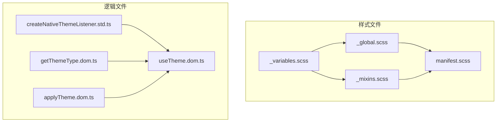
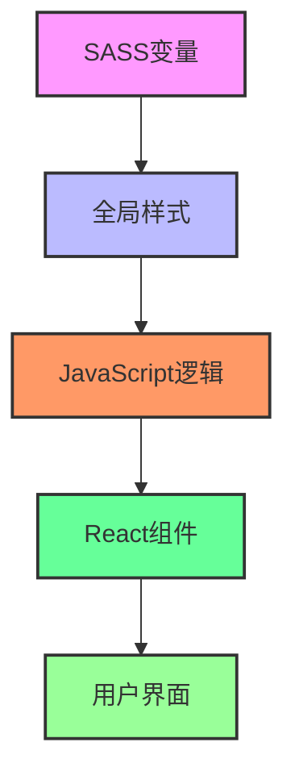
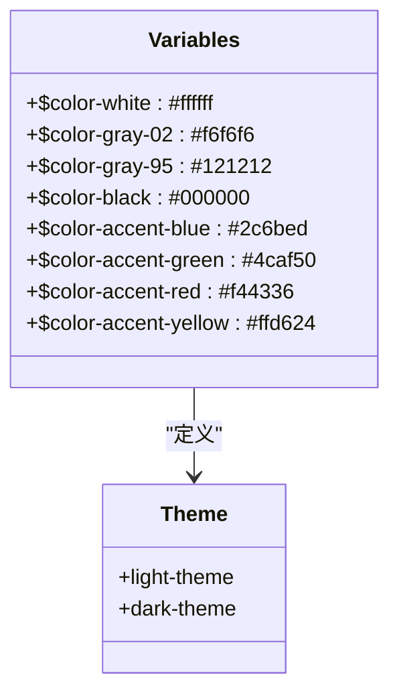
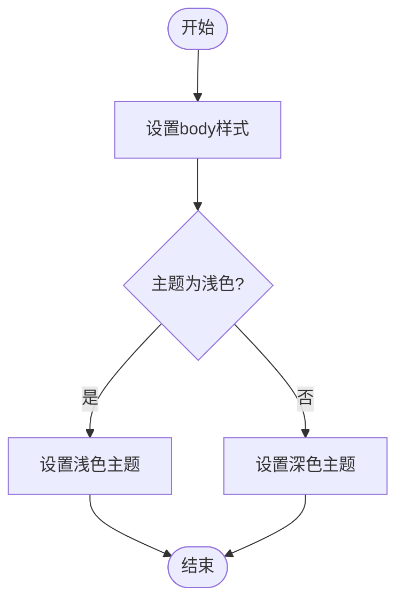
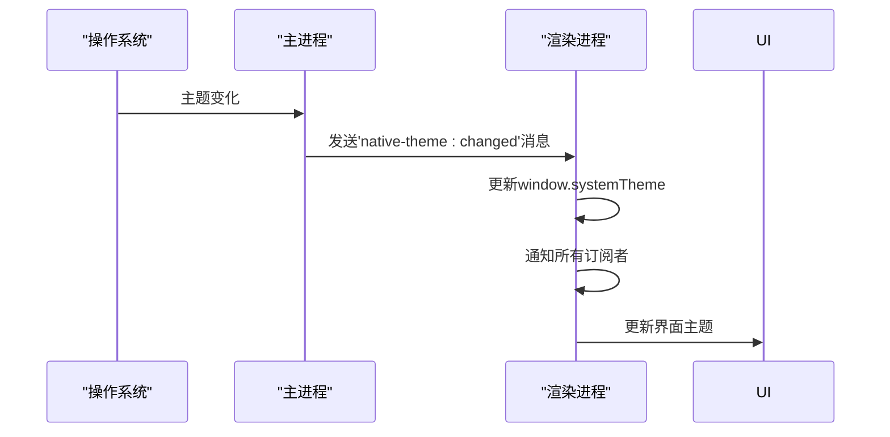
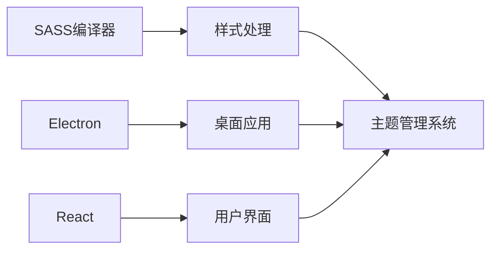

# 主题管理

<cite>
**本文档中引用的文件**  
- [_variables.scss](file://stylesheets/_variables.scss)
- [_global.scss](file://stylesheets/_global.scss)
- [createNativeThemeListener.std.ts](file://ts/context/createNativeThemeListener.std.ts)
- [_mixins.scss](file://stylesheets/_mixins.scss)
- [useTheme.dom.ts](file://ts/hooks/useTheme.dom.ts)
- [getThemeType.dom.ts](file://ts/util/getThemeType.dom.ts)
- [applyTheme.dom.ts](file://ts/windows/applyTheme.dom.ts)
- [theme.std.ts](file://ts/util/theme.std.ts)
- [Util.std.ts](file://ts/types/Util.std.ts)
- [manifest.scss](file://stylesheets/manifest.scss)
</cite>

## 目录
1. [简介](#简介)
2. [项目结构](#项目结构)
3. [核心组件](#核心组件)
4. [架构概述](#架构概述)
5. [详细组件分析](#详细组件分析)
6. [依赖分析](#依赖分析)
7. [性能考虑](#性能考虑)
8. [故障排除指南](#故障排除指南)
9. [结论](#结论)

## 简介
Signal-Desktop的主题管理系统提供了一套完整的深色和浅色主题切换机制，通过SASS变量、全局样式重置和系统主题监听器实现。该系统允许用户根据个人偏好或系统设置选择合适的界面外观，同时支持自定义主题扩展。主题管理不仅关注视觉呈现，还考虑了无障碍访问和性能优化，确保在各种设备和环境下都能提供一致的用户体验。

## 项目结构
Signal-Desktop的主题管理系统主要由SASS样式文件和TypeScript逻辑文件组成。样式文件位于`stylesheets`目录下，包括核心变量定义、全局样式重置和各种UI组件的样式。逻辑文件位于`ts`目录下，负责主题状态管理和系统主题变化的监听。整个系统通过模块化设计，实现了主题配置、应用和更新的分离，便于维护和扩展。

**图表来源**
- [_variables.scss](file://stylesheets/_variables.scss)
- [_global.scss](file://stylesheets/_global.scss)
- [_mixins.scss](file://stylesheets/_mixins.scss)
- [manifest.scss](file://stylesheets/manifest.scss)
- [createNativeThemeListener.std.ts](file://ts/context/createNativeThemeListener.std.ts)
- [useTheme.dom.ts](file://ts/hooks/useTheme.dom.ts)
- [getThemeType.dom.ts](file://ts/util/getThemeType.dom.ts)
- [applyTheme.dom.ts](file://ts/windows/applyTheme.dom.ts)

## 核心组件
Signal-Desktop的主题管理系统由三个核心部分组成：SASS变量定义、全局样式重置和系统主题监听器。SASS变量文件`_variables.scss`定义了所有主题相关的颜色、字体和布局参数，为整个应用提供一致的视觉语言。全局样式文件`_global.scss`通过CSS类应用主题，确保页面元素根据当前主题正确渲染。系统主题监听器`createNativeThemeListener.std.ts`监控操作系统主题变化，并实时同步更新UI。

**章节来源**
- [_variables.scss](file://stylesheets/_variables.scss#L1-L328)
- [_global.scss](file://stylesheets/_global.scss#L1-L640)
- [createNativeThemeListener.std.ts](file://ts/context/createNativeThemeListener.std.ts#L1-L83)

## 架构概述
Signal-Desktop的主题管理架构采用分层设计，从底层的SASS变量到顶层的React组件，每一层都有明确的职责。SASS变量层定义了所有可配置的主题参数，全局样式层将这些参数应用到具体的CSS规则中，JavaScript逻辑层负责主题状态的管理和更新，React组件层则通过hooks消费主题状态并渲染相应的UI。

**图表来源**
- [_variables.scss](file://stylesheets/_variables.scss)
- [_global.scss](file://stylesheets/_global.scss)
- [createNativeThemeListener.std.ts](file://ts/context/createNativeThemeListener.std.ts)
- [useTheme.dom.ts](file://ts/hooks/useTheme.dom.ts)

## 详细组件分析

### SASS变量实现主题切换
Signal-Desktop通过`_variables.scss`文件中的SASS变量实现深色和浅色主题的切换。该文件定义了两套完整的颜色方案，分别对应浅色和深色主题。每个颜色变量都有明确的命名约定，如`$color-gray-02`表示浅灰色，`$color-gray-95`表示深灰色。这些变量被组织成逻辑组，包括主色调、辅助色、文本色和背景色等，便于统一管理和使用。

**图表来源**
- [_variables.scss](file://stylesheets/_variables.scss#L24-L47)

**章节来源**
- [_variables.scss](file://stylesheets/_variables.scss#L1-L328)

### 全局样式重置和基础样式
`_global.scss`文件负责应用全局样式重置和基础样式。它通过CSS类`light-theme`和`dark-theme`来区分不同的主题模式，并为body元素设置相应的背景色和文本色。该文件还定义了一些通用的样式规则，如按钮、链接和表单元素的外观，确保在整个应用中保持一致的视觉风格。

**图表来源**
- [_global.scss](file://stylesheets/_global.scss#L7-L40)

**章节来源**
- [_global.scss](file://stylesheets/_global.scss#L1-L640)

### 系统主题变化监听
`createNativeThemeListener.std.ts`文件实现了系统主题变化的监听功能。该模块通过Electron的IPC机制与主进程通信，获取操作系统的主题设置。当系统主题发生变化时，它会触发相应的事件，通知所有订阅者更新UI。这种设计确保了应用主题与系统主题的同步，提供了无缝的用户体验。

**图表来源**
- [createNativeThemeListener.std.ts](file://ts/context/createNativeThemeListener.std.ts#L32-L82)

**章节来源**
- [createNativeThemeListener.std.ts](file://ts/context/createNativeThemeListener.std.ts#L1-L83)

### 自定义主题实现方法
Signal-Desktop支持通过扩展SASS变量和覆盖组件样式来实现自定义主题。开发者可以通过修改`_variables.scss`文件中的颜色值来调整整体配色方案，或者通过创建新的SASS规则来覆盖特定组件的样式。此外，还可以通过JavaScript API动态修改主题参数，实现更灵活的主题定制。

**章节来源**
- [_variables.scss](file://stylesheets/_variables.scss)
- [_mixins.scss](file://stylesheets/_mixins.scss)

### 性能优化和无障碍访问
主题管理系统在设计时充分考虑了性能优化和无障碍访问。通过使用CSS变量和高效的样式计算，减少了主题切换时的重绘和回流。同时，系统遵循WCAG 2.1标准，确保在不同主题模式下都能提供足够的对比度，方便视觉障碍用户使用。此外，还支持键盘导航和屏幕阅读器，提升了整体的可访问性。

**章节来源**
- [_global.scss](file://stylesheets/_global.scss)
- [_mixins.scss](file://stylesheets/_mixins.scss)

## 依赖分析
Signal-Desktop的主题管理系统依赖于多个核心模块和外部库。SASS编译器用于处理样式文件，Electron框架提供跨平台的桌面应用支持，React库用于构建用户界面。这些依赖项通过pnpm包管理器进行管理，确保版本的一致性和安全性。

**图表来源**
- [package.json](file://package.json)
- [pnpm-lock.yaml](file://pnpm-lock.yaml)

**章节来源**
- [package.json](file://package.json)
- [pnpm-lock.yaml](file://pnpm-lock.yaml)

## 性能考虑
主题管理系统在性能方面进行了多项优化。首先，通过预编译SASS文件减少运行时的计算开销。其次，使用CSS类切换而非内联样式更新，避免了频繁的DOM操作。最后，采用事件驱动的更新机制，只有在主题真正发生变化时才触发UI重绘，最大限度地减少了不必要的渲染。

**章节来源**
- [_global.scss](file://stylesheets/_global.scss)
- [applyTheme.dom.ts](file://ts/windows/applyTheme.dom.ts)

## 故障排除指南
当遇到主题显示异常时，可以按照以下步骤进行排查：首先检查`_variables.scss`文件中的颜色值是否正确；其次确认`_global.scss`中的主题类是否被正确应用；然后验证`createNativeThemeListener.std.ts`是否正常接收系统主题变化事件；最后检查React组件是否正确使用了`useTheme` hook。

**章节来源**
- [_variables.scss](file://stylesheets/_variables.scss)
- [_global.scss](file://stylesheets/_global.scss)
- [createNativeThemeListener.std.ts](file://ts/context/createNativeThemeListener.std.ts)
- [useTheme.dom.ts](file://ts/hooks/useTheme.dom.ts)

## 结论
Signal-Desktop的主题管理系统通过SASS变量、全局样式和系统监听器的有机结合，实现了灵活、高效的主题管理。该系统不仅支持基本的深色和浅色主题切换，还提供了丰富的自定义选项和良好的性能表现。通过遵循最佳实践和标准，确保了在各种环境下的稳定性和可访问性，为用户提供了优质的视觉体验。