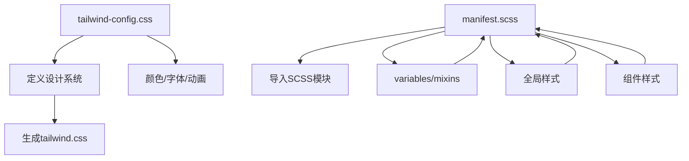
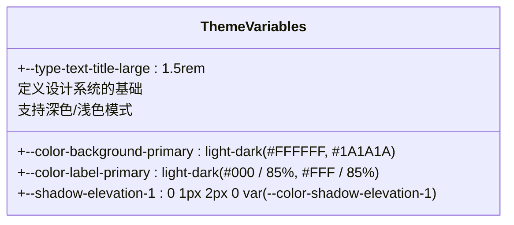
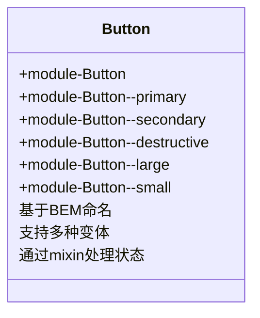
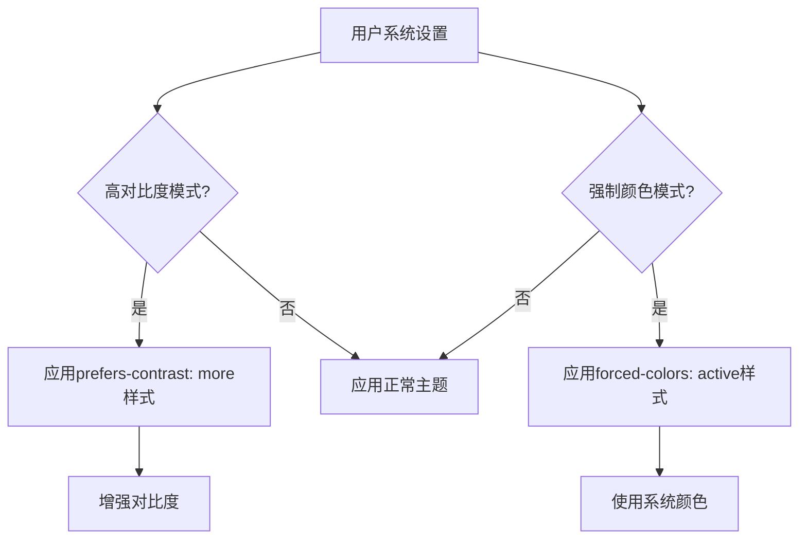

# 样式系统

<cite>
**本文档中引用的文件**   
- [tailwind-config.css](file://stylesheets/tailwind-config.css)
- [manifest.scss](file://stylesheets/manifest.scss)
- [_variables.scss](file://stylesheets/_variables.scss)
- [_mixins.scss](file://stylesheets/_mixins.scss)
- [_global.scss](file://stylesheets/_global.scss)
- [_modules.scss](file://stylesheets/_modules.scss)
- [Button.scss](file://stylesheets/components/Button.scss)
- [Input.scss](file://stylesheets/components/Input.scss)
- [Modal.scss](file://stylesheets/components/Modal.scss)
- [ConversationView.scss](file://stylesheets/components/ConversationView.scss)
- [tailwind-plugins/scrollbar.css](file://stylesheets/tailwind-plugins/scrollbar.css)
- [tailwind-plugins/animate-general.css](file://stylesheets/tailwind-plugins/animate-general.css)
</cite>

## 目录
1. [介绍](#介绍)
2. [配置与主题](#配置与主题)
3. [核心样式模块](#核心样式模块)
4. [样式规范与最佳实践](#样式规范与最佳实践)
5. [定制与扩展](#定制与扩展)

## 介绍
Signal-Desktop的样式系统采用Tailwind CSS与传统SCSS样式的混合策略，旨在提供现代化的实用优先（utility-first）开发体验，同时保留传统CSS的灵活性和可维护性。该系统通过精心设计的配置、主题变量和响应式断点，确保了跨平台和多语言环境下的视觉一致性和可访问性。

**Section sources**
- [tailwind-config.css](file://stylesheets/tailwind-config.css)
- [manifest.scss](file://stylesheets/manifest.scss)

## 配置与主题

### 配置文件结构
样式系统的配置主要由两个核心文件驱动：`tailwind-config.css` 和 `manifest.scss`。`tailwind-config.css` 是Tailwind CSS的配置入口，它定义了设计系统的核心原则，包括颜色、字体、动画和阴影等。`manifest.scss` 则是传统SCSS样式的入口文件，它通过 `@use` 指令按需导入 `_variables.scss`、`_mixins.scss`、`_global.scss` 以及各个组件的样式文件，实现了样式的模块化组织。

**Diagram sources **
- [tailwind-config.css](file://stylesheets/tailwind-config.css)
- [manifest.scss](file://stylesheets/manifest.scss)

### 自定义主题变量
系统通过CSS自定义属性（CSS Custom Properties）实现主题化。在 `tailwind-config.css` 中，`@theme` 规则定义了所有设计令牌（Design Tokens），如 `--color-background-primary`、`--type-text-title-large` 和 `--shadow-elevation-1`。这些变量利用 `light-dark()` 函数为浅色和深色主题提供不同的值，实现了无缝的主题切换。

**Diagram sources **
- [tailwind-config.css](file://stylesheets/tailwind-config.css)

### 响应式断点设置
响应式设计通过 `@custom-variant` 规则在 `tailwind-config.css` 中定义。系统使用了标准的断点，如 `sm`、`md`、`lg` 和 `xl`，并结合 `@media` 查询来应用不同的样式。此外，还定义了自定义变体（custom variants），如 `dark`、`hovered`、`pressed` 和 `focused`，这些变体可以像标准的Tailwind类一样使用，极大地增强了样式的表达能力。

**Section sources**
- [tailwind-config.css](file://stylesheets/tailwind-config.css)

## 核心样式模块

### 对话组件
对话视图（ConversationView）是应用的核心界面，其样式在 `ConversationView.scss` 中定义。该组件采用Flexbox布局，`ConversationView__pane` 作为主容器，其高度通过 `calc()` 函数动态计算，以适应标题栏的高度。消息气泡的样式则在 `_modules.scss` 中通过 `.module-message__container` 类实现，它使用 `border-radius: 18px` 创建圆角，并根据消息方向（incoming/outgoing）应用不同的背景色。

**Section sources**
- [ConversationView.scss](file://stylesheets/components/ConversationView.scss)
- [_modules.scss](file://stylesheets/_modules.scss)

### 按钮
按钮组件（Button）在 `Button.scss` 中实现，遵循BEM（Block, Element, Modifier）命名规范。基础类为 `module-Button`，通过修饰符类如 `module-Button--primary`、`module-Button--secondary` 和 `module-Button--destructive` 来定义不同变体。悬停和激活状态通过Sass的 `@mixin hover-and-active-states` 混合宏实现，利用 `color.mix()` 函数动态生成更暗或更亮的背景色。

**Diagram sources **
- [Button.scss](file://stylesheets/components/Button.scss)

### 输入框
输入框（Input）的样式在 `Input.scss` 中定义。它由一个外层容器 `Input__container` 和内部的 `Input__input` 元素组成。容器负责边框、圆角和背景色，而输入框本身则继承父级样式。焦点状态通过 `:focus-within` 伪类触发，此时边框颜色会变为品牌蓝色（`$color-ultramarine`）。该组件还支持禁用状态和清除图标。

**Section sources**
- [Input.scss](file://stylesheets/components/Input.scss)

### 模态框
模态框（Modal）在 `Modal.scss` 中实现。它使用 `@include mixins.popper-shadow()` 混合宏添加阴影效果，并通过 `max-height: 89vh` 确保在小屏幕上不会溢出。模态框的头部、主体和底部按钮区域都有明确的类名，如 `module-Modal__header`、`module-Modal__body` 和 `module-Modal__button-footer`。关闭按钮和返回按钮通过 `@include mixins.button-reset` 重置默认样式，并使用 `@include mixins.color-svg()` 混合宏来渲染SVG图标。

**Section sources**
- [Modal.scss](file://stylesheets/components/Modal.scss)

## 样式规范与最佳实践

### CSS类名命名规范
系统主要采用BEM（Block, Element, Modifier）命名规范。组件的根类名以 `module-` 为前缀（如 `module-Button`），元素使用双下划线 `__` 连接（如 `module-Button__icon`），修饰符使用双连字符 `--` 连接（如 `module-Button--primary`）。这种命名方式清晰地表达了组件的结构和状态，避免了样式冲突。

### 样式作用域管理
样式作用域通过多种方式管理。首先，所有组件样式都封装在各自的模块类名下，防止全局污染。其次，使用Sass的 `@use` 规则替代 `@import`，实现了模块的私有性。最后，对于全局样式（如 `html`, `body`），它们被定义在 `_global.scss` 中，并通过 `@use` 被 `manifest.scss` 导入，确保了全局样式的集中管理。

### 性能优化技巧
1.  **按需编译**：`manifest.scss` 只导入实际需要的SCSS文件，避免了不必要的样式膨胀。
2.  **高效动画**：关键动画（如加载旋转）使用 `transform` 和 `opacity` 属性，这些属性由GPU加速，性能开销小。
3.  **减少重排重绘**：通过 `overflow: hidden` 和 `position: absolute` 等技术，将可能影响布局的元素隔离。
4.  **Tailwind JIT**：利用Tailwind的即时模式（JIT），只生成实际在代码中使用的类，极大地减小了最终CSS文件的体积。

**Section sources**
- [manifest.scss](file://stylesheets/manifest.scss)
- [_global.scss](file://stylesheets/_global.scss)

## 定制与扩展

### 主题切换
主题切换通过切换 `body` 元素上的 `light-theme` 或 `dark-theme` 类来实现。`tailwind-config.css` 中的 `@theme` 规则和SCSS中的 `@include mixins.light-theme()` / `@include mixins.dark-theme()` 混合宏会监听这些类，并应用相应的CSS变量值。无障碍模式（High Contrast Mode）通过 `@media (prefers-contrast: more)` 媒体查询自动激活，提供更高的对比度。

### 自定义组件样式
要创建自定义组件样式，开发者应遵循现有模式。首先，在 `stylesheets/components/` 目录下创建新的SCSS文件。然后，在 `manifest.scss` 中使用 `@use` 导入该文件。组件的样式应使用BEM命名，并利用 `_mixins.scss` 中提供的混合宏（如 `button-reset`, `font-body-1`）来保持一致性。

### 无障碍访问支持
系统高度重视无障碍访问（a11y）。这体现在：
1.  **键盘导航**：通过 `keyboard-mode` 和 `mouse-mode` 类，为键盘用户提供了高对比度的焦点轮廓（`box-shadow`）。
2.  **语义化HTML**：代码库中使用了 `ariaRoles.dom.tsx` 来确保ARIA角色的正确性。
3.  **高对比度**：在 `tailwind-config.css` 中，`@media (prefers-contrast: more)` 查询为高对比度模式提供了专门的样式。
4.  **强制颜色**：使用 `@media (forced-colors: active)` 查询，确保在Windows强制颜色模式下，图标和文本颜色能正确显示。

**Diagram sources **
- [tailwind-config.css](file://stylesheets/tailwind-config.css)
- [ts/axo/_internal/ariaRoles.dom.tsx](file://ts/axo/_internal/ariaRoles.dom.tsx)