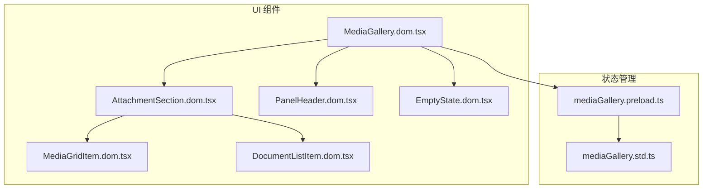
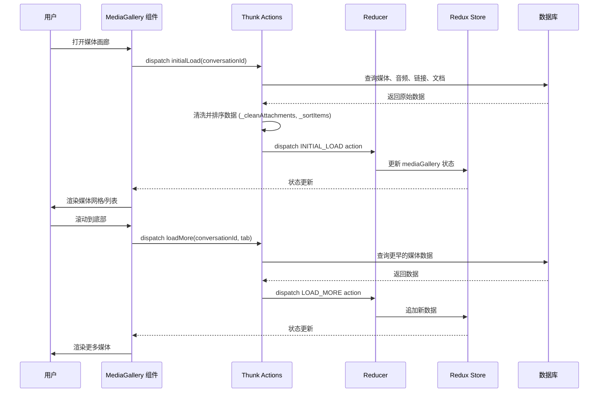
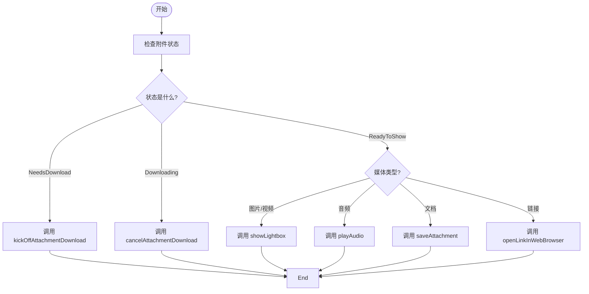
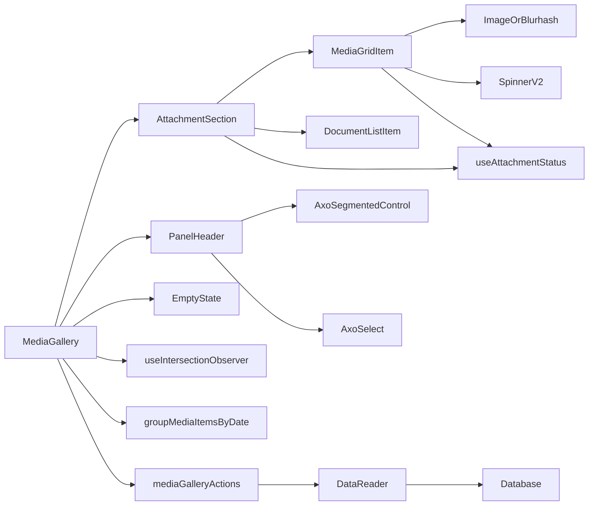

# 媒体展示

<cite>
**本文档中引用的文件**  
- [MediaGallery.dom.tsx](file://ts/components/conversation/media-gallery/MediaGallery.dom.tsx)
- [MediaGallery.dom.stories.tsx](file://ts/components/conversation/media-gallery/MediaGallery.dom.stories.tsx)
- [mediaGallery.preload.ts](file://ts/state/ducks/mediaGallery.preload.ts)
- [mediaGallery.std.ts](file://ts/state/selectors/mediaGallery.std.ts)
- [AttachmentSection.dom.tsx](file://ts/components/conversation/media-gallery/AttachmentSection.dom.tsx)
- [MediaGridItem.dom.tsx](file://ts/components/conversation/media-gallery/MediaGridItem.dom.tsx)
- [PanelHeader.dom.tsx](file://ts/components/conversation/media-gallery/PanelHeader.dom.tsx)
- [EmptyState.dom.tsx](file://ts/components/conversation/media-gallery/EmptyState.dom.tsx)
- [DocumentListItem.dom.tsx](file://ts/components/conversation/media-gallery/DocumentListItem.dom.tsx)
</cite>

## 目录
1. [简介](#简介)
2. [项目结构](#项目结构)
3. [核心组件](#核心组件)
4. [架构概述](#架构概述)
5. [详细组件分析](#详细组件分析)
6. [依赖分析](#依赖分析)
7. [性能考虑](#性能考虑)
8. [故障排除指南](#故障排除指南)
9. [结论](#结论)

## 简介
Signal-Desktop 的媒体展示功能通过 MediaGallery 组件实现，为用户提供了一个集中查看和管理消息中所有媒体内容的界面。该组件支持多种媒体类型，包括图片、视频、GIF、音频和文档，并提供了灯箱查看、附件预览和下载管理等核心功能。MediaGallery 采用现代化的 React 架构，结合 Redux 状态管理，实现了高效的数据流和用户交互。其设计注重用户体验，通过网格布局展示图片和视频，通过列表形式展示音频和文档，并支持按时间分组和懒加载，确保在处理大量媒体时仍能保持流畅的性能。此外，组件还集成了严格的安全机制，防止恶意文件自动执行，确保媒体内容的安全显示。

## 项目结构
媒体展示功能的代码主要位于 `ts/components/conversation/media-gallery/` 目录下，形成了一个高度模块化的组件体系。该目录包含了 MediaGallery 的核心逻辑、UI 子组件以及相关的工具函数。状态管理逻辑则位于 `ts/state/ducks/` 和 `ts/state/selectors/` 目录中，实现了数据与视图的分离。这种清晰的分层结构使得代码易于维护和扩展。

**图源**  
- [MediaGallery.dom.tsx](file://ts/components/conversation/media-gallery/MediaGallery.dom.tsx)
- [mediaGallery.preload.ts](file://ts/state/ducks/mediaGallery.preload.ts)

**节源**  
- [MediaGallery.dom.tsx](file://ts/components/conversation/media-gallery/MediaGallery.dom.tsx)
- [mediaGallery.preload.ts](file://ts/state/ducks/mediaGallery.preload.ts)

## 核心组件
MediaGallery 组件是媒体展示功能的核心，它接收来自 Redux store 的媒体数据和状态，并将其渲染为一个用户友好的界面。该组件通过 `Props` 接口与外部系统进行交互，定义了处理媒体加载、下载、播放和查看等操作的回调函数。其主要职责是根据当前选中的标签页（tab）筛选出相应的媒体项，将它们按日期分组，并通过 `AttachmentSection` 组件进行渲染。组件还实现了懒加载功能，通过 `useIntersectionObserver` 钩子监听滚动到底部的事件，从而触发 `loadMore` 回调加载更多历史媒体，有效管理内存和网络资源。

**节源**  
- [MediaGallery.dom.tsx](file://ts/components/conversation/media-gallery/MediaGallery.dom.tsx)
- [MediaGallery.dom.stories.tsx](file://ts/components/conversation/media-gallery/MediaGallery.dom.stories.tsx)

## 架构概述
MediaGallery 的整体架构遵循 React 和 Redux 的最佳实践，形成了一个清晰的数据流。UI 组件负责渲染和用户交互，而状态管理部分则负责数据的获取、存储和更新。当用户打开媒体画廊时，`initialLoad` thunk action 会被触发，它会从数据库中批量获取不同类型的媒体数据，并通过 `DataReader` 接口进行查询。获取到的数据经过清洗和排序后，由 `reducer` 函数更新到 Redux store 中。MediaGallery 组件通过 `useSelector` 钩子订阅这些状态变化，并重新渲染 UI。当用户与媒体项交互时，如点击下载或播放，组件会通过 `useMediaGalleryActions` 获取绑定的 action creator，并分发相应的 action 来更新状态。

**图源**  
- [mediaGallery.preload.ts](file://ts/state/ducks/mediaGallery.preload.ts)
- [MediaGallery.dom.tsx](file://ts/components/conversation/media-gallery/MediaGallery.dom.tsx)

## 详细组件分析
### MediaGallery 组件分析
MediaGallery 组件是整个媒体展示功能的入口和控制器。它首先通过 `useRef` 创建一个焦点引用，确保组件挂载后能自动获得焦点。组件使用 `useEffect` 钩子来处理初始加载逻辑：当组件首次渲染且没有任何媒体数据时，会自动调用 `initialLoad` 回调。核心的懒加载功能通过 `useIntersectionObserver` 实现，该钩子返回一个 `setObserverRef` 函数和一个 `observerEntry` 对象。组件将 `setObserverRef` 赋给一个隐藏的 div 元素，当该元素进入视口时，`observerEntry.isIntersecting` 会变为 true，从而触发 `loadMore` 回调，加载更多历史媒体。

#### 组件属性与事件回调
MediaGallery 组件通过一个名为 `Props` 的 TypeScript 接口定义了其所有输入和回调。关键属性包括：
- `conversationId`: 当前会话的唯一标识符。
- `tab`: 当前选中的标签页，可以是 'media', 'audio', 'documents', 或 'links'。
- `media`, `audio`, `links`, `documents`: 分别存储不同类型的媒体项数组。
- `haveOldestXxx`: 布尔值，指示是否已加载该类型媒体的最旧数据。

关键的事件回调包括：
- `initialLoad`: 在首次加载时调用，用于获取初始批次的媒体数据。
- `loadMore`: 在需要加载更多历史媒体时调用。
- `showLightbox`: 当用户点击图片或视频时调用，用于打开灯箱查看器。
- `playAudio`: 当用户点击音频文件时调用，用于播放音频。
- `saveAttachment`: 当用户点击文档时调用，用于保存附件。
- `kickOffAttachmentDownload` / `cancelAttachmentDownload`: 用于管理附件的下载过程。

**节源**  
- [MediaGallery.dom.tsx](file://ts/components/conversation/media-gallery/MediaGallery.dom.tsx)

### AttachmentSection 组件分析
AttachmentSection 组件负责渲染一组按日期分组的媒体项。它接收一个 `mediaItems` 数组，并根据数组中第一个项目的类型（通过 `verifyMediaItems` 函数验证）来决定渲染方式。对于图片和视频（`media` 类型），它会渲染为一个响应式的 CSS Grid 网格，支持在不同屏幕尺寸下显示 3 到 5 列。对于音频、文档和链接，它则渲染为一个简单的列表。每个媒体项都通过 `renderMediaItem` 回调进行渲染，这使得 MediaGallery 可以灵活地为不同类型的媒体项提供不同的渲染器。

#### 媒体处理流程
媒体处理流程始于数据库查询，经过状态管理，最终在 UI 组件中完成渲染和交互。当一个媒体项被点击时，`onItemClick` 回调会根据当前附件的状态（通过 `useAttachmentStatus` 钩子获取）执行不同的操作：如果附件需要下载，则调用 `kickOffAttachmentDownload`；如果正在下载，则调用 `cancelAttachmentDownload`；如果已准备好，则根据媒体类型调用 `showLightbox`、`playAudio` 或 `saveAttachment`。

**图源**  
- [MediaGallery.dom.tsx](file://ts/components/conversation/media-gallery/MediaGallery.dom.tsx)
- [AttachmentSection.dom.tsx](file://ts/components/conversation/media-gallery/AttachmentSection.dom.tsx)

**节源**  
- [MediaGallery.dom.tsx](file://ts/components/conversation/media-gallery/MediaGallery.dom.tsx)
- [AttachmentSection.dom.tsx](file://ts/components/conversation/media-gallery/AttachmentSection.dom.tsx)

### MediaGridItem 组件分析
MediaGridItem 组件专门用于渲染图片和视频缩略图。它使用 `ImageOrBlurhash` 组件来显示媒体，该组件优先显示真实的 `objectURL`，如果不可用，则显示由 `blurHash` 生成的模糊占位符，提供平滑的加载体验。组件通过 `useAttachmentStatus` 钩子获取附件的当前状态，并据此显示不同的叠加层。当附件正在下载时，会显示一个带有进度条的 `SpinnerV2` 组件；当附件已准备好时，会根据媒体类型在右下角显示元数据，如 GIF 标签、视频时长或文件大小。

**节源**  
- [MediaGridItem.dom.tsx](file://ts/components/conversation/media-gallery/MediaGridItem.dom.tsx)

## 依赖分析
MediaGallery 组件的实现依赖于多个内部模块和第三方库。其核心依赖关系如下图所示。

**图源**  
- [MediaGallery.dom.tsx](file://ts/components/conversation/media-gallery/MediaGallery.dom.tsx)
- [mediaGallery.preload.ts](file://ts/state/ducks/mediaGallery.preload.ts)

**节源**  
- [MediaGallery.dom.tsx](file://ts/components/conversation/media-gallery/MediaGallery.dom.tsx)
- [mediaGallery.preload.ts](file://ts/state/ducks/mediaGallery.preload.ts)

## 性能考虑
MediaGallery 组件在设计上充分考虑了性能。通过懒加载（lazy loading）机制，它只在用户滚动到页面底部时才加载更多媒体，避免了一次性加载大量数据导致的内存占用过高和界面卡顿。媒体项按日期分组，减少了渲染的 DOM 节点数量。使用 `useIntersectionObserver` 替代传统的滚动事件监听，可以更高效地检测元素的可见性。此外，`useAttachmentStatus` 钩子和 `useIntersectionObserver` 都是经过优化的自定义钩子，它们通过精确的依赖项控制，确保了组件只在必要时才重新渲染，从而提升了整体性能。

## 故障排除指南
在使用 MediaGallery 组件时，可能会遇到以下常见问题：

1.  **媒体项不显示**：检查 `haveOldestXxx` 状态是否正确。如果为 `true`，则 `loadMore` 回调不会被触发。确保 `initialLoad` 回调被正确调用并返回了数据。
2.  **懒加载不工作**：确认 `useIntersectionObserver` 返回的 `setObserverRef` 是否被正确地赋给了一个位于列表末尾的 DOM 元素。检查该元素是否具有足够的高度以被 Intersection Observer 检测到。
3.  **下载状态不更新**：确保 `kickOffAttachmentDownload` 和 `cancelAttachmentDownload` 回调能够正确地更新附件在 Redux store 中的状态。`useAttachmentStatus` 钩子会根据 store 中的状态自动更新。
4.  **灯箱无法打开**：检查 `showLightbox` 回调的实现，确保它接收的 `attachment` 和 `messageId` 参数是有效的。确认灯箱组件本身已正确实现。

**节源**  
- [MediaGallery.dom.tsx](file://ts/components/conversation/media-gallery/MediaGallery.dom.tsx)
- [mediaGallery.preload.ts](file://ts/state/ducks/mediaGallery.preload.ts)

## 结论
Signal-Desktop 的 MediaGallery 组件是一个设计精良、功能完整的媒体展示解决方案。它通过清晰的组件化设计、高效的懒加载机制和强大的状态管理，为用户提供了一个流畅、安全的媒体浏览体验。该组件不仅实现了图片、视频、音频和文档的统一展示，还通过灯箱查看、附件预览和下载管理等功能，极大地提升了应用的可用性。其代码结构清晰，依赖关系明确，易于维护和扩展，是 Signal-Desktop 应用中一个关键且高质量的模块。