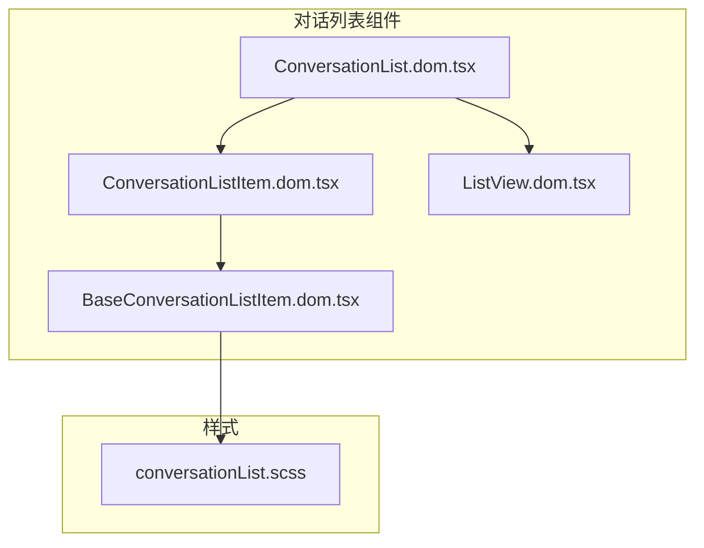
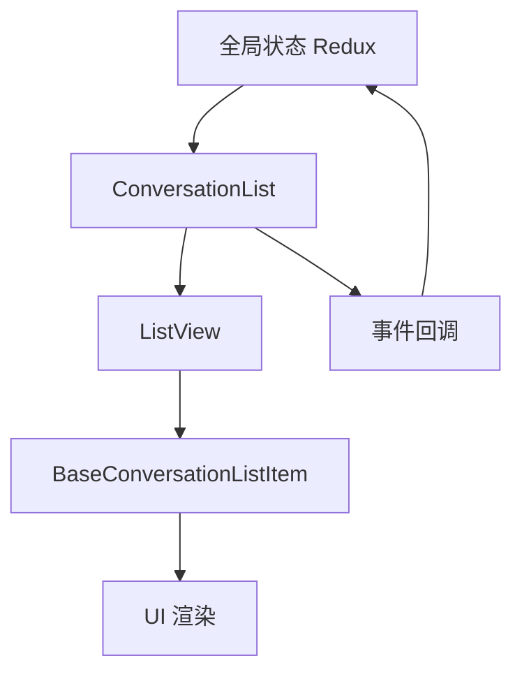
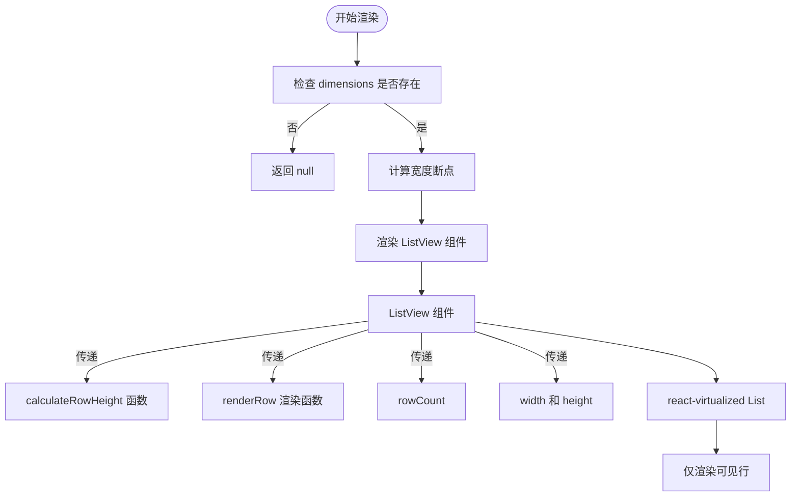
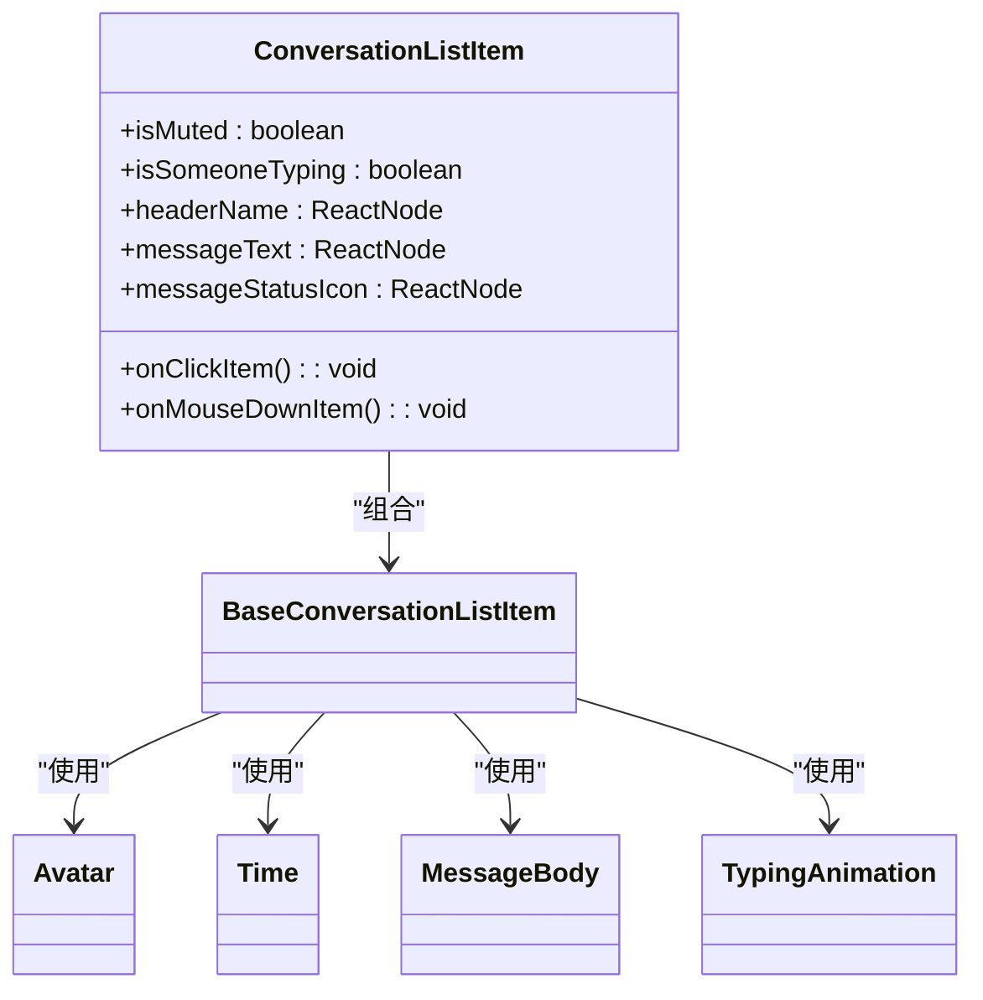
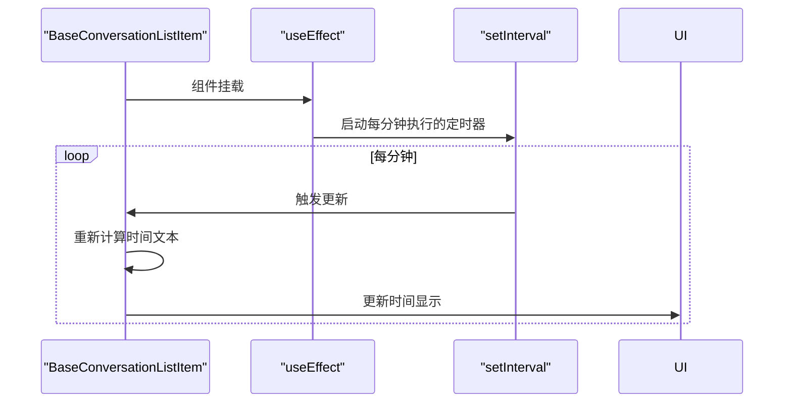
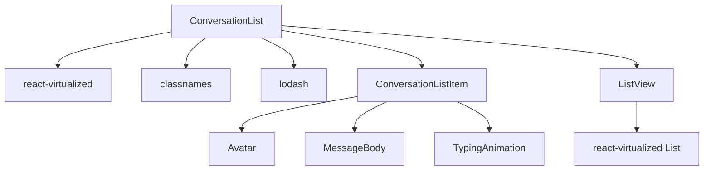

# 对话列表

<cite>
**本文档中引用的文件**   
- [ConversationList.dom.tsx](file://ts/components/ConversationList.dom.tsx)
- [ConversationListItem.dom.tsx](file://ts/components/conversationList/ConversationListItem.dom.tsx)
- [BaseConversationListItem.dom.tsx](file://ts/components/conversationList/BaseConversationListItem.dom.tsx)
- [ListView.dom.tsx](file://ts/components/ListView.dom.tsx)
- [conversationList.scss](file://stylesheets/components/conversationList.scss)
</cite>

## 目录
1. [介绍](#介绍)
2. [项目结构](#项目结构)
3. [核心组件](#核心组件)
4. [架构概述](#架构概述)
5. [详细组件分析](#详细组件分析)
6. [依赖分析](#依赖分析)
7. [性能考虑](#性能考虑)
8. [故障排除指南](#故障排除指南)
9. [结论](#结论)

## 介绍
本文件详细记录了Signal-Desktop应用程序中对话列表组件的实现。该组件负责在主界面中高效渲染和管理大量会话项，支持虚拟滚动、搜索过滤、会话状态显示（如未读消息、静音状态、置顶会话）以及平滑的动画效果。文档将深入分析其架构设计、性能优化策略、与全局状态管理的集成方式，以及在不同屏幕尺寸下的响应式设计实现。

## 项目结构
对话列表组件位于`ts/components/`目录下，主要由多个相互协作的React组件构成。核心组件`ConversationList`作为容器，使用`react-virtualized`库实现虚拟滚动，以高效处理大量会话数据。该组件依赖于`ListView`组件进行底层的滚动和渲染管理，并通过`ConversationListItem`和`BaseConversationListItem`组件来渲染单个会话项。样式文件位于`stylesheets/components/`目录下，使用SCSS进行模块化管理。

**图源**
- [ConversationList.dom.tsx](file://ts/components/ConversationList.dom.tsx)
- [ConversationListItem.dom.tsx](file://ts/components/conversationList/ConversationListItem.dom.tsx)
- [BaseConversationListItem.dom.tsx](file://ts/components/conversationList/BaseConversationListItem.dom.tsx)
- [ListView.dom.tsx](file://ts/components/ListView.dom.tsx)
- [conversationList.scss](file://stylesheets/components/conversationList.scss)

## 核心组件
对话列表的核心功能由`ConversationList`、`ConversationListItem`和`ListView`三个组件协同实现。`ConversationList`负责接收来自全局状态的数据和回调函数，`ListView`处理虚拟滚动的复杂性，而`ConversationListItem`则专注于单个会话项的视觉呈现和交互逻辑。

**节源**
- [ConversationList.dom.tsx](file://ts/components/ConversationList.dom.tsx)
- [ConversationListItem.dom.tsx](file://ts/components/conversationList/ConversationListItem.dom.tsx)
- [ListView.dom.tsx](file://ts/components/ListView.dom.tsx)

## 架构概述
对话列表组件采用分层架构设计，将数据处理、滚动逻辑和UI渲染分离。`ConversationList`作为顶层容器，接收来自Redux状态管理的会话数据流，并通过`getRow`函数为`ListView`提供每一行的数据。`ListView`利用`react-virtualized`的`List`组件，仅渲染当前视口内的会话项，从而实现高性能的滚动体验。`BaseConversationListItem`作为基础UI组件，封装了头像、未读指示器、消息预览等通用元素，`ConversationListItem`在此基础上添加了特定于会话的业务逻辑。

**图源**
- [ConversationList.dom.tsx](file://ts/components/ConversationList.dom.tsx)
- [ListView.dom.tsx](file://ts/components/ListView.dom.tsx)
- [BaseConversationListItem.dom.tsx](file://ts/components/conversationList/BaseConversationListItem.dom.tsx)

## 详细组件分析

### ConversationList 组件分析
`ConversationList`是对话列表的主容器组件，它定义了组件的公共接口（props），并协调数据流和事件处理。

#### 组件接口与可定制化选项
`ConversationList`通过其`PropsType`接口暴露了丰富的配置和回调选项，使其高度可定制化。

| 属性 | 类型 | 描述 |
| :--- | :--- | :--- |
| `dimensions` | `{ width: number, height: number }` | 列表的尺寸，用于虚拟滚动计算 |
| `rowCount` | `number` | 列表中总行数 |
| `getRow` | `(index: number) => Row` | 获取指定索引行数据的函数 |
| `onSelectConversation` | `(conversationId: string, messageId?: string) => void` | 点击会话项时的回调 |
| `onPreloadConversation` | `(conversationId: string, messageId?: string) => void` | 鼠标悬停时预加载会话的回调 |
| `renderConversationListItemContextMenu` | `(props: RenderConversationListItemContextMenuProps) => JSX.Element` | 自定义右键菜单的渲染函数 |
| `scrollToRowIndex` | `number` | 指定滚动到的行索引 |

**节源**
- [ConversationList.dom.tsx](file://ts/components/ConversationList.dom.tsx#L209-L249)

#### 虚拟滚动实现
`ConversationList`通过`ListView`组件实现虚拟滚动。它定义了`calculateRowHeight`函数来根据行类型（会话、联系人、标题等）动态计算每行的高度，并将此函数和`renderRow`渲染函数传递给`ListView`。`ListView`内部使用`react-virtualized`的`List`组件，仅渲染视口内的行，极大地提升了渲染性能。

**图源**
- [ConversationList.dom.tsx](file://ts/components/ConversationList.dom.tsx#L287-L325)
- [ListView.dom.tsx](file://ts/components/ListView.dom.tsx#L48-L51)

### ConversationListItem 组件分析
`ConversationListItem`负责渲染单个会话项，它处理了会话状态的显示逻辑。

#### 会话状态显示
该组件通过条件渲染来显示不同的会话状态：
- **静音状态**：通过检查`muteExpiresAt`时间戳是否在未来，来决定是否显示静音图标。
- **未读消息**：通过`unreadCount`属性显示未读消息数量，或通过`markedUnread`属性显示已标记未读的指示器。
- **草稿消息**：当`shouldShowDraft`为真且存在`draftPreview`时，显示“草稿”前缀和消息预览。
- **正在输入**：当`typingContactIdTimestamps`对象不为空时，显示“正在输入”动画。

**图源**
- [ConversationListItem.dom.tsx](file://ts/components/conversationList/ConversationListItem.dom.tsx#L77-L248)
- [BaseConversationListItem.dom.tsx](file://ts/components/conversationList/BaseConversationListItem.dom.tsx#L89-L332)

#### 搜索过滤功能
搜索过滤功能主要在`ConversationList`的父级组件中实现。`ConversationList`本身通过`getRow`函数接收一个已经过滤和排序的会话列表。当用户输入搜索词时，应用会调用`filterAndSortConversations`工具函数，该函数根据标题、电话号码等字段对会话进行模糊匹配和排序，然后将结果传递给`ConversationList`进行渲染。

**节源**
- [ConversationList.dom.tsx](file://ts/components/ConversationList.dom.tsx#L218)
- [util/filterAndSortConversations.std.ts](file://ts/util/filterAndSortConversations.std.ts)

#### 平滑动画效果
组件通过多种方式实现平滑的动画效果：
- **时间戳更新**：`BaseConversationListItem`中的`Timestamp`组件使用`useEffect`和`setInterval`，每分钟更新一次时间显示，从“刚刚”平滑过渡到“1分钟前”、“2分钟前”等。
- **CSS动画**：SCSS文件中定义了`panel--in--ltr`和`panel--in--rtl`关键帧动画，用于实现面板从侧边滑入的动画效果。

**图源**
- [BaseConversationListItem.dom.tsx](file://ts/components/conversationList/BaseConversationListItem.dom.tsx#L334-L352)
- [conversationList.scss](file://stylesheets/components/conversationList.scss#L6-L28)

## 依赖分析
对话列表组件依赖于多个外部库和内部模块。它使用`react-virtualized`进行高效的列表渲染，`classnames`进行动态CSS类名拼接，`lodash`进行数据处理。在内部，它紧密依赖于`state/ducks/conversations.preload.js`中的状态定义和`types/Util.std.js`中的类型定义。样式方面，它依赖于`stylesheets/_variables.scss`中的设计变量。

**图源**
- [ConversationList.dom.tsx](file://ts/components/ConversationList.dom.tsx#L4-L8)
- [BaseConversationListItem.dom.tsx](file://ts/components/conversationList/BaseConversationListItem.dom.tsx#L10-L18)

## 性能考虑
该组件的性能优化策略主要体现在以下几个方面：
1.  **虚拟滚动**：通过`react-virtualized`，避免渲染大量不在视口内的DOM节点，显著降低了内存占用和渲染开销。
2.  **组件记忆化**：`ConversationListItem`和`BaseConversationListItem`都使用了`React.memo`进行记忆化，防止在父组件重新渲染时进行不必要的子组件重渲染。
3.  **回调函数记忆化**：使用`useCallback`对`calculateRowHeight`和`renderRow`等函数进行记忆化，确保传递给`ListView`的引用稳定，避免`ListView`不必要的重渲染。
4.  **高效的数据选择**：通过`pick`函数从完整的会话对象中提取`ConversationListItem`所需的最小属性集，减少了不必要的数据传递。

## 故障排除指南
- **问题：列表滚动卡顿**
  - **可能原因**：虚拟滚动未正确工作，导致渲染了过多的DOM节点。
  - **解决方案**：检查`dimensions` prop是否正确传递，确保`ListView`能获取到正确的宽高。检查`calculateRowHeight`函数是否有性能问题。

- **问题：会话状态（如未读数）未及时更新**
  - **可能原因**：`shouldRecomputeRowHeights` prop未在数据变化时正确触发。
  - **解决方案**：确保在会话数据发生可能影响行高的变化时（如未读数从0变为1），将`shouldRecomputeRowHeights`设置为`true`。

- **问题：右键菜单不显示**
  - **可能原因**：`renderConversationListItemContextMenu` prop未被正确传递或实现。
  - **解决方案**：检查父组件是否提供了此prop，并确保其返回一个有效的React元素。

**节源**
- [ConversationList.dom.tsx](file://ts/components/ConversationList.dom.tsx#L37-L41)
- [BaseConversationListItem.dom.tsx](file://ts/components/conversationList/BaseConversationListItem.dom.tsx#L66-L68)

## 结论
Signal-Desktop的对话列表组件是一个设计精良、性能优异的UI组件。它通过分层架构和虚拟滚动技术，成功解决了在桌面应用中高效渲染和管理大量会话的挑战。组件的可定制化接口和与全局状态的紧密集成，使其能够灵活地适应不同的使用场景。其对细节的关注，如平滑的时间戳动画和响应式的布局设计，进一步提升了用户体验。该组件是React应用中处理复杂列表渲染的一个优秀范例。