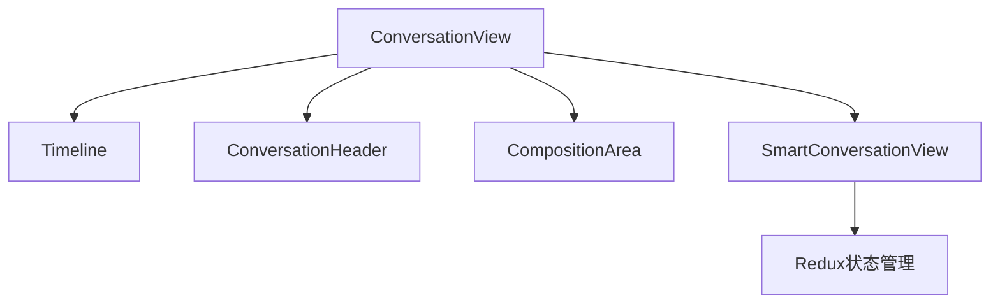
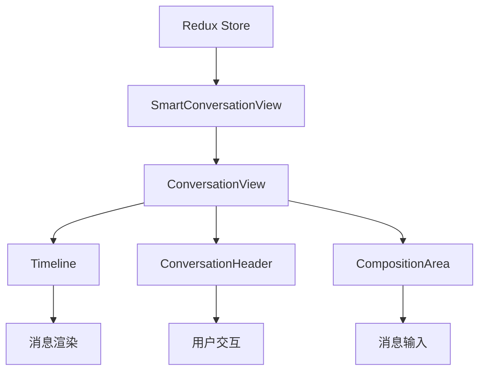
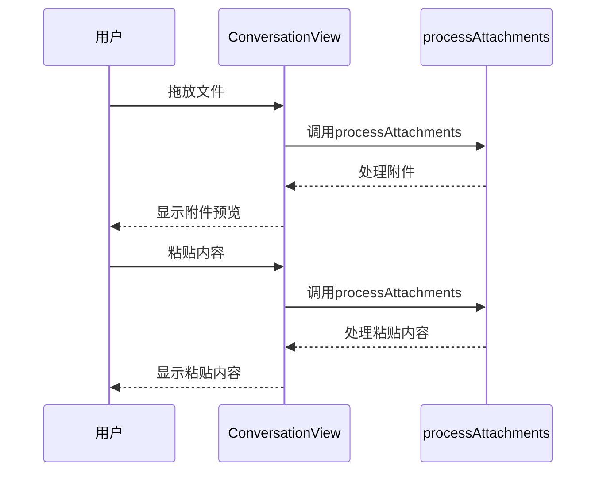
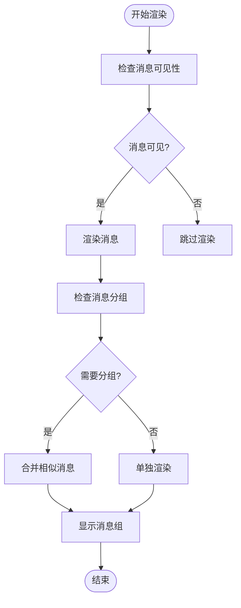
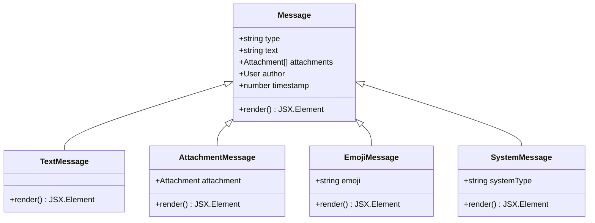
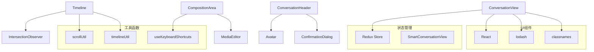

# 对话视图

<cite>
**本文档引用的文件**
- [ConversationView.dom.tsx](file://ts/components/conversation/ConversationView.dom.tsx)
- [ConversationView.scss](file://stylesheets/components/ConversationView.scss)
- [Timeline.dom.tsx](file://ts/components/conversation/Timeline.dom.tsx)
- [ConversationHeader.dom.tsx](file://ts/components/conversation/ConversationHeader.dom.tsx)
- [CompositionArea.dom.tsx](file://ts/components/CompositionArea.dom.tsx)
- [ConversationView.preload.tsx](file://ts/state/smart/ConversationView.preload.tsx)
</cite>

## 目录
1. [简介](#简介)
2. [项目结构](#项目结构)
3. [核心组件](#核心组件)
4. [架构概述](#架构概述)
5. [详细组件分析](#详细组件分析)
6. [依赖分析](#依赖分析)
7. [性能考虑](#性能考虑)
8. [故障排除指南](#故障排除指南)
9. [结论](#结论)

## 简介
本文档深入分析Signal-Desktop中对话视图组件的实现。详细记录ConversationView组件的架构设计、状态管理机制和性能优化策略，包括消息渲染、时间线布局、系统消息处理和用户交互响应。解释组件如何处理不同类型的消息（文本、附件、表情、系统通知）的渲染逻辑，以及如何实现消息的分组、时间戳显示和滚动位置管理。提供组件props接口、事件回调和生命周期方法的完整文档，包含实际使用示例和最佳实践。分析该组件与Redux状态管理的集成方式，以及如何处理大量消息时的性能优化（如虚拟滚动、懒加载等）。

## 项目结构
对话视图组件主要由以下几个部分组成：
- `ConversationView.dom.tsx`：对话视图的主要React组件
- `ConversationView.scss`：对话视图的样式文件
- `Timeline.dom.tsx`：消息时间线组件
- `ConversationHeader.dom.tsx`：对话头部组件
- `CompositionArea.dom.tsx`：消息输入区域组件
- `ConversationView.preload.tsx`：智能对话视图组件，连接Redux状态



**图表来源**
- [ConversationView.dom.tsx](file://ts/components/conversation/ConversationView.dom.tsx)
- [ConversationView.scss](file://stylesheets/components/ConversationView.scss)

**本节来源**
- [ConversationView.dom.tsx](file://ts/components/conversation/ConversationView.dom.tsx)
- [ConversationView.scss](file://stylesheets/components/ConversationView.scss)

## 核心组件
对话视图的核心组件包括ConversationView、Timeline、ConversationHeader和CompositionArea。这些组件共同构成了Signal桌面客户端的对话界面。

**本节来源**
- [ConversationView.dom.tsx](file://ts/components/conversation/ConversationView.dom.tsx)
- [Timeline.dom.tsx](file://ts/components/conversation/Timeline.dom.tsx)

## 架构概述
对话视图采用分层架构设计，将UI组件与状态管理分离。SmartConversationView作为容器组件，负责从Redux store中获取数据并传递给展示组件ConversationView。ConversationView则负责组合各个子组件，包括消息时间线、对话头部和消息输入区域。



**图表来源**
- [ConversationView.preload.tsx](file://ts/state/smart/ConversationView.preload.tsx)
- [ConversationView.dom.tsx](file://ts/components/conversation/ConversationView.dom.tsx)

## 详细组件分析

### ConversationView组件分析
ConversationView是对话视图的主要展示组件，负责组合和协调各个子组件。它通过props接收来自SmartConversationView的数据和回调函数。

#### 组件属性接口
```typescript
export type PropsType = {
  conversationId: string;
  hasOpenModal: boolean;
  hasOpenPanel: boolean;
  isSelectMode: boolean;
  onExitSelectMode: () => void;
  processAttachments: (options: {
    conversationId: string;
    files: ReadonlyArray<File>;
    flags: null;
  }) => void;
  renderCompositionArea: (conversationId: string) => JSX.Element;
  renderConversationHeader: (conversationId: string) => JSX.Element;
  renderTimeline: (conversationId: string) => JSX.Element;
  renderPanel: (conversationId: string) => JSX.Element | undefined;
  shouldHideConversationView?: boolean;
};
```

#### 用户交互处理
ConversationView组件处理拖放和粘贴事件，允许用户直接将文件拖入对话区域或从剪贴板粘贴内容。组件通过`onDrop`和`onPaste`回调函数实现这些功能。



**图表来源**
- [ConversationView.dom.tsx](file://ts/components/conversation/ConversationView.dom.tsx)

**本节来源**
- [ConversationView.dom.tsx](file://ts/components/conversation/ConversationView.dom.tsx)

### Timeline组件分析
Timeline组件负责渲染消息时间线，处理消息的分组、时间戳显示和滚动位置管理。

#### 消息渲染逻辑
Timeline组件通过IntersectionObserver来优化性能，只在消息进入视口时才进行渲染。组件还实现了智能滚动，能够自动保持在底部或记住用户的滚动位置。



**图表来源**
- [Timeline.dom.tsx](file://ts/components/conversation/Timeline.dom.tsx)

**本节来源**
- [Timeline.dom.tsx](file://ts/components/conversation/Timeline.dom.tsx)

### 消息类型处理
对话视图组件能够处理多种类型的消息，包括文本、附件、表情和系统通知。

#### 消息类型渲染策略


**图表来源**
- [Timeline.dom.tsx](file://ts/components/conversation/Timeline.dom.tsx)
- [Message.dom.tsx](file://ts/components/conversation/Message.dom.tsx)

**本节来源**
- [Timeline.dom.tsx](file://ts/components/conversation/Timeline.dom.tsx)
- [Message.dom.tsx](file://ts/components/conversation/Message.dom.tsx)

## 依赖分析
对话视图组件依赖于多个子系统和外部库，包括Redux状态管理、React Hooks和各种工具函数。



**图表来源**
- [ConversationView.preload.tsx](file://ts/state/smart/ConversationView.preload.tsx)
- [Timeline.dom.tsx](file://ts/components/conversation/Timeline.dom.tsx)
- [CompositionArea.dom.tsx](file://ts/components/CompositionArea.dom.tsx)

**本节来源**
- [ConversationView.preload.tsx](file://ts/state/smart/ConversationView.preload.tsx)
- [Timeline.dom.tsx](file://ts/components/conversation/Timeline.dom.tsx)

## 性能考虑
对话视图组件在处理大量消息时采用了多种性能优化策略：

1. **虚拟滚动**：通过IntersectionObserver实现，只渲染可见区域的消息
2. **消息分组**：将连续的相似消息合并显示，减少DOM节点数量
3. **防抖处理**：对频繁触发的事件（如滚动）进行防抖处理
4. **状态记忆**：使用React.memo对组件进行记忆化，避免不必要的重渲染
5. **懒加载**：在需要时才加载更多消息，而不是一次性加载所有消息

这些优化策略确保了即使在包含数千条消息的对话中，用户界面仍然保持流畅和响应迅速。

## 故障排除指南
当对话视图组件出现问题时，可以参考以下常见问题和解决方案：

1. **消息不显示**：检查Redux store中的消息数据是否正确加载
2. **滚动卡顿**：检查是否有过多的DOM节点，考虑增加虚拟滚动的阈值
3. **附件无法上传**：检查processAttachments回调函数的实现
4. **时间戳显示错误**：检查时区设置和时间格式化函数
5. **键盘快捷键失效**：检查useKeyboardShortcuts Hook的使用是否正确

**本节来源**
- [ConversationView.dom.tsx](file://ts/components/conversation/ConversationView.dom.tsx)
- [Timeline.dom.tsx](file://ts/components/conversation/Timeline.dom.tsx)

## 结论
Signal-Desktop的对话视图组件采用现代化的React架构，通过合理的组件拆分和状态管理，实现了高性能、可维护的对话界面。组件的设计充分考虑了用户体验和性能优化，能够流畅处理大量消息。通过深入理解其架构和实现细节，开发者可以更好地维护和扩展这一关键功能。