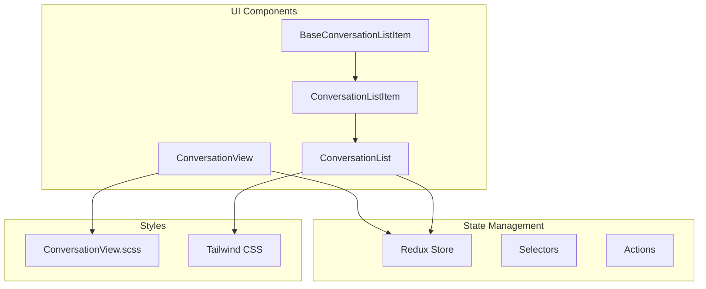
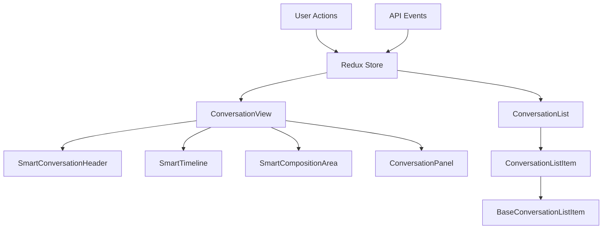
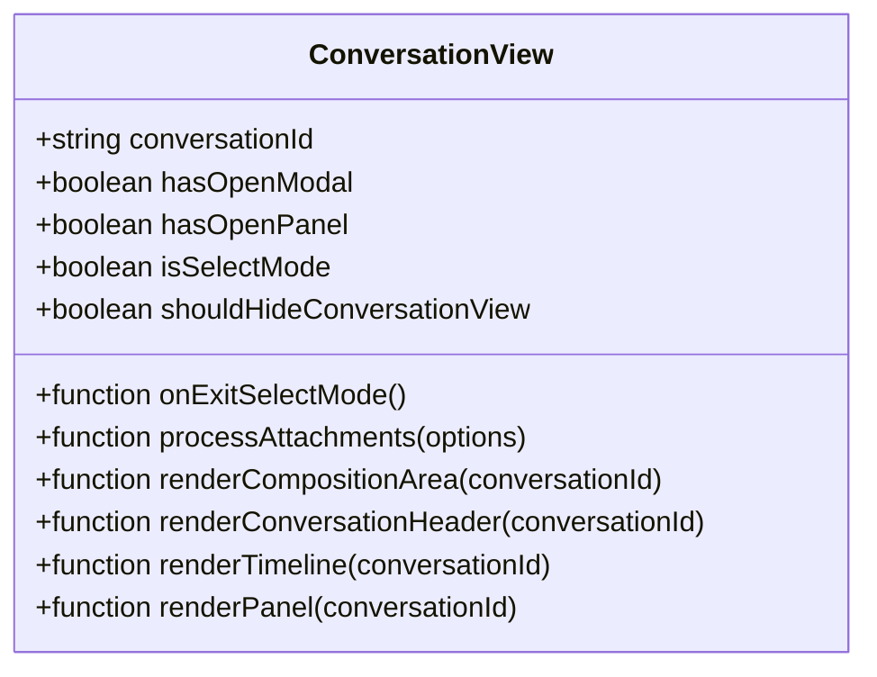
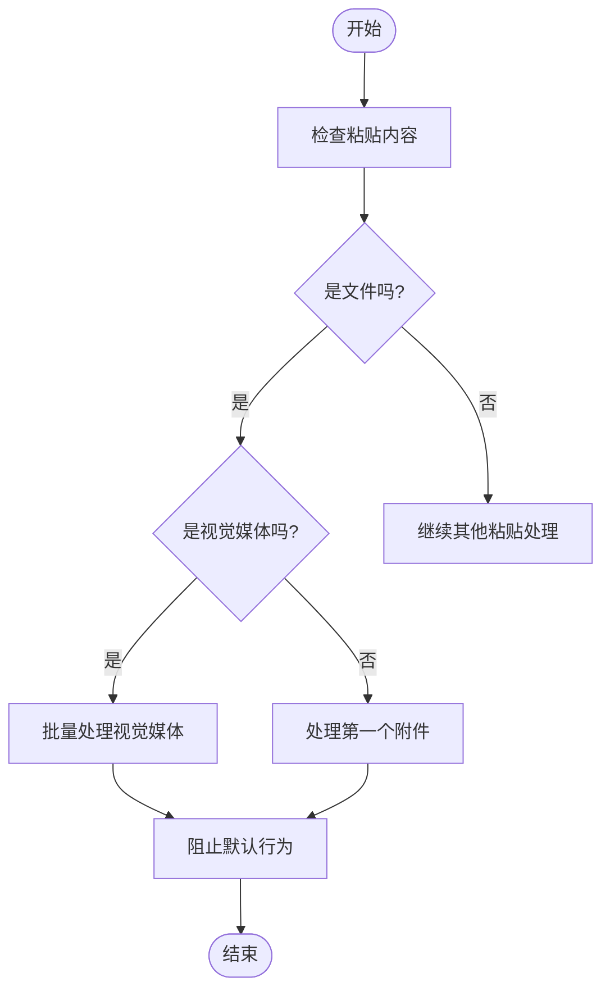
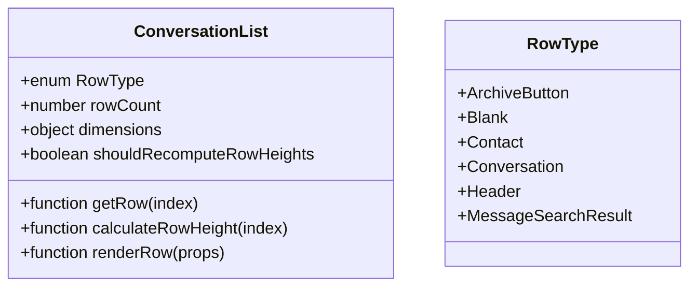
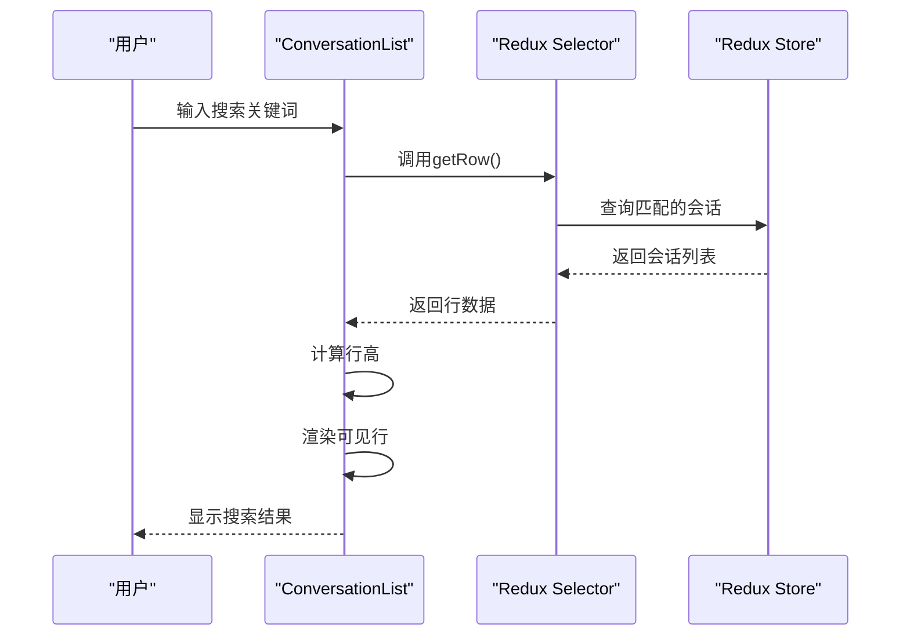
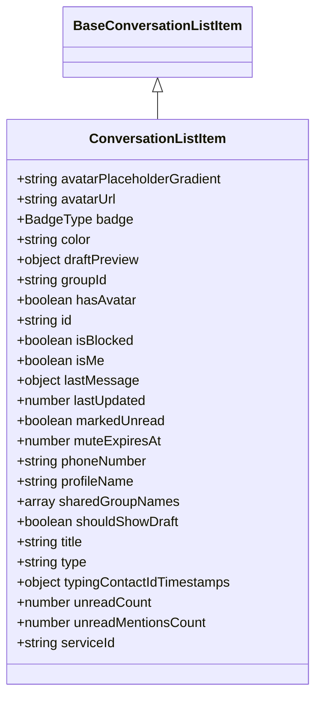
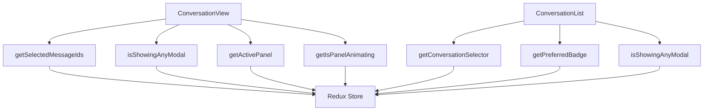

# 核心UI组件

<cite>
**本文档中引用的文件**   
- [ConversationView.dom.tsx](file://ts/components/conversation/ConversationView.dom.tsx)
- [ConversationList.dom.tsx](file://ts/components/ConversationList.dom.tsx)
- [ConversationListItem.dom.tsx](file://ts/components/conversationList/ConversationListItem.dom.tsx)
- [BaseConversationListItem.dom.tsx](file://ts/components/conversationList/BaseConversationListItem.dom.tsx)
- [ConversationView.scss](file://stylesheets/components/ConversationView.scss)
- [ConversationView.preload.tsx](file://ts/state/smart/ConversationView.preload.tsx)
- [conversations.dom.ts](file://ts/state/selectors/conversations.dom.ts)
- [conversations.preload.ts](file://ts/state/ducks/conversations.preload.ts)
</cite>

## 目录
1. [简介](#简介)
2. [项目结构](#项目结构)
3. [核心组件](#核心组件)
4. [架构概述](#架构概述)
5. [详细组件分析](#详细组件分析)
6. [依赖分析](#依赖分析)
7. [性能考虑](#性能考虑)
8. [故障排除指南](#故障排除指南)
9. [结论](#结论)

## 简介
本文档深入分析Signal-Desktop的核心UI组件实现，重点关注ConversationView和ConversationList组件。详细记录了这些组件的架构设计、状态管理机制和性能优化策略。文档解释了对话视图中消息渲染、附件处理、时间线布局的实现细节，以及对话列表的虚拟滚动、搜索过滤和会话状态显示功能。提供了组件props接口、事件回调和生命周期方法的完整文档，包含实际使用示例和最佳实践。同时分析了组件间的通信模式和数据流，以及如何通过Redux连接实现状态同步。

## 项目结构
Signal-Desktop项目采用模块化架构，核心UI组件主要分布在`ts/components`目录下。`ConversationView`和`ConversationList`作为核心会话管理组件，分别负责单个对话的展示和对话列表的管理。组件的样式定义在`stylesheets/components`目录中，而状态管理逻辑则通过Redux存储在`ts/state`目录下。这种清晰的分层结构使得UI组件与业务逻辑分离，提高了代码的可维护性和可测试性。



**图表来源**
- [ConversationView.dom.tsx](file://ts/components/conversation/ConversationView.dom.tsx)
- [ConversationList.dom.tsx](file://ts/components/ConversationList.dom.tsx)
- [ConversationView.scss](file://stylesheets/components/ConversationView.scss)

**章节来源**
- [ConversationView.dom.tsx](file://ts/components/conversation/ConversationView.dom.tsx)
- [ConversationList.dom.tsx](file://ts/components/ConversationList.dom.tsx)

## 核心组件
Signal-Desktop的核心UI组件围绕会话管理构建，其中`ConversationView`和`ConversationList`是两个最关键的组件。`ConversationView`负责渲染单个对话的完整界面，包括消息时间线、输入区域和对话头。`ConversationList`则管理所有会话的列表展示，实现了虚拟滚动以优化大量会话的性能表现。

**章节来源**
- [ConversationView.dom.tsx](file://ts/components/conversation/ConversationView.dom.tsx)
- [ConversationList.dom.tsx](file://ts/components/ConversationList.dom.tsx)

## 架构概述
Signal-Desktop的UI架构采用React与Redux的组合模式，实现了组件的声明式渲染和状态的集中管理。`ConversationView`和`ConversationList`作为容器组件，通过Redux连接器与全局状态树连接，订阅相关数据的变化。组件树采用自上而下的数据流设计，确保状态变更的可预测性。



**图表来源**
- [ConversationView.preload.tsx](file://ts/state/smart/ConversationView.preload.tsx)
- [ConversationList.dom.tsx](file://ts/components/ConversationList.dom.tsx)

## 详细组件分析

### ConversationView组件分析
`ConversationView`组件是Signal-Desktop中负责渲染单个对话的核心组件。它通过props接收会话ID和各种状态标志，将复杂的UI分解为可复用的子组件。组件实现了拖放和粘贴事件处理，支持直接从文件系统向对话中添加附件。

#### 组件接口和属性


**图表来源**
- [ConversationView.dom.tsx](file://ts/components/conversation/ConversationView.dom.tsx)

#### 消息渲染和附件处理
`ConversationView`通过`renderTimeline` prop委托时间线的渲染，实现了消息的高效更新。组件对粘贴事件进行了特殊处理，能够识别剪贴板中的图像数据并自动重命名，解决了浏览器默认行为导致的文件名问题。



**图表来源**
- [ConversationView.dom.tsx](file://ts/components/conversation/ConversationView.dom.tsx)

**章节来源**
- [ConversationView.dom.tsx](file://ts/components/conversation/ConversationView.dom.tsx)

### ConversationList组件分析
`ConversationList`组件负责管理对话列表的展示，采用了`react-virtualized`库实现虚拟滚动，确保在大量会话情况下仍能保持流畅的滚动性能。组件通过`ListView`包装器管理行高计算和渲染，支持多种行类型，包括普通会话、联系人、标题和特殊按钮。

#### 虚拟滚动和行类型管理


**图表来源**
- [ConversationList.dom.tsx](file://ts/components/ConversationList.dom.tsx)

#### 搜索过滤和会话状态显示
`ConversationList`通过`getRow`函数动态生成列表项，支持搜索结果的实时过滤。组件使用`RenderConversationListItemContextMenu` prop实现右键菜单的注入，允许在不修改核心组件的情况下扩展功能。



**图表来源**
- [ConversationList.dom.tsx](file://ts/components/ConversationList.dom.tsx)

**章节来源**
- [ConversationList.dom.tsx](file://ts/components/ConversationList.dom.tsx)

### ConversationListItem组件分析
`ConversationListItem`组件是对话列表中每个会话项的具体实现。它继承自`BaseConversationListItem`，实现了特定于会话的渲染逻辑。组件负责显示会话的头像、标题、最后消息预览和未读计数。

#### 状态管理和性能优化


**图表来源**
- [ConversationListItem.dom.tsx](file://ts/components/conversationList/ConversationListItem.dom.tsx)
- [BaseConversationListItem.dom.tsx](file://ts/components/conversationList/BaseConversationListItem.dom.tsx)

#### 时间线布局和消息预览
`ConversationListItem`根据会话状态动态决定显示内容：当用户正在输入时显示输入动画，有草稿时显示草稿前缀和内容，消息被删除时显示特殊提示。这种条件渲染策略确保了UI的清晰性和一致性。

```mermaid
flowchart TD
A[开始] --> B{会话被屏蔽?}
B --> |是| C[显示"已屏蔽"消息]
B --> |否| D{消息请求?}
D --> |是| E[显示"消息请求"消息]
D --> |否| F{有人正在输入?}
F --> |是| G[显示输入动画]
F --> |否| H{有草稿?}
H --> |是| I[显示草稿内容]
H --> |否| J{最后消息被删除?}
J --> |是| K[显示"已为所有人删除"消息]
J --> |否| L[显示最后消息预览]
C --> M[结束]
E --> M
G --> M
I --> M
K --> M
L --> M
```

**图表来源**
- [ConversationListItem.dom.tsx](file://ts/components/conversationList/ConversationListItem.dom.tsx)

**章节来源**
- [ConversationListItem.dom.tsx](file://ts/components/conversationList/ConversationListItem.dom.tsx)
- [BaseConversationListItem.dom.tsx](file://ts/components/conversationList/BaseConversationListItem.dom.tsx)

## 依赖分析
`ConversationView`和`ConversationList`组件通过Redux与应用的全局状态紧密集成。`ConversationView`依赖于`getSelectedMessageIds`、`isShowingAnyModal`等选择器来确定当前状态，而`ConversationList`则依赖于`getConversationSelector`来获取会话数据。



**图表来源**
- [ConversationView.preload.tsx](file://ts/state/smart/ConversationView.preload.tsx)
- [conversations.dom.ts](file://ts/state/selectors/conversations.dom.ts)

**章节来源**
- [ConversationView.preload.tsx](file://ts/state/smart/ConversationView.preload.tsx)
- [conversations.dom.ts](file://ts/state/selectors/conversations.dom.ts)

## 性能考虑
Signal-Desktop在UI性能优化方面采用了多种策略。`ConversationList`使用虚拟滚动技术，只渲染可视区域内的行，大大减少了DOM节点数量。组件广泛使用`React.memo`进行记忆化，避免不必要的重新渲染。`ConversationView`通过将复杂UI分解为独立的智能组件，实现了更细粒度的更新控制。

## 故障排除指南
当遇到`ConversationView`或`ConversationList`相关的问题时，首先检查Redux状态是否正确更新。使用开发者工具监控`conversations` slice的变化，确保会话数据的加载和更新符合预期。对于渲染性能问题，检查是否正确实现了虚拟滚动，以及是否有不必要的重新渲染。

**章节来源**
- [ConversationView.dom.tsx](file://ts/components/conversation/ConversationView.dom.tsx)
- [ConversationList.dom.tsx](file://ts/components/ConversationList.dom.tsx)

## 结论
Signal-Desktop的`ConversationView`和`ConversationList`组件展示了现代React应用中复杂的UI组件设计模式。通过合理的架构分层、高效的性能优化和清晰的状态管理，这两个组件为用户提供流畅的会话管理体验。组件的设计充分考虑了可扩展性和可维护性，为未来的功能迭代奠定了坚实的基础。