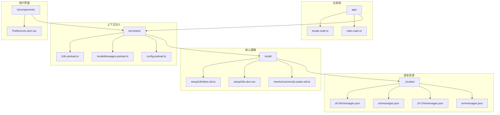
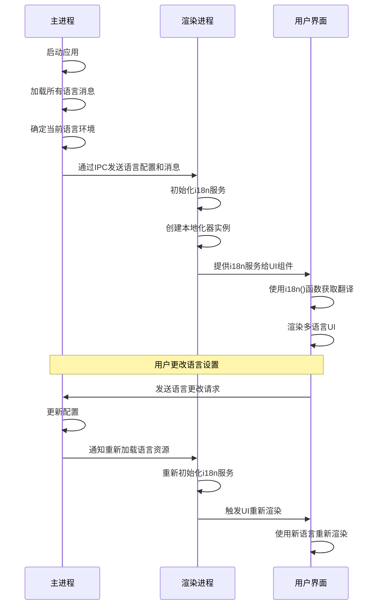
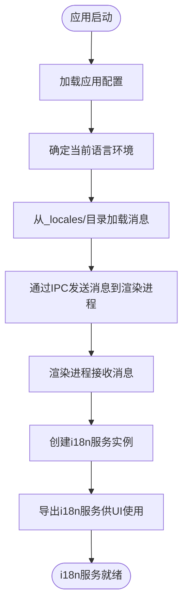
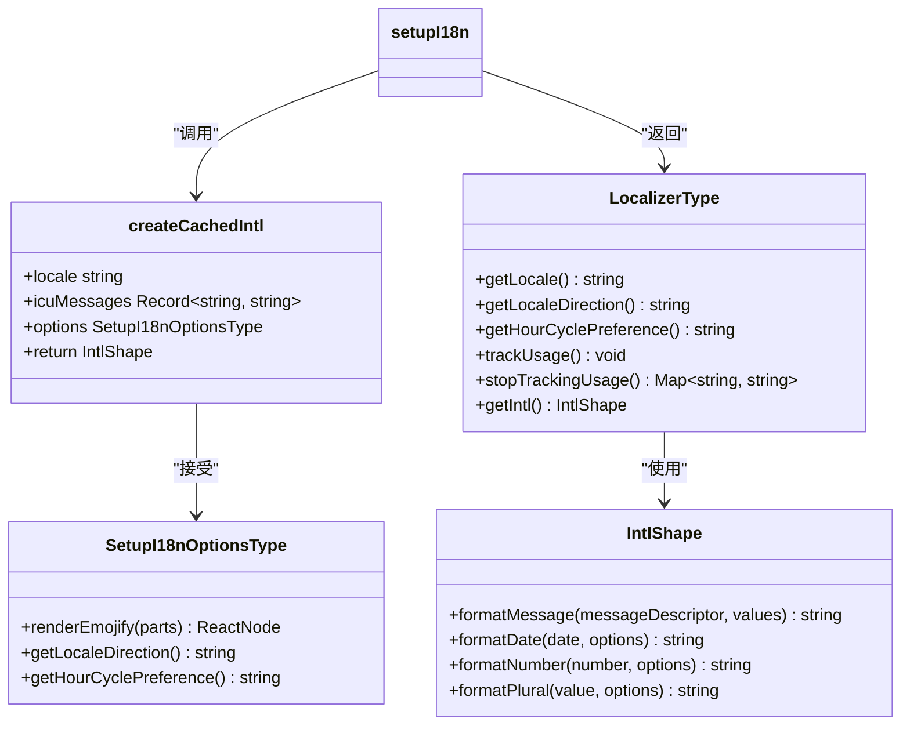
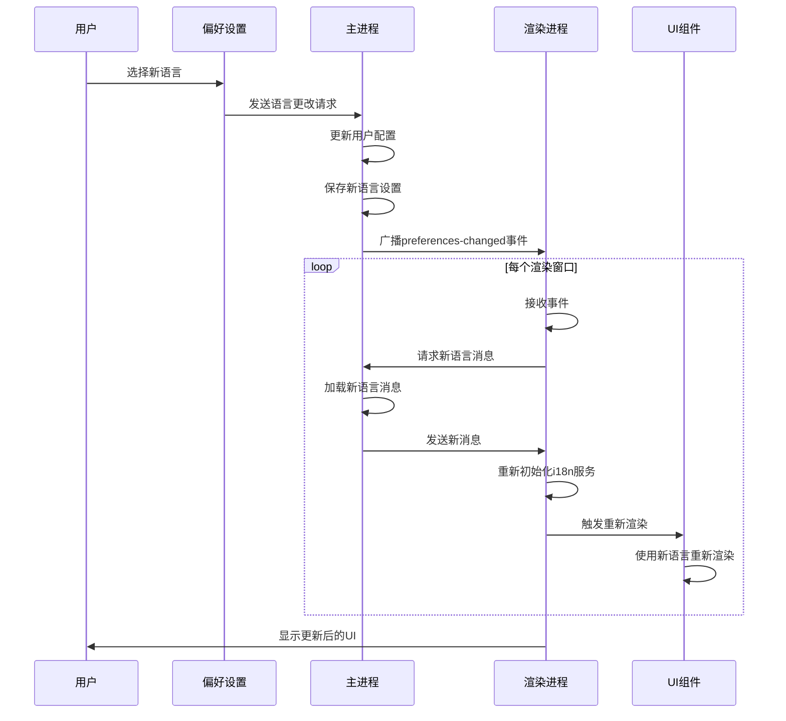

# i18n架构

<cite>
**本文档中引用的文件**  
- [i18n.preload.ts](file://ts/context/i18n.preload.ts)
- [localeMessages.preload.ts](file://ts/context/localeMessages.preload.ts)
- [config.preload.ts](file://ts/context/config.preload.ts)
- [setupI18nMain.std.ts](file://ts/util/setupI18nMain.std.ts)
- [setupI18n.dom.tsx](file://ts/util/setupI18n.dom.tsx)
- [locale.node.ts](file://app/locale.node.ts)
- [main.main.ts](file://app/main.main.ts)
- [Preferences.dom.tsx](file://ts/components/Preferences.dom.tsx)
- [resolveCanonicalLocales.std.ts](file://ts/util/resolveCanonicalLocales.std.ts)
- [userLanguages.std.ts](file://ts/util/userLanguages.std.ts)
</cite>

## 目录
1. [简介](#简介)
2. [项目结构](#项目结构)
3. [核心组件](#核心组件)
4. [架构概述](#架构概述)
5. [详细组件分析](#详细组件分析)
6. [依赖分析](#依赖分析)
7. [性能考虑](#性能考虑)
8. [故障排除指南](#故障排除指南)
9. [结论](#结论)

## 简介
Signal-Desktop的i18n架构为应用程序提供了完整的多语言支持，包括语言环境初始化、消息解析和格式化服务。该系统通过Electron的主进程和渲染进程之间的通信机制，在整个应用程序中实现语言设置的同步。i18n服务在preload上下文中被注入，确保在应用程序启动时即可使用。动态语言切换功能允许用户在运行时更改语言设置，系统会相应地更新状态并重新渲染UI。消息ID采用ICU（International Components for Unicode）格式，结合缓存机制和性能优化措施，确保高效的翻译查找和格式化。

## 项目结构
Signal-Desktop的i18n架构基于分层设计，将语言资源、配置和处理逻辑分离。语言消息存储在`_locales`目录下的各个语言子目录中，每个子目录包含一个`messages.json`文件。核心i18n逻辑位于`ts/util`目录下的`setupI18nMain.std.ts`和`setupI18n.dom.tsx`文件中。配置和消息数据通过`ts/context`目录下的`config.preload.ts`和`localeMessages.preload.ts`文件在主进程和渲染进程之间传递。语言环境的初始化和匹配逻辑在`app/locale.node.ts`文件中实现。



**图示来源**
- [locale.node.ts](file://app/locale.node.ts#L30-L34)
- [setupI18nMain.std.ts](file://ts/util/setupI18nMain.std.ts#L116-L184)
- [i18n.preload.ts](file://ts/context/i18n.preload.ts#L4-L21)

**本节来源**
- [app/locale.node.ts](file://app/locale.node.ts#L1-L40)
- [ts/util/setupI18nMain.std.ts](file://ts/util/setupI18nMain.std.ts#L1-L185)
- [ts/context/i18n.preload.ts](file://ts/context/i18n.preload.ts#L1-L22)

## 核心组件
Signal-Desktop的i18n系统由多个核心组件构成，包括语言环境初始化器、消息解析器、格式化服务和上下文注入机制。`setupI18n`函数是i18n系统的核心，负责创建本地化器实例，该实例提供翻译消息、获取当前语言环境和处理复数形式等方法。`getLocaleMessages`函数从文件系统加载特定语言的消息包，而`resolveCanonicalLocales`函数确保语言标签的标准化和有效性。`userLanguages`工具函数生成符合HTTP Accept-Language头格式的语言优先级列表。

**本节来源**
- [setupI18nMain.std.ts](file://ts/util/setupI18nMain.std.ts#L116-L184)
- [locale.node.ts](file://app/locale.node.ts#L30-L34)
- [resolveCanonicalLocales.std.ts](file://ts/util/resolveCanonicalLocales.std.ts#L4-L19)
- [userLanguages.std.ts](file://ts/util/userLanguages.std.ts#L13-L45)

## 架构概述
Signal-Desktop的i18n架构采用分层设计，将语言资源管理、消息解析和UI渲染分离。在应用程序启动时，主进程从文件系统加载所有可用的语言消息，并通过Electron的IPC机制将当前语言的消息包和配置发送到渲染进程。渲染进程在preload脚本中初始化i18n服务，创建一个全局可访问的本地化器实例。当用户更改语言设置时，主进程更新配置并通知所有窗口重新加载语言资源，触发UI的重新渲染。



**图示来源**
- [main.main.ts](file://app/main.main.ts#L2872-L2887)
- [localeMessages.preload.ts](file://ts/context/localeMessages.preload.ts#L6-L10)
- [i18n.preload.ts](file://ts/context/i18n.preload.ts#L19-L21)

## 详细组件分析

### i18n服务初始化分析
i18n服务的初始化过程始于主进程，其中`locale.node.ts`文件中的`getLocaleMessages`函数负责从文件系统加载特定语言的消息包。这些消息随后通过Electron的IPC机制传递给渲染进程，在`localeMessages.preload.ts`文件中通过同步IPC调用接收。在渲染进程的preload上下文中，`i18n.preload.ts`文件使用接收到的配置和消息数据调用`setupI18n`函数来创建本地化器实例。



**图示来源**
- [locale.node.ts](file://app/locale.node.ts#L30-L34)
- [localeMessages.preload.ts](file://ts/context/localeMessages.preload.ts#L6-L10)
- [i18n.preload.ts](file://ts/context/i18n.preload.ts#L19-L21)

**本节来源**
- [app/locale.node.ts](file://app/locale.node.ts#L30-L34)
- [ts/context/localeMessages.preload.ts](file://ts/context/localeMessages.preload.ts#L6-L10)
- [ts/context/i18n.preload.ts](file://ts/context/i18n.preload.ts#L4-L21)

### 消息解析与格式化分析
消息解析和格式化服务由`setupI18nMain.std.ts`文件中的`setupI18n`函数提供。该函数使用`react-intl`库创建一个`IntlShape`实例，该实例负责实际的消息格式化。`filterLegacyMessages`函数从原始消息数据中提取ICU格式的消息，而`normalizeSubstitutions`函数处理消息中的占位符替换，包括双向文本隔离。本地化器实例提供了`formatMessage`方法，用于根据当前语言环境和提供的参数格式化消息。



**图示来源**
- [setupI18nMain.std.ts](file://ts/util/setupI18nMain.std.ts#L34-L184)
- [setupI18n.dom.tsx](file://ts/util/setupI18n.dom.tsx#L17-L58)

**本节来源**
- [ts/util/setupI18nMain.std.ts](file://ts/util/setupI18nMain.std.ts#L34-L184)
- [ts/util/setupI18n.dom.tsx](file://ts/util/setupI18n.dom.tsx#L17-L58)

### 动态语言切换分析
动态语言切换功能允许用户在运行时更改应用程序的语言设置。当用户在偏好设置中选择新语言时，`Preferences.dom.tsx`组件会触发语言更改流程。主进程更新配置并广播`preferences-changed`事件，通知所有窗口重新加载语言资源。`main.main.ts`文件中的IPC处理器负责处理语言数据请求，确保渲染进程能够获取更新后的消息包。



**图示来源**
- [Preferences.dom.tsx](file://ts/components/Preferences.dom.tsx#L931-L937)
- [main.main.ts](file://app/main.main.ts#L2932-L2933)
- [main.main.ts](file://app/main.main.ts#L2872-L2874)

**本节来源**
- [ts/components/Preferences.dom.tsx](file://ts/components/Preferences.dom.tsx#L921-L1023)
- [app/main.main.ts](file://app/main.main.ts#L2872-L2887)

## 依赖分析
Signal-Desktop的i18n系统依赖于多个外部库和内部模块。`react-intl`库提供核心的国际化功能，包括消息格式化、日期/时间格式化和复数规则处理。`@formatjs/intl-localematcher`库用于语言环境匹配，确保选择最合适的语言变体。内部依赖包括Electron的IPC机制用于主进程和渲染进程之间的通信，以及`lodash`库用于对象合并等实用功能。

```mermaid
graph TD
i18n[i18n系统] --> react-intl[react-intl]
i18n --> formatjs[[@formatjs/intl-localematcher]]
i18n --> electron[Electron IPC]
i18n --> lodash[lodash]
i18n --> zod[zod]
react-intl --> Intl[ECMAScript Intl API]
formatjs --> Intl
electron --> NodeJS[Node.js]
subgraph "功能"
F1[消息格式化]
F2[语言匹配]
F3[进程通信]
F4[数据验证]
F5[对象操作]
end
react-intl --> F1
formatjs --> F2
electron --> F3
zod --> F4
lodash --> F5
```

**图示来源**
- [locale.node.ts](file://app/locale.node.ts#L7-L8)
- [setupI18nMain.std.ts](file://ts/util/setupI18nMain.std.ts#L4-L5)
- [setupI18nMain.std.ts](file://ts/util/setupI18nMain.std.ts#L6-L7)
- [locale.node.ts](file://app/locale.node.ts#L6)

**本节来源**
- [app/locale.node.ts](file://app/locale.node.ts#L4-L8)
- [ts/util/setupI18nMain.std.ts](file://ts/util/setupI18nMain.std.ts#L4-L6)

## 性能考虑
Signal-Desktop的i18n系统通过多种机制优化性能。`createCachedIntl`函数使用`createIntlCache`来缓存格式化器实例，避免重复创建开销。消息数据在应用启动时一次性加载到内存中，减少运行时的文件系统访问。`memoize`装饰器用于缓存频繁调用的格式化函数，如数字和日期格式化。对于大型消息包，系统采用惰性加载策略，只在需要时解析和加载特定语言的消息。

**本节来源**
- [setupI18nMain.std.ts](file://ts/util/setupI18nMain.std.ts#L40-L72)
- [setupI18nMain.std.ts](file://ts/util/setupI18nMain.std.ts#L20-L28)
- [i18n.ts](file://sticker-creator/src/util/i18n.ts#L19-L29)

## 故障排除指南
i18n系统中的常见问题包括缺失的翻译、语言环境不匹配和格式化错误。对于缺失的翻译，系统通过`strictAssert`断言确保开发过程中及时发现，并在生产环境中回退到英文。语言环境不匹配问题通过`resolveCanonicalLocales`函数处理，该函数验证并标准化语言标签。格式化错误通常由无效的消息参数引起，可以通过启用`onError`回调来捕获和记录。

**本节来源**
- [setupI18nMain.std.ts](file://ts/util/setupI18nMain.std.ts#L53-L56)
- [resolveCanonicalLocales.std.ts](file://ts/util/resolveCanonicalLocales.std.ts#L4-L19)
- [setupI18nMain.std.ts](file://ts/util/setupI18nMain.std.ts#L154-L155)

## 结论
Signal-Desktop的i18n架构是一个健壮且可扩展的多语言支持系统，通过分层设计和模块化组件实现了高效的国际化功能。系统利用Electron的主进程-渲染进程架构，在保证性能的同时提供了灵活的语言切换能力。通过结合现代国际化库和自定义优化措施，该架构能够支持多种语言环境，并为用户提供流畅的多语言体验。未来可以进一步优化消息包的按需加载和压缩，以减少初始加载时间。