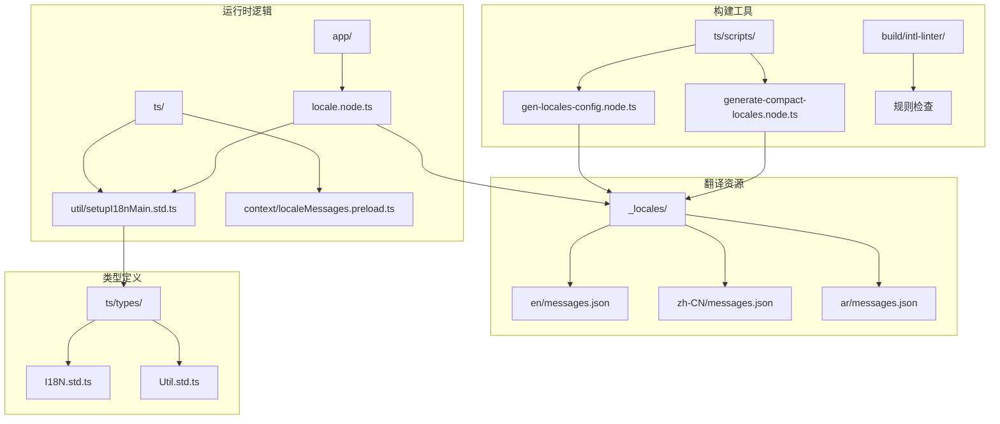
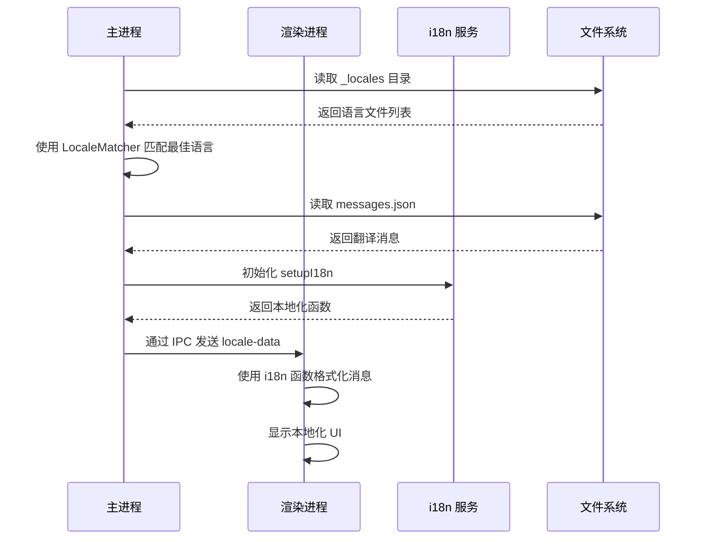
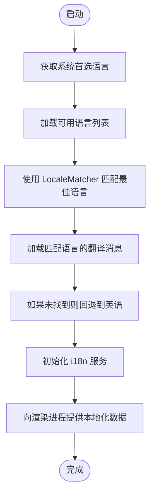
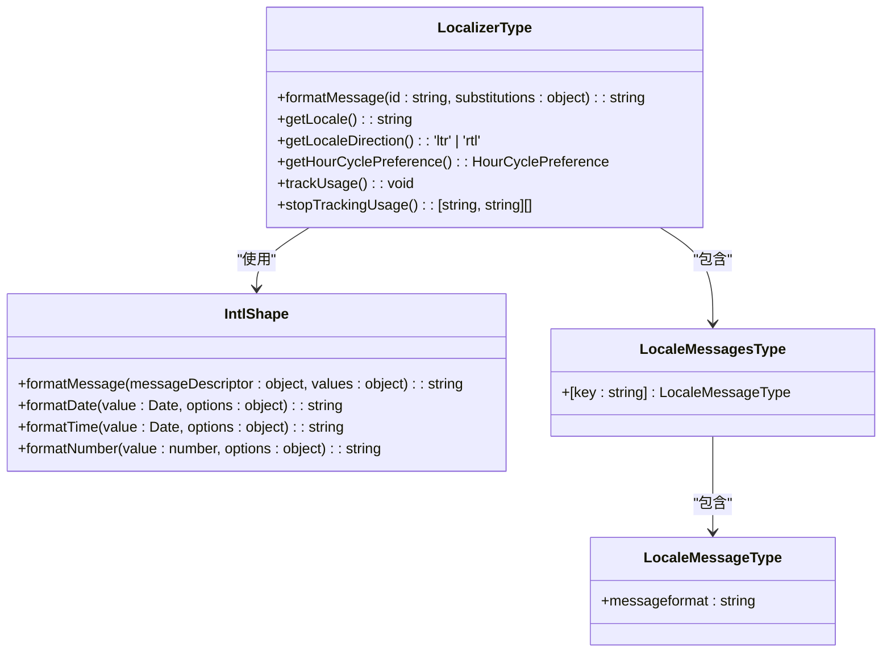
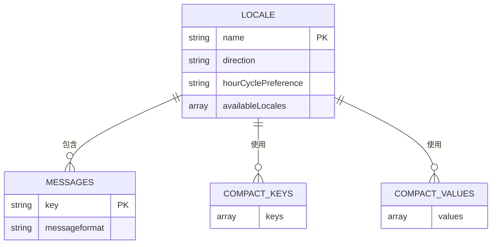
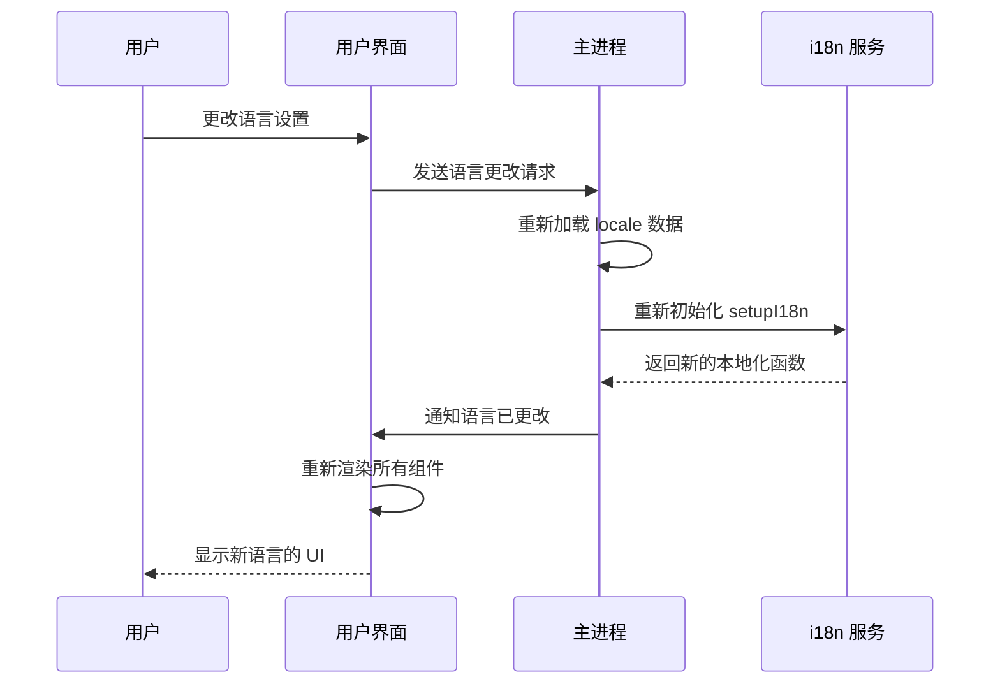
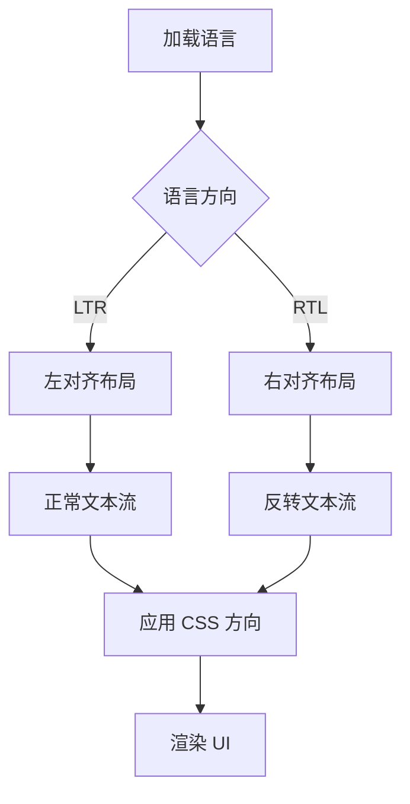

# 国际化支持

<cite>
**本文档中引用的文件**  
- [locale.node.ts](file://app/locale.node.ts)
- [setupI18nMain.std.ts](file://ts/util/setupI18nMain.std.ts)
- [localeMessages.preload.ts](file://ts/context/localeMessages.preload.ts)
- [gen-locales-config.node.ts](file://ts/scripts/gen-locales-config.node.ts)
- [generate-compact-locales.node.ts](file://ts/scripts/generate-compact-locales.node.ts)
- [I18N.std.ts](file://ts/types/I18N.std.ts)
- [Util.std.ts](file://ts/types/Util.std.ts)
- [icuPrefix.std.ts](file://build/intl-linter/rules/icuPrefix.std.ts)
- [noLegacyVariables.std.ts](file://build/intl-linter/rules/noLegacyVariables.std.ts)
- [Intl.d.ts](file://ts/Intl.d.ts)
</cite>

## 目录
1. [简介](#简介)
2. [项目结构](#项目结构)
3. [核心组件](#核心组件)
4. [架构概述](#架构概述)
5. [详细组件分析](#详细组件分析)
6. [依赖分析](#依赖分析)
7. [性能考虑](#性能考虑)
8. [故障排除指南](#故障排除指南)
9. [结论](#结论)

## 简介
Signal-Desktop 的国际化（i18n）系统为全球用户提供多语言支持，涵盖超过 70 种语言。该系统基于现代国际化标准构建，使用 `react-intl` 和 `@formatjs/intl-localematcher` 等库实现消息格式化、语言匹配和本地化功能。系统支持 RTL（从右到左）语言、复数形式、性别变化、日期时间格式化等高级功能，并通过严格的工具链确保翻译质量和一致性。

## 项目结构
Signal-Desktop 的国际化系统采用分层架构，将翻译资源、运行时逻辑和构建工具分离。翻译文件存储在 `_locales` 目录中，每个语言有独立的子目录。运行时逻辑位于 `app` 和 `ts` 目录中，而构建和验证工具位于 `build` 和 `ts/scripts` 目录中。



**Diagram sources**
- [locale.node.ts](file://app/locale.node.ts)
- [setupI18nMain.std.ts](file://ts/util/setupI18nMain.std.ts)
- [gen-locales-config.node.ts](file://ts/scripts/gen-locales-config.node.ts)
- [generate-compact-locales.node.ts](file://ts/scripts/generate-compact-locales.node.ts)

**Section sources**
- [app](file://app)
- [ts](file://ts)
- [_locales](file://_locales)

## 核心组件
Signal-Desktop 的国际化系统由多个核心组件构成，包括语言加载器、消息格式化器、本地化工具和构建验证工具。这些组件协同工作，确保应用程序能够正确加载和显示多语言内容。

**Section sources**
- [locale.node.ts](file://app/locale.node.ts)
- [setupI18nMain.std.ts](file://ts/util/setupI18nMain.std.ts)
- [localeMessages.preload.ts](file://ts/context/localeMessages.preload.ts)

## 架构概述
Signal-Desktop 的国际化架构采用客户端-服务器模式，其中主进程负责加载和解析翻译资源，渲染进程通过 IPC 通信获取本地化数据。系统使用 `react-intl` 作为核心国际化库，结合自定义的包装器提供统一的 API 接口。



**Diagram sources**
- [locale.node.ts](file://app/locale.node.ts)
- [setupI18nMain.std.ts](file://ts/util/setupI18nMain.std.ts)
- [localeMessages.preload.ts](file://ts/context/localeMessages.preload.ts)

## 详细组件分析

### 语言加载与匹配机制
Signal-Desktop 使用 `@formatjs/intl-localematcher` 库实现智能语言匹配。当用户启动应用程序时，系统会根据操作系统的首选语言列表和应用程序支持的语言进行最佳匹配。



**Diagram sources**
- [locale.node.ts](file://app/locale.node.ts#L148-L162)
- [gen-locales-config.node.ts](file://ts/scripts/gen-locales-config.node.ts)

**Section sources**
- [locale.node.ts](file://app/locale.node.ts#L125-L219)
- [gen-locales-config.node.ts](file://ts/scripts/gen-locales-config.node.ts)

### 消息格式化与占位符处理
Signal-Desktop 使用 ICU（International Components for Unicode）消息格式，支持复杂的文本插值、复数形式和选择格式。系统通过 `setupI18n` 函数创建本地化实例，提供类型安全的消息格式化 API。



**Diagram sources**
- [setupI18nMain.std.ts](file://ts/util/setupI18nMain.std.ts)
- [I18N.std.ts](file://ts/types/I18N.std.ts)
- [Util.std.ts](file://ts/types/Util.std.ts)

**Section sources**
- [setupI18nMain.std.ts](file://ts/util/setupI18nMain.std.ts)
- [I18N.std.ts](file://ts/types/I18N.std.ts)

### 翻译文件组织结构
Signal-Desktop 的翻译文件采用 JSON 格式存储在 `_locales` 目录中，每个语言有独立的子目录。系统支持两种模式：开发模式直接读取 `messages.json`，打包模式使用压缩的 `keys.json` 和 `values.json` 以优化性能。



**Diagram sources**
- [locale.node.ts](file://app/locale.node.ts#L30-L45)
- [generate-compact-locales.node.ts](file://ts/scripts/generate-compact-locales.node.ts)

**Section sources**
- [locale.node.ts](file://app/locale.node.ts)
- [generate-compact-locales.node.ts](file://ts/scripts/generate-compact-locales.node.ts)

### 动态语言切换机制
Signal-Desktop 支持运行时动态语言切换，用户可以在设置中更改语言偏好，应用程序会立即更新 UI 以反映新的语言设置。这一功能通过重新初始化 i18n 服务并触发 UI 重新渲染实现。



**Diagram sources**
- [locale.node.ts](file://app/locale.node.ts#L125-L219)
- [localeMessages.preload.ts](file://ts/context/localeMessages.preload.ts)

**Section sources**
- [locale.node.ts](file://app/locale.node.ts)
- [localeMessages.preload.ts](file://ts/context/localeMessages.preload.ts)

### RTL 语言支持
Signal-Desktop 完整支持 RTL（从右到左）语言如阿拉伯语和希伯来语。系统通过 `Intl.Locale` API 检测语言方向，并相应地调整 UI 布局和文本方向。



**Diagram sources**
- [locale.node.ts](file://app/locale.node.ts#L83-L114)
- [stylesheets](file://stylesheets)

**Section sources**
- [locale.node.ts](file://app/locale.node.ts#L70-L81)

## 依赖分析
Signal-Desktop 的国际化系统依赖多个关键库和工具，确保功能完整性和质量保证。

```mermaid
graph TD
A[Signal-Desktop i18n] --> B[react-intl]
A --> C[@formatjs/intl-localematcher]
A --> D[zod]
A --> E[lodash]
B --> F[Intl API]
C --> F
A --> G[Electron IPC]
A --> H[Node.js fs]
A --> I[TypeScript]
subgraph "验证工具"
J[build/intl-linter]
J --> K[icuPrefix.std.ts]
J --> L[noLegacyVariables.std.ts]
J --> M[noNestedChoice.std.ts]
J --> N[noOffset.std.ts]
J --> O[noOneChoice.std.ts]
J --> P[noOrdinal.std.ts]
J --> Q[onePlural.std.ts]
J --> R[pluralPound.std.ts]
J --> S[wrapEmoji.std.ts]
end
A --> J
```

**Diagram sources**
- [package.json](file://package.json)
- [locale.node.ts](file://app/locale.node.ts#L7)
- [setupI18nMain.std.ts](file://ts/util/setupI18nMain.std.ts#L4)
- [build/intl-linter](file://build/intl-linter)

**Section sources**
- [package.json](file://package.json)
- [app](file://app)
- [ts](file://ts)
- [build/intl-linter](file://build/intl-linter)

## 性能考虑
Signal-Desktop 的国际化系统在性能方面进行了多项优化，特别是在打包版本中。系统使用压缩的翻译格式（`keys.json` 和 `values.json`）来减少文件大小和加载时间，同时通过缓存机制提高消息格式化的效率。

在开发模式下，系统直接读取完整的 `messages.json` 文件，便于开发和调试。而在生产模式下，系统使用预处理的紧凑格式，将所有翻译消息扁平化为数组，通过索引访问，显著提高了加载性能。

**Section sources**
- [locale.node.ts](file://app/locale.node.ts#L167-L197)
- [generate-compact-locales.node.ts](file://ts/scripts/generate-compact-locales.node.ts)

## 故障排除指南
当遇到国际化相关问题时，可以参考以下常见问题和解决方案：

1. **缺少翻译字符串**：系统会在开发模式下抛出断言错误，提示缺少特定消息 ID 的翻译。确保在 `messages.json` 文件中添加相应的翻译条目。

2. **语言匹配不正确**：检查 `available-locales.json` 文件是否包含所有支持的语言，并验证 `LocaleMatcher` 的匹配逻辑。

3. **RTL 布局问题**：确保 CSS 样式正确处理 `direction` 属性，并使用 `bidiIsolate` 和 `bidiStrip` 函数处理双向文本。

4. **构建失败**：运行 `intl-linter` 工具检查翻译字符串是否符合规范，特别是 ICU 格式要求。

**Section sources**
- [setupI18nMain.std.ts](file://ts/util/setupI18nMain.std.ts#L154-L155)
- [locale.node.ts](file://app/locale.node.ts#L108-L112)
- [build/intl-linter](file://build/intl-linter)

## 结论
Signal-Desktop 的国际化系统是一个功能完整、性能优化且易于维护的多语言支持架构。通过结合现代国际化库、严格的类型定义和自动化工具链，系统能够为全球用户提供高质量的本地化体验。未来可以进一步优化翻译工作流，集成机器翻译建议，并增强对更多文化特定格式的支持。