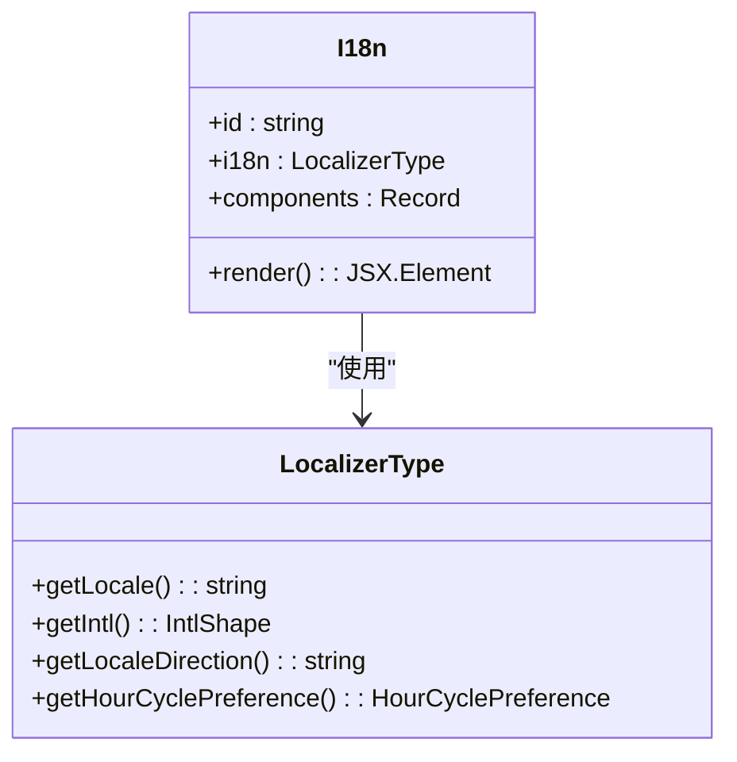
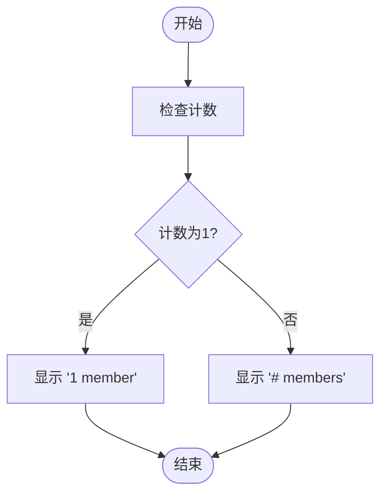
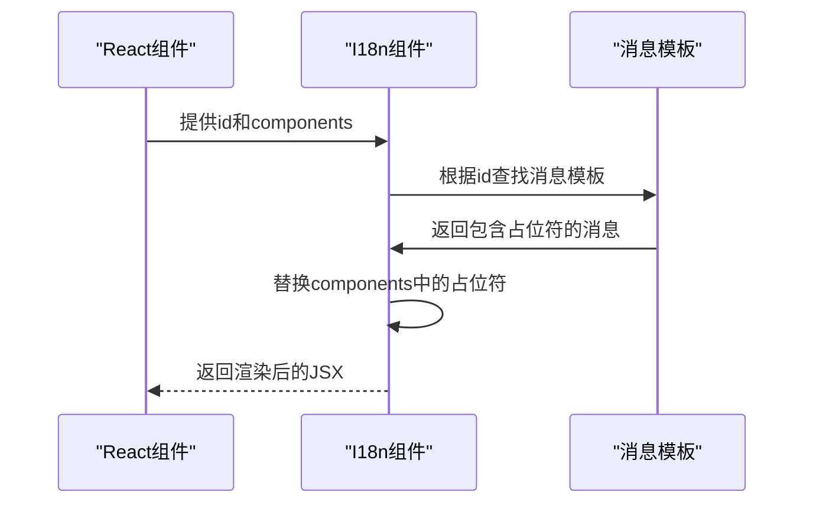
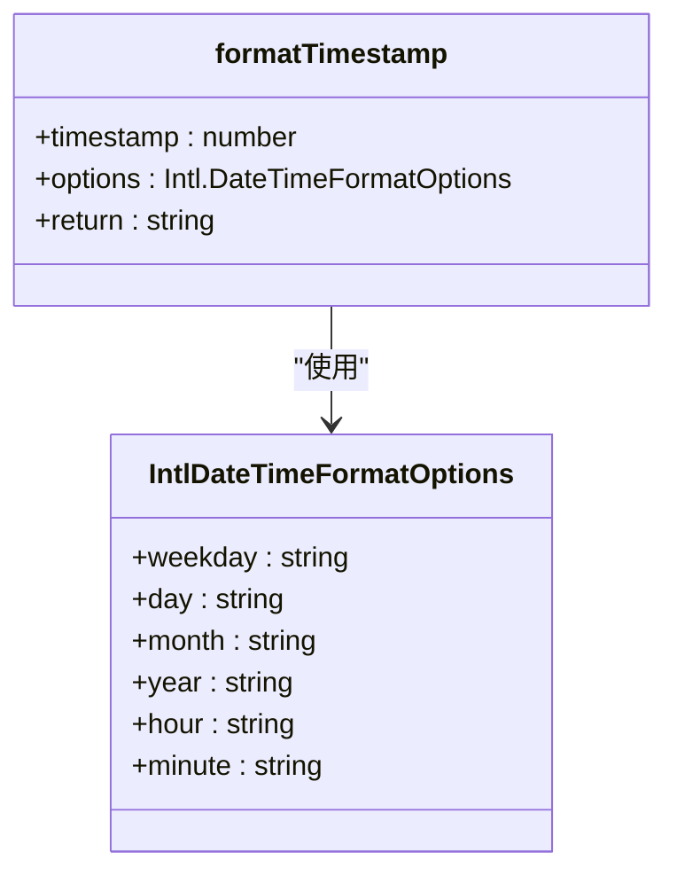
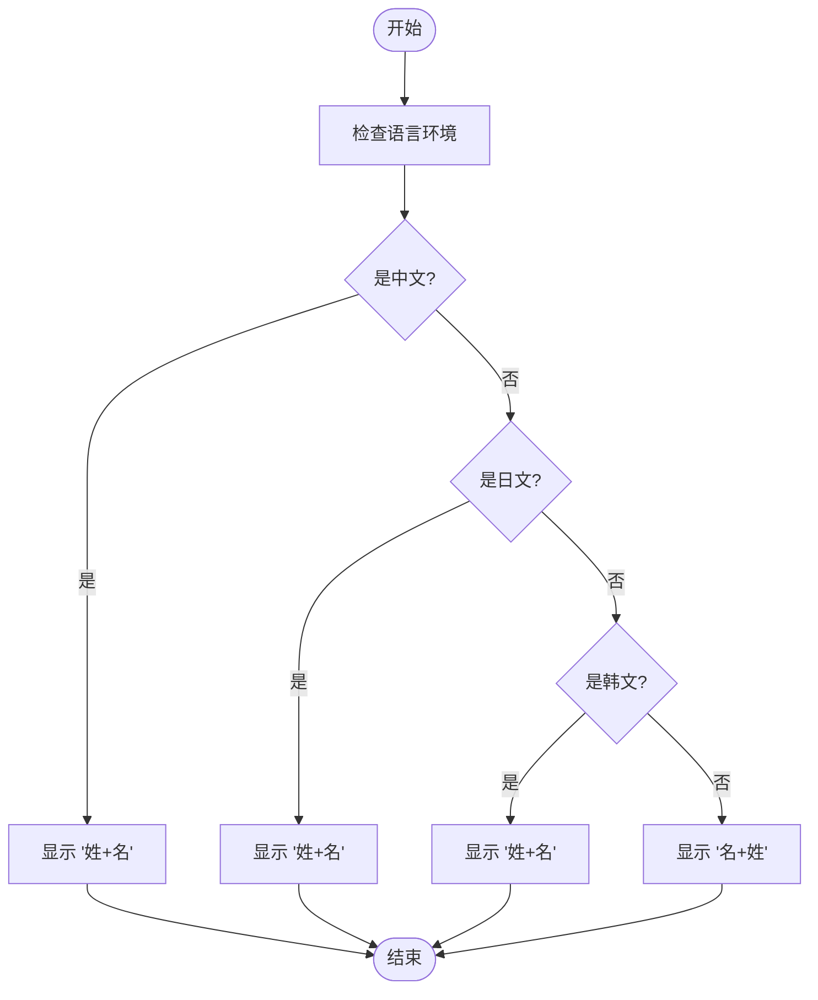
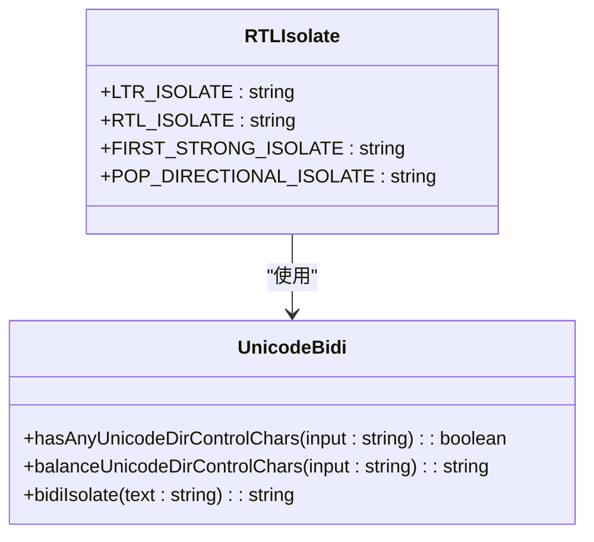
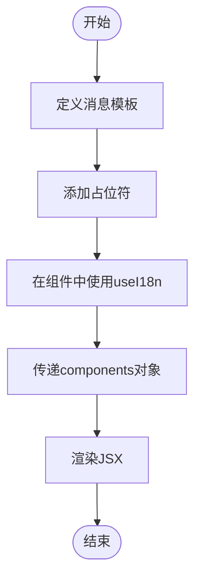

# 多语言UI实现

<cite>
**本文档引用的文件**   
- [I18n.dom.tsx](file://ts/components/I18n.dom.tsx)
- [setupI18nMain.std.ts](file://ts/util/setupI18nMain.std.ts)
- [I18n.tsx](file://sticker-creator/src/contexts/I18n.tsx)
- [getICUMessageParams.std.ts](file://ts/util/getICUMessageParams.std.ts)
- [formatTimestamp.dom.ts](file://ts/util/formatTimestamp.dom.ts)
- [currency.dom.ts](file://ts/util/currency.dom.ts)
- [unicodeBidi.std.ts](file://ts/util/unicodeBidi.std.ts)
- [messages.json](file://_locales/en/messages.json)
- [_variables.scss](file://stylesheets/_variables.scss)
- [.stylelintrc.js](file://.stylelintrc.js)
</cite>

## 目录
1. [简介](#简介)
2. [国际化API使用模式](#国际化api使用模式)
3. [复数形式、性别变化和选择性格式化](#复数形式性别变化和选择性格式化)
4. [JSX中嵌入动态内容](#jsx中嵌入动态内容)
5. [日期时间、数字和货币的本地化格式化](#日期时间数字和货币的本地化格式化)
6. [文化特定的排序规则](#文化特定的排序规则)
7. [RTL语言支持的CSS处理和布局调整策略](#rtl语言支持的css处理和布局调整策略)
8. [复杂UI元素的多语言实现示例](#复杂ui元素的多语言实现示例)
9. [结论](#结论)

## 简介
Signal-Desktop应用通过React组件和国际化API实现了多语言UI支持。该系统基于ICU（International Components for Unicode）消息格式，利用`useI18n` hook和`I18n`组件来处理文本翻译、复数形式、性别变化和选择性格式化。本文档详细分析了这些功能的实现细节，并提供了实际代码示例。

## 国际化API使用模式

Signal-Desktop的国际化系统主要依赖于两个核心组件：`useI18n` hook和`I18n`组件。`useI18n`是一个React hook，用于在函数组件中访问国际化函数，而`I18n`是一个React组件，用于在JSX中嵌入翻译文本。

`I18n`组件接受一个`id`属性，该属性对应于`_locales`目录下的`messages.json`文件中的键。例如，`id="icu:AddUserToAnotherGroupModal__title"`对应于英文消息文件中的`"Add to a group"`。组件还接受一个`components`属性，用于传递动态内容。

**图表来源**
- [I18n.dom.tsx](file://ts/components/I18n.dom.tsx#L1-L34)
- [setupI18nMain.std.ts](file://ts/util/setupI18nMain.std.ts#L1-L185)

**本节来源**
- [I18n.dom.tsx](file://ts/components/I18n.dom.tsx#L1-L34)
- [setupI18nMain.std.ts](file://ts/util/setupI18nMain.std.ts#L1-L185)

## 复数形式、性别变化和选择性格式化

Signal-Desktop使用ICU消息格式来处理复数形式、性别变化和选择性格式化。ICU消息格式允许开发者定义复杂的文本模式，这些模式可以根据上下文动态变化。

例如，在`messages.json`文件中，复数形式可以通过`{count, plural, one {# member} other {# members}}`来定义。这里的`count`是一个变量，`plural`表示这是一个复数形式，`one`和`other`是不同的情况。当`count`为1时，显示`1 member`，否则显示`# members`。

**图表来源**
- [messages.json](file://_locales/en/messages.json#L54-L57)

**本节来源**
- [messages.json](file://_locales/en/messages.json#L54-L57)
- [getICUMessageParams.std.ts](file://ts/util/getICUMessageParams.std.ts#L1-L84)

## JSX中嵌入动态内容

在JSX中嵌入动态内容是通过`components`属性实现的。`components`属性是一个对象，其键对应于消息中的占位符，值是React元素或字符串。

例如，在`AddUserToAnotherGroupModal__confirm-message`消息中，`{contact}`和`{group}`是占位符。在使用`I18n`组件时，可以通过`components`属性传递实际的联系人和组名。

**图表来源**
- [I18n.dom.tsx](file://ts/components/I18n.dom.tsx#L1-L34)
- [messages.json](file://_locales/en/messages.json#L30-L33)

**本节来源**
- [I18n.dom.tsx](file://ts/components/I18n.dom.tsx#L1-L34)
- [messages.json](file://_locales/en/messages.json#L30-L33)

## 日期时间、数字和货币的本地化格式化

Signal-Desktop使用`Intl.DateTimeFormat`和`Intl.NumberFormat`来格式化日期时间、数字和货币。这些API根据用户的区域设置自动选择合适的格式。

`formatTimestamp`函数用于格式化时间戳。它接受一个时间戳和一个选项对象，返回格式化后的字符串。选项对象可以包含`weekday`、`day`、`month`、`year`、`hour`和`minute`等属性。

**图表来源**
- [formatTimestamp.dom.ts](file://ts/util/formatTimestamp.dom.ts#L1-L272)

**本节来源**
- [formatTimestamp.dom.ts](file://ts/util/formatTimestamp.dom.ts#L1-L272)
- [currency.dom.ts](file://ts/util/currency.dom.ts#L1-L264)

## 文化特定的排序规则

Signal-Desktop考虑了不同文化背景下的排序规则。例如，在中文、日文和韩文中，名字的顺序与西方文化不同。`combineNames`函数根据语言环境决定名字的顺序。

**图表来源**
- [combineNames_test.std.ts](file://ts/test-node/util/combineNames_test.std.ts#L1-L32)

**本节来源**
- [combineNames_test.std.ts](file://ts/test-node/util/combineNames_test.std.ts#L1-L32)

## RTL语言支持的CSS处理和布局调整策略

对于从右到左（RTL）的语言，如阿拉伯语和希伯来语，Signal-Desktop使用CSS逻辑属性和Unicode控制字符来处理布局。`.stylelintrc.js`文件中的`liberty/use-logical-spec`规则确保使用逻辑属性而不是物理属性。

**图表来源**
- [unicodeBidi.std.ts](file://ts/util/unicodeBidi.std.ts#L1-L202)
- [.stylelintrc.js](file://.stylelintrc.js#L1-L47)

**本节来源**
- [unicodeBidi.std.ts](file://ts/util/unicodeBidi.std.ts#L1-L202)
- [.stylelintrc.js](file://.stylelintrc.js#L1-L47)

## 复杂UI元素的多语言实现示例

以下是一个复杂的UI元素多语言实现的示例。该示例展示了如何在消息中嵌入链接和富文本内容。

**图表来源**
- [I18n.dom.stories.tsx](file://ts/components/I18n.dom.stories.tsx#L1-L59)

**本节来源**
- [I18n.dom.stories.tsx](file://ts/components/I18n.dom.stories.tsx#L1-L59)
- [I18n.dom.tsx](file://ts/components/I18n.dom.tsx#L1-L34)

## 结论
Signal-Desktop的多语言UI实现是一个复杂而精细的系统，它利用了现代Web技术中的最佳实践。通过使用ICU消息格式、React组件和CSS逻辑属性，Signal-Desktop能够为全球用户提供一致且本地化的用户体验。本文档详细分析了这些功能的实现细节，并提供了实际代码示例，帮助开发者理解和应用这些技术。