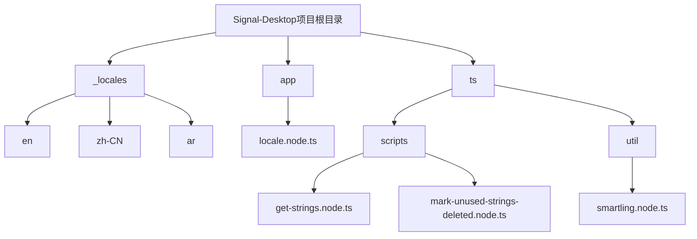
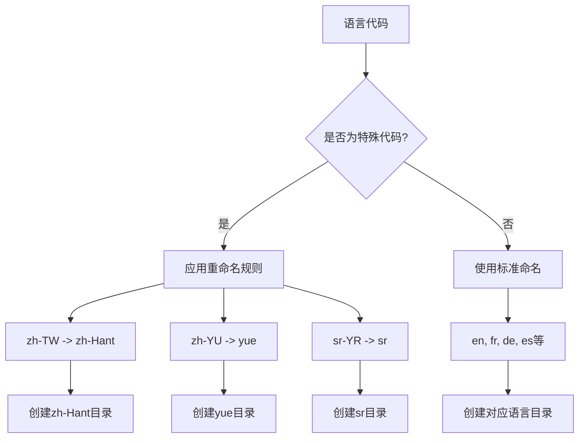
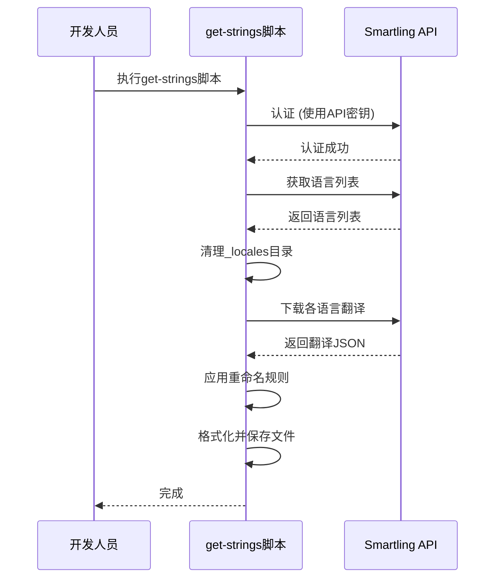
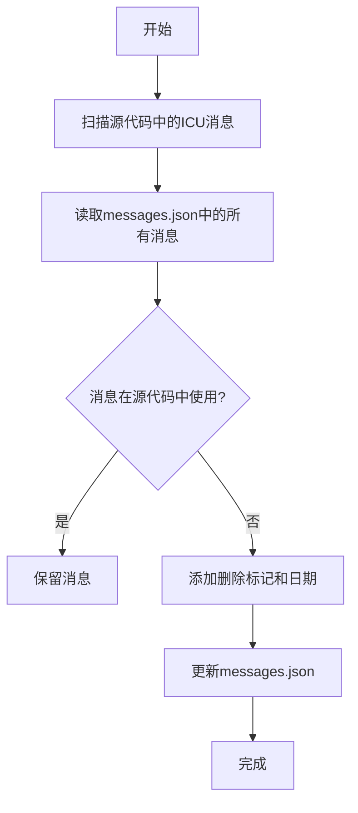

# 翻译文件管理

<cite>
**本文档引用的文件**   
- [_locales\en\messages.json](file://_locales\en\messages.json)
- [_locales\zh-CN\messages.json](file://_locales\zh-CN\messages.json)
- [_locales\ar\messages.json](file://_locales\ar\messages.json)
- [app\locale.node.ts](file://app\locale.node.ts)
- [ts\scripts\get-strings.node.ts](file://ts\scripts\get-strings.node.ts)
- [ts\scripts\mark-unused-strings-deleted.node.ts](file://ts\scripts\mark-unused-strings-deleted.node.ts)
- [ts\util\smartling.node.ts](file://ts\util\smartling.node.ts)
- [.smartling.yml](file://.smartling.yml)
</cite>

## 目录
1. [项目结构](#项目结构)
2. [翻译文件目录结构](#翻译文件目录结构)
3. [messages.json文件格式规范](#messagesjson文件格式规范)
4. [翻译字符串提取与更新流程](#翻译字符串提取与更新流程)
5. [特殊字符与转义序列处理](#特殊字符与转义序列处理)
6. [翻译工作流质量保证](#翻译工作流质量保证)
7. [多语言文件维护示例](#多语言文件维护示例)
8. [RTL语言文本方向处理](#rtl语言文本方向处理)

## 项目结构
Signal-Desktop项目的翻译文件系统主要位于`_locales`目录下，该目录包含了所有支持语言的翻译文件。每个语言都有一个独立的子目录，目录名遵循标准化的语言代码命名约定。翻译文件的管理通过一系列脚本和配置文件实现自动化，确保翻译内容的准确性和一致性。



**目录来源**
- [app\locale.node.ts](file://app\locale.node.ts#L30-L34)
- [ts\scripts\get-strings.node.ts](file://ts\scripts\get-strings.node.ts#L102-L124)

## 翻译文件目录结构
Signal-Desktop的翻译文件系统采用标准化的目录结构，所有翻译文件都存储在项目根目录下的`_locales`文件夹中。每个支持的语言都有一个独立的子目录，目录名称遵循特定的命名约定。

### 语言代码标准化处理
翻译目录的命名严格遵循语言代码的标准化处理规则：
- **基础语言代码**：使用ISO 639-1标准的双字母语言代码，如`en`（英语）、`fr`（法语）、`de`（德语）。
- **区域变体代码**：对于有区域变体的语言，使用连字符连接语言代码和区域代码，如`zh-CN`（简体中文）、`zh-HK`（繁体中文-香港）、`pt-BR`（葡萄牙语-巴西）。
- **特殊重命名规则**：系统对某些语言代码进行了特殊处理以确保兼容性：
  - `zh-TW`被重命名为`zh-Hant`，以正确表示繁体中文。
  - `zh-YU`被重命名为`yue`，以正确表示粤语。
  - `sr-YR`被重命名为`sr`，因为"YR"不是有效的区域子标签。

这种命名约定确保了语言代码的标准化和一致性，便于系统自动匹配和加载正确的翻译文件。



**目录来源**
- [ts\scripts\get-strings.node.ts](file://ts\scripts\get-strings.node.ts#L15-L31)
- [app\locale.node.ts](file://app\locale.node.ts#L154-L159)

## messages.json文件格式规范
`messages.json`文件是Signal-Desktop翻译系统的核心，它定义了所有用户界面字符串的翻译内容。该文件采用特定的JSON格式，包含消息ID、默认消息文本、描述和占位符语法。

### 消息ID命名约定
消息ID遵循严格的命名约定，采用`icu:ComponentName__Element--State`的格式：
- **前缀**：所有消息ID都以`icu:`开头，表示使用ICU（International Components for Unicode）消息格式。
- **组件名称**：表示消息所属的UI组件，如`AddUserToAnotherGroupModal`。
- **元素名称**：表示具体的UI元素，如`title`、`confirm-add`。
- **状态**：表示元素的特定状态，如`--user-added-to-group`。

这种命名约定确保了消息ID的唯一性和可读性，便于开发人员和翻译人员理解消息的上下文。

### 消息格式与占位符语法
`messages.json`文件中的每个消息对象包含以下属性：
- **messageformat**：包含实际的翻译文本，支持ICU消息格式的占位符语法。
- **description**：提供消息的上下文描述，帮助翻译人员理解消息的用途。

占位符语法使用花括号`{}`包围变量名，支持以下类型：
- **简单占位符**：如`{contact}`、`{group}`，用于插入动态内容。
- **复数规则**：使用`{count, plural, one {# member} other {# members}}`语法处理单复数变化。
- **选择规则**：根据条件显示不同文本，如`{gender, select, male {先生} female {女士} other {用户}}`。

```json
{
  "icu:AddUserToAnotherGroupModal__confirm-message": {
    "messageformat": "Add “{contact}” to the group “{group}”",
    "description": "Shown in the confirmation dialog body when adding a contact to a group"
  },
  "icu:GroupListItem__message-default": {
    "messageformat": "{count, plural, one {# member} other {# members}}",
    "description": "Shown below the group name when selecting a group to invite a contact to"
  }
}
```

**文件来源**
- [_locales\en\messages.json](file://_locales\en\messages.json#L18-L146)
- [_locales\zh-CN\messages.json](file://_locales\zh-CN\messages.json#L2-L51)
- [_locales\ar\messages.json](file://_locales\ar\messages.json#L2-L51)

## 翻译字符串提取与更新流程
Signal-Desktop的翻译字符串提取和更新流程是一个自动化的过程，通过脚本从源代码中提取新的翻译字符串，并从翻译管理系统中获取最新的翻译内容。

### 字符串提取流程
翻译字符串的提取主要通过`get-strings.node.ts`脚本实现，该脚本与Smartling翻译管理系统集成：
1. **认证**：脚本首先使用环境变量`SMARTLING_USER`和`SMARTLING_SECRET`向Smartling API进行认证。
2. **获取语言列表**：从Smartling获取所有支持的语言列表。
3. **清理目录**：删除`_locales`目录下除`en`之外的所有现有翻译文件。
4. **下载翻译**：从Smartling下载每个语言的最新翻译内容。
5. **重命名处理**：根据预定义的重命名规则（如`zh-TW`到`zh-Hant`）调整目录名称。
6. **格式化输出**：使用Prettier格式化JSON文件，确保代码风格一致。

### 更新流程
当源代码中的UI字符串发生变化时，需要执行以下步骤来更新翻译：
1. **更新英文源文件**：在`_locales/en/messages.json`中添加或修改消息。
2. **运行提取脚本**：执行`get-strings.node.ts`脚本，将新的英文字符串上传到Smartling。
3. **等待翻译**：翻译团队在Smartling平台上完成翻译工作。
4. **下载更新**：再次运行提取脚本，下载最新的翻译内容。



**流程来源**
- [ts\scripts\get-strings.node.ts](file://ts\scripts\get-strings.node.ts#L46-L146)
- [ts\util\smartling.node.ts](file://ts\util\smartling.node.ts#L15-L42)

## 特殊字符与转义序列处理
在翻译文件管理中，正确处理特殊字符和转义序列对于确保翻译质量和应用稳定性至关重要。Signal-Desktop的翻译系统通过多种机制来处理这些特殊情况。

### 特殊字符处理
翻译文件中的特殊字符需要特别注意：
- **引号处理**：在JSON文件中，双引号需要使用反斜杠进行转义，如`\"`。
- **换行符**：使用`\n`表示换行，确保文本在UI中正确显示。
- **Unicode字符**：直接支持Unicode字符，如表情符号和特殊符号。

### 转义序列规范
系统定义了特定的转义序列处理规则：
- **占位符保护**：在`get-strings.node.ts`脚本中，下载翻译后会删除`description`字段，以防止敏感信息泄露。
- **智能转义**：`smartling`配置中的`placeholder_format_custom`字段定义了自定义占位符格式，使用正则表达式`(\\$.+?\\$)`来识别和保护占位符。

```json
{
  "smartling": {
    "placeholder_format_custom": "(\\$.+?\\$)",
    "string_format_paths": "icu: [*/messageformat]",
    "translate_paths": [
      {
        "path": "*/messageformat",
        "key": "{*}/messageformat",
        "instruction": "*/description"
      },
      {
        "key": "{*}/message",
        "path": "*/message",
        "instruction": "*/description"
      }
    ]
  }
}
```

**处理来源**
- [.smartling.yml](file://.smartling.yml#L1-L5)
- [ts\scripts\get-strings.node.ts](file://ts\scripts\get-strings.node.ts#L134-L138)

## 翻译工作流质量保证
Signal-Desktop的翻译工作流包含严格的质量保证措施，确保翻译内容的准确性和完整性。这些措施包括重复字符串检测、未使用字符串清理和自动化验证。

### 重复字符串检测
系统通过以下方式避免重复字符串：
- **唯一消息ID**：每个消息都有唯一的ID，防止重复定义。
- **自动化检查**：在构建过程中检查消息ID的唯一性。

### 未使用字符串清理
`mark-unused-strings-deleted.node.ts`脚本负责清理未使用的翻译字符串：
1. **扫描源代码**：使用`grep`命令扫描`ts/`、`app/`和`js/`目录，查找所有使用的ICU消息ID。
2. **比较消息文件**：将源代码中使用的消息ID与`_locales/en/messages.json`中的所有消息ID进行比较。
3. **标记未使用字符串**：对于未在源代码中找到的消息，添加删除标记和日期，如`(Deleted 2024/01/15) 原描述`。
4. **保留历史记录**：不直接删除字符串，而是标记为已删除，便于追溯和恢复。



**质量保证来源**
- [ts\scripts\mark-unused-strings-deleted.node.ts](file://ts\scripts\mark-unused-strings-deleted.node.ts#L11-L76)
- [ts\scripts\get-strings.node.ts](file://ts\scripts\get-strings.node.ts#L134-L138)

## 多语言文件维护示例
以下示例展示了如何维护Signal-Desktop的多语言翻译文件，包括添加新翻译、更新现有翻译和处理区域变体。

### 添加新翻译
当需要添加新的UI元素时，按照以下步骤操作：
1. **在英文文件中添加**：在`_locales/en/messages.json`中添加新的消息ID和默认文本。
```json
"icu:NewFeature__button-label": {
  "messageformat": "New Feature",
  "description": "Label for the new feature button"
}
```
2. **上传到Smartling**：运行`get-strings.node.ts`脚本，将新字符串上传到翻译管理系统。
3. **下载翻译**：翻译完成后，再次运行脚本下载各语言的翻译。

### 区域变体维护
对于区域变体的维护，如简体中文和繁体中文：
- **zh-CN**：使用简体中文，如`"添加至群组"`。
- **zh-HK**：使用繁体中文（香港），如`"加入群組"`。
- **zh-Hant**：使用标准繁体中文，如`"加入群組"`。

这种区分确保了不同地区用户的语言习惯得到尊重。

**维护示例来源**
- [_locales\en\messages.json](file://_locales\en\messages.json#L18-L37)
- [_locales\zh-CN\messages.json](file://_locales\zh-CN\messages.json#L2-L16)
- [_locales\ar\messages.json](file://_locales\ar\messages.json#L2-L16)

## RTL语言文本方向处理
Signal-Desktop系统支持从右到左（RTL）书写的语言，如阿拉伯语（ar）和希伯来语（he）。系统通过智能的文本方向检测和布局调整来正确处理RTL语言。

### 文本方向检测
`locale.node.ts`文件中的`getLocaleDirection`函数负责检测语言的文本方向：
1. **使用Intl.Locale API**：创建`Intl.Locale`对象来获取语言的文本信息。
2. **获取文本方向**：尝试使用`getTextInfo()`或`textInfo`属性获取文本方向。
3. **默认值**：如果检测失败，默认使用从左到右（LTR）方向。

### 布局调整
当检测到RTL语言时，系统会自动调整UI布局：
- **文本对齐**：文本右对齐，光标从右开始。
- **UI元素顺序**：按钮、图标等UI元素的顺序反转。
- **导航方向**：导航箭头方向反转。

```javascript
function getLocaleDirection(localeName, logger) {
  const locale = new Intl.Locale(localeName);
  try {
    if (typeof locale.getTextInfo === 'function') {
      return parseUnknown(TextInfoSchema, locale.getTextInfo() as unknown).direction;
    }
    if (typeof locale.textInfo === 'object') {
      return parseUnknown(TextInfoSchema, locale.textInfo as unknown).direction;
    }
  } catch (error) {
    logger.error('locale: Error getting text info for locale', Errors.toLogFormat(error));
  }
  return 'ltr';
}
```

**RTL处理来源**
- [app\locale.node.ts](file://app\locale.node.ts#L83-L114)
- [_locales\ar\messages.json](file://_locales\ar\messages.json#L2-L16)