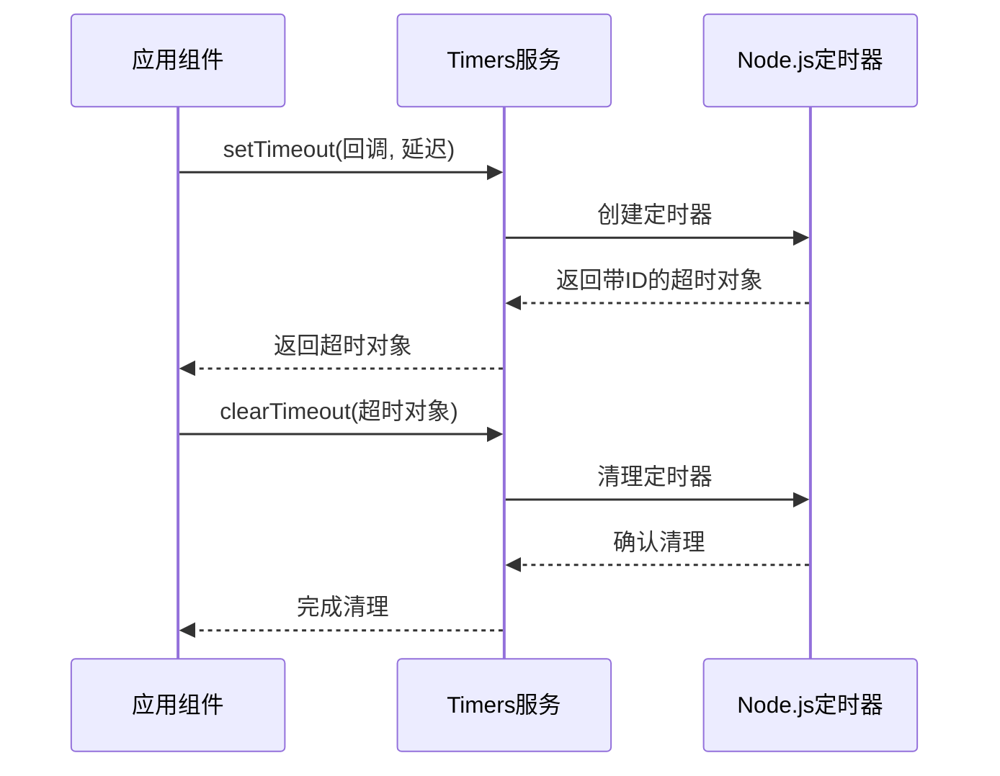
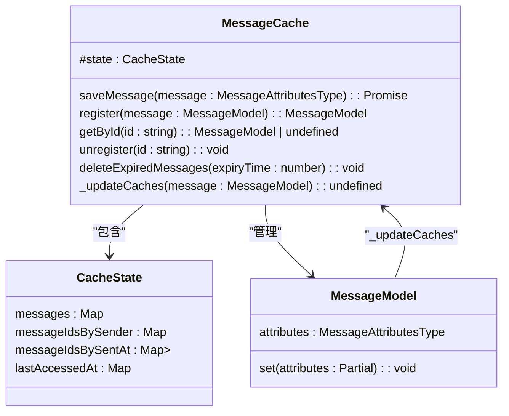
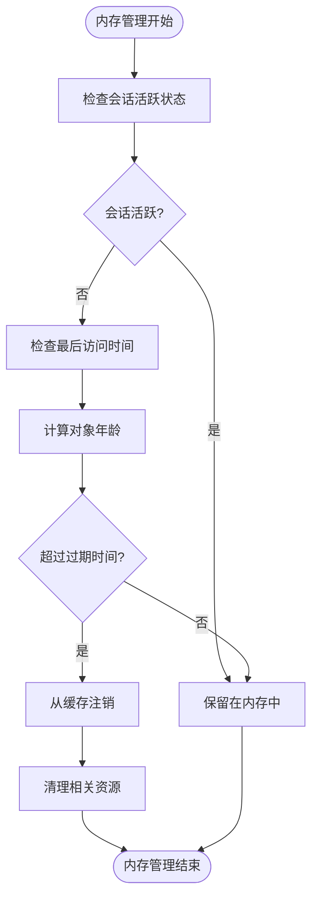
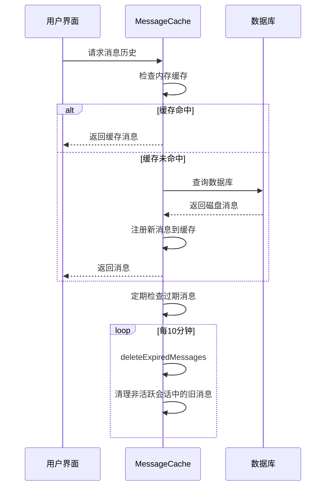
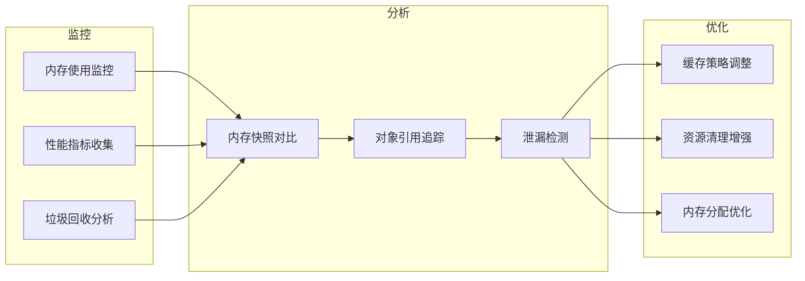

# 内存管理

<cite>
**本文档中引用的文件**  
- [EventTarget.std.ts](file://ts/textsecure/EventTarget.std.ts)
- [messageStateCleanup.preload.ts](file://ts/services/messageStateCleanup.preload.ts)
- [cleanup.preload.ts](file://ts/util/cleanup.preload.ts)
- [MessageCache.preload.ts](file://ts/services/MessageCache.preload.ts)
- [Timers.preload.ts](file://ts/Timers.preload.ts)
- [context/Timers.node.ts](file://ts/context/Timers.node.ts)
- [clearTimeoutIfNecessary.std.ts](file://ts/util/clearTimeoutIfNecessary.std.ts)
- [expiringMessagesDeletion.preload.ts](file://ts/services/expiringMessagesDeletion.preload.ts)
</cite>

## 目录
1. [简介](#简介)
2. [事件监听器管理](#事件监听器管理)
3. [定时器清理策略](#定时器清理策略)
4. [消息缓存与内存优化](#消息缓存与内存优化)
5. [大型数据结构的内存管理](#大型数据结构的内存管理)
6. [消息历史的内存优化](#消息历史的内存优化)
7. [性能分析与诊断](#性能分析与诊断)

## 简介
Signal-Desktop 实现了一套完整的内存管理机制，旨在防止内存泄漏并优化资源使用。系统通过事件监听器管理、定时器清理、消息缓存策略和过期数据清理等多种技术手段，确保长时间运行下的内存稳定性。本文档详细描述了这些机制的实现原理和具体策略。

## 事件监听器管理

Signal-Desktop 实现了自定义的 `EventTarget` 类来管理事件监听器，确保事件处理程序的正确添加和移除，防止内存泄漏。

```mermaid
classDiagram
class EventTarget {
listeners? : { [type : string] : Array<EventHandler> }
dispatchEvent(ev : Event) : Array<unknown>
addEventListener(eventName : string, callback : EventHandler) : void
removeEventListener(eventName : string, callback : EventHandler) : void
extend(source : any) : any
}
class EventHandler {
<<type>>
(event : any) => unknown
}
EventTarget --> EventHandler : "使用"
```

**图示来源**  
- [EventTarget.std.ts](file://ts/textsecure/EventTarget.std.ts#L16-L88)

**节来源**  
- [EventTarget.std.ts](file://ts/textsecure/EventTarget.std.ts#L16-L88)

## 定时器清理策略

Signal-Desktop 通过封装定时器操作来确保定时器的正确清理，防止因未清理的定时器导致的内存泄漏。



**图示来源**  
- [Timers.preload.ts](file://ts/Timers.preload.ts#L8-L18)
- [context/Timers.node.ts](file://ts/context/Timers.node.ts#L11-L42)

**节来源**  
- [Timers.preload.ts](file://ts/Timers.preload.ts#L8-L18)
- [context/Timers.node.ts](file://ts/context/Timers.node.ts#L11-L42)

## 消息缓存与内存优化

Signal-Desktop 使用 `MessageCache` 类来管理消息对象的生命周期，通过LRU缓存策略和定期清理机制优化内存使用。



**图示来源**  
- [MessageCache.preload.ts](file://ts/services/MessageCache.preload.ts#L28-L351)

**节来源**  
- [MessageCache.preload.ts](file://ts/services/MessageCache.preload.ts#L28-L351)

## 大型数据结构的内存管理

Signal-Desktop 通过多种机制管理大型数据结构的内存使用，包括引用计数、弱引用和垃圾回收优化。



**图示来源**  
- [MessageCache.preload.ts](file://ts/services/MessageCache.preload.ts#L132-L148)
- [messageStateCleanup.preload.ts](file://ts/services/messageStateCleanup.preload.ts#L10-L14)

**节来源**  
- [MessageCache.preload.ts](file://ts/services/MessageCache.preload.ts#L132-L148)
- [messageStateCleanup.preload.ts](file://ts/services/messageStateCleanup.preload.ts#L10-L14)

## 消息历史的内存优化

Signal-Desktop 针对长会话中的消息历史实现了多种内存优化技术，包括数据分页、缓存策略和过期数据清理。



**图示来源**  
- [MessageCache.preload.ts](file://ts/services/MessageCache.preload.ts#L97-L118)
- [expiringMessagesDeletion.preload.ts](file://ts/services/expiringMessagesDeletion.preload.ts#L77-L74)

**节来源**  
- [MessageCache.preload.ts](file://ts/services/MessageCache.preload.ts#L97-L118)
- [expiringMessagesDeletion.preload.ts](file://ts/services/expiringMessagesDeletion.preload.ts#L77-L74)

## 性能分析与诊断

Signal-Desktop 提供了多种性能分析工具和诊断方法，帮助开发人员识别和解决内存问题。



**图示来源**  
- [cleanup.preload.ts](file://ts/util/cleanup.preload.ts#L38-L41)
- [messageStateCleanup.preload.ts](file://ts/services/messageStateCleanup.preload.ts#L10-L14)

**节来源**  
- [cleanup.preload.ts](file://ts/util/cleanup.preload.ts#L38-L41)
- [messageStateCleanup.preload.ts](file://ts/services/messageStateCleanup.preload.ts#L10-L14)