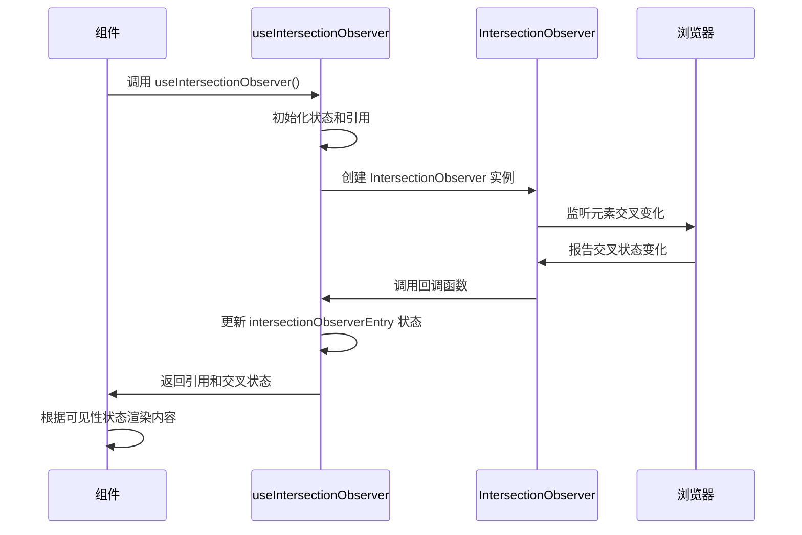
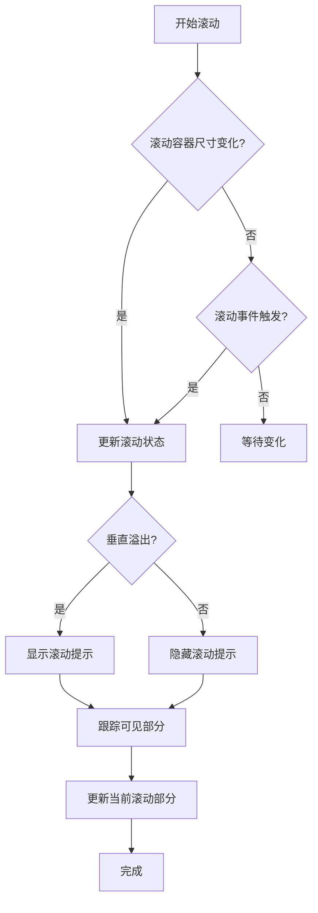
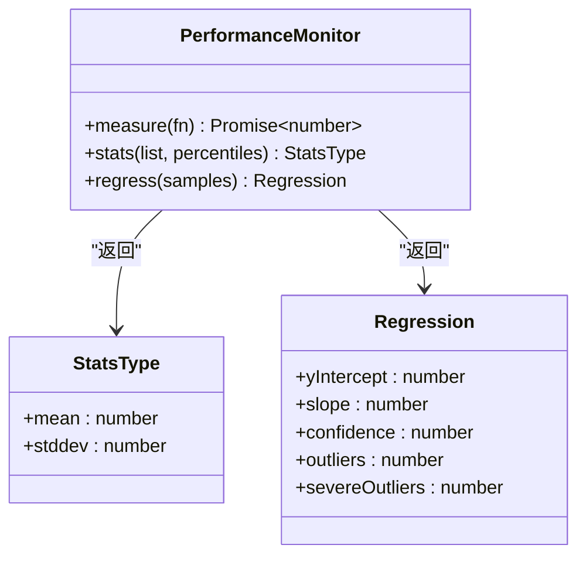

# 性能优化

<cite>
**本文档引用的文件**   
- [FunPanelGifs.dom.tsx](file://ts/components/fun/panels/FunPanelGifs.dom.tsx)
- [useIntersectionObserver.std.ts](file://ts/hooks/useIntersectionObserver.std.ts)
- [FunScroller.dom.tsx](file://ts/components/fun/base/FunScroller.dom.tsx)
- [useSizeObserver.dom.tsx](file://ts/hooks/useSizeObserver.dom.tsx)
- [useScrollLock.dom.tsx](file://ts/hooks/useScrollLock.dom.tsx)
- [Attachment.std.ts](file://ts/util/Attachment.std.ts)
- [stats.std.ts](file://ts/util/benchmark/stats.std.ts)
- [handleOutsideClick.dom.ts](file://ts/util/handleOutsideClick.dom.ts)
- [scrollUtil.std.ts](file://ts/util/scrollUtil.std.ts)
</cite>

## 目录
1. [引言](#引言)
2. [虚拟滚动实现](#虚拟滚动实现)
3. [Intersection Observer API 使用](#intersection-observer-api-使用)
4. [组件懒加载与内存管理](#组件懒加载与内存管理)
5. [长列表优化技术](#长列表优化技术)
6. [图片与媒体附件延迟加载](#图片与媒体附件延迟加载)
7. [内存泄漏预防与事件监听器管理](#内存泄漏预防与事件监听器管理)
8. [平滑滚动实现](#平滑滚动实现)
9. [性能监控与诊断](#性能监控与诊断)
10. [结论](#结论)

## 引言
Signal-Desktop 应用程序通过多种性能优化技术来确保流畅的用户体验，特别是在处理大量数据和复杂UI组件时。本文档详细描述了渲染进程的性能优化策略，包括虚拟滚动、懒加载和内存管理技术。文档涵盖了Intersection Observer API的使用、组件懒加载实现、不必要的渲染避免、长列表（如消息历史）的优化技术、图片和媒体附件的延迟加载策略、内存泄漏预防措施、事件监听器管理以及平滑滚动实现。此外，还提供了性能监控工具集成和性能瓶颈诊断方法的实际代码示例。

## 虚拟滚动实现
Signal-Desktop 使用虚拟滚动技术来优化长列表的渲染性能。在 `FunPanelGifs.dom.tsx` 文件中，通过 `@tanstack/react-virtual` 库的 `useVirtualizer` 钩子实现了虚拟滚动。该技术仅渲染当前可见的项目，从而显著减少DOM节点数量和内存占用。

虚拟滚动配置包括：
- `count`: 列表项总数
- `getScrollElement`: 获取滚动容器元素
- `estimateSize`: 估算每个项目大小
- `rangeExtractor`: 自定义范围提取器，确保始终包含第一个和最后一个索引
- `overscan`: 预渲染区域，提高滚动流畅性
- `lanes`: 瀑布流列数
- `scrollPaddingStart` 和 `scrollPaddingEnd`: 滚动内边距

当用户滚动接近列表末尾时，系统会自动触发更多数据的加载，实现无限滚动功能。

**Section sources**
- [FunPanelGifs.dom.tsx](file://ts/components/fun/panels/FunPanelGifs.dom.tsx#L310-L345)

## Intersection Observer API 使用
Signal-Desktop 广泛使用 Intersection Observer API 来实现高效的可见性检测和懒加载功能。在 `useIntersectionObserver.std.ts` 文件中，提供了一个轻量级的React钩子封装，简化了Intersection Observer的使用。

该API的主要应用场景包括：
- 检测元素是否进入视口，用于懒加载图片和组件
- 实现无限滚动，当用户滚动到列表底部时加载更多内容
- 优化资源加载，仅在需要时加载非关键资源

`useIntersectionObserver` 钩子返回一个设置引用的函数和一个IntersectionObserverEntry对象，开发者可以通过检查 `isIntersecting` 属性来确定元素的可见状态。

**Diagram sources**
- [useIntersectionObserver.std.ts](file://ts/hooks/useIntersectionObserver.std.ts#L27-L64)

**Section sources**
- [useIntersectionObserver.std.ts](file://ts/hooks/useIntersectionObserver.std.ts#L1-L65)

## 组件懒加载与内存管理
Signal-Desktop 通过组件懒加载和有效的内存管理策略来优化应用性能。在 `FunPanelGifs.dom.tsx` 文件中，实现了GIF预览的懒加载机制，结合LRU缓存策略管理内存使用。

关键实现包括：
- 使用 `LRUCache` 实现50MB大小的GIF Blob缓存
- 弱引用缓存（WeakMap）用于临时存储活动的GIF Blob
- 在组件卸载时及时释放Object URL，防止内存泄漏
- 使用 `AbortController` 管理异步操作，避免不必要的网络请求

懒加载流程：
1. 首先检查内存缓存中是否存在已下载的GIF
2. 如果缓存中不存在，则发起网络请求下载GIF
3. 下载完成后，将Blob存储到LRU缓存和弱引用缓存中
4. 创建Object URL用于图片显示
5. 组件卸载时，撤销Object URL释放内存

**Section sources**
- [FunPanelGifs.dom.tsx](file://ts/components/fun/panels/FunPanelGifs.dom.tsx#L75-L93)

## 长列表优化技术
对于长列表（如消息历史）的优化，Signal-Desktop采用了多种技术组合。在 `FunScroller.dom.tsx` 文件中，实现了基于Intersection Observer的滚动位置跟踪系统。

主要优化技术包括：
- 使用 `useScrollObserver` 监听滚动容器的尺寸和滚动位置变化
- 通过Intersection Observer跟踪当前可见的滚动部分
- 实现滚动提示，当内容可以上下滚动时显示视觉指示
- 使用 `passive: true` 选项注册滚动事件监听器，提高滚动性能

`FunScroller` 组件通过观察内部元素的尺寸变化来检测滚动溢出状态，并相应地显示或隐藏滚动提示，帮助用户了解内容的可滚动性。

**Diagram sources**
- [FunScroller.dom.tsx](file://ts/components/fun/base/FunScroller.dom.tsx#L78-L96)

**Section sources**
- [FunScroller.dom.tsx](file://ts/components/fun/base/FunScroller.dom.tsx#L1-L179)

## 图片与媒体附件延迟加载
Signal-Desktop 对图片和媒体附件实现了延迟加载策略，以优化初始页面加载性能。在 `FunPanelGifs.dom.tsx` 文件中，GIF预览图的加载是按需进行的。

延迟加载实现细节：
- 初始渲染时不加载实际图片数据
- 当项目进入虚拟滚动的渲染范围时，才开始加载图片
- 使用状态管理跟踪图片加载状态
- 提供加载失败的回退机制

媒体附件处理还考虑了网络条件和用户偏好，可能根据设备性能和网络状况调整加载策略。对于大文件，系统可能会先加载缩略图，然后在后台加载完整版本。

**Section sources**
- [FunPanelGifs.dom.tsx](file://ts/components/fun/panels/FunPanelGifs.dom.tsx#L582-L613)

## 内存泄漏预防与事件监听器管理
Signal-Desktop 通过严格的内存管理和事件监听器清理机制来预防内存泄漏。在多个文件中实现了资源清理模式，确保组件卸载时正确释放资源。

关键预防措施包括：
- 在 `useEffect` 的返回函数中清理事件监听器
- 使用 `AbortController` 取消未完成的异步操作
- 及时撤销创建的Object URL
- 使用弱引用缓存避免对象引用泄漏
- 定期清理过期的缓存数据

在 `handleOutsideClick.dom.ts` 文件中，实现了外部点击处理的资源管理，通过维护处理程序栈并在不再需要时从文档中移除全局事件监听器来避免内存泄漏。

**Section sources**
- [FunPanelGifs.dom.tsx](file://ts/components/fun/panels/FunPanelGifs.dom.tsx#L616-L621)
- [handleOutsideClick.dom.ts](file://ts/util/handleOutsideClick.dom.ts#L95-L108)

## 平滑滚动实现
Signal-Desktop 实现了平滑滚动功能，提供更好的用户体验。在 `scrollUtil.std.ts` 文件中，提供了滚动相关的实用函数。

平滑滚动技术包括：
- `getScrollBottom`: 计算元素底部的滚动距离
- `setScrollBottom`: 设置元素的底部滚动位置
- `scrollToBottom`: 将元素滚动到底部

这些函数被用于消息列表等需要自动滚动到最新内容的场景。通过直接操作 `scrollTop` 属性，实现了高效的滚动控制，避免了不必要的重排和重绘。

**Section sources**
- [scrollUtil.std.ts](file://ts/util/scrollUtil.std.ts#L1-L23)

## 性能监控与诊断
Signal-Desktop 集成了性能监控工具来诊断和优化性能瓶颈。在 `stats.std.ts` 文件中，实现了统计分析功能，用于性能基准测试。

性能监控特性包括：
- 基准测试框架，用于测量关键操作的执行时间
- 统计分析函数，计算平均值、标准差和百分位数
- 回归分析，检测性能变化趋势
- 异常值检测，识别性能异常

这些工具被用于自动化测试中，持续监控应用性能，确保优化措施的有效性，并及时发现性能退化问题。

**Diagram sources**
- [stats.std.ts](file://ts/util/benchmark/stats.std.ts#L4-L154)

**Section sources**
- [stats.std.ts](file://ts/util/benchmark/stats.std.ts#L1-L154)

## 结论
Signal-Desktop 通过综合运用虚拟滚动、懒加载、Intersection Observer API、有效的内存管理和性能监控等技术，实现了卓越的渲染性能。这些优化策略共同确保了即使在处理大量消息和媒体内容时，应用仍能保持流畅的用户体验。通过持续的性能监控和优化，Signal-Desktop 能够及时发现和解决性能瓶颈，为用户提供可靠和高效的消息服务。