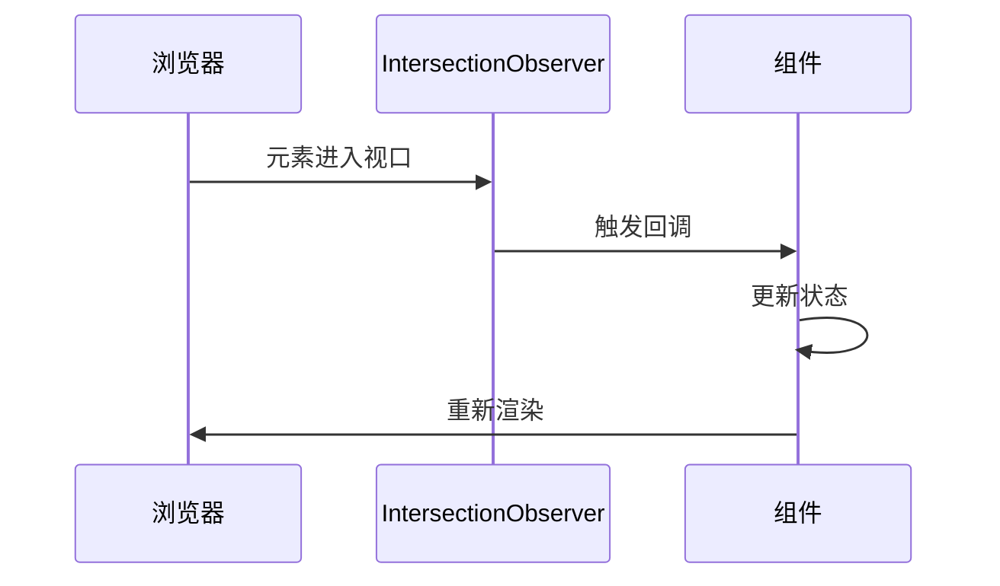
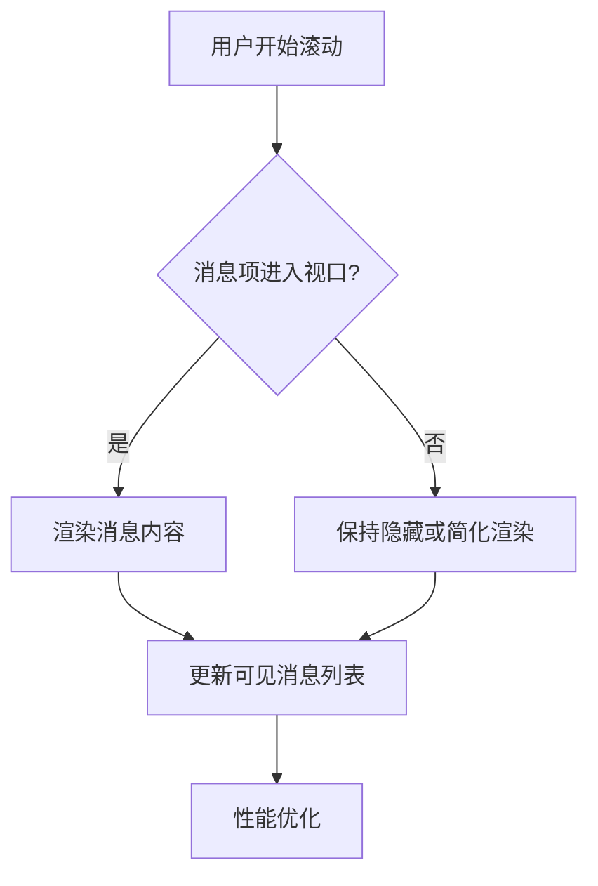
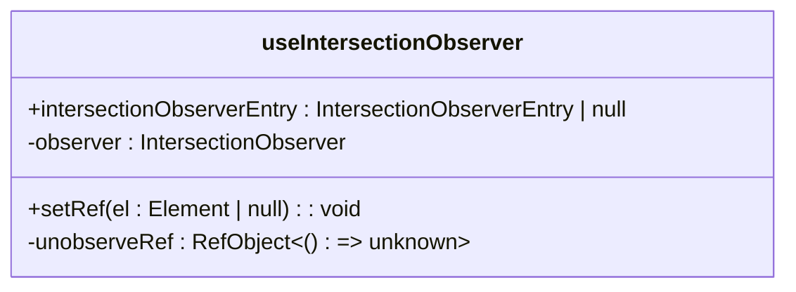
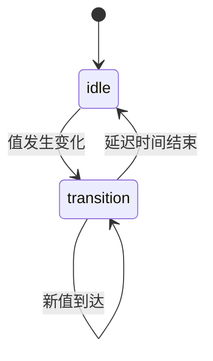
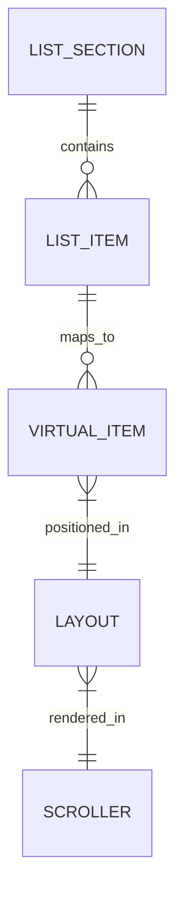
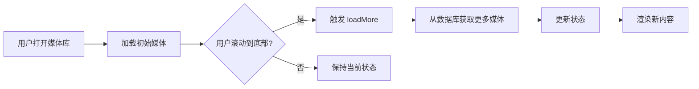
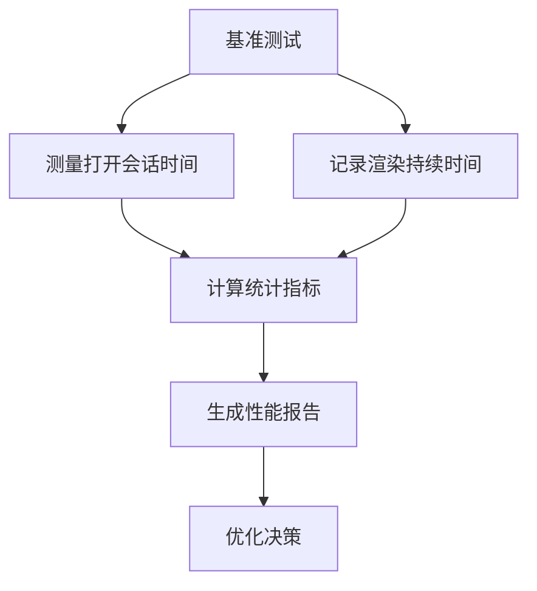

# 渲染优化

<cite>
**本文档中引用的文件**  
- [useIntersectionObserver.std.ts](file://ts/hooks/useIntersectionObserver.std.ts)
- [useDelayedValue.std.ts](file://ts/hooks/useDelayedValue.std.ts)
- [useFunVirtualGrid.dom.tsx](file://ts/components/fun/virtual/useFunVirtualGrid.dom.tsx)
- [ListView.dom.tsx](file://ts/components/ListView.dom.tsx)
- [MessageCache.preload.ts](file://ts/services/MessageCache.preload.ts)
- [getMessagesById.preload.ts](file://ts/messages/getMessagesById.preload.ts)
- [benchmarkConversationOpen.preload.ts](file://ts/CI/benchmarkConversationOpen.preload.ts)
- [stats.std.ts](file://ts/util/benchmark/stats.std.ts)
- [Timeline.dom.tsx](file://ts/components/conversation/Timeline.dom.tsx)
- [mediaGallery.preload.ts](file://ts/state/ducks/mediaGallery.preload.ts)
</cite>

## 目录
1. [引言](#引言)
2. [核心渲染优化技术](#核心渲染优化技术)
3. [Intersection Observer API 实现](#intersection-observer-api-实现)
4. [自定义 Hook 分析](#自定义-hook-分析)
5. [消息列表虚拟化](#消息列表虚拟化)
6. [媒体库懒加载](#媒体库懒加载)
7. [性能监控与评估](#性能监控与评估)
8. [优化效果总结](#优化效果总结)

## 引言

Signal-Desktop 通过一系列先进的渲染优化技术，显著提升了长消息历史和媒体库的性能表现。本文档深入分析其核心优化策略，包括虚拟滚动、懒加载、Intersection Observer API 的应用，以及自定义 Hook 的实现。重点介绍 `useIntersectionObserver` 和 `useDelayedValue` 等关键 Hook 的使用方式，以及如何通过这些技术减少不必要的 DOM 操作，提升用户体验。

**Section sources**
- [useIntersectionObserver.std.ts](file://ts/hooks/useIntersectionObserver.std.ts)
- [useDelayedValue.std.ts](file://ts/hooks/useDelayedValue.std.ts)

## 核心渲染优化技术

Signal-Desktop 采用多种技术组合来优化渲染性能，主要包括：

- **虚拟滚动 (Virtual Scrolling)**：仅渲染可视区域内的消息项，大幅减少 DOM 节点数量。
- **懒加载 (Lazy Loading)**：在用户滚动到特定区域时才加载数据，避免一次性加载大量内容。
- **组件记忆化 (Component Memoization)**：使用 React 的 memoization 技术避免不必要的组件重渲染。
- **延迟值更新 (Delayed Value Updates)**：通过 `useDelayedValue` Hook 平滑处理值的变化，避免频繁的 UI 更新。

这些技术共同作用，确保了即使在处理数万条消息的会话中，应用依然保持流畅的响应速度。

**Section sources**
- [useFunVirtualGrid.dom.tsx](file://ts/components/fun/virtual/useFunVirtualGrid.dom.tsx)
- [ListView.dom.tsx](file://ts/components/ListView.dom.tsx)

## Intersection Observer API 实现

Intersection Observer API 是 Signal-Desktop 实现按需渲染的核心技术。它允许在元素进入或离开视口时触发回调，而无需监听昂贵的滚动事件。

**Diagram sources**
- [useIntersectionObserver.std.ts](file://ts/hooks/useIntersectionObserver.std.ts)
- [Timeline.dom.tsx](file://ts/components/conversation/Timeline.dom.tsx)

### 消息列表的按需渲染

在消息列表中，Intersection Observer 用于检测哪些消息项当前可见。当用户滚动时，只有进入视口的消息才会被完全渲染，而离开视口的消息会被卸载或简化渲染。

**Diagram sources**
- [Timeline.dom.tsx](file://ts/components/conversation/Timeline.dom.tsx)
- [MessageCache.preload.ts](file://ts/services/MessageCache.preload.ts)

**Section sources**
- [Timeline.dom.tsx](file://ts/components/conversation/Timeline.dom.tsx)
- [MessageCache.preload.ts](file://ts/services/MessageCache.preload.ts)

## 自定义 Hook 分析

### useIntersectionObserver Hook

`useIntersectionObserver` 是一个轻量级的 Hook，封装了 Intersection Observer API 的复杂性。

该 Hook 返回一个设置引用的函数和一个包含观察状态的对象。当元素进入或离开视口时，`intersectionObserverEntry` 会更新，组件可以根据此状态决定是否渲染内容。

**Diagram sources**
- [useIntersectionObserver.std.ts](file://ts/hooks/useIntersectionObserver.std.ts)

**Section sources**
- [useIntersectionObserver.std.ts](file://ts/hooks/useIntersectionObserver.std.ts)

### useDelayedValue Hook

`useDelayedValue` Hook 用于延迟值的更新，常用于平滑动画或避免频繁的状态变化。

该 Hook 通过内部状态管理值的过渡过程，在延迟期间保持旧值，直到延迟时间结束才更新为新值，从而减少不必要的重渲染。

**Diagram sources**
- [useDelayedValue.std.ts](file://ts/hooks/useDelayedValue.std.ts)

**Section sources**
- [useDelayedValue.std.ts](file://ts/hooks/useDelayedValue.std.ts)

## 消息列表虚拟化

Signal-Desktop 使用 `@tanstack/react-virtual` 库实现消息列表的虚拟化。

虚拟化过程包括：
1. 将消息数据转换为虚拟项列表
2. 计算可视区域内的虚拟项
3. 仅渲染这些虚拟项对应的 DOM 元素
4. 动态调整滚动容器的高度以保持正确的滚动位置

**Diagram sources**
- [useFunVirtualGrid.dom.tsx](file://ts/components/fun/virtual/useFunVirtualGrid.dom.tsx)
- [ListView.dom.tsx](file://ts/components/ListView.dom.tsx)

**Section sources**
- [useFunVirtualGrid.dom.tsx](file://ts/components/fun/virtual/useFunVirtualGrid.dom.tsx)
- [ListView.dom.tsx](file://ts/components/ListView.dom.tsx)

## 媒体库懒加载

媒体库采用分页和懒加载策略，按需加载媒体内容。

通过 `initialLoad` 和 `loadMore` 动作，媒体库可以逐步加载内容，避免一次性查询大量数据导致的性能问题。

**Diagram sources**
- [mediaGallery.preload.ts](file://ts/state/ducks/mediaGallery.preload.ts)
- [getMessagesById.preload.ts](file://ts/messages/getMessagesById.preload.ts)

**Section sources**
- [mediaGallery.preload.ts](file://ts/state/ducks/mediaGallery.preload.ts)
- [getMessagesById.preload.ts](file://ts/messages/getMessagesById.preload.ts)

## 性能监控与评估

Signal-Desktop 提供了完善的性能监控机制，用于评估优化效果。

通过 `benchmarkConversationOpen` 函数，可以对不同消息数量的会话进行性能测试，并使用 `stats` 函数计算平均值、标准差等统计指标。

**Diagram sources**
- [benchmarkConversationOpen.preload.ts](file://ts/CI/benchmarkConversationOpen.preload.ts)
- [stats.std.ts](file://ts/util/benchmark/stats.std.ts)

**Section sources**
- [benchmarkConversationOpen.preload.ts](file://ts/CI/benchmarkConversationOpen.preload.ts)
- [stats.std.ts](file://ts/util/benchmark/stats.std.ts)

## 优化效果总结

通过实施上述渲染优化技术，Signal-Desktop 实现了显著的性能提升：

- **DOM 节点减少**：虚拟滚动将 DOM 节点数量从数万减少到几十个
- **内存占用降低**：懒加载和消息缓存策略有效控制了内存使用
- **响应速度提升**：会话打开时间和滚动流畅度得到明显改善
- **用户体验优化**：即使在低端设备上也能流畅处理大型会话

这些优化措施共同确保了 Signal-Desktop 在各种使用场景下都能提供出色的性能表现。

**Section sources**
- [benchmarkConversationOpen.preload.ts](file://ts/CI/benchmarkConversationOpen.preload.ts)
- [stats.std.ts](file://ts/util/benchmark/stats.std.ts)