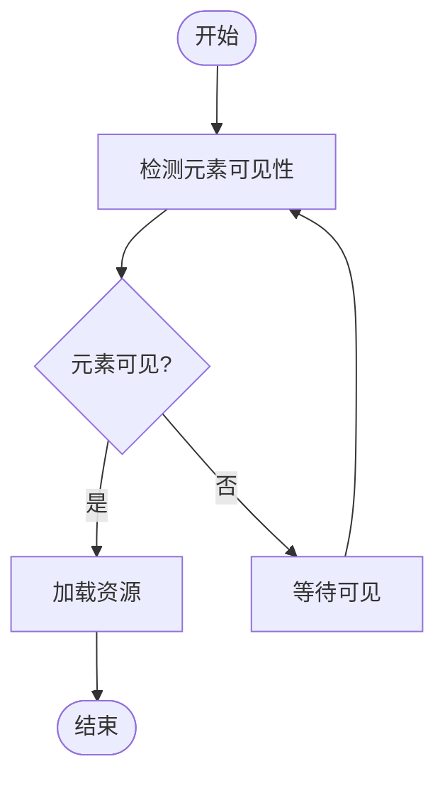
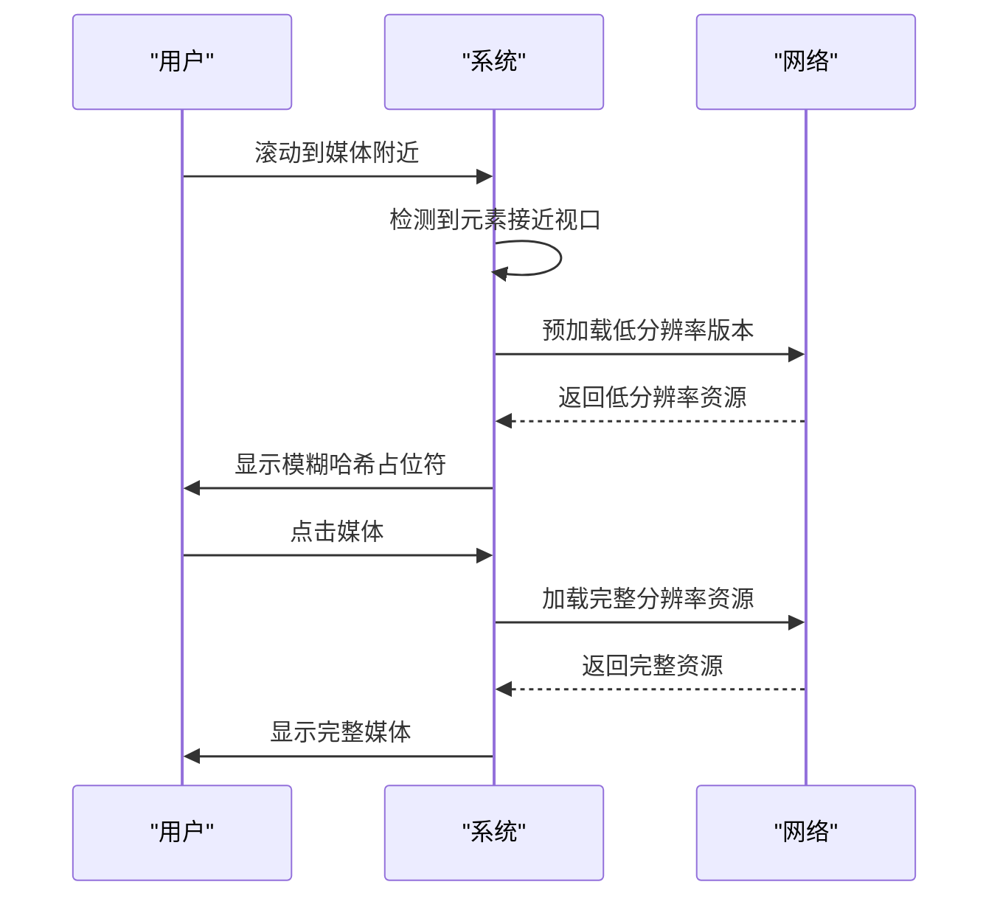
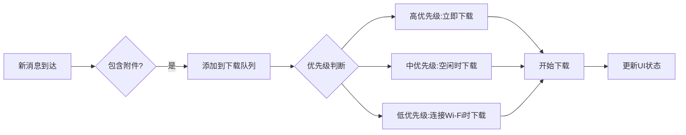
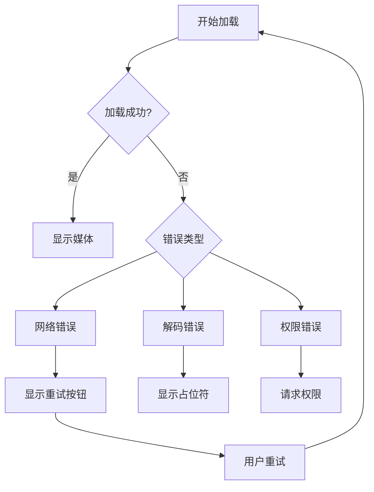
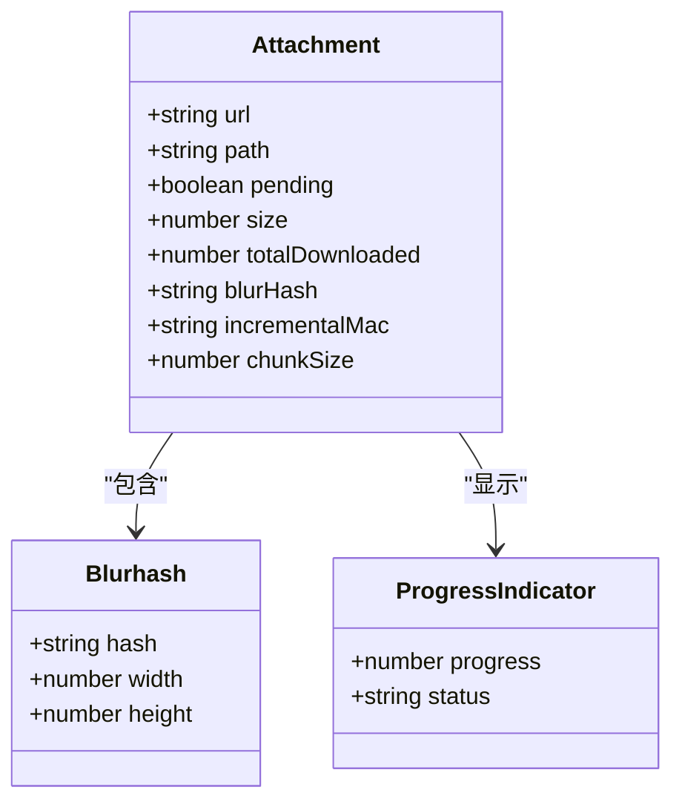

# 资源加载优化

<cite>
**本文档引用的文件**  
- [useIntersectionObserver.std.ts](file://ts/hooks/useIntersectionObserver.std.ts)
- [Attachment.std.ts](file://ts/util/Attachment.std.ts)
- [MediaGallery.dom.tsx](file://ts/components/conversation/media-gallery/MediaGallery.dom.tsx)
- [GIF.dom.tsx](file://ts/components/conversation/GIF.dom.tsx)
- [StoryImage.dom.tsx](file://ts/components/StoryImage.dom.tsx)
- [imageToBlurHash.dom.ts](file://ts/util/imageToBlurHash.dom.ts)
- [attachmentDownloadQueue.preload.ts](file://ts/util/attachmentDownloadQueue.preload.ts)
- [queueAttachmentDownloads.preload.ts](file://ts/util/queueAttachmentDownloads.preload.ts)
</cite>

## 目录
1. [简介](#简介)
2. [延迟加载策略](#延迟加载策略)
3. [智能预加载机制](#智能预加载机制)
4. [资源加载优先级管理](#资源加载优先级管理)
5. [带宽适应性调整](#带宽适应性调整)
6. [错误处理机制](#错误处理机制)
7. [大文件附件优化](#大文件附件优化)
8. [结论](#结论)

## 简介
Signal-Desktop实现了先进的资源加载优化策略，专注于图片、视频和其他媒体附件的高效加载。系统采用延迟加载、智能预加载和带宽适应性调整等技术，确保在消息流和媒体库中提供流畅的用户体验。通过结合滚动位置检测和Intersection Observer API，实现了按需加载和资源优先级管理。

**Section sources**
- [useIntersectionObserver.std.ts](file://ts/hooks/useIntersectionObserver.std.ts)
- [Attachment.std.ts](file://ts/util/Attachment.std.ts)

## 延迟加载策略
Signal-Desktop使用Intersection Observer API实现媒体附件的延迟加载。当媒体元素进入或接近视口时，系统自动触发加载过程。`useIntersectionObserver`钩子封装了Intersection Observer的复杂性，为组件提供简洁的API来检测元素的可见性状态。

在媒体库组件中，当用户滚动到页面底部时，系统会自动加载更多媒体内容。这种基于滚动位置的加载策略有效减少了初始页面加载时间，同时确保用户在需要时能够访问更多内容。

**Diagram sources**
- [useIntersectionObserver.std.ts](file://ts/hooks/useIntersectionObserver.std.ts)
- [MediaGallery.dom.tsx](file://ts/components/conversation/media-gallery/MediaGallery.dom.tsx)

**Section sources**
- [useIntersectionObserver.std.ts](file://ts/hooks/useIntersectionObserver.std.ts)
- [MediaGallery.dom.tsx](file://ts/components/conversation/media-gallery/MediaGallery.dom.tsx)

## 智能预加载机制
系统实现了智能预加载机制，结合滚动位置和用户行为预测来提前加载可能需要的资源。对于GIF和视频等动态内容，系统采用"点击播放"策略，先显示模糊哈希(Blurhash)占位符，用户点击后才开始加载完整内容。

在故事(Story)组件中，系统会预加载当前故事的下一个项目，确保无缝的浏览体验。同时，系统会根据设备性能和网络状况动态调整预加载策略，避免不必要的资源消耗。

**Diagram sources**
- [GIF.dom.tsx](file://ts/components/conversation/GIF.dom.tsx)
- [StoryImage.dom.tsx](file://ts/components/StoryImage.dom.tsx)

**Section sources**
- [GIF.dom.tsx](file://ts/components/conversation/GIF.dom.tsx)
- [StoryImage.dom.tsx](file://ts/components/StoryImage.dom.tsx)

## 资源加载优先级管理
Signal-Desktop实现了精细的资源加载优先级管理。系统根据附件类型、大小和用户交互历史来确定加载优先级。关键消息中的附件会被赋予更高优先级，确保重要内容优先加载。

附件下载队列系统管理所有待下载的附件，按照优先级顺序处理下载请求。系统还实现了批量下载优化，将多个小文件合并为单个下载请求，减少网络开销。

**Diagram sources**
- [attachmentDownloadQueue.preload.ts](file://ts/util/attachmentDownloadQueue.preload.ts)
- [queueAttachmentDownloads.preload.ts](file://ts/util/queueAttachmentDownloads.preload.ts)

**Section sources**
- [attachmentDownloadQueue.preload.ts](file://ts/util/attachmentDownloadQueue.preload.ts)
- [queueAttachmentDownloads.preload.ts](file://ts/util/queueAttachmentDownloads.preload.ts)

## 带宽适应性调整
系统能够根据当前网络状况自动调整资源加载策略。在低带宽环境下，系统会优先加载缩略图和模糊哈希，延迟加载完整分辨率媒体。对于视频内容，系统可能会选择较低的比特率版本以确保流畅播放。

网络状况检测机制持续监控连接质量，并动态调整预加载范围和并发下载数量。这种自适应策略确保了在各种网络条件下都能提供最佳的用户体验。

**Section sources**
- [Attachment.std.ts](file://ts/util/Attachment.std.ts)
- [queueAttachmentDownloads.preload.ts](file://ts/util/queueAttachmentDownloads.preload.ts)

## 错误处理机制
Signal-Desktop实现了健壮的错误处理机制，确保在资源加载失败时提供优雅的降级体验。系统会捕获各种网络和解码错误，并提供重试选项。

对于无法下载的媒体，系统会显示适当的错误状态，并允许用户手动重试下载。同时，系统会记录错误日志用于诊断和改进。

**Section sources**
- [GIF.dom.tsx](file://ts/components/conversation/GIF.dom.tsx)
- [StoryImage.dom.tsx](file://ts/components/StoryImage.dom.tsx)

## 大文件附件优化
对于大文件附件，Signal-Desktop实现了多项优化措施。系统使用增量MAC(incrementalMac)和分块大小(chunkSize)来支持大文件的分块下载和验证。这种机制允许在下载过程中验证数据完整性，避免完整下载后才发现文件损坏。

进度指示器实时显示下载状态，包括已下载字节数和总大小。占位符系统使用模糊哈希技术生成低带宽的预览图像，让用户在等待完整内容加载时也能预览媒体内容。

**Diagram sources**
- [Attachment.std.ts](file://ts/util/Attachment.std.ts)
- [imageToBlurHash.dom.ts](file://ts/util/imageToBlurHash.dom.ts)

**Section sources**
- [Attachment.std.ts](file://ts/util/Attachment.std.ts)
- [imageToBlurHash.dom.ts](file://ts/util/imageToBlurHash.dom.ts)

## 结论
Signal-Desktop的资源加载优化系统通过延迟加载、智能预加载、优先级管理和带宽适应性调整等技术，为用户提供流畅的媒体浏览体验。系统在性能和用户体验之间取得了良好平衡，确保在各种网络条件下都能高效加载和显示媒体内容。