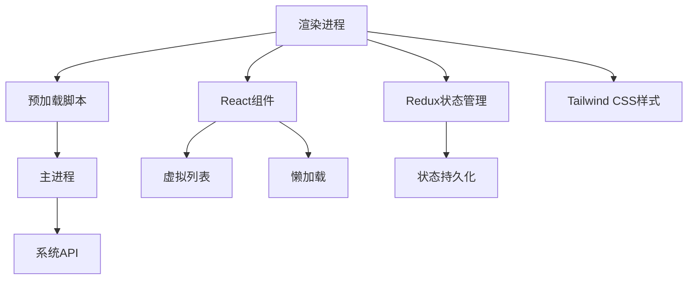
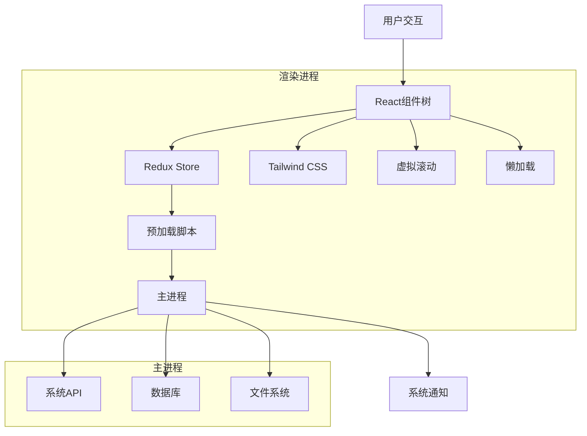
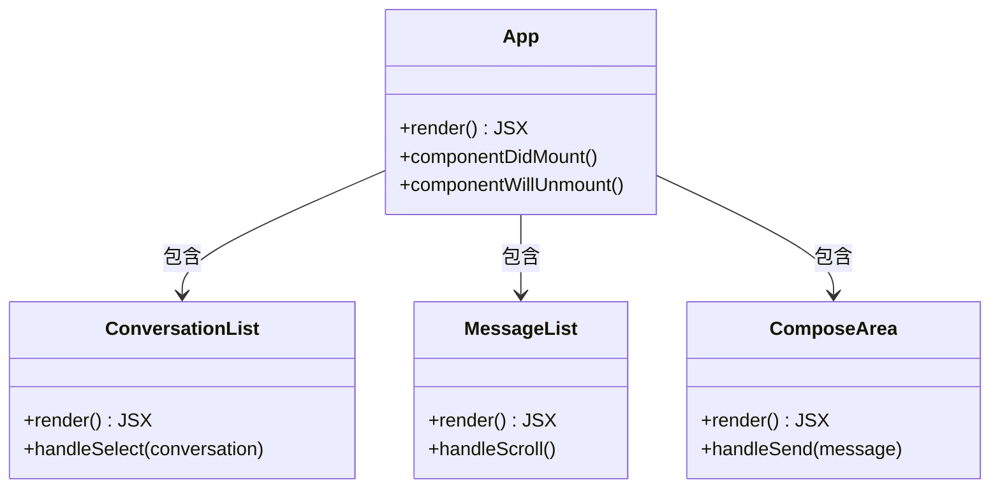
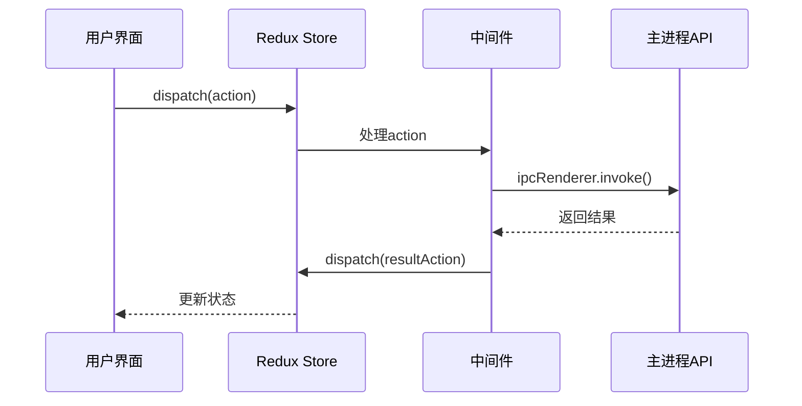
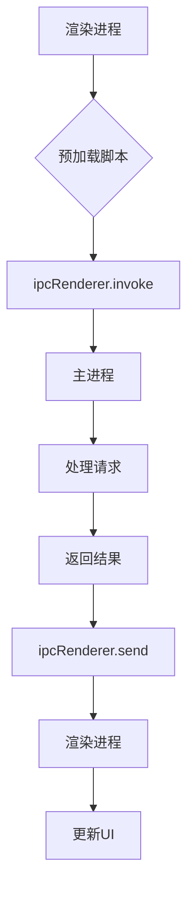
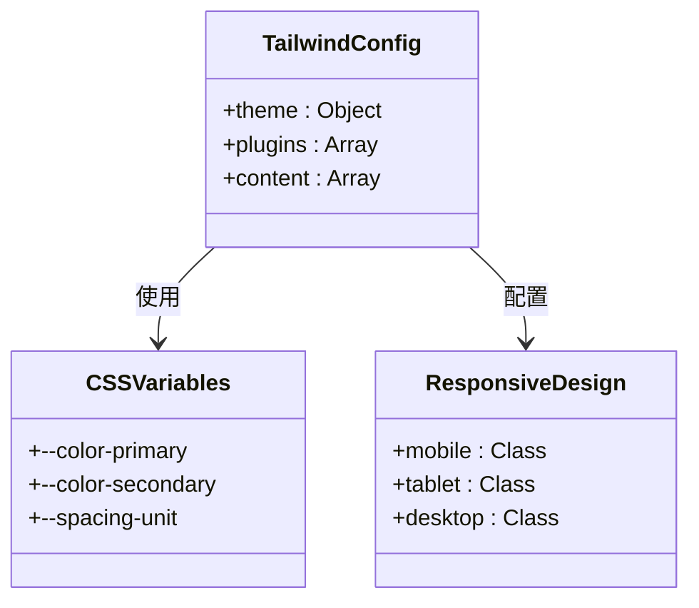
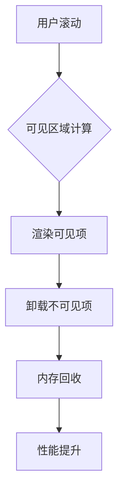
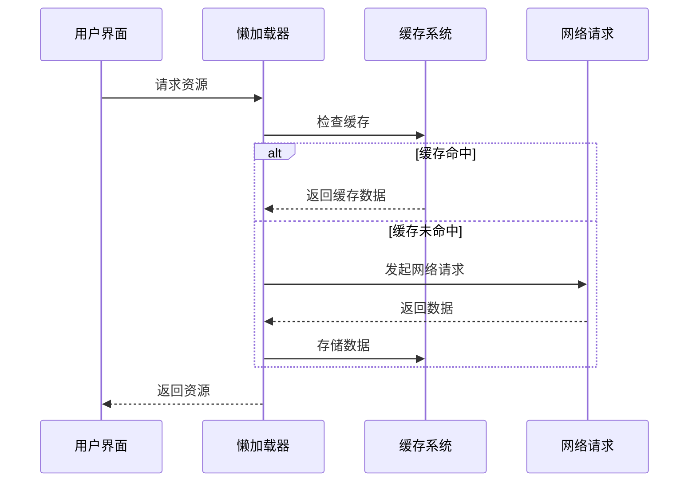
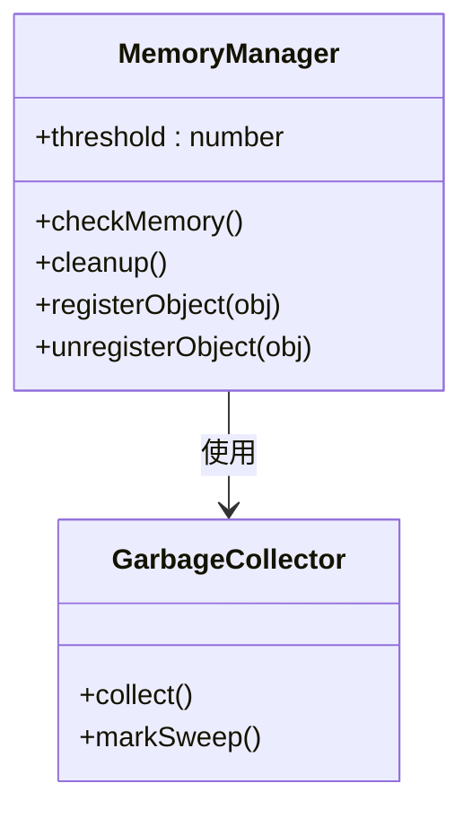

# 渲染进程架构

<cite>
**本文档中引用的文件**  
- [package.json](file://package.json)
- [preload.wrapper.ts](file://preload.wrapper.ts)
- [background.html](file://background.html)
- [loading.html](file://loading.html)
- [util/preload.preload.ts](file://ts/util/preload.preload.ts)
- [state/createStore.preload.ts](file://ts/state/createStore.preload.ts)
- [state/reducer.preload.ts](file://ts/state/reducer.preload.ts)
- [components/App.tsx](file://ts/components/App.tsx)
- [state/ducks/conversations.preload.ts](file://ts/state/ducks/conversations.preload.ts)
- [state/ducks/user.preload.ts](file://ts/state/ducks/user.preload.ts)
- [hooks/useConversations.ts](file://ts/hooks/useConversations.ts)
- [hooks/useUser.ts](file://ts/hooks/useUser.ts)
- [context/AppContext.ts](file://ts/context/AppContext.ts)
- [stylesheets/tailwind-config.css](file://stylesheets/tailwind-config.css)
- [stylesheets/manifest.scss](file://stylesheets/manifest.scss)
- [components/virtual_list/VirtualList.tsx](file://ts/components/virtual_list/VirtualList.tsx)
- [components/LazyImage.tsx](file://ts/components/LazyImage.tsx)
- [util/memoryManager.preload.ts](file://ts/util/memoryManager.preload.ts)
</cite>

## 目录
1. [介绍](#介绍)
2. [项目结构](#项目结构)
3. [核心组件](#核心组件)
4. [架构概述](#架构概述)
5. [详细组件分析](#详细组件分析)
6. [依赖分析](#依赖分析)
7. [性能考虑](#性能考虑)
8. [故障排除指南](#故障排除指南)
9. [结论](#结论)

## 介绍
Signal-Desktop的渲染进程架构基于React构建，采用Redux进行状态管理，并通过预加载脚本与主进程安全通信。该架构旨在提供高效、安全且可扩展的桌面应用体验，支持丰富的用户界面功能和复杂的通信模式。

## 项目结构



**图示来源**
- [package.json](file://package.json)
- [background.html](file://background.html)

**本节来源**
- [package.json](file://package.json#L1-L714)
- [background.html](file://background.html#L1-L140)

## 核心组件

Signal-Desktop的渲染进程核心组件包括React UI架构、Redux状态管理系统、预加载通信机制和Tailwind CSS样式系统。这些组件协同工作，实现了高效、响应式的用户界面。

**本节来源**
- [components/App.tsx](file://ts/components/App.tsx)
- [state/createStore.preload.ts](file://ts/state/createStore.preload.ts)

## 架构概述



**图示来源**
- [background.html](file://background.html#L107-L110)
- [preload.wrapper.ts](file://preload.wrapper.ts#L9-L10)

## 详细组件分析

### React UI架构分析

Signal-Desktop采用基于React的组件化架构，通过组件层次结构组织用户界面。根组件App.tsx负责初始化应用状态和渲染主界面。



**图示来源**
- [components/App.tsx](file://ts/components/App.tsx)
- [components/conversation_list/ConversationList.tsx](file://ts/components/conversation_list/ConversationList.tsx)

#### 状态管理实现

Signal-Desktop使用Redux进行全局状态管理，通过createStore.preload.ts创建Redux store，并配置中间件处理异步操作和日志记录。



**图示来源**
- [state/createStore.preload.ts](file://ts/state/createStore.preload.ts#L81-L87)
- [util/preload.preload.ts](file://ts/util/preload.preload.ts#L4-L8)

#### 预加载脚本通信

预加载脚本作为渲染进程与主进程之间的安全通信桥梁，通过Electron的ipcRenderer实现双向通信。



**图示来源**
- [preload.wrapper.ts](file://preload.wrapper.ts#L7-L50)
- [util/preload.preload.ts](file://ts/util/preload.preload.ts#L4-L8)

**本节来源**
- [preload.wrapper.ts](file://preload.wrapper.ts#L1-L83)
- [util/preload.preload.ts](file://ts/util/preload.preload.ts#L1-L193)

### 样式系统集成

Signal-Desktop采用Tailwind CSS作为样式系统，通过JIT模式实现高效的样式生成和响应式设计。



**图示来源**
- [stylesheets/tailwind-config.css](file://stylesheets/tailwind-config.css)
- [stylesheets/manifest.scss](file://stylesheets/manifest.scss)

## 依赖分析

```mermaid
graph TD
A[React] --> B[React-DOM]
A --> C[React-Redux]
C --> D[Redux]
D --> E[Redux-Thunk]
D --> F[Redux-Promise-Middleware]
A --> G[Tailwind CSS]
G --> H[PostCSS]
A --> I[@tanstack/react-virtual]
A --> J[react-virtualized]
K[Electron] --> L[ipcRenderer]
L --> M[预加载脚本]
```

**图示来源**
- [package.json](file://package.json#L201-L225)
- [package.json](file://package.json#L143-L144)

**本节来源**
- [package.json](file://package.json#L118-L225)

## 性能考虑

Signal-Desktop在渲染进程层面实施了多项性能优化策略，包括虚拟滚动、懒加载和内存管理，以确保大型数据集下的流畅用户体验。

### 虚拟滚动实现



**图示来源**
- [components/virtual_list/VirtualList.tsx](file://ts/components/virtual_list/VirtualList.tsx)

### 懒加载机制



**图示来源**
- [components/LazyImage.tsx](file://ts/components/LazyImage.tsx)

### 内存管理



**图示来源**
- [util/memoryManager.preload.ts](file://ts/util/memoryManager.preload.ts)

**本节来源**
- [components/virtual_list/VirtualList.tsx](file://ts/components/virtual_list/VirtualList.tsx#L1-L100)
- [components/LazyImage.tsx](file://ts/components/LazyImage.tsx#L1-L50)
- [util/memoryManager.preload.ts](file://ts/util/memoryManager.preload.ts#L1-L80)

## 故障排除指南

当遇到渲染进程相关问题时，可参考以下常见问题及解决方案：

1. **通信失败**：检查预加载脚本是否正确加载，确保ipcRenderer通道名称匹配
2. **性能问题**：验证虚拟滚动配置，检查内存使用情况
3. **样式丢失**：确认Tailwind CSS生成是否正常，检查content配置
4. **状态不一致**：检查Redux action类型，验证reducer逻辑

**本节来源**
- [util/preload.preload.ts](file://ts/util/preload.preload.ts#L122-L161)
- [state/createStore.preload.ts](file://ts/state/createStore.preload.ts#L50-L79)

## 结论
Signal-Desktop的渲染进程架构通过React、Redux和Tailwind CSS的有机结合，实现了高效、可维护的用户界面。预加载脚本的安全通信机制确保了渲染进程与主进程之间的可靠交互，而虚拟滚动、懒加载等性能优化策略则保障了应用在处理大量数据时的流畅性。