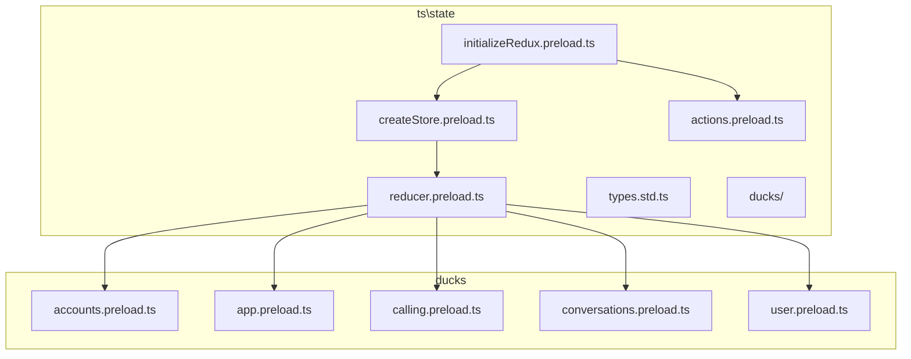
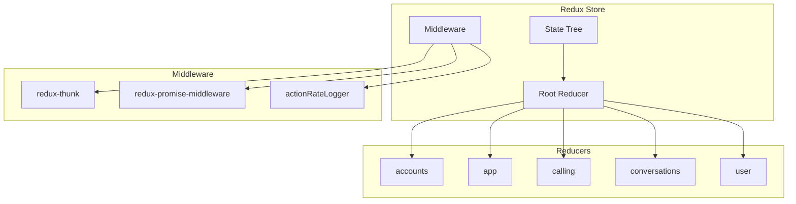
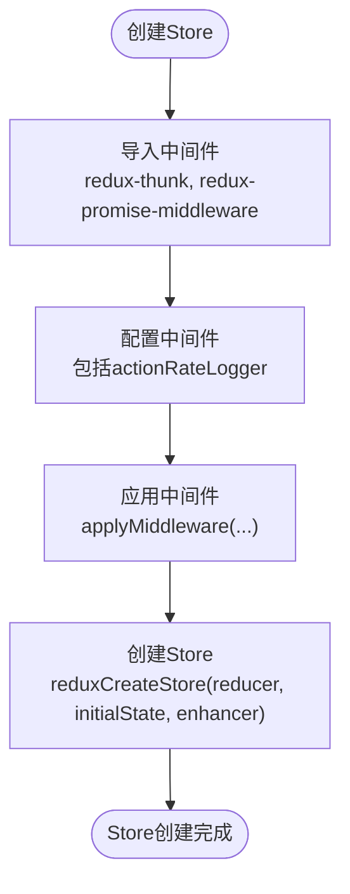
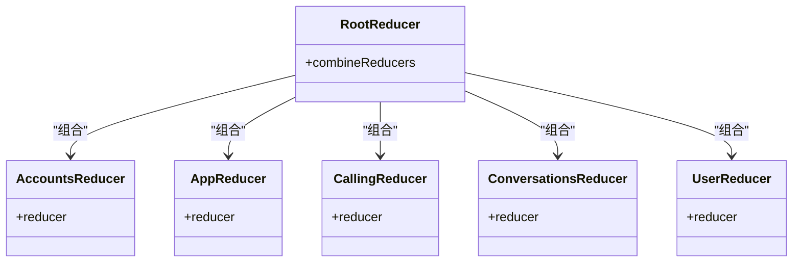
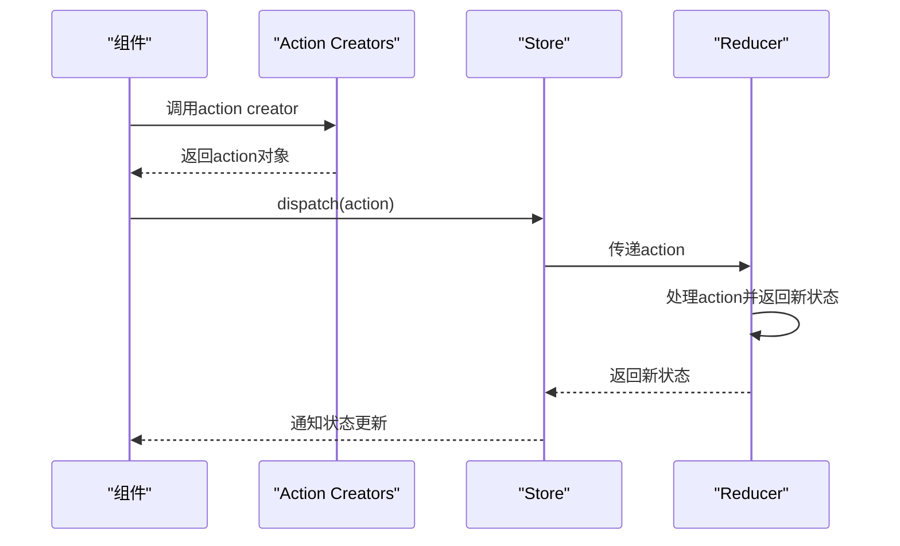
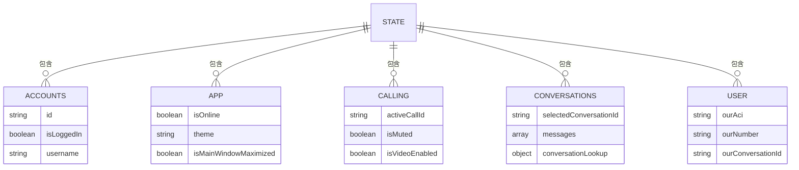
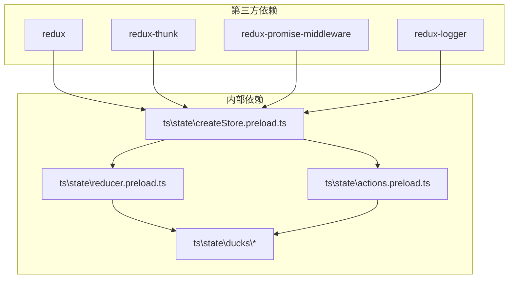

# Redux架构

<cite>
**本文档引用的文件**
- [reducer.preload.ts](file://ts\state\reducer.preload.ts)
- [createStore.preload.ts](file://ts\state\createStore.preload.ts)
- [initializeRedux.preload.ts](file://ts\state\initializeRedux.preload.ts)
- [actions.preload.ts](file://ts\state\actions.preload.ts)
- [types.std.ts](file://ts\state\types.std.ts)
- [conversations.preload.ts](file://ts\state\ducks\conversations.preload.ts)
- [calling.preload.ts](file://ts\state\ducks\calling.preload.ts)
- [user.preload.ts](file://ts\state\ducks\user.preload.ts)
</cite>

## 目录
1. [简介](#简介)
2. [项目结构](#项目结构)
3. [核心组件](#核心组件)
4. [架构概述](#架构概述)
5. [详细组件分析](#详细组件分析)
6. [依赖分析](#依赖分析)
7. [性能考虑](#性能考虑)
8. [故障排除指南](#故障排除指南)
9. [结论](#结论)
10. [附录](#附录)（如有必要）

## 简介
Signal-Desktop应用程序采用Redux作为其状态管理解决方案，以集中管理应用程序的状态并确保可预测的状态转换。该文档深入探讨了Signal-Desktop中Redux架构的实现，包括store的创建、reducer的组合、action creators的设计模式以及整体状态树的结构。文档还分析了中间件的配置、错误处理机制和Redux DevTools的集成方式。

## 项目结构
Signal-Desktop的Redux相关代码主要位于`ts\state`目录下，该目录包含了store创建、reducer定义、action creators和类型定义等核心文件。`ducks`子目录包含了按功能模块划分的reducer和action creators，实现了功能模块的状态管理分片。

**图表来源**
- [reducer.preload.ts](file://ts\state\reducer.preload.ts#L4-82)
- [createStore.preload.ts](file://ts\state\createStore.preload.ts#L91-95)
- [initializeRedux.preload.ts](file://ts\state\initializeRedux.preload.ts#L42-46)

**章节来源**
- [reducer.preload.ts](file://ts\state\reducer.preload.ts#L1-85)
- [createStore.preload.ts](file://ts\state\createStore.preload.ts#L1-96)

## 核心组件
Signal-Desktop的Redux架构由store、reducer、action creators和selectors等核心组件构成。store是应用程序的单一状态树，reducer定义了状态如何响应action进行更新，action creators用于创建action对象，selectors用于从状态树中提取数据。

**章节来源**
- [reducer.preload.ts](file://ts\state\reducer.preload.ts#L1-85)
- [createStore.preload.ts](file://ts\state\createStore.preload.ts#L1-96)
- [actions.preload.ts](file://ts\state\actions.preload.ts#L1-80)

## 架构概述
Signal-Desktop的Redux架构采用模块化设计，通过`combineReducers`将多个功能模块的reducer组合成一个根reducer。每个功能模块（如conversations、calling、user等）都有自己的reducer和action creators，实现了关注点分离和代码组织的清晰性。

**图表来源**
- [reducer.preload.ts](file://ts\state\reducer.preload.ts#L44-82)
- [createStore.preload.ts](file://ts\state\createStore.preload.ts#L81-87)

## 详细组件分析
本节详细分析Signal-Desktop Redux架构中的关键组件，包括store的创建过程、reducer的组合模式、action creators的设计模式以及状态树的整体结构。

### Store创建过程分析
Signal-Desktop通过`createStore`函数创建Redux store，该函数配置了必要的中间件并应用了根reducer。store的创建过程包括中间件的配置和应用，确保了异步操作的支持和日志记录等功能。

#### Store创建流程

**图表来源**
- [createStore.preload.ts](file://ts\state\createStore.preload.ts#L7-87)

#### 中间件配置
Signal-Desktop配置了多个中间件来增强Redux的功能：
- **redux-thunk**: 支持异步action，允许action creators返回函数而不是纯对象
- **redux-promise-middleware**: 处理Promise，简化异步操作
- **actionRateLogger**: 记录action的频率，用于性能监控
- **redux-logger**: 在开发环境中记录action和状态变化

**章节来源**
- [createStore.preload.ts](file://ts\state\createStore.preload.ts#L7-87)

### Reducer组合模式分析
Signal-Desktop采用`combineReducers`将多个功能模块的reducer组合成一个根reducer，实现了状态管理的模块化和可维护性。

#### Reducer组合示意图

**图表来源**
- [reducer.preload.ts](file://ts\state\reducer.preload.ts#L44-82)

#### Reducer职责划分
各reducer模块负责管理特定功能的状态：
- **accounts**: 管理账户相关状态
- **app**: 管理应用程序全局状态
- **calling**: 管理通话相关状态
- **conversations**: 管理会话相关状态
- **user**: 管理用户相关状态

**章节来源**
- [reducer.preload.ts](file://ts\state\reducer.preload.ts#L6-43)

### Action Creators设计模式分析
Signal-Desktop的action creators设计模式包括同步action和异步action的实现方式，通过`bindActionCreators`将action creators与store.dispatch绑定，简化了组件中的状态更新操作。

#### Action Creators实现方式

**图表来源**
- [actions.preload.ts](file://ts\state\actions.preload.ts#L4-79)
- [initializeRedux.preload.ts](file://ts\state\initializeRedux.preload.ts#L50-117)

#### 同步与异步Action
- **同步Action**: 直接返回action对象，用于简单的状态更新
- **异步Action**: 返回函数，函数接收dispatch和getState作为参数，用于处理异步操作

**章节来源**
- [actions.preload.ts](file://ts\state\actions.preload.ts#L4-79)
- [types.std.ts](file://ts\state\types.std.ts#L85-90)

### Redux状态树结构分析
Signal-Desktop的Redux状态树采用分片设计，各分片负责管理特定功能模块的状态，实现了关注点分离和代码组织的清晰性。

#### 状态树结构示意图

**图表来源**
- [reducer.preload.ts](file://ts\state\reducer.preload.ts#L44-82)
- [user.preload.ts](file://ts\state\ducks\user.preload.ts#L19-39)

#### 状态分片职责
- **conversations**: 管理会话列表、消息、选中的会话等状态
- **calling**: 管理通话状态、参与者、音频/视频设置等
- **user**: 管理用户身份、设备信息、界面设置等

**章节来源**
- [conversations.preload.ts](file://ts\state\ducks\conversations.preload.ts#L603-650)
- [calling.preload.ts](file://ts\state\ducks\calling.preload.ts#L257-264)
- [user.preload.ts](file://ts\state\ducks\user.preload.ts#L19-39)

## 依赖分析
Signal-Desktop的Redux架构依赖于多个第三方库和内部模块，这些依赖关系确保了状态管理的完整性和功能性。

**图表来源**
- [createStore.preload.ts](file://ts\state\createStore.preload.ts#L7-8)
- [reducer.preload.ts](file://ts\state\reducer.preload.ts#L4-43)
- [actions.preload.ts](file://ts\state\actions.preload.ts#L4-39)

**章节来源**
- [createStore.preload.ts](file://ts\state\createStore.preload.ts#L1-96)
- [reducer.preload.ts](file://ts\state\reducer.preload.ts#L1-85)
- [actions.preload.ts](file://ts\state\actions.preload.ts#L1-80)

## 性能考虑
Signal-Desktop在Redux架构中实现了多个性能优化措施，包括action频率日志记录、状态选择器优化和异步操作管理，确保了应用程序的响应性和效率。

## 故障排除指南
当遇到Redux相关问题时，可以检查以下方面：
- 确保action types定义正确且唯一
- 检查reducer是否正确处理所有action类型
- 验证中间件配置是否正确
- 确认store创建时的初始状态是否正确

**章节来源**
- [createStore.preload.ts](file://ts\state\createStore.preload.ts#L41-79)
- [reducer.preload.ts](file://ts\state\reducer.preload.ts#L44-82)

## 结论
Signal-Desktop的Redux架构设计精良，通过模块化的reducer、清晰的action creators和合理的中间件配置，实现了高效的状态管理。该架构不仅支持复杂的应用程序状态，还提供了良好的可维护性和扩展性，为Signal-Desktop的稳定运行提供了坚实的基础。