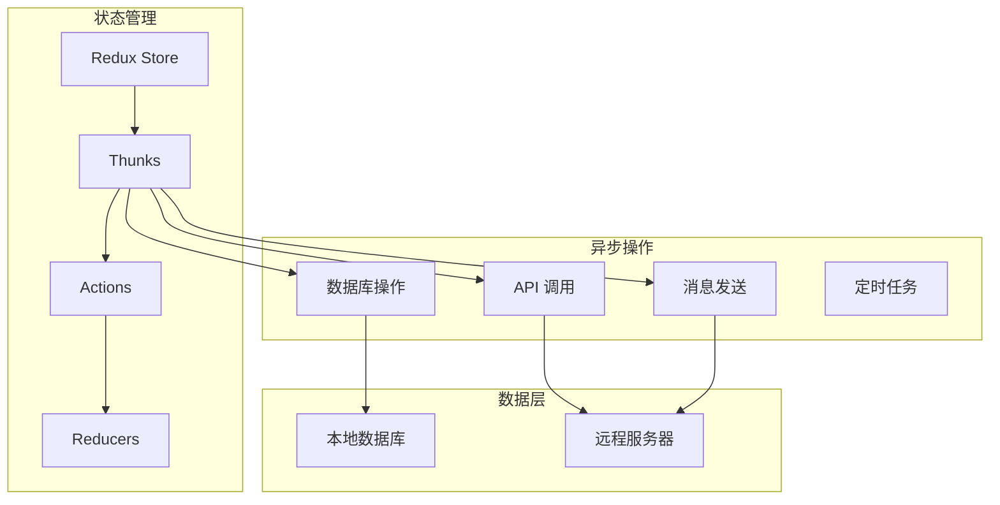
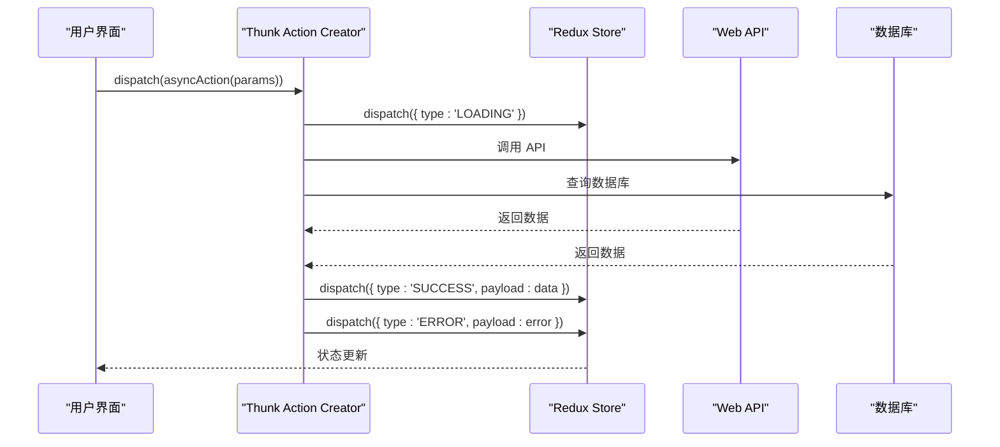
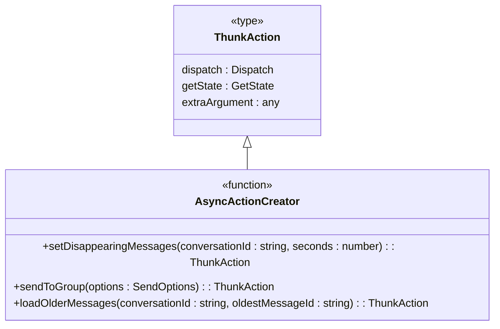
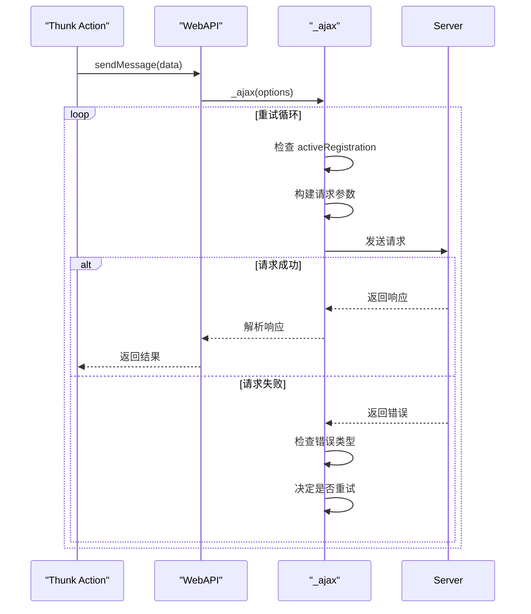
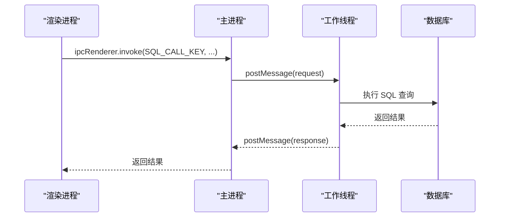
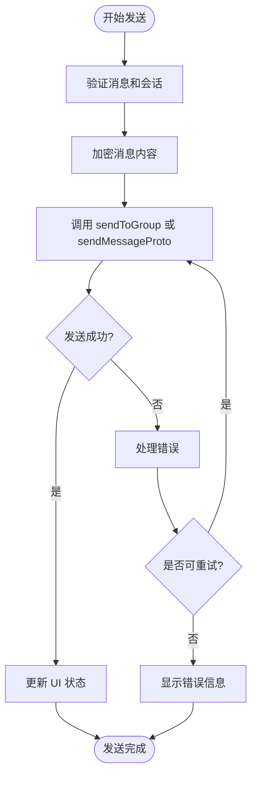
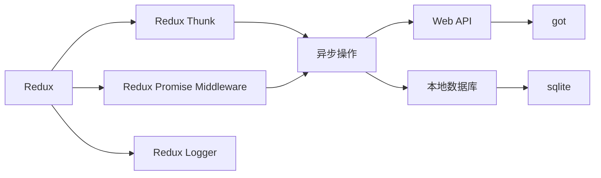

# 异步操作处理

<cite>
**本文档中引用的文件**  
- [createStore.preload.ts](file://ts/state/createStore.preload.ts)
- [useBoundActions.std.ts](file://ts/hooks/useBoundActions.std.ts)
- [conversations.preload.ts](file://ts/state/ducks/conversations.preload.ts)
- [send.preload.ts](file://ts/messages/send.preload.ts)
- [sendToGroup.preload.ts](file://ts/util/sendToGroup.preload.ts)
- [WebAPI.preload.ts](file://ts/textsecure/WebAPI.preload.ts)
- [mainWorker.node.ts](file://ts/sql/mainWorker.node.ts)
- [sql_channel.main.ts](file://app/sql_channel.main.ts)
- [util.std.ts](file://ts/sql/util.std.ts)
- [asyncIterables.std.ts](file://ts/util/asyncIterables.std.ts)
- [loadable.std.ts](file://ts/util/loadable.std.ts)
</cite>

## 目录
1. [简介](#简介)
2. [项目结构](#项目结构)
3. [核心组件](#核心组件)
4. [架构概述](#架构概述)
5. [详细组件分析](#详细组件分析)
6. [依赖分析](#依赖分析)
7. [性能考虑](#性能考虑)
8. [故障排除指南](#故障排除指南)
9. [结论](#结论)

## 简介
Signal-Desktop 使用 Redux Thunk 处理复杂的异步操作，包括消息发送、通话建立、数据同步和数据库操作。该系统通过中间件链集成异步逻辑，确保状态管理的一致性和可预测性。异步操作被封装在 thunk action creators 中，这些函数可以访问 `getState` 和 `dispatch`，从而实现复杂的控制流、条件逻辑和错误处理。本文件详细记录了 Signal-Desktop 中异步操作的实现模式、状态管理策略和最佳实践。

## 项目结构
Signal-Desktop 的异步操作处理分布在多个模块中，主要集中在 `ts` 目录下的 `state`、`messages`、`textsecure` 和 `sql` 子目录。`state` 目录包含 Redux store 的配置和 action creators，`messages` 目录处理消息发送逻辑，`textsecure` 目录包含与 Signal 服务器通信的 API 调用，而 `sql` 目录则负责与本地数据库的异步交互。

**图源**  
- [createStore.preload.ts](file://ts/state/createStore.preload.ts#L81-L87)
- [conversations.preload.ts](file://ts/state/ducks/conversations.preload.ts)

## 核心组件
Signal-Desktop 的异步操作处理核心是 Redux Thunk 中间件，它被配置在 Redux store 的中间件链中。thunk action creators 被用来封装所有异步逻辑，包括 API 调用、数据库查询和消息发送。这些 action creators 可以返回一个函数，该函数接收 `dispatch` 和 `getState` 作为参数，从而允许在异步操作完成后分发新的 action 来更新应用状态。

**节源**  
- [createStore.preload.ts](file://ts/state/createStore.preload.ts#L83)
- [conversations.preload.ts](file://ts/state/ducks/conversations.preload.ts)

## 架构概述
Signal-Desktop 的异步操作架构基于 Redux 模式，使用 thunk 中间件来处理副作用。当一个异步操作被触发时，一个 thunk action creator 会被调用，它启动一个异步任务（如 API 调用或数据库查询）。在任务执行期间，可以分发 action 来更新加载状态。任务完成后，根据结果分发成功或失败的 action，从而更新 Redux store 中的状态。

**图源**  
- [WebAPI.preload.ts](file://ts/textsecure/WebAPI.preload.ts)
- [util.std.ts](file://ts/sql/util.std.ts)
- [conversations.preload.ts](file://ts/state/ducks/conversations.preload.ts)

## 详细组件分析

### 异步 Action Creators 分析
Signal-Desktop 中的异步 action creators 被定义为返回 `ThunkAction` 类型的函数。这些函数可以访问 `dispatch` 和 `getState`，从而实现复杂的异步逻辑。例如，在 `conversations.preload.ts` 文件中，`setDisappearingMessages` 函数是一个 thunk action creator，它在更新会话的消失消息设置后分发一个 `NOOP` action。

**图源**  
- [conversations.preload.ts](file://ts/state/ducks/conversations.preload.ts#L1800-L1803)
- [useBoundActions.std.ts](file://ts/hooks/useBoundActions.std.ts#L5)

**节源**  
- [conversations.preload.ts](file://ts/state/ducks/conversations.preload.ts)
- [useBoundActions.std.ts](file://ts/hooks/useBoundActions.std.ts)

### API 调用分析
API 调用在 `WebAPI.preload.ts` 文件中实现，使用 `_ajax` 函数进行 HTTP 请求。这些调用被封装在 thunk action creators 中，以便在 Redux 状态流中管理。API 调用支持重试机制和错误处理，确保在网络不稳定的情况下仍能可靠地通信。

**图源**  
- [WebAPI.preload.ts](file://ts/textsecure/WebAPI.preload.ts#L1820-L1861)

**节源**  
- [WebAPI.preload.ts](file://ts/textsecure/WebAPI.preload.ts)

### 数据库操作分析
数据库操作通过 `sql_channel` 在主进程和渲染进程之间进行通信。`mainWorker.node.ts` 文件处理来自渲染进程的 SQL 请求，并在工作线程中执行数据库查询。这确保了数据库操作不会阻塞 UI 线程，从而保持应用的响应性。

**图源**  
- [mainWorker.node.ts](file://ts/sql/mainWorker.node.ts#L103-L117)
- [sql_channel.main.ts](file://app/sql_channel.main.ts)

**节源**  
- [mainWorker.node.ts](file://ts/sql/mainWorker.node.ts)
- [sql_channel.main.ts](file://app/sql_channel.main.ts)

### 消息发送流程分析
消息发送是一个复杂的异步流程，涉及多个步骤，包括准备消息、发送到服务器、处理响应和更新本地状态。`send.preload.ts` 文件中的 `send` 函数处理整个发送过程，包括错误处理和状态更新。

**图源**  
- [send.preload.ts](file://ts/messages/send.preload.ts#L43-L329)
- [sendToGroup.preload.ts](file://ts/util/sendToGroup.preload.ts)

**节源**  
- [send.preload.ts](file://ts/messages/send.preload.ts)
- [sendToGroup.preload.ts](file://ts/util/sendToGroup.preload.ts)

## 依赖分析
Signal-Desktop 的异步操作依赖于多个外部库和内部模块。Redux Thunk 是核心依赖，用于处理异步 action。`redux-promise-middleware` 用于处理 Promise-based actions。`got` 库用于 HTTP 请求，而 `sqlite` 用于本地数据库存储。这些依赖通过中间件链集成，确保异步操作的统一处理。

**图源**  
- [createStore.preload.ts](file://ts/state/createStore.preload.ts#L81-L87)
- [package.json](file://package.json)

**节源**  
- [createStore.preload.ts](file://ts/state/createStore.preload.ts)
- [package.json](file://package.json)

## 性能考虑
Signal-Desktop 通过多种方式优化异步操作的性能。数据库操作在工作线程中执行，避免阻塞 UI 线程。API 调用使用连接池和缓存来减少延迟。消息发送使用批量处理和压缩来提高效率。此外，`actionRateLogger` 中间件监控 action 的频率，防止过多的 action 导致性能下降。

**节源**  
- [mainWorker.node.ts](file://ts/sql/mainWorker.node.ts)
- [createStore.preload.ts](file://ts/state/createStore.preload.ts#L50-L79)

## 故障排除指南
在调试异步操作时，应首先检查 Redux DevTools 以查看 action 的流动。`actionRateLogger` 可以帮助识别频繁的 action。对于数据库问题，检查 `mainWorker.node.ts` 中的日志。API 调用问题可以通过 `WebAPI.preload.ts` 中的 `_ajax` 函数日志来诊断。确保所有异步操作都正确处理错误并更新加载状态。

**节源**  
- [createStore.preload.ts](file://ts/state/createStore.preload.ts#L50-L79)
- [WebAPI.preload.ts](file://ts/textsecure/WebAPI.preload.ts)
- [mainWorker.node.ts](file://ts/sql/mainWorker.node.ts)

## 结论
Signal-Desktop 的异步操作处理是一个复杂而强大的系统，它利用 Redux Thunk 和中间件模式来管理应用中的所有副作用。通过将异步逻辑封装在 thunk action creators 中，Signal-Desktop 实现了可预测的状态管理、一致的错误处理和高效的性能。该系统支持复杂的操作，如消息发送、通话建立和数据同步，同时保持代码的可维护性和可测试性。