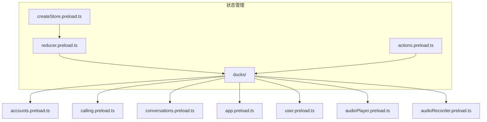
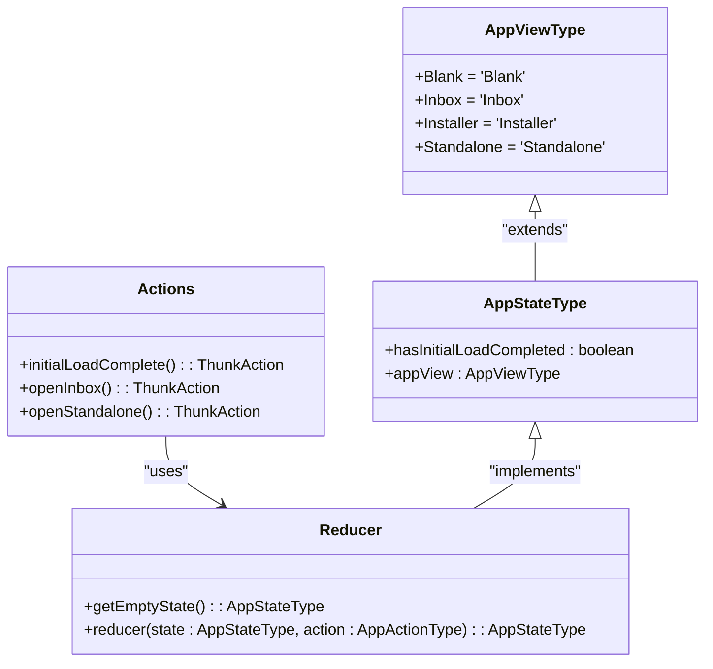
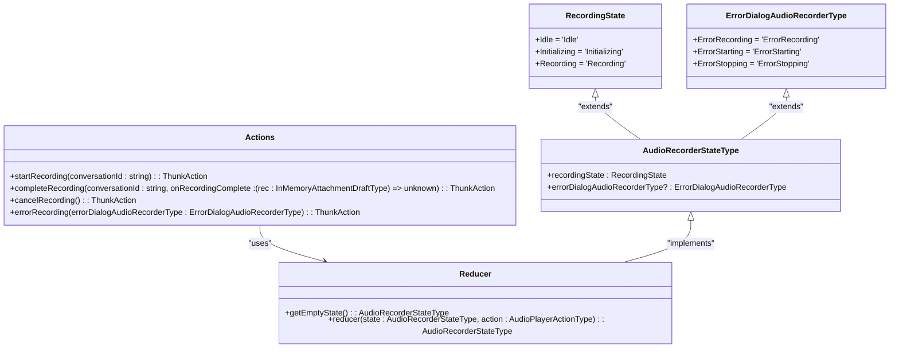
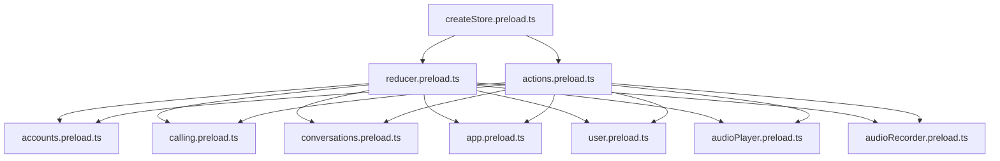

# 状态管理

<cite>
**本文档引用的文件**   
- [createStore.preload.ts](file://ts/state/createStore.preload.ts)
- [actions.preload.ts](file://ts/state/actions.preload.ts)
- [reducer.preload.ts](file://ts/state/reducer.preload.ts)
- [accounts.preload.ts](file://ts/state/ducks/accounts.preload.ts)
- [calling.preload.ts](file://ts/state/ducks/calling.preload.ts)
- [conversations.preload.ts](file://ts/state/ducks/conversations.preload.ts)
- [app.preload.ts](file://ts/state/ducks/app.preload.ts)
- [user.preload.ts](file://ts/state/ducks/user.preload.ts)
- [audioPlayer.preload.ts](file://ts/state/ducks/audioPlayer.preload.ts)
- [audioRecorder.preload.ts](file://ts/state/ducks/audioRecorder.preload.ts)
</cite>

## 目录
1. [简介](#简介)
2. [项目结构](#项目结构)
3. [核心组件](#核心组件)
4. [架构概述](#架构概述)
5. [详细组件分析](#详细组件分析)
6. [依赖分析](#依赖分析)
7. [性能考虑](#性能考虑)
8. [故障排除指南](#故障排除指南)
9. [结论](#结论)

## 简介
Signal-Desktop 使用基于 Redux 的状态管理架构来管理应用程序的全局状态。该架构包括 store 创建、reducer 设计、action creators 实现、状态分片、异步操作处理（使用 Redux Thunk）、状态选择器优化、智能组件与普通组件的分离、状态持久化、错误处理和调试工具集成。本文档详细描述了这些方面，并提供了实际代码示例展示会话状态、通话状态和用户偏好设置的管理方式。

## 项目结构
Signal-Desktop 的状态管理相关文件主要位于 `ts/state` 目录下，包括核心的 store 创建、reducer 组合、action creators 和各个功能模块的状态管理。



**图表来源**
- [createStore.preload.ts](file://ts/state/createStore.preload.ts#L1-L96)
- [reducer.preload.ts](file://ts/state/reducer.preload.ts#L1-L85)
- [actions.preload.ts](file://ts/state/actions.preload.ts#L1-L80)

**章节来源**
- [createStore.preload.ts](file://ts/state/createStore.preload.ts#L1-L96)
- [reducer.preload.ts](file://ts/state/reducer.preload.ts#L1-L85)
- [actions.preload.ts](file://ts/state/actions.preload.ts#L1-L80)

## 核心组件
Signal-Desktop 的状态管理核心组件包括 store 创建、reducer 组合、action creators 和各个功能模块的状态管理。store 使用 Redux 创建，包含多个中间件如 redux-promise-middleware、redux-thunk 和自定义的 actionRateLogger。reducer 使用 combineReducers 将多个功能模块的 reducer 组合在一起。action creators 通过导入各个模块的 actions 并组合成一个对象来提供统一的接口。

**章节来源**
- [createStore.preload.ts](file://ts/state/createStore.preload.ts#L1-L96)
- [reducer.preload.ts](file://ts/state/reducer.preload.ts#L1-L85)
- [actions.preload.ts](file://ts/state/actions.preload.ts#L1-L80)

## 架构概述
Signal-Desktop 的状态管理架构基于 Redux，采用模块化设计，将不同的功能模块的状态管理分离到不同的文件中。每个模块包含自己的 state、actions、action creators 和 reducer。store 创建时使用 applyMiddleware 组合多个中间件，包括 redux-promise-middleware、redux-thunk 和自定义的 actionRateLogger。reducer 使用 combineReducers 将多个模块的 reducer 组合在一起。action creators 通过导入各个模块的 actions 并组合成一个对象来提供统一的接口。

```mermaid
graph TB
subgraph "Store"
Store[Store]
end
subgraph "中间件"
Promise[redux-promise-middleware]
Thunk[redux-thunk]
Logger[redux-logger]
ActionRate[actionRateLogger]
end
subgraph "Reducer"
Reducer[combineReducers]
end
subgraph "Action Creators"
Actions[actions.preload.ts]
end
Store --> Reducer
Store --> 中间件
Reducer --> Accounts[accounts.preload.ts]
Reducer --> Calling[calling.preload.ts]
Reducer --> Conversations[conversations.preload.ts]
Reducer --> App[app.preload.ts]
Reducer --> User[user.preload.ts]
Reducer --> AudioPlayer[audioPlayer.preload.ts]
Reducer --> AudioRecorder[audioRecorder.preload.ts]
Actions --> Accounts
Actions --> Calling
Actions --> Conversations
Actions --> App
Actions --> User
Actions --> AudioPlayer
Actions --> AudioRecorder
```

**图表来源**
- [createStore.preload.ts](file://ts/state/createStore.preload.ts#L1-L96)
- [reducer.preload.ts](file://ts/state/reducer.preload.ts#L1-L85)
- [actions.preload.ts](file://ts/state/actions.preload.ts#L1-L80)

## 详细组件分析
### accounts 模块分析
accounts 模块负责管理用户账户相关状态，包括账户信息的更新和查询。该模块包含 state、actions、action creators 和 reducer。

#### Class Diagram
```mermaid
classDiagram
class AccountsStateType {
+accounts : Record<string, ServiceIdString | undefined>
}
class AccountUpdateActionType {
+type : 'accounts/UPDATE'
+payload : { phoneNumber : string; serviceId? : ServiceIdString }
}
class AccountsActionType {
+type : 'accounts/UPDATE'
+payload : { phoneNumber : string; serviceId? : ServiceIdString }
}
class Actions {
+checkForAccount(phoneNumber : string) : ThunkAction
}
class Reducer {
+getEmptyState() : AccountsStateType
+reducer(state : AccountsStateType, action : AccountsActionType) : AccountsStateType
}
Actions --> Reducer : "uses"
AccountsStateType <|-- Reducer : "implements"
AccountUpdateActionType <|-- AccountsActionType : "extends"
```

**图表来源**
- [accounts.preload.ts](file://ts/state/ducks/accounts.preload.ts#L1-L150)

**章节来源**
- [accounts.preload.ts](file://ts/state/ducks/accounts.preload.ts#L1-L150)

### calling 模块分析
calling 模块负责管理通话相关状态，包括通话状态、通话参与者、通话设置等。该模块包含 state、actions、action creators 和 reducer。

#### Class Diagram
```mermaid
classDiagram
class CallingStateType {
+callsByConversation : CallsByConversationType
+adhocCalls : AdhocCallsType
+callLinks : CallLinksByRoomIdType
+activeCallState? : ActiveCallStateType | WaitingCallStateType
+capturerBaton? : DesktopCapturerBaton
+callQualitySurveySubmission : CQSSubmissionStateType
}
class DirectCallStateType {
+callMode : CallMode.Direct
+conversationId : string
+callState? : CallState
+callEndedReason? : CallEndedReason
+isIncoming : boolean
+isSharingScreen? : boolean
+isVideoCall : boolean
+hasRemoteAudio? : boolean
+hasRemoteVideo? : boolean
+remoteAudioLevel : number
}
class GroupCallStateType {
+callMode : CallMode.Group | CallMode.Adhoc
+conversationId : string
+connectionState : GroupCallConnectionState
+localDemuxId : number | undefined
+joinState : GroupCallJoinState
+peekInfo? : GroupCallPeekInfoType
+raisedHands? : Array<number>
+remoteParticipants : Array<GroupCallParticipantInfoType>
+remoteAudioLevels? : Map<number, number>
}
class ActiveCallStateType {
+state : 'Active'
+callMode : CallMode
+conversationId : string
+hasLocalAudio : boolean
+hasLocalVideo : boolean
+localAudioLevel : number
+viewMode : CallViewMode
+viewModeBeforePresentation? : CallViewMode
+joinedAt : number | null
+outgoingRing : boolean
+pip : boolean
+presentingSource? : PresentedSource
+presentingSourcesAvailable? : ReadonlyArray<PresentableSource>
+selfViewExpanded : boolean
+settingsDialogOpen : boolean
+showNeedsScreenRecordingPermissionsWarning? : boolean
+showParticipantsList : boolean
+suggestLowerHand? : boolean
+mutedBy? : number
+observedRemoteMute? : ObservedRemoteMuteType
+reactions? : ActiveCallReactionsType
}
class WaitingCallStateType {
+state : 'Waiting'
+conversationId : string
}
class CallsByConversationType {
+[conversationId : string] : DirectCallStateType | GroupCallStateType
}
class AdhocCallsType {
+[roomId : string] : GroupCallStateType
}
class CallLinksByRoomIdType {
+[roomId : string] : CallLinkType
}
class CQSSubmissionStateType {
+failedAttempts : number
+state : { status : 'idle' } | { status : 'loading' } | { status : 'failed'; lastSubmissionData : SubmitCallQualitySurveyOptionsType }
}
class Actions {
+acceptCall(conversationId : string, asVideoCall : boolean) : ThunkAction
+cancelCall(conversationId : string) : ThunkAction
+declineCall(conversationId : string) : ThunkAction
+startCall(callMode : CallMode, conversationId : string, hasLocalAudio : boolean, hasLocalVideo : boolean) : ThunkAction
+setLocalAudio(enabled : boolean) : ThunkAction
+setLocalVideo(enabled : boolean) : ThunkAction
+setMutedBy(mutedBy : number) : ThunkAction
+setGroupCallVideoRequest(conversationId : string, resolutions : Array<GroupCallVideoRequest>, speakerHeight : number) : ThunkAction
+startCallingLobby(conversationId : string, isVideoCall : boolean) : ThunkAction
+startCallLinkLobby(rootKey : string, epoch : string | null) : ThunkAction
+startCallLinkLobbyByRoomId(roomId : string) : ThunkAction
+hangUp(conversationId : string) : ThunkAction
+sendGroupCallRaiseHand(conversationId : string, raise : boolean) : ThunkAction
+sendGroupCallReaction(callMode : CallMode, conversationId : string, value : string) : ThunkAction
+peekNotConnectedGroupCall(callMode : CallMode, conversationId : string) : ThunkAction
+remoteVideoChange(conversationId : string, hasVideo : boolean) : ThunkAction
+remoteAudioChange(conversationId : string, hasAudio : boolean) : ThunkAction
+remoteSharingScreenChange(conversationId : string, isSharingScreen : boolean) : ThunkAction
+removeClient(demuxId : number) : ThunkAction
+setRendererCanvas(element : React.RefObject<HTMLCanvasElement> | undefined) : void
}
class Reducer {
+getEmptyState() : CallingStateType
+reducer(state : CallingStateType, action : CallingActionType) : CallingStateType
}
Actions --> Reducer : "uses"
CallingStateType <|-- Reducer : "implements"
DirectCallStateType <|-- CallsByConversationType : "extends"
GroupCallStateType <|-- CallsByConversationType : "extends"
GroupCallStateType <|-- AdhocCallsType : "extends"
CallLinksByRoomIdType <|-- CallingStateType : "extends"
ActiveCallStateType <|-- CallingStateType : "extends"
WaitingCallStateType <|-- CallingStateType : "extends"
CQSSubmissionStateType <|-- CallingStateType : "extends"
```

**图表来源**
- [calling.preload.ts](file://ts/state/ducks/calling.preload.ts#L1-L800)

**章节来源**
- [calling.preload.ts](file://ts/state/ducks/calling.preload.ts#L1-L800)

### conversations 模块分析
conversations 模块负责管理会话相关状态，包括会话信息、消息、草稿、参与者等。该模块包含 state、actions、action creators 和 reducer。

#### Class Diagram
```mermaid
classDiagram
class ConversationsStateType {
+preJoinConversation? : PreJoinConversationType
+invitedServiceIdsForNewlyCreatedGroup? : ReadonlyArray<ServiceIdString>
+conversationLookup : ConversationLookupType
+conversationsByE164 : ConversationLookupType
+conversationsByServiceId : ConversationLookupType
+conversationsByGroupId : ConversationLookupType
+conversationsByUsername : ConversationLookupType
+selectedConversationId? : string
+targetedMessage : string | undefined
+targetedMessageCounter : number
+targetedMessageSource : TargetedMessageSource | undefined
+targetedConversationPanels : { isAnimating : boolean; wasAnimated : boolean; direction : 'push' | 'pop' | undefined; stack : ReadonlyArray<PanelRenderType>; watermark : number }
+targetedMessageForDetails? : ReadonlyMessageAttributesType
+lastSelectedMessage : MessageTimestamps | undefined
+selectedMessageIds : ReadonlyArray<string> | undefined
+showArchived : boolean
+composer? : ComposerStateType
+hasContactSpoofingReview : boolean
+verificationDataByConversation : VerificationDataByConversation
+messagesLookup : MessageLookupType
+messagesByConversation : MessagesByConversationType
+lastCenterMessageByConversation : LastCenterMessageByConversationType
+pendingRequestedAvatarDownload : Record<string, boolean>
+preloadData? : ConversationPreloadDataType
+hasProfileUpdateError? : boolean
}
class ConversationType {
+id : string
+serviceId? : ServiceIdString
+pni? : PniString
+e164? : string
+name? : string
+nicknameGivenName? : string
+nicknameFamilyName? : string
+note? : string
+systemGivenName? : string
+systemFamilyName? : string
+systemNickname? : string
+familyName? : string
+firstName? : string
+profileName? : string
+profileLastUpdatedAt? : number
+capabilities? : CapabilitiesType
+username? : string
+about? : string
+aboutText? : string
+aboutEmoji? : string
+avatars? : ReadonlyArray<AvatarDataType>
+avatarUrl? : string
+rawAvatarPath? : string
+avatarHash? : string
+avatarPlaceholderGradient? : Readonly<[string, string]>
+profileAvatarUrl? : string
+hasAvatar? : boolean
+areWeAdmin? : boolean
+areWePending? : boolean
+areWePendingApproval? : boolean
+canChangeTimer? : boolean
+canEditGroupInfo? : boolean
+canAddNewMembers? : boolean
+color? : AvatarColorType
+conversationColor? : ConversationColorType
+customColor? : CustomColorType
+customColorId? : string
+discoveredUnregisteredAt? : number
+hideStory? : boolean
+isArchived? : boolean
+isBlocked? : boolean
+isReported? : boolean
+reportingToken? : string
+removalStage? : ConversationRemovalStage
+isGroupV1AndDisabled? : boolean
+isPinned? : boolean
+isUntrusted? : boolean
+isVerified? : boolean
+activeAt? : number
+timestamp? : number
+lastMessageReceivedAt? : number
+lastMessageReceivedAtMs? : number
+inboxPosition? : number
+left? : boolean
+lastMessage? : LastMessageType
+markedUnread? : boolean
+phoneNumber? : string
+membersCount? : number
+hasMessages? : boolean
+messagesDeleted? : boolean
+accessControlAddFromInviteLink? : number
+accessControlAttributes? : number
+accessControlMembers? : number
+announcementsOnly? : boolean
+announcementsOnlyReady? : boolean
+expireTimer? : DurationInSeconds
+memberships? : ReadonlyArray<{ aci : AciString; isAdmin : boolean }>
+pendingMemberships? : ReadonlyArray<{ serviceId : ServiceIdString; addedByUserId? : AciString }>
+pendingApprovalMemberships? : ReadonlyArray<{ aci : AciString }>
+bannedMemberships? : ReadonlyArray<ServiceIdString>
+muteExpiresAt? : number
+dontNotifyForMentionsIfMuted? : boolean
+isMe : boolean
+lastUpdated? : number
+sortedGroupMembers? : ReadonlyArray<ConversationType>
+title : string
+titleNoDefault? : string
+titleNoNickname? : string
+titleShortNoDefault? : string
+searchableTitle? : string
+unreadCount? : number
+unreadMentionsCount? : number
+isSelected? : boolean
+isFetchingUUID? : boolean
+typingContactIdTimestamps? : Record<string, number>
+recentMediaItems? : ReadonlyArray<MediaItemType>
+profileSharing? : boolean
+sharingPhoneNumber? : boolean
+shouldShowDraft? : boolean
+draftText? : string
+draftEditMessage? : DraftEditMessageType
+draftBodyRanges? : DraftBodyRanges
+draftPreview? : DraftPreviewType
+draftTimestamp? : number
+sharedGroupNames : ReadonlyArray<string>
+groupDescription? : string
+groupVersion? : 1 | 2
+groupId? : string
+groupLink? : string
+acceptedMessageRequest : boolean
+secretParams? : string
+publicParams? : string
+profileKey? : string
+voiceNotePlaybackRate? : number
+badges : ReadonlyArray<{ id : string } | { id : string; expiresAt : number; isVisible : boolean }>
}
class ConversationLookupType {
+[key : string] : ConversationType
}
class MessageWithUIFieldsType {
+id : string
+received_at : number
+sent_at? : number
+body? : string
+attachments? : ReadonlyArray<AttachmentType>
+conversationId : string
+type : 'incoming' | 'outgoing'
+status? : 'sending' | 'sent' | 'delivered' | 'read' | 'error'
+errors? : Array<CustomError>
+expirationStartTimestamp? : number
+flags? : number
+hasAttachments? : boolean
+hasFileAttachments? : boolean
+hasVisualMediaAttachments? : boolean
+isErased? : boolean
+isViewOnce? : boolean
+messageTimer? : number
+messageTimerStart? : number
+messageTimerPause? : number
+reactions? : Array<ReactionType>
+readStatus? : ReadStatus
+sendEventTimings? : SendEventTimingsType
+sendErrors? : Array<CustomError>
+sent_to? : Array<string>
+timestamp : number
+unread? : boolean
+isGiftBadge? : boolean
+preview? : LinkPreviewType
+quote? : QuoteType
+schemaVersion : number
+source? : string
+sourceDevice? : number
+sourceServiceId? : ServiceIdString
+storyDistributionListId? : string
+storyDistributionListName? : string
+storyDistributionListMembers? : Array<ServiceIdString>
+storyDistributionListIsMyStory? : boolean
+storyDistributionListIsFromLinkedDevice? : boolean
+storyDistributionListIsFromUserInitiated? : boolean
+storyDistributionListIsFromSync? : boolean
+storyDistributionListIsFromSyncRequest? : boolean
+storyDistributionListIsFromSyncResponse? : boolean
+storyDistributionListIsFromSyncRequestResponse? : boolean
+storyDistributionListIsFromSyncRequestResponseError? : boolean
+storyDistributionListIsFromSyncRequestResponseSuccess? : boolean
+storyDistributionListIsFromSyncRequestResponseTimeout? : boolean
+storyDistributionListIsFromSyncRequestResponseUnknown? : boolean
+storyDistributionListIsFromSyncRequestResponseCancelled? : boolean
+storyDistributionListIsFromSyncRequestResponseRejected? : boolean
+storyDistributionListIsFromSyncRequestResponseFailed? : boolean
+storyDistributionListIsFromSyncRequestResponseAborted? : boolean
+storyDistributionListIsFromSyncRequestResponseCompleted? : boolean
+storyDistributionListIsFromSyncRequestResponseInProgress? : boolean
+storyDistributionListIsFromSyncRequestResponseQueued? : boolean
+storyDistributionListIsFromSyncRequestResponseScheduled? : boolean
+storyDistributionListIsFromSyncRequestResponseStarted? : boolean
+storyDistributionListIsFromSyncRequestResponsePaused? : boolean
+storyDistributionListIsFromSyncRequestResponseResumed? : boolean
+storyDistributionListIsFromSyncRequestResponseStopped? : boolean
+storyDistributionListIsFromSyncRequestResponseCancelledByUser? : boolean
+storyDistributionListIsFromSyncRequestResponseRejectedByUser? : boolean
+storyDistributionListIsFromSyncRequestResponseFailedByUser? : boolean
+storyDistributionListIsFromSyncRequestResponseAbortedByUser? : boolean
+storyDistributionListIsFromSyncRequestResponseCompletedByUser? : boolean
+storyDistributionListIsFromSyncRequestResponseInProgressByUser? : boolean
+storyDistributionListIsFromSyncRequestResponseQueuedByUser? : boolean
+storyDistributionListIsFromSyncRequestResponseScheduledByUser? : boolean
+storyDistributionListIsFromSyncRequestResponseStartedByUser? : boolean
+storyDistributionListIsFromSyncRequestResponsePausedByUser? : boolean
+storyDistributionListIsFromSyncRequestResponseResumedByUser? : boolean
+storyDistributionListIsFromSyncRequestResponseStoppedByUser? : boolean
}
class MessageLookupType {
+[key : string] : MessageWithUIFieldsType
}
class MessagesByConversationType {
+[key : string] : ConversationMessageType | undefined
}
class ConversationMessageType {
+isNearBottom? : boolean
+messageChangeCounter : number
+messageIds : ReadonlyArray<string>
+messageLoadingState? : undefined | TimelineMessageLoadingState
+metrics : MessageMetricsType
+scrollToMessageId? : string
+scrollToMessageCounter : number
}
class MessageMetricsType {
+newest? : MessagePointerType
+oldest? : MessagePointerType
+oldestUnseen? : MessagePointerType
+totalUnseen : number
}
class MessagePointerType {
+id : string
+received_at : number
+sent_at? : number
}
class ConversationPreloadDataType {
+conversationId : string
+messages : ReadonlyArray<ReadonlyMessageAttributesType>
+pinnedMessages : ReadonlyArray<PinnedMessageRenderData>
+metrics : MessageMetricsType
+unboundedFetch : boolean
}
class MessagesResetDataType {
+conversationId : string
+messages : ReadonlyArray<ReadonlyMessageAttributesType>
+pinnedMessages : ReadonlyArray<PinnedMessageRenderData>
+metrics : MessageMetricsType
+unboundedFetch : boolean
+scrollToMessageId? : string
}
class MessagesResetOptionsType {
+conversationId : string
+messages : ReadonlyArray<ReadonlyMessageAttributesType>
+pinnedMessages : ReadonlyArray<PinnedMessageRenderData>
+metrics : MessageMetricsType
+unboundedFetch? : boolean
+scrollToMessageId? : string
}
class PreJoinConversationType {
+avatar? : { loading? : boolean; url? : string }
+groupDescription? : string
+memberCount : number
+title : string
+approvalRequired : boolean
}
class ComposerGroupCreationState {
+groupAvatar : undefined | Uint8Array
+groupName : string
+groupExpireTimer : DurationInSeconds
+maximumGroupSizeModalState : OneTimeModalState
+recommendedGroupSizeModalState : OneTimeModalState
+selectedConversationIds : ReadonlyArray<string>
+userAvatarData : ReadonlyArray<AvatarDataType>
}
class DistributionVerificationData {
+serviceIdsNeedingVerification : Array<ServiceIdString>
}
class ConversationVerificationData {
+type : ConversationVerificationState.PendingVerification | ConversationVerificationState.VerificationCanceled
+serviceIdsNeedingVerification? : ReadonlyArray<ServiceIdString>
+canceledAt? : number
+byDistributionId? : Record<StoryDistributionIdString, DistributionVerificationData>
}
class VerificationDataByConversation {
+[string] : ConversationVerificationData
}
class ComposerStateType {
+step : ComposerStep.StartDirectConversation | ComposerStep.FindByUsername | ComposerStep.FindByPhoneNumber | ComposerStep.ChooseGroupMembers | ComposerStep.SetGroupMetadata
+searchTerm : string
+uuidFetchState : UUIDFetchStateType
+selectedRegion? : string
+groupAvatar? : undefined | Uint8Array
+groupName : string
+groupExpireTimer : DurationInSeconds
+maximumGroupSizeModalState : OneTimeModalState
+recommendedGroupSizeModalState : OneTimeModalState
+selectedConversationIds : ReadonlyArray<string>
+userAvatarData : ReadonlyArray<AvatarDataType>
+isEditingAvatar? : boolean
+isCreating? : boolean
+hasError? : boolean
}
class Actions {
+cancelConversationPendingVerification(canceledAt : number) : ThunkAction
+clearCanceledVerification(conversationId : string) : ThunkAction
+clearConversationsPendingVerification() : ThunkAction
+colorsChanged(conversationColor? : ConversationColorType, customColorData? : { id : string; value : CustomColorType }) : ThunkAction
+colorSelected(conversationId : string, conversationColor? : ConversationColorType, customColorData? : { id : string; value : CustomColorType }) : ThunkAction
+composeToggleEditingAvatar() : ThunkAction
+composeAddAvatar(avatar : AvatarDataType) : ThunkAction
+composeRemoveAvatar(avatar : AvatarDataType) : ThunkAction
+composeReplaceAvatar(curr : AvatarDataType, prev? : AvatarDataType) : ThunkAction
+customColorRemoved(colorId : string) : ThunkAction
+discardMessages(conversationId : string, numberToKeepAtBottom : number) : ThunkAction
+replaceAvatars(conversationId : string, avatars : ReadonlyArray<AvatarDataType>) : ThunkAction
+targetedConversationChanged(conversationId : string, messageId : string, source : TargetedMessageSource) : ThunkAction
+pushPanel(panel : PanelRenderType) : ThunkAction
+popPanel() : ThunkAction
+panelAnimationDone() : ThunkAction
+panelAnimationStarted() : ThunkAction
+markRead(conversationId : string, timestamp : number) : ThunkAction
+messageChanged(messageId : string, data : ReadonlyMessageAttributesType) : ThunkAction
+messageDeleted(messageId : string) : ThunkAction
+messageExpired(messageId : string) : ThunkAction
+setVoiceNotePlaybackRate(conversationId : string, rate : number) : ThunkAction
+conversationUnloaded(conversationId : string) : ThunkAction
+showSpoiler(messageId : string, index : number) : ThunkAction
+setPendingRequestedAvatarDownload(conversationId : string, requested : boolean) : ThunkAction
+setProfileUpdateError(hasError : boolean) : ThunkAction
+addPreloadData(data : ConversationPreloadDataType) : ThunkAction
+consumePreloadData() : ThunkAction
+messagesReset(options : MessagesResetOptionsType) : ThunkAction
}
class Reducer {
+getEmptyState() : ConversationsStateType
+reducer(state : ConversationsStateType, action : ConversationsActionType) : ConversationsStateType
}
Actions --> Reducer : "uses"
ConversationsStateType <|-- Reducer : "implements"
ConversationType <|-- ConversationLookupType : "extends"
MessageWithUIFieldsType <|-- MessageLookupType : "extends"
ConversationMessageType <|-- MessagesByConversationType : "extends"
MessageMetricsType <|-- ConversationMessageType : "extends"
MessagePointerType <|-- MessageMetricsType : "extends"
ConversationPreloadDataType <|-- MessagesResetDataType : "extends"
MessagesResetOptionsType <|-- MessagesResetDataType : "extends"
PreJoinConversationType <|-- ConversationsStateType : "extends"
ComposerGroupCreationState <|-- ComposerStateType : "extends"
DistributionVerificationData <|-- ConversationVerificationData : "extends"
ConversationVerificationData <|-- VerificationDataByConversation : "extends"
ComposerStateType <|-- ConversationsStateType : "extends"
```

**图表来源**
- [conversations.preload.ts](file://ts/state/ducks/conversations.preload.ts#L1-L800)

**章节来源**
- [conversations.preload.ts](file://ts/state/ducks/conversations.preload.ts#L1-L800)

### app 模块分析
app 模块负责管理应用程序的整体状态，包括应用视图、初始加载完成状态等。该模块包含 state、actions、action creators 和 reducer。

#### Class Diagram


**图表来源**
- [app.preload.ts](file://ts/state/ducks/app.preload.ts#L1-L153)

**章节来源**
- [app.preload.ts](file://ts/state/ducks/app.preload.ts#L1-L153)

### user 模块分析
user 模块负责管理用户相关状态，包括用户信息、主题、交互模式等。该模块包含 state、actions、action creators 和 reducer。

#### Class Diagram
```mermaid
classDiagram
class UserStateType {
+attachmentsPath : string
+i18n : LocalizerType
+interactionMode : 'mouse' | 'keyboard'
+isMainWindowFullScreen : boolean
+isMainWindowMaximized : boolean
+localeMessages : LocaleMessagesType
+menuOptions : MenuOptionsType
+osName : 'linux' | 'macos' | 'windows' | undefined
+ourAci : AciString | undefined
+ourConversationId : string | undefined
+ourDeviceId : number | undefined
+ourNumber : string | undefined
+ourPni : PniString | undefined
+platform : string
+regionCode : string | undefined
+stickersPath : string
+tempPath : string
+theme : ThemeType
+version : string
}
class ThemeType {
+light = 'light'
+dark = 'dark'
}
class Actions {
+eraseStorageServiceState() : ThunkAction
+userChanged(attributes : { interactionMode? : 'mouse' | 'keyboard'; ourConversationId? : string; ourDeviceId? : number; ourNumber? : string; ourAci? : AciString; ourPni? : PniString; regionCode? : string; theme? : ThemeType; isMainWindowMaximized? : boolean; isMainWindowFullScreen? : boolean; menuOptions? : MenuOptionsType }) : ThunkAction
+manualReconnect() : ThunkAction
}
class Reducer {
+getEmptyState() : UserStateType
+reducer(state : UserStateType, action : UserActionType) : UserStateType
}
Actions --> Reducer : "uses"
UserStateType <|-- Reducer : "implements"
ThemeType <|-- UserStateType : "extends"
```

**图表来源**
- [user.preload.ts](file://ts/state/ducks/user.preload.ts#L1-L189)

**章节来源**
- [user.preload.ts](file://ts/state/ducks/user.preload.ts#L1-L189)

### audioPlayer 模块分析
audioPlayer 模块负责管理音频播放相关状态，包括播放状态、播放位置、播放速率等。该模块包含 state、actions、action creators 和 reducer。

#### Class Diagram
```mermaid
classDiagram
class AudioPlayerStateType {
+active : ActiveAudioPlayerStateType | undefined
}
class ActiveAudioPlayerStateType {
+playing : boolean
+currentTime : number
+playbackRate : number
+duration : number | undefined
+startPosition : number
+content : AudioPlayerContentVoiceNote | AudioPlayerContentDraft
}
class AudioPlayerContentVoiceNote {
+conversationId : string
+context : RenderingContextType
+current : VoiceNoteForPlayback
+isConsecutive : boolean
}
class AudioPlayerContentDraft {
+conversationId : string
+url : string
}
class VoiceNoteForPlayback {
+id : string
+receivedAt : number
+sentAt : number
+url : string | undefined
+duration : number
}
class RenderingContextType {
+Conversation = 'Conversation'
+AllMedia = 'AllMedia'
+Story = 'Story'
}
class Actions {
+loadVoiceNoteAudio(voiceNoteData : VoiceNoteAndConsecutiveForPlayback, position : number, context : RenderingContextType, playbackRate : number) : ThunkAction
+loadVoiceNoteDraftAudio(content : AudioPlayerContentDraft & { playbackRate : number; startPosition : number }) : ThunkAction
+setPlaybackRate(rate : number) : ThunkAction
+currentTimeUpdated(value : number) : ThunkAction
+durationChanged(value : number | undefined) : ThunkAction
+setIsPlaying(value : boolean) : ThunkAction
+setPosition(positionAsRatio : number) : ThunkAction
+pauseVoiceNotePlayer() : ThunkAction
+unloadMessageAudio() : ThunkAction
+messageAudioEnded() : ThunkAction
}
class Reducer {
+getEmptyState() : AudioPlayerStateType
+reducer(state : AudioPlayerStateType, action : AudioPlayerActionType) : AudioPlayerStateType
}
Actions --> Reducer : "uses"
AudioPlayerStateType <|-- Reducer : "implements"
ActiveAudioPlayerStateType <|-- AudioPlayerStateType : "extends"
AudioPlayerContentVoiceNote <|-- ActiveAudioPlayerStateType : "extends"
AudioPlayerContentDraft <|-- ActiveAudioPlayerStateType : "extends"
VoiceNoteForPlayback <|-- AudioPlayerContentVoiceNote : "extends"
RenderingContextType <|-- AudioPlayerContentVoiceNote : "extends"
```

**图表来源**
- [audioPlayer.preload.ts](file://ts/state/ducks/audioPlayer.preload.ts#L1-L591)

**章节来源**
- [audioPlayer.preload.ts](file://ts/state/ducks/audioPlayer.preload.ts#L1-L591)

### audioRecorder 模块分析
audioRecorder 模块负责管理音频录制相关状态，包括录制状态、错误信息等。该模块包含 state、actions、action creators 和 reducer。

#### Class Diagram


**图表来源**
- [audioRecorder.preload.ts](file://ts/state/ducks/audioRecorder.preload.ts#L1-L265)

**章节来源**
- [audioRecorder.preload.ts](file://ts/state/ducks/audioRecorder.preload.ts#L1-L265)

## 依赖分析
Signal-Desktop 的状态管理模块之间存在明确的依赖关系。`createStore.preload.ts` 依赖于 `reducer.preload.ts` 和 `actions.preload.ts`，而 `reducer.preload.ts` 依赖于各个功能模块的 reducer。`actions.preload.ts` 依赖于各个功能模块的 actions。各个功能模块之间通过 Redux 的 state 和 actions 进行通信。



**图表来源**
- [createStore.preload.ts](file://ts/state/createStore.preload.ts#L1-L96)
- [reducer.preload.ts](file://ts/state/reducer.preload.ts#L1-L85)
- [actions.preload.ts](file://ts/state/actions.preload.ts#L1-L80)

**章节来源**
- [createStore.preload.ts](file://ts/state/createStore.preload.ts#L1-L96)
- [reducer.preload.ts](file://ts/state/reducer.preload.ts#L1-L85)
- [actions.preload.ts](file://ts/state/actions.preload.ts#L1-L80)

## 性能考虑
Signal-Desktop 的状态管理在性能方面做了多项优化。首先，使用了 `redux-thunk` 中间件来处理异步操作，避免了阻塞主线程。其次，使用了 `redux-promise-middleware` 来处理 Promise，简化了异步操作的处理。此外，还使用了自定义的 `actionRateLogger` 中间件来监控 action 的频率，防止过多的 action 导致性能问题。最后，通过 `combineReducers` 将多个 reducer 组合在一起，提高了 reducer 的执行效率。

**章节来源**
- [createStore.preload.ts](file://ts/state/createStore.preload.ts#L1-L96)

## 故障排除指南
在使用 Signal-Desktop 的状态管理时，可能会遇到一些常见问题。以下是一些故障排除建议：

1. **Action 频率过高**：如果发现 action 频率过高，可以检查 `actionRateLogger` 中间件的输出，找出频繁触发的 action，并优化相关逻辑。
2. **状态更新不及时**：如果发现状态更新不及时，可以检查相关 action 是否正确触发，以及 reducer 是否正确处理了 action。
3. **异步操作失败**：如果发现异步操作失败，可以检查 `redux-thunk` 和 `redux-promise-middleware` 的配置，确保中间件正确处理了异步操作。
4. **状态持久化问题**：如果发现状态持久化问题，可以检查相关模块的持久化逻辑，确保状态正确保存和恢复。

**章节来源**
- [createStore.preload.ts](file://ts/state/createStore.preload.ts#L1-L96)
- [reducer.preload.ts](file://ts/state/reducer.preload.ts#L1-L85)
- [actions.preload.ts](file://ts/state/actions.preload.ts#L1-L80)

## 结论
Signal-Desktop 的状态管理架构基于 Redux，采用模块化设计，将不同的功能模块的状态管理分离到不同的文件中。通过使用 `redux-thunk` 和 `redux-promise-middleware` 中间件，简化了异步操作的处理。通过 `combineReducers` 将多个 reducer 组合在一起，提高了 reducer 的执行效率。通过自定义的 `actionRateLogger` 中间件，监控 action 的频率，防止过多的 action 导致性能问题。整体架构清晰、高效，能够满足 Signal-Desktop 的复杂状态管理需求。