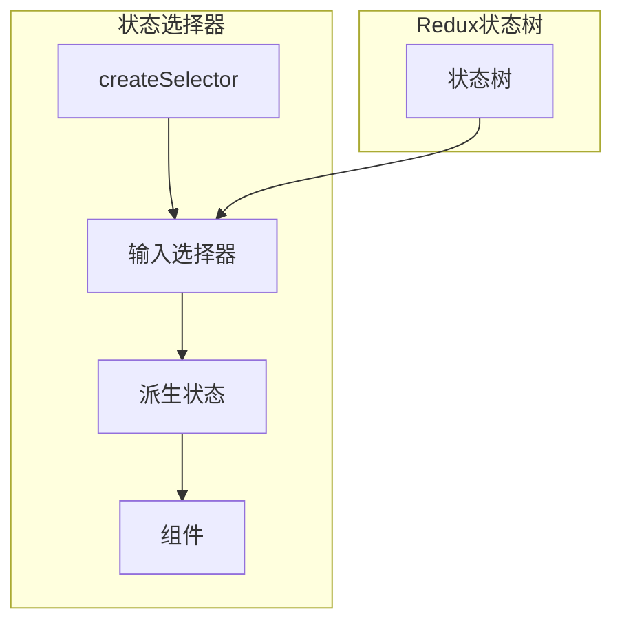
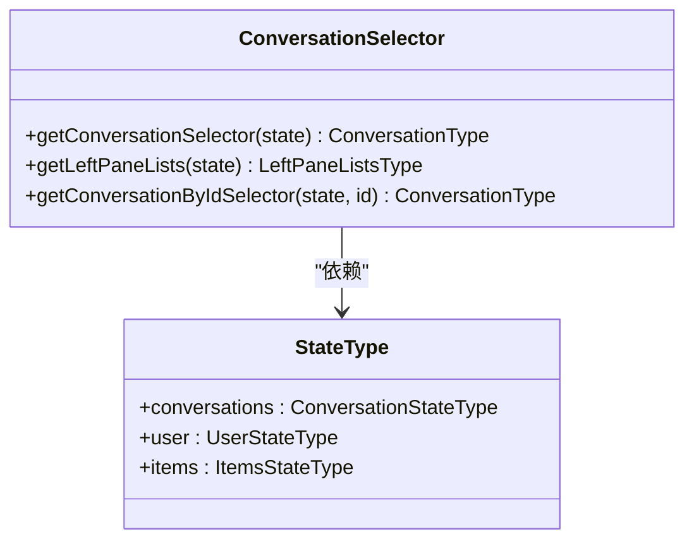
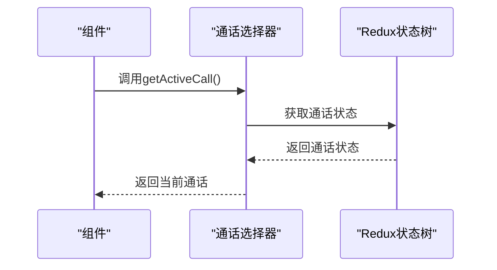
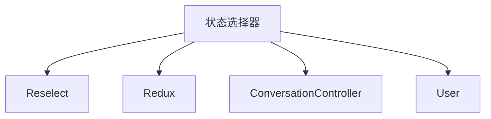

# 状态选择器

<cite>
**本文档引用的文件**   
- [conversations.js](file://ts\state\selectors\conversations.js)
- [accounts.std.ts](file://ts\state\selectors\accounts.std.ts)
- [app.std.ts](file://ts\state\selectors\app.std.ts)
- [calling.std.ts](file://ts\state\selectors\calling.std.ts)
- [user.std.ts](file://ts\state\selectors\user.std.ts)
- [items.js](file://ts\state\selectors\items.js)
- [useProxySelector.std.ts](file://ts\hooks\useProxySelector.std.ts)
- [conversations.dom.ts](file://ts\state\selectors\conversations.dom.ts)
</cite>

## 目录
1. [简介](#简介)
2. [项目结构](#项目结构)
3. [核心组件](#核心组件)
4. [架构概述](#架构概述)
5. [详细组件分析](#详细组件分析)
6. [依赖分析](#依赖分析)
7. [性能考虑](#性能考虑)
8. [故障排除指南](#故障排除指南)
9. [结论](#结论)

## 简介
本文档全面描述了Signal-Desktop项目中使用Reselect库创建高效、可记忆化（memoized）状态选择器的最佳实践。文档详细解释了如何通过`createSelector`函数构建派生状态，避免不必要的组件重新渲染，并深入探讨了选择器的组合模式以及如何从Redux状态树中提取特定数据片段。通过实际示例，展示了会话列表过滤、通话状态提取和用户偏好设置读取的实现方式。同时，文档还记录了选择器的性能优化策略，包括避免创建匿名选择器和正确处理参数化选择器。

## 项目结构
Signal-Desktop项目采用模块化结构，将代码组织成多个功能目录。核心的状态选择器实现位于`ts\state\selectors`目录下，该目录包含了多个专门的选择器文件，如`conversations.js`、`calling.std.ts`和`user.std.ts`，这些文件分别负责处理会话、通话和用户相关的状态选择逻辑。此外，`ts\hooks`目录下的`useProxySelector.std.ts`文件提供了一个自定义的React Hook，用于优化选择器的使用。

**Diagram sources**
- [conversations.js](file://ts\state\selectors\conversations.js#L1-L1148)
- [calling.std.ts](file://ts\state\selectors\calling.std.ts#L1-L186)

**Section sources**
- [conversations.js](file://ts\state\selectors\conversations.js#L1-L1148)
- [calling.std.ts](file://ts\state\selectors\calling.std.ts#L1-L186)

## 核心组件
状态选择器的核心组件包括`createSelector`函数的使用、参数化选择器的实现以及选择器的组合模式。通过`createSelector`，可以创建一个记忆化的选择器，该选择器仅在其输入状态发生变化时才重新计算其输出。这在处理复杂状态树时尤为重要，因为它可以显著减少不必要的计算和组件重新渲染。

**Section sources**
- [conversations.js](file://ts\state\selectors\conversations.js#L1-L1148)
- [calling.std.ts](file://ts\state\selectors\calling.std.ts#L1-L186)

## 架构概述
Signal-Desktop的状态管理架构基于Redux，通过Reselect库提供的`createSelector`函数来优化状态选择。选择器函数被设计为纯函数，它们接收Redux状态树作为输入，并返回派生状态。这种设计模式不仅提高了代码的可测试性和可维护性，还通过记忆化机制显著提升了应用性能。

**Diagram sources**
- [conversations.js](file://ts\state\selectors\conversations.js#L1-L1148)
- [calling.std.ts](file://ts\state\selectors\calling.std.ts#L1-L186)

## 详细组件分析
### 会话选择器分析
会话选择器负责从Redux状态树中提取和处理会话相关的数据。通过`getConversationSelector`，可以获取特定会话的详细信息，而`getLeftPaneLists`则用于生成左侧面板的会话列表，包括置顶会话、普通会话和归档会话。

#### 对于对象导向的组件：

**Diagram sources**
- [conversations.js](file://ts\state\selectors\conversations.js#L1-L1148)

**Section sources**
- [conversations.js](file://ts\state\selectors\conversations.js#L1-L1148)

### 通话选择器分析
通话选择器负责管理通话相关的状态，包括获取当前通话状态、检查是否处于通话中以及获取通话的音频和视频设备信息。通过`getActiveCall`和`isInCall`等选择器，可以轻松地在组件中访问这些信息。

#### 对于API/服务组件：

**Diagram sources**
- [calling.std.ts](file://ts\state\selectors\calling.std.ts#L1-L186)

**Section sources**
- [calling.std.ts](file://ts\state\selectors\calling.std.ts#L1-L186)

## 依赖分析
状态选择器的实现依赖于多个外部库和内部模块。主要依赖包括Reselect库用于创建记忆化选择器，以及Redux用于状态管理。内部模块如`ConversationController`和`User`提供了必要的数据和功能，以支持选择器的正常工作。

**Diagram sources**
- [conversations.js](file://ts\state\selectors\conversations.js#L1-L1148)
- [calling.std.ts](file://ts\state\selectors\calling.std.ts#L1-L186)

**Section sources**
- [conversations.js](file://ts\state\selectors\conversations.js#L1-L1148)
- [calling.std.ts](file://ts\state\selectors\calling.std.ts#L1-L186)

## 性能考虑
为了确保应用的高性能，状态选择器的设计和实现中考虑了多个性能优化策略。首先，通过使用`createSelector`，选择器能够记忆其计算结果，从而避免在相同输入下重复计算。其次，避免创建匿名选择器，确保选择器函数的可重用性和可测试性。最后，正确处理参数化选择器，确保在不同参数下能够正确地记忆和重用计算结果。

## 故障排除指南
在使用状态选择器时，可能会遇到一些常见问题，如选择器未正确更新或组件未重新渲染。这些问题通常可以通过检查选择器的输入状态是否正确变化、确保选择器函数的纯度以及验证Redux状态树的结构来解决。

**Section sources**
- [conversations.js](file://ts\state\selectors\conversations.js#L1-L1148)
- [calling.std.ts](file://ts\state\selectors\calling.std.ts#L1-L186)

## 结论
通过本文档的详细分析，我们可以看到Signal-Desktop项目中状态选择器的实现不仅高效且可维护，而且通过合理的架构设计和性能优化策略，确保了应用的高性能和良好的用户体验。未来的工作可以进一步探索更复杂的选择器组合模式和更高级的性能优化技术。