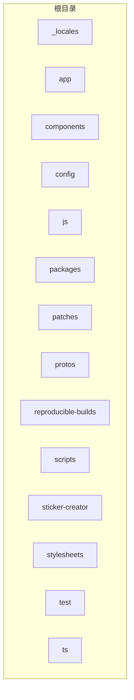
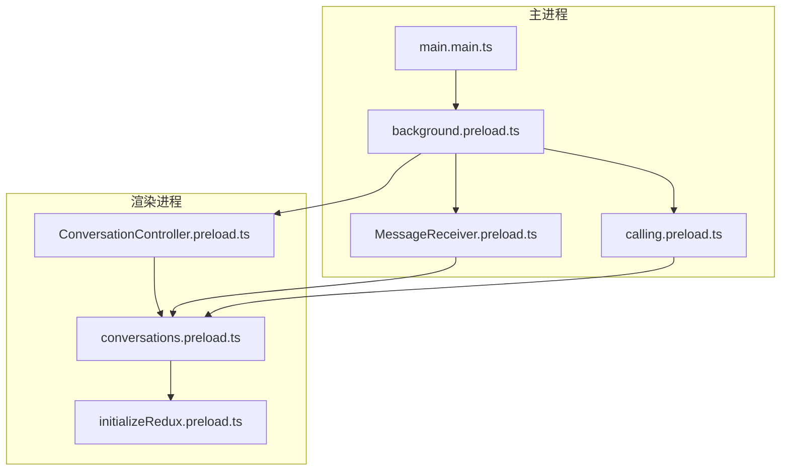
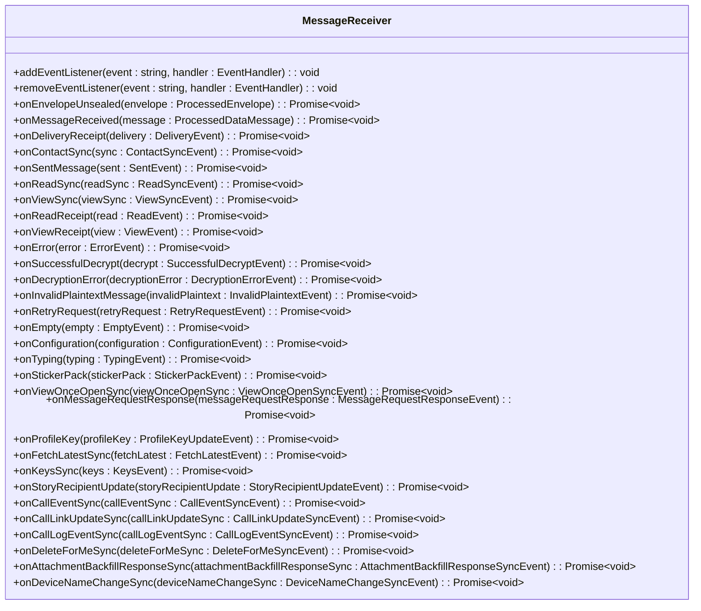
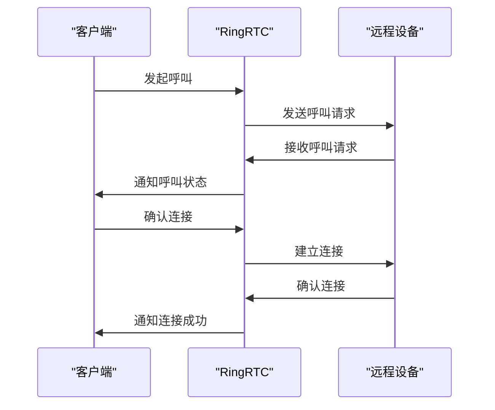
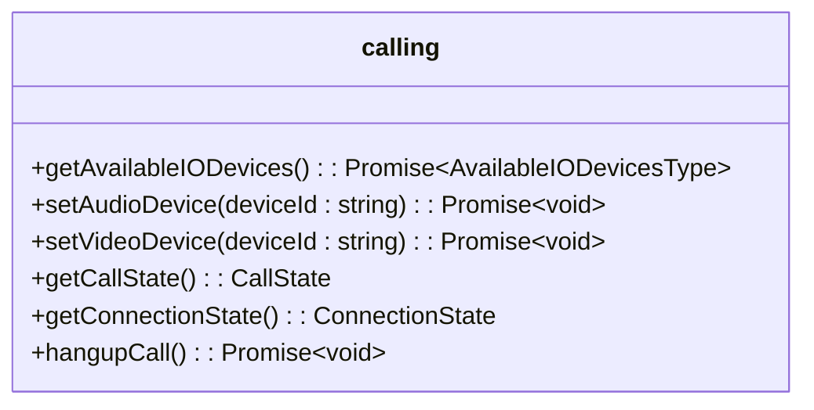
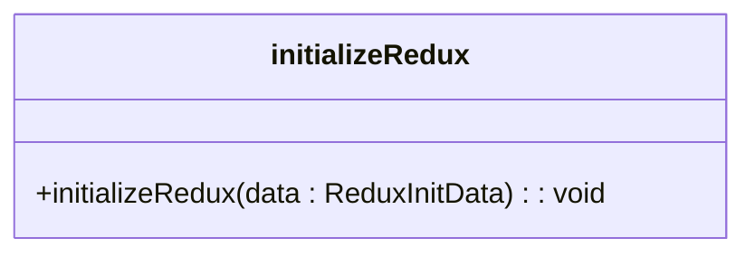

# 核心功能模块

<cite>
**本文档引用的文件**   
- [main.main.ts](file://app/main.main.ts)
- [ConversationController.preload.ts](file://ts/ConversationController.preload.ts)
- [background.preload.ts](file://ts/background.preload.ts)
- [MessageReceiver.preload.ts](file://ts/textsecure/MessageReceiver.preload.ts)
- [calling.preload.ts](file://ts/services/calling.preload.ts)
- [conversations.preload.ts](file://ts/models/conversations.preload.ts)
- [initializeRedux.preload.ts](file://ts/state/initializeRedux.preload.ts)
- [sendToGroup.preload.ts](file://ts/util/sendToGroup.preload.ts)
- [OutgoingMessage.preload.ts](file://ts/textsecure/OutgoingMessage.preload.ts)
</cite>

## 目录
1. [简介](#简介)
2. [项目结构](#项目结构)
3. [核心组件](#核心组件)
4. [架构概述](#架构概述)
5. [详细组件分析](#详细组件分析)
6. [依赖关系分析](#依赖关系分析)
7. [性能考虑](#性能考虑)
8. [故障排除指南](#故障排除指南)
9. [结论](#结论)

## 简介
Signal-Desktop 是一个桌面应用程序，它与 Signal 移动应用链接，允许用户在 Windows、macOS 和 Linux 计算机上发送消息。该应用程序的核心功能包括端到端加密的消息传递、语音和视频通话以及用户界面的实现。本文档深入探讨了这些核心功能模块的实现细节、调用关系、接口、领域模型和使用模式。

## 项目结构
Signal-Desktop 项目结构清晰，主要分为以下几个目录：
- `_locales`：包含多语言支持文件。
- `app`：包含主进程相关的代码。
- `components`：包含 WebAudioRecorder 等组件。
- `config`：包含不同环境的配置文件。
- `js`：包含调用工具和 WebAudioRecorder 的 JavaScript 文件。
- `packages`：包含 mute-state-change 包。
- `patches`：包含各种依赖项的补丁文件。
- `protos`：包含 Protocol Buffers 定义文件。
- `reproducible-builds`：包含可重复构建的 Docker 配置。
- `scripts`：包含构建和准备脚本。
- `sticker-creator`：包含贴纸创建器的相关代码。
- `stylesheets`：包含样式表文件。
- `test`：包含测试文件。
- `ts`：包含 TypeScript 源代码。



**Diagram sources**
- [README.md](file://README.md#L1-L46)

## 核心组件
Signal-Desktop 的核心组件主要包括消息系统、通话系统和用户界面。这些组件通过复杂的调用关系和接口相互协作，实现了端到端加密的消息传递、语音和视频通话等功能。

**Section sources**
- [main.main.ts](file://app/main.main.ts#L1-L800)
- [ConversationController.preload.ts](file://ts/ConversationController.preload.ts#L1-L800)
- [background.preload.ts](file://ts/background.preload.ts#L1-L800)

## 架构概述
Signal-Desktop 的架构基于 Electron 框架，分为主进程和渲染进程。主进程负责管理应用程序的生命周期、窗口管理和系统集成，而渲染进程负责用户界面的展示和交互。消息系统和通话系统通过主进程和渲染进程之间的 IPC 通信进行协调。



**Diagram sources**
- [main.main.ts](file://app/main.main.ts#L1-L800)
- [background.preload.ts](file://ts/background.preload.ts#L1-L800)
- [MessageReceiver.preload.ts](file://ts/textsecure/MessageReceiver.preload.ts#L1-L200)
- [calling.preload.ts](file://ts/services/calling.preload.ts#L1-L200)
- [ConversationController.preload.ts](file://ts/ConversationController.preload.ts#L1-L800)
- [conversations.preload.ts](file://ts/models/conversations.preload.ts#L1-L200)
- [initializeRedux.preload.ts](file://ts/state/initializeRedux.preload.ts#L1-L119)

## 详细组件分析

### 消息系统分析
消息系统是 Signal-Desktop 的核心功能之一，负责处理端到端加密的消息传递。消息系统通过 `MessageReceiver` 类接收和处理消息，确保消息的安全性和完整性。

#### 消息接收和处理
`MessageReceiver` 类通过 WebSocket 连接接收消息，并使用 LibSignal 库进行解密。解密后的消息通过事件系统分发给相应的处理函数。



**Diagram sources**
- [MessageReceiver.preload.ts](file://ts/textsecure/MessageReceiver.preload.ts#L1-L200)

#### 消息发送
消息发送通过 `OutgoingMessage` 类实现，该类负责加密消息并将其发送到目标设备。消息发送过程中，`OutgoingMessage` 类会根据目标设备的公钥和会话状态生成加密消息。

```mermaid
classDiagram
class OutgoingMessage {
+timestamp : number
+message : Proto.Content | Proto.PlaintextContent
+sendMetadata : Map~ServiceIdString, SendMetadata~
+getCiphertextMessage(options : { identityKeyStore : IdentityKeys, protocolAddress : ProtocolAddress, sessionStore : Sessions }) : Promise~CiphertextMessage~
+doSendMessage(serviceId : ServiceIdString, deviceIds : number[], recurse? : boolean) : Promise~void~
}
```

**Diagram sources**
- [OutgoingMessage.preload.ts](file://ts/textsecure/OutgoingMessage.preload.ts#L80-L439)

### 通话系统分析
通话系统是 Signal-Desktop 的另一个核心功能，支持语音和视频通话。通话系统通过 `calling` 模块实现，该模块利用 WebRTC 技术进行实时通信。

#### 通话建立
通话建立过程包括发起呼叫、接收呼叫和连接建立。`calling` 模块通过 `RingRTC` 库与远程设备建立连接，并处理音频和视频流。



**Diagram sources**
- [calling.preload.ts](file://ts/services/calling.preload.ts#L1-L200)

#### 通话管理
通话管理包括音频和视频设备的管理、通话质量监控和通话结束处理。`calling` 模块通过 `AudioDevice` 和 `VideoFrameSource` 类管理音频和视频设备，并通过 `CallState` 和 `ConnectionState` 类监控通话状态。



**Diagram sources**
- [calling.preload.ts](file://ts/services/calling.preload.ts#L1-L200)

### 用户界面分析
用户界面是 Signal-Desktop 的重要组成部分，负责展示消息、通话状态和用户设置。用户界面通过 React 组件实现，利用 Redux 进行状态管理。

#### 状态管理
用户界面的状态管理通过 `initializeRedux` 函数实现，该函数初始化 Redux store 并绑定 action creators。Redux store 负责管理应用程序的全局状态，包括消息、通话历史和用户设置。



**Diagram sources**
- [initializeRedux.preload.ts](file://ts/state/initializeRedux.preload.ts#L1-L119)

#### 组件架构
用户界面的组件架构基于 React，通过 `ConversationController` 和 `conversations` 组件管理对话。`ConversationController` 组件负责管理对话的创建、更新和删除，而 `conversations` 组件负责展示对话列表。

```mermaid
classDiagram
class ConversationController {
+get(id? : string | null) : ConversationModel | undefined
+getAll() : ConversationModel[]
+getOrCreate(id : string | null, type : ConversationAttributesTypeType, additionalInitialProps : Partial~SettableConversationAttributesType~ = {}) : ConversationModel
+getOrCreateAndWait(id : string | null, type : ConversationAttributesTypeType, additionalInitialProps : Partial~SettableConversationAttributesType~ = {}) : Promise~ConversationModel~
+getConversationId(address : string | null) : string | null
+getOurConversationId() : string | undefined
+getOurConversationIdOrThrow() : string
+getOurConversation() : ConversationModel | undefined
+getOurConversationOrThrow() : ConversationModel
+getOrCreateSignalConversation() : Promise~ConversationModel~
+isSignalConversationId(conversationId : string) : boolean
+areWePrimaryDevice() : boolean
+maybeMergeContacts(options : { aci? : AciString, e164? : string, pni? : PniString, reason : string, fromPniSignature? : boolean, mergeOldAndNew? : (options : SafeCombineConversationsParams) => Promise~void~ }) : { conversation : ConversationModel, mergePromises : Promise[]void~~ }
}
class conversations {
+format() : ConversationType
+updateServiceId(serviceId : ServiceIdString) : void
+updateE164(e164 : string) : void
+updatePni(pni : PniString, pniSignatureVerified : boolean) : void
+set(attributes : Partial~SettableConversationAttributesType~) : void
+get(key : keyof ConversationAttributesType) : any
+has(key : keyof ConversationAttributesType) : boolean
+save() : Promise~void~
+destroy() : Promise~void~
+fetch() : Promise~void~
+fetchMessages() : Promise~void~
+fetchMessagesBySentAt(sentAt : number) : Promise~void~
+fetchMessagesByConversationId(conversationId : string) : Promise~void~
+fetchMessagesByType(type : string) : Promise~void~
+fetchMessagesByStatus(status : string) : Promise~void~
+fetchMessagesByReadStatus(readStatus : ReadStatus) : Promise~void~
+fetchMessagesBySendStatus(sendStatus : SendStatus) : Promise~void~
+fetchMessagesByStory(story : boolean) : Promise~void~
+fetchMessagesByExpiration(expiration : boolean) : Promise~void~
+fetchMessagesByUnread(unread : boolean) : Promise~void~
+fetchMessagesByMention(mention : boolean) : Promise~void~
+fetchMessagesByReaction(reaction : boolean) : Promise~void~
+fetchMessagesByQuote(quote : boolean) : Promise~void~
+fetchMessagesByLink(link : boolean) : Promise~void~
+fetchMessagesByAttachment(attachment : boolean) : Promise~void~
+fetchMessagesByCall(call : boolean) : Promise~void~
+fetchMessagesByGroup(group : boolean) : Promise~void~
+fetchMessagesByDirect(direct : boolean) : Promise~void~
+fetchMessagesBySystem(system : boolean) : Promise~void~
+fetchMessagesByTimer(timer : boolean) : Promise~void~
+fetchMessagesByDelete(delete : boolean) : Promise~void~
+fetchMessagesByEdit(edit : boolean) : Promise~void~
+fetchMessagesByReaction(reaction : boolean) : Promise~void~
+fetchMessagesByQuote(quote : boolean) : Promise~void~
+fetchMessagesByLink(link : boolean) : Promise~void~
+fetchMessagesByAttachment(attachment : boolean) : Promise~void~
+fetchMessagesByCall(call : boolean) : Promise~void~
+fetchMessagesByGroup(group : boolean) : Promise~void~
+fetchMessagesByDirect(direct : boolean) : Promise~void~
+fetchMessagesBySystem(system : boolean) : Promise~void~
+fetchMessagesByTimer(timer : boolean) : Promise~void~
+fetchMessagesByDelete(delete : boolean) : Promise~void~
+fetchMessagesByEdit(edit : boolean) : Promise~void~
}
```

**Diagram sources**
- [ConversationController.preload.ts](file://ts/ConversationController.preload.ts#L1-L800)
- [conversations.preload.ts](file://ts/models/conversations.preload.ts#L1-L200)

## 依赖关系分析
Signal-Desktop 的依赖关系复杂，涉及多个第三方库和内部模块。主要依赖包括：
- `@signalapp/libsignal-client`：用于端到端加密。
- `@signalapp/ringrtc`：用于实时通信。
- `@signalapp/sqlcipher`：用于数据库加密。
- `@signalapp/windows-ucv`：用于 Windows 系统集成。
- `@signalapp/mute-state-change`：用于静音状态管理。
- `@indutny/simple-windows-notifications`：用于 Windows 通知。
- `@indutny/mac-screen-share`：用于 macOS 屏幕共享。

```mermaid
graph TD
subgraph "第三方依赖"
libsignal-client[@signalapp/libsignal-client]
ringrtc[@signalapp/ringrtc]
sqlcipher[@signalapp/sqlcipher]
windows-ucv[@signalapp/windows-ucv]
mute-state-change[@signalapp/mute-state-change]
simple-windows-notifications[@indutny/simple-windows-notifications]
mac-screen-share[@indutny/mac-screen-share]
end
subgraph "内部模块"
main[main.main.ts]
background[background.preload.ts]
MessageReceiver[MessageReceiver.preload.ts]
calling[calling.preload.ts]
ConversationController[ConversationController.preload.ts]
conversations[conversations.preload.ts]
initializeRedux[initializeRedux.preload.ts]
end
main --> background
background --> MessageReceiver
background --> calling
ConversationController --> conversations
conversations --> initializeRedux
background --> ConversationController
MessageReceiver --> conversations
calling --> conversations
libsignal-client --> MessageReceiver
ringrtc --> calling
sqlcipher --> main
windows-ucv --> main
mute-state-change --> calling
simple-windows-notifications --> main
mac-screen-share --> main
```

**Diagram sources**
- [package.json](file://package.json#L1-L714)

## 性能考虑
Signal-Desktop 在性能方面做了大量优化，以确保应用程序的响应性和稳定性。主要性能优化措施包括：
- **异步处理**：消息接收和发送、通话建立等操作均采用异步处理，避免阻塞主线程。
- **批处理**：消息更新和状态同步采用批处理机制，减少频繁的 DOM 操作。
- **缓存**：对话和消息数据在内存中缓存，减少数据库查询次数。
- **资源管理**：音频和视频资源在通话结束后及时释放，避免内存泄漏。

## 故障排除指南
在使用 Signal-Desktop 时，可能会遇到一些常见问题。以下是一些常见问题及其解决方案：

### 消息发送失败
- **检查网络连接**：确保设备连接到互联网。
- **检查目标设备状态**：确保目标设备在线且未被屏蔽。
- **检查加密密钥**：确保目标设备的公钥和会话状态正确。

### 通话连接失败
- **检查网络连接**：确保设备连接到互联网。
- **检查音频和视频设备**：确保音频和视频设备正常工作。
- **检查防火墙设置**：确保防火墙未阻止 WebRTC 连接。

### 应用程序崩溃
- **检查日志文件**：查看日志文件以获取错误信息。
- **更新应用程序**：确保使用最新版本的 Signal-Desktop。
- **重新安装应用程序**：尝试重新安装应用程序以解决潜在问题。

## 结论
Signal-Desktop 是一个功能强大的桌面应用程序，通过端到端加密的消息传递、语音和视频通话以及用户友好的界面，为用户提供安全、高效的通信体验。本文档详细介绍了 Signal-Desktop 的核心功能模块，包括消息系统、通话系统和用户界面的实现细节、调用关系、接口、领域模型和使用模式。希望本文档能帮助开发者更好地理解和使用 Signal-Desktop。