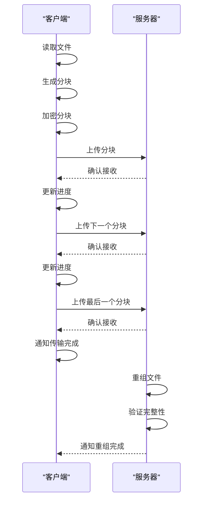

# 分块传输策略

<cite>
**本文档中引用的文件**  
- [attachments.preload.ts](file://ts/util/attachments.preload.ts)
- [processAttachment.preload.ts](file://ts/util/processAttachment.preload.ts)
- [uploadAttachment.preload.ts](file://ts/util/uploadAttachment.preload.ts)
- [AttachmentCrypto.node.ts](file://ts/AttachmentCrypto.node.ts)
- [tusProtocol.node.ts](file://ts/util/uploads/tusProtocol.node.ts)
</cite>

## 目录
1. [引言](#引言)
2. [分块传输概述](#分块传输概述)
3. [分块大小确定](#分块大小确定)
4. [分块处理流程](#分块处理流程)
5. [分块传输管理](#分块传输管理)
6. [加密与完整性验证](#加密与完整性验证)
7. [分块重组逻辑](#分块重组逻辑)
8. [元数据格式与同步机制](#元数据格式与同步机制)
9. [错误处理策略](#错误处理策略)
10. [分块传输时序图](#分块传输时序图)
11. [常见问题与解决方案](#常见问题与解决方案)
12. [性能优化建议](#性能优化建议)

## 引言
Signal-Desktop的分块传输策略旨在安全高效地处理大文件传输。该策略通过将大文件分割成较小的块，对每个块进行独立加密，并在接收端重新组合，确保了传输过程的安全性和可靠性。本文档详细解释了分块算法、加密机制、重组逻辑以及相关的元数据格式、同步机制和错误处理策略。

## 分块传输概述
分块传输是Signal-Desktop处理大文件的核心机制。它将大文件分割成固定大小的块，每个块独立加密并传输，最后在接收端按顺序重组。这种策略不仅提高了传输效率，还增强了安全性，因为即使某个块在传输过程中丢失或损坏，也只需重新传输该块，而不需要重新传输整个文件。

**分块传输的主要优势包括：**
- **提高传输效率**：通过并行传输多个块，可以显著加快大文件的传输速度。
- **增强安全性**：每个块独立加密，即使某个块被截获，也无法解密整个文件。
- **容错性**：单个块的丢失或损坏不会影响其他块的传输，只需重新传输受损的块。

## 分块大小确定
分块大小的确定是分块传输策略的关键环节。Signal-Desktop在`attachments.preload.ts`中定义了分块大小的计算方法，确保分块大小既能充分利用网络带宽，又能避免过大的分块导致传输延迟。

### 分块大小计算
分块大小的计算基于文件的总大小和网络条件。具体来说，`inferChunkSize`函数根据文件的加密后大小来推断合适的分块大小。该函数考虑了文件的原始大小、加密后的填充大小以及网络传输的效率。

```typescript
function inferChunkSize(ciphertextSize: number): ChunkSizeChoice {
  // 根据ciphertextSize选择合适的分块大小
  // 实现细节在AttachmentCrypto.node.ts中
}
```

**分块大小的选择标准：**
- **小文件**：对于小于1MB的文件，通常不分块，直接传输。
- **中等文件**：对于1MB到10MB之间的文件，分块大小通常为1MB。
- **大文件**：对于大于10MB的文件，分块大小根据网络带宽和延迟动态调整，通常在1MB到5MB之间。

**Section sources**
- [attachments.preload.ts](file://ts/util/attachments.preload.ts#L81-L116)
- [AttachmentCrypto.node.ts](file://ts/AttachmentCrypto.node.ts#L202-L209)

## 分块处理流程
分块处理流程在`processAttachment.preload.ts`中实现，负责将文件分割成块并进行初步处理。该流程包括文件读取、分块生成和元数据提取。

### 文件读取
文件读取是分块处理的第一步。`processAttachment`函数接收一个`File`对象，并将其转换为`Uint8Array`，以便后续处理。

```typescript
async function processAttachment(file: File): Promise<InMemoryAttachmentDraftType> {
  const data = await fileToBytes(file);
  return {
    clientUuid: generateUuid(),
    contentType: file.type,
    data,
    fileName: file.name,
    path: file.name,
    pending: false,
    size: data.byteLength,
  };
}
```

### 分块生成
分块生成是将文件数据分割成固定大小的块。`_getSegmentRanges`函数根据文件大小和分块大小生成分块范围。

```typescript
function _getSegmentRanges(contentLength: number, segmentSize: number): ReadonlyArray<_SegmentRange> {
  const segmentRanges: Array<_SegmentRange> = [];
  const segmentCount = Math.ceil(contentLength / segmentSize);
  for (let index = 0; index < segmentCount; index += 1) {
    let startIndex = segmentSize * index;
    let endIndexInclusive = startIndex + segmentSize - 1;
    let sliceSize = segmentSize;
    let sliceStart = 0;

    if (endIndexInclusive > contentLength) {
      endIndexInclusive = contentLength - 1;
      startIndex = contentLength - segmentSize;
      sliceSize = contentLength % segmentSize;
      sliceStart = segmentSize - sliceSize;
    }

    segmentRanges.push({
      startIndex,
      endIndexInclusive,
      sliceStart,
      segmentSize,
      sliceSize,
    });
  }
  return segmentRanges;
}
```

### 元数据提取
元数据提取包括文件类型、大小、分块数量等信息。这些元数据在传输过程中用于验证文件的完整性和正确性。

**Section sources**
- [processAttachment.preload.ts](file://ts/util/processAttachment.preload.ts#L32-L85)
- [components/fun/data/segments.std.ts](file://ts/components/fun/data/segments.std.ts#L45-L90)

## 分块传输管理
分块传输管理在`uploadAttachment.preload.ts`中实现，负责将分块上传到服务器。该流程包括分块加密、上传请求和进度报告。

### 分块加密
分块加密是确保传输安全的关键步骤。`encryptAndUploadAttachment`函数使用AES-256-CBC算法对每个分块进行加密，并生成相应的MAC（消息认证码）以确保数据完整性。

```typescript
async function encryptAndUploadAttachment({
  keys,
  needIncrementalMac,
  plaintext,
  uploadType,
}: {
  keys: Uint8Array;
  needIncrementalMac: boolean;
  plaintext: PlaintextSourceType;
  uploadType: 'standard' | 'backup';
}): Promise<{
  cdnKey: string;
  cdnNumber: number;
  encrypted: EncryptedAttachmentV2;
}> {
  const uploadForm = await getAttachmentUploadForm();
  const encrypted = await encryptAttachmentV2ToDisk({
    getAbsoluteAttachmentPath,
    keys,
    needIncrementalMac,
    plaintext,
  });

  const absoluteCiphertextPath = getAbsoluteAttachmentPath(encrypted.path);
  await uploadFile({
    absoluteCiphertextPath,
    ciphertextFileSize: encrypted.ciphertextSize,
    uploadForm,
  });

  return { cdnKey: uploadForm.key, cdnNumber: uploadForm.cdn, encrypted };
}
```

### 上传请求
上传请求使用TUS协议（Resumable Upload Protocol）实现，支持断点续传。`tusUpload`函数负责发送上传请求，并处理服务器响应。

```typescript
async function tusUpload({
  endpoint,
  headers,
  fileName,
  filePath,
  fileSize,
  reader,
  onProgress,
  onCaughtError,
  maxRetries = DEFAULT_MAX_RETRIES,
  signal,
  fetchFn = fetch,
}: {
  endpoint: string;
  headers: Record<string, string>;
  fileName: string;
  filePath: string;
  fileSize: number;
  reader: TusFileReader;
  onProgress?: (bytesUploaded: number) => void;
  onCaughtError?: (error: Error) => void;
  maxRetries?: number;
  signal?: AbortSignal;
  fetchFn?: FetchFunctionType;
}): Promise<void> {
  const readable = reader(filePath);
  const done = await _tusCreateWithUploadRequest({
    endpoint,
    headers,
    fileName,
    fileSize,
    readable: readable as any,
    onProgress,
    onCaughtError,
    signal,
    fetchFn,
  });
  if (!done) {
    await tusResumeUpload({
      endpoint,
      headers,
      fileName,
      filePath,
      fileSize,
      reader,
      onProgress,
      onCaughtError,
      maxRetries,
      signal,
      fetchFn,
    });
  }
}
```

### 进度报告
进度报告通过`onProgress`回调函数实现，实时更新上传进度。这有助于用户了解传输状态，并在必要时采取相应措施。

**Section sources**
- [uploadAttachment.preload.ts](file://ts/util/uploadAttachment.preload.ts#L39-L200)
- [util/uploads/tusProtocol.node.ts](file://ts/util/uploads/tusProtocol.node.ts#L1-L412)

## 加密与完整性验证
加密与完整性验证是分块传输策略的核心安全机制。Signal-Desktop使用AES-256-CBC算法对每个分块进行加密，并生成MAC以确保数据完整性。

### 加密算法
Signal-Desktop使用AES-256-CBC算法对每个分块进行加密。加密密钥由`generateAttachmentKeys`函数生成，确保每个分块都有唯一的密钥。

```typescript
function generateAttachmentKeys(): Uint8Array {
  return randomBytes(KEY_SET_LENGTH);
}
```

### MAC生成
MAC（消息认证码）用于验证数据的完整性和真实性。`appendMacStream`函数在加密后的数据末尾添加MAC，确保数据在传输过程中未被篡改。

```typescript
function appendMacStream(
  macKey: Uint8Array,
  onMac?: (mac: Uint8Array) => undefined
): Duplex {
  if (macKey.byteLength !== MAC_KEY_SIZE) {
    throw new Error('appendMacStream: invalid macKey length');
  }

  const hmac = createHmac(HashType.size256, macKey);
  return new Transform({
    transform(chunk, _encoding, callback) {
      try {
        hmac.update(chunk);
        callback(null, chunk);
      } catch (error) {
        callback(error);
      }
    },
    flush(callback) {
      try {
        const mac = hmac.digest();
        onMac?.(mac);
        callback(null, mac);
      } catch (error) {
        callback(error);
      }
    },
  });
}
```

### 完整性验证
在接收端，`decryptAttachmentV2`函数使用MAC验证每个分块的完整性。如果MAC验证失败，说明数据在传输过程中被篡改，需要重新传输该分块。

```typescript
async function decryptAttachmentV2(
  options: DecryptAttachmentOptionsType
): Promise<DecryptedAttachmentV2> {
  const logId = `decryptAttachmentV2(${options.idForLogging})`;

  // 创建随机输出文件
  const relativeTargetPath = getRelativePath(createName());
  const absoluteTargetPath = options.getAbsoluteAttachmentPath(relativeTargetPath);

  let writeFd;
  try {
    try {
      await ensureFile(absoluteTargetPath);
    } catch (error) {
      log.error(`${logId}: Failed to create output file`, Errors.toLogFormat(error));
      throw error;
    }

    // 初始化流
    let readFd: FileHandle | undefined;
    let ourPlaintextHash: Uint8Array | undefined;
    let ourDigest: Uint8Array | undefined;
    let ciphertextStream: Readable;

    try {
      if ('ciphertextPath' in options) {
        try {
          readFd = await open(options.ciphertextPath, 'r');
          ciphertextStream = readFd.createReadStream();
        } catch (cause) {
          throw new Error(`${logId}: Read path doesn't exist`, { cause });
        }
      } else if ('ciphertextStream' in options) {
        ciphertextStream = options.ciphertextStream;
      } else {
        throw missingCaseError(options);
      }

      // 初始化验证流
      const incrementalDigestValidator =
        options.type === 'standard' &&
        options.theirIncrementalMac &&
        options.theirChunkSize
          ? new ValidatingPassThrough(
              Buffer.from(macKey),
              everyNthByte(options.theirChunkSize),
              Buffer.from(options.theirIncrementalMac)
            )
          : undefined;

      await pipeline(
        [
          ciphertextStream,
          maybeOuterEncryptionGetMacAndUpdateMac,
          maybeOuterEncryptionGetIvAndDecipher,
          peekAndUpdateHash(digest),
          incrementalDigestValidator,
          getMacAndUpdateHmac(hmac, theirMacValue => {
            theirMac = theirMacValue;
          }),
          decipherWithAesKey(aesKey),
          trimPadding(options.size),
          peekAndUpdateHash(plaintextHash),
          finalStream(() => {
            const ourMac = hmac.digest();
            ourDigest = digest.digest();
            ourPlaintextHash = plaintextHash.digest();

            strictAssert(
              ourMac.byteLength === ATTACHMENT_MAC_LENGTH,
              `${logId}: Failed to generate ourMac!`
            );

            strictAssert(
              ourDigest.byteLength === DIGEST_LENGTH,
              `${logId}: Failed to generate ourDigest!`
            );

            strictAssert(
              ourPlaintextHash.byteLength === PLAINTEXT_HASH_LENGTH,
              `${logId}: Failed to generate ourPlaintextHash!`
            );

            if (options.type === 'standard') {
              if (options.integrityCheck.type === 'plaintext') {
                strictAssert(
                  constantTimeEqual(
                    options.integrityCheck.plaintextHash,
                    ourPlaintextHash
                  ),
                  `${logId}: Plaintext hash mismatch!`
                );
              } else {
                strictAssert(
                  constantTimeEqual(options.integrityCheck.digest, ourDigest),
                  `${logId}: Digest mismatch!`
                );
              }

              if (incrementalDigestValidator) {
                incrementalDigestValidator.finalize();
              }
            }
          }),
          createWriteStream(absoluteTargetPath),
        ].filter(isNotNil)
      );
    } finally {
      if (readFd) {
        await readFd.close();
      }
    }

    return {
      path: relativeTargetPath,
      digest: toBase64(ourDigest),
      plaintextHash: toHex(ourPlaintextHash),
    };
  } finally {
    if (writeFd) {
      await writeFd.close();
    }
  }
}
```

**Section sources**
- [AttachmentCrypto.node.ts](file://ts/AttachmentCrypto.node.ts#L66-L339)
- [util/appendMacStream.node.ts](file://ts/util/appendMacStream.node.ts#L1-L42)

## 分块重组逻辑
分块重组逻辑在接收端实现，负责将接收到的分块按顺序重新组合成原始文件。该过程包括分块排序、完整性验证和文件写入。

### 分块排序
分块排序确保接收到的分块按正确的顺序排列。每个分块包含一个序号，接收端根据序号对分块进行排序。

### 完整性验证
完整性验证确保每个分块在传输过程中未被篡改。接收端使用MAC验证每个分块的完整性，如果验证失败，需要重新传输该分块。

### 文件写入
文件写入是将排序后的分块写入磁盘，形成完整的文件。`decryptAttachmentV2`函数负责将解密后的数据写入输出文件。

**Section sources**
- [AttachmentCrypto.node.ts](file://ts/AttachmentCrypto.node.ts#L326-L339)

## 元数据格式与同步机制
元数据格式和同步机制确保分块传输的可靠性和一致性。元数据包括文件类型、大小、分块数量、加密密钥等信息。

### 元数据格式
元数据以JSON格式存储，包含以下字段：
- `cdnId`：CDN标识符
- `cdnKey`：CDN密钥
- `cdnNumber`：CDN编号
- `digest`：文件摘要
- `incrementalMac`：增量MAC
- `chunkSize`：分块大小
- `key`：加密密钥
- `plaintextHash`：明文哈希
- `uploadTimestamp`：上传时间戳

```typescript
type CdnFieldsType = Pick<
  AttachmentType,
  | 'cdnId'
  | 'cdnKey'
  | 'cdnNumber'
  | 'digest'
  | 'incrementalMac'
  | 'chunkSize'
  | 'isReencryptableToSameDigest'
  | 'iv'
  | 'key'
  | 'plaintextHash'
  | 'uploadTimestamp'
>;
```

### 同步机制
同步机制确保发送端和接收端的元数据一致。发送端在上传分块时，将元数据发送给接收端。接收端在接收到分块后，验证元数据的完整性，并更新本地元数据。

**Section sources**
- [attachments.preload.ts](file://ts/util/attachments.preload.ts#L81-L116)

## 错误处理策略
错误处理策略确保分块传输的可靠性和容错性。常见的错误包括网络中断、分块丢失、MAC验证失败等。

### 网络中断
网络中断时，TUS协议支持断点续传。发送端在重新连接后，从上次中断的位置继续上传。

### 分块丢失
分块丢失时，接收端检测到缺失的分块，并请求发送端重新传输该分块。

### MAC验证失败
MAC验证失败时，接收端认为该分块在传输过程中被篡改，需要重新传输该分块。

**Section sources**
- [uploadAttachment.preload.ts](file://ts/util/uploadAttachment.preload.ts#L39-L200)
- [util/uploads/tusProtocol.node.ts](file://ts/util/uploads/tusProtocol.node.ts#L1-L412)

## 分块传输时序图
以下是分块传输的时序图，展示了分块生成、传输和重组的完整流程。



**Diagram sources**
- [processAttachment.preload.ts](file://ts/util/processAttachment.preload.ts#L32-L85)
- [uploadAttachment.preload.ts](file://ts/util/uploadAttachment.preload.ts#L39-L200)
- [AttachmentCrypto.node.ts](file://ts/AttachmentCrypto.node.ts#L66-L339)

## 常见问题与解决方案
### 分块丢失
**问题描述**：在传输过程中，某个分块未能成功上传。
**解决方案**：使用TUS协议的断点续传功能，从上次中断的位置继续上传。

### 顺序错乱
**问题描述**：接收到的分块顺序与发送顺序不一致。
**解决方案**：每个分块包含一个序号，接收端根据序号对分块进行排序。

### 部分传输完成
**问题描述**：传输过程中网络中断，导致部分分块已上传，部分分块未上传。
**解决方案**：使用TUS协议的断点续传功能，从上次中断的位置继续上传。

**Section sources**
- [uploadAttachment.preload.ts](file://ts/util/uploadAttachment.preload.ts#L39-L200)
- [util/uploads/tusProtocol.node.ts](file://ts/util/uploads/tusProtocol.node.ts#L1-L412)

## 性能优化建议
### 选择合适的分块大小
选择合适的分块大小可以显著提高传输效率。对于小文件，不分块直接传输；对于大文件，根据网络带宽和延迟动态调整分块大小。

### 并行传输
并行传输多个分块可以显著加快大文件的传输速度。建议使用多线程或多进程技术实现并行传输。

### 缓存机制
使用缓存机制可以减少重复传输的开销。对于频繁传输的文件，可以将分块缓存到本地，避免重复上传。

**Section sources**
- [AttachmentCrypto.node.ts](file://ts/AttachmentCrypto.node.ts#L202-L209)
- [util/AttachmentCrypto.std.ts](file://ts/util/AttachmentCrypto.std.ts#L9-L44)