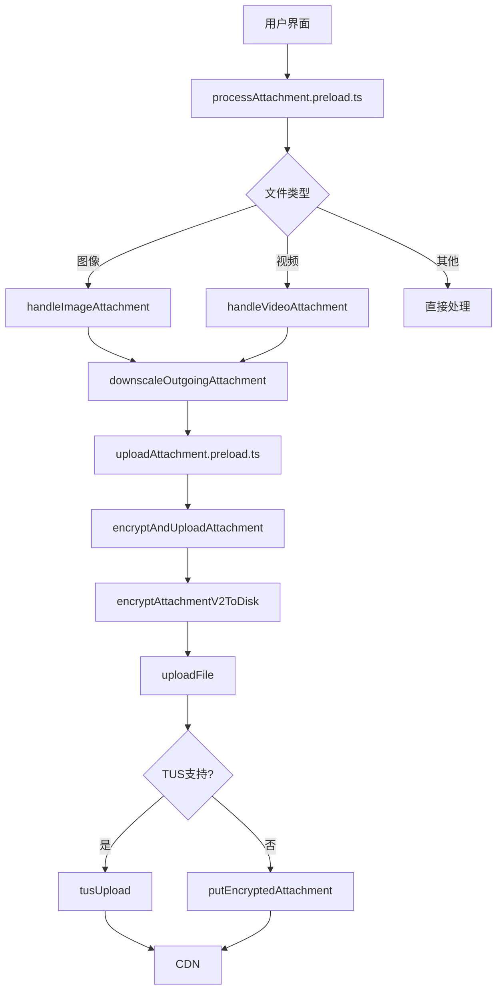
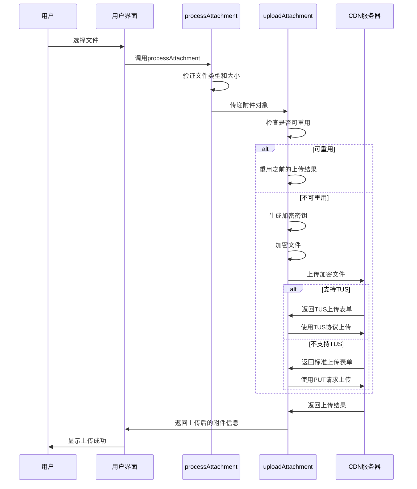
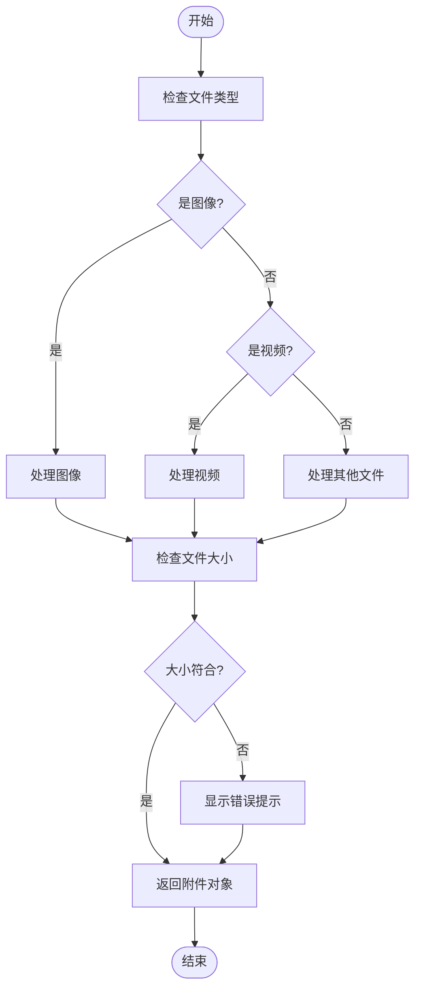
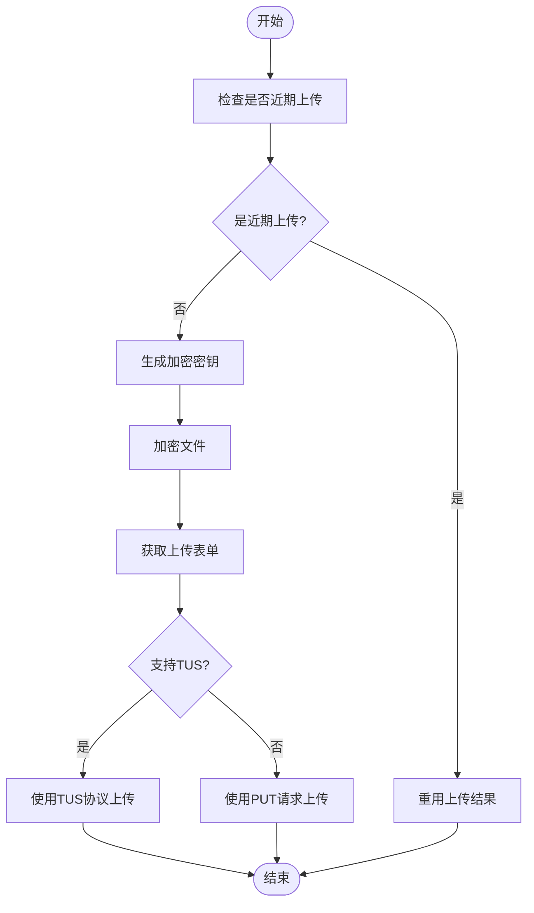
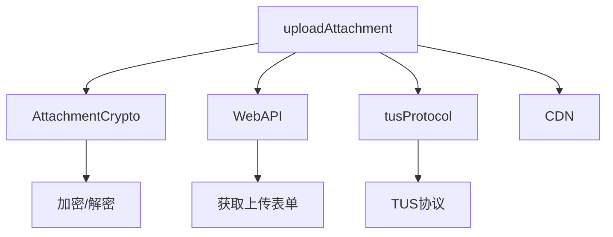

# 文件上传机制

<cite>
**本文档引用的文件**  
- [attachments.preload.ts](file://ts/util/attachments.preload.ts)
- [processAttachment.preload.ts](file://ts/util/processAttachment.preload.ts)
- [uploadAttachment.preload.ts](file://ts/util/uploadAttachment.preload.ts)
- [tusProtocol.node.ts](file://ts/util/uploads/tusProtocol.node.ts)
- [AttachmentCrypto.node.ts](file://ts/AttachmentCrypto.node.js)
- [WebAPI.preload.ts](file://ts/textsecure/WebAPI.preload.js)
- [Attachment.std.ts](file://ts/types/Attachment.std.ts)
- [AttachmentDownloadManager.preload.ts](file://ts/jobs/AttachmentDownloadManager.preload.ts)
</cite>

## 目录
1. [简介](#简介)
2. [项目结构](#项目结构)
3. [核心组件](#核心组件)
4. [架构概述](#架构概述)
5. [详细组件分析](#详细组件分析)
6. [依赖分析](#依赖分析)
7. [性能考虑](#性能考虑)
8. [故障排除指南](#故障排除指南)
9. [结论](#结论)

## 简介
Signal-Desktop的文件上传机制是一个安全、高效且具备容错能力的系统，专为保护用户隐私而设计。该机制涵盖了从用户选择文件到服务器确认的完整流程，包括附件元数据处理、文件预处理（加密和格式验证）以及网络传输逻辑。本文档深入解析了`attachments.preload.ts`、`processAttachment.preload.ts`和`uploadAttachment.preload.ts`三个核心文件，详细说明了上传接口的参数配置、进度报告和错误处理机制。同时，文档还提供了文件上传状态机图，展示了完整的上传流程，并针对大文件上传超时、网络中断恢复和存储空间不足等常见问题提供了相应的解决方案。

## 项目结构
Signal-Desktop的文件上传相关代码主要分布在`ts/util/`和`ts/textsecure/`目录下。核心上传逻辑位于`ts/util/`目录中的`attachments.preload.ts`、`processAttachment.preload.ts`和`uploadAttachment.preload.ts`文件中。加密和解密功能由`ts/AttachmentCrypto.node.ts`提供，而与服务器通信的API则定义在`ts/textsecure/WebAPI.preload.ts`中。上传协议的具体实现，如TUS协议，位于`ts/util/uploads/`目录下。

**图示来源**  
- [processAttachment.preload.ts](file://ts/util/processAttachment.preload.ts)
- [uploadAttachment.preload.ts](file://ts/util/uploadAttachment.preload.ts)
- [tusProtocol.node.ts](file://ts/util/uploads/tusProtocol.node.ts)

**本节来源**  
- [ts/util/processAttachment.preload.ts](file://ts/util/processAttachment.preload.ts)
- [ts/util/uploadAttachment.preload.ts](file://ts/util/uploadAttachment.preload.ts)
- [ts/util/uploads/tusProtocol.node.ts](file://ts/util/uploads/tusProtocol.node.ts)

## 核心组件
文件上传机制的核心组件包括附件元数据处理、文件预处理和网络传输逻辑。`processAttachment.preload.ts`负责处理用户选择的文件，根据文件类型调用相应的处理函数，并进行大小验证。`uploadAttachment.preload.ts`负责加密文件并上传到服务器，支持重用最近上传的附件以提高效率。`attachments.preload.ts`提供了辅助功能，如缩放图像和复制CDN字段。

**本节来源**  
- [processAttachment.preload.ts](file://ts/util/processAttachment.preload.ts#L32-L106)
- [uploadAttachment.preload.ts](file://ts/util/uploadAttachment.preload.ts#L39-L200)
- [attachments.preload.ts](file://ts/util/attachments.preload.ts#L24-L79)

## 架构概述
Signal-Desktop的文件上传架构采用分层设计，确保了安全性和可靠性。首先，用户选择文件后，系统会根据文件类型进行预处理，包括生成缩略图和验证文件大小。然后，文件被加密并上传到CDN。上传过程中，系统会检查文件是否已在近期上传过，如果是，则直接重用之前的上传结果，避免重复上传。对于大文件或网络不稳定的情况，系统支持TUS协议，实现断点续传。

**图示来源**  
- [processAttachment.preload.ts](file://ts/util/processAttachment.preload.ts#L32-L106)
- [uploadAttachment.preload.ts](file://ts/util/uploadAttachment.preload.ts#L39-L200)
- [WebAPI.preload.ts](file://ts/textsecure/WebAPI.preload.js#L3946-L3992)

## 详细组件分析

### 附件元数据处理
`attachments.preload.ts`文件中的`downscaleOutgoingAttachment`函数负责处理附件的元数据。该函数会检查附件是否可以被转码，如果可以，则将其缩放到高质量级别，去除EXIF数据，并保存。此过程确保了发送的图像已经过优化，同时避免了数据丢失的风险。

**本节来源**  
- [attachments.preload.ts](file://ts/util/attachments.preload.ts#L24-L79)

### 文件预处理
`processAttachment.preload.ts`文件中的`processAttachment`函数负责文件的预处理。该函数首先根据文件类型调用相应的处理函数，如`handleImageAttachment`或`handleVideoAttachment`。然后，它会检查附件的大小是否符合要求，如果不符合，则会显示错误提示。

**图示来源**  
- [processAttachment.preload.ts](file://ts/util/processAttachment.preload.ts#L32-L106)

**本节来源**  
- [processAttachment.preload.ts](file://ts/util/processAttachment.preload.ts#L32-L106)

### 网络传输逻辑
`uploadAttachment.preload.ts`文件中的`uploadAttachment`函数负责网络传输逻辑。该函数首先检查附件是否已在近期上传过，如果是，则直接重用之前的上传结果。否则，生成新的加密密钥，加密文件，并上传到CDN。上传过程中，系统会根据CDN的支持情况选择使用TUS协议或标准PUT请求。

**图示来源**  
- [uploadAttachment.preload.ts](file://ts/util/uploadAttachment.preload.ts#L39-L200)
- [tusProtocol.node.ts](file://ts/util/uploads/tusProtocol.node.ts#L282-L411)

**本节来源**  
- [uploadAttachment.preload.ts](file://ts/util/uploadAttachment.preload.ts#L39-L200)

## 依赖分析
文件上传机制依赖于多个模块和外部服务。`AttachmentCrypto.node.ts`提供了加密和解密功能，`WebAPI.preload.ts`定义了与服务器通信的API，`tusProtocol.node.ts`实现了TUS协议。此外，系统还依赖于CDN服务来存储上传的文件。

**图示来源**  
- [uploadAttachment.preload.ts](file://ts/util/uploadAttachment.preload.ts#L118-L164)
- [AttachmentCrypto.node.ts](file://ts/AttachmentCrypto.node.js)
- [WebAPI.preload.ts](file://ts/textsecure/WebAPI.preload.js)

**本节来源**  
- [uploadAttachment.preload.ts](file://ts/util/uploadAttachment.preload.ts#L118-L164)
- [AttachmentCrypto.node.ts](file://ts/AttachmentCrypto.node.js)
- [WebAPI.preload.ts](file://ts/textsecure/WebAPI.preload.js)

## 性能考虑
为了提高上传效率，Signal-Desktop实现了多项性能优化措施。首先，系统会检查附件是否已在近期上传过，如果是，则直接重用之前的上传结果，避免重复上传。其次，对于大文件，系统支持TUS协议，实现断点续传，减少因网络中断导致的重复上传。此外，图像在上传前会被缩放到合适的尺寸，减少传输时间和存储空间。

## 故障排除指南
### 大文件上传超时
对于大文件上传超时的问题，Signal-Desktop通过支持TUS协议来解决。TUS协议允许断点续传，即使上传过程中断，也可以从中断处继续上传，而不需要重新开始。

**本节来源**  
- [tusProtocol.node.ts](file://ts/util/uploads/tusProtocol.node.ts#L344-L411)

### 网络中断恢复
网络中断恢复同样依赖于TUS协议。当网络中断时，上传会暂停，待网络恢复后，系统会自动从中断处继续上传。

**本节来源**  
- [tusProtocol.node.ts](file://ts/util/uploads/tusProtocol.node.ts#L344-L411)

### 存储空间不足
对于存储空间不足的问题，系统会在上传前检查磁盘空间。如果磁盘空间不足，会提示用户清理空间或选择其他存储位置。

**本节来源**  
- [AttachmentDownloadManager.preload.ts](file://ts/jobs/AttachmentDownloadManager.preload.ts#L387-L429)

## 结论
Signal-Desktop的文件上传机制是一个高度安全、可靠且高效的系统。通过分层设计和多种优化措施，系统能够有效处理各种上传场景，包括大文件上传和网络不稳定的情况。未来，可以进一步优化上传速度和用户体验，例如通过并行上传多个文件片段来提高上传效率。