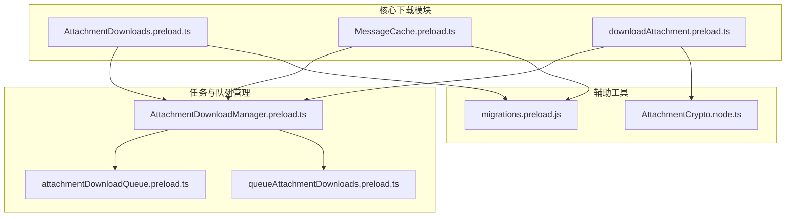
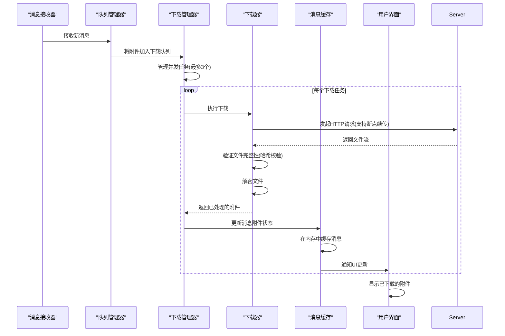
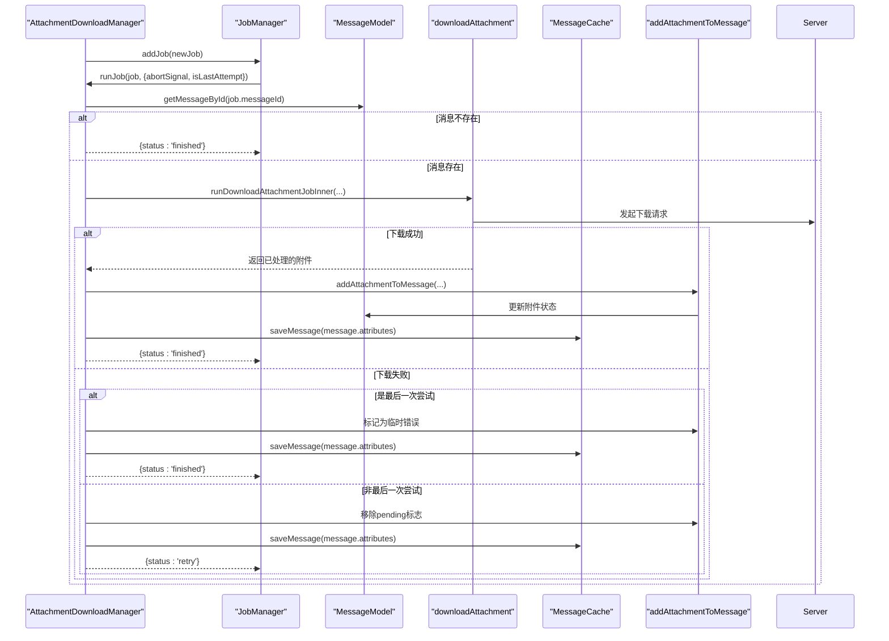
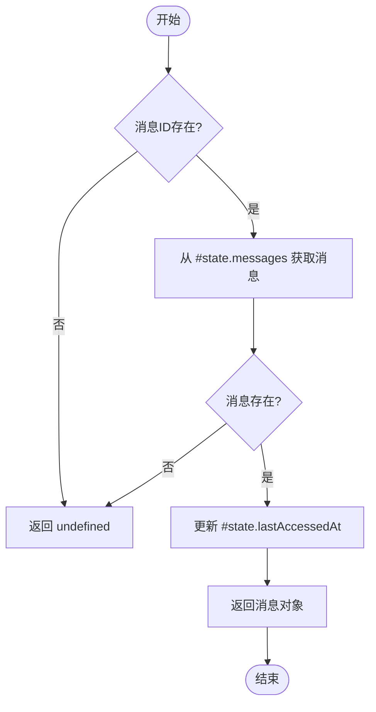
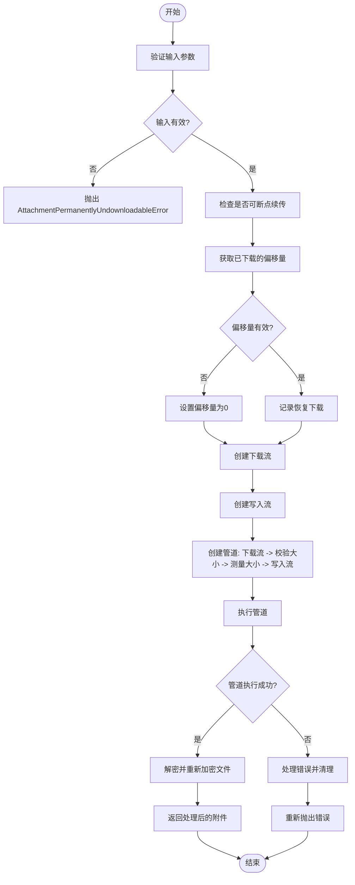
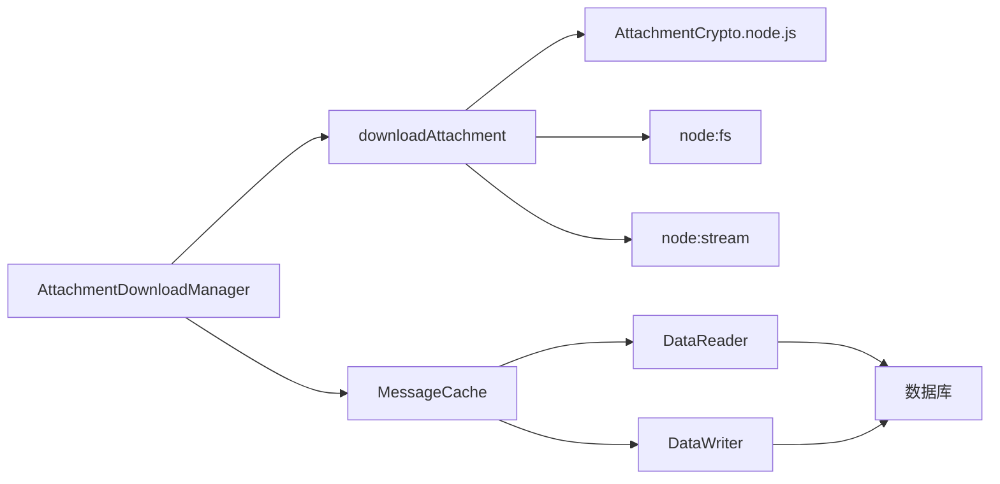

# 文件下载管理

<cite>
**本文档中引用的文件**  
- [AttachmentDownloads.preload.ts](file://ts/messageModifiers/AttachmentDownloads.preload.ts)
- [MessageCache.preload.ts](file://ts/services/MessageCache.preload.ts)
- [downloadAttachment.preload.ts](file://ts/textsecure/downloadAttachment.preload.ts)
- [AttachmentDownloadManager.preload.ts](file://ts/jobs/AttachmentDownloadManager.preload.ts)
- [attachmentDownloadQueue.preload.ts](file://ts/util/attachmentDownloadQueue.preload.ts)
- [queueAttachmentDownloads.preload.ts](file://ts/util/queueAttachmentDownloads.preload.ts)
</cite>

## 目录
1. [简介](#简介)
2. [项目结构](#项目结构)
3. [核心组件](#核心组件)
4. [架构概述](#架构概述)
5. [详细组件分析](#详细组件分析)
6. [依赖分析](#依赖分析)
7. [性能考虑](#性能考虑)
8. [故障排除指南](#故障排除指南)
9. [结论](#结论)

## 简介
本文档深入探讨Signal-Desktop应用程序中的文件下载管理系统。该系统负责处理消息中附件的下载、缓存和管理，确保用户能够可靠地访问图像、视频、音频和其他文件类型。文档重点分析了三个核心模块：`AttachmentDownloads.preload.ts`中的下载任务队列管理、`MessageCache.preload.ts`中的缓存策略以及`downloadAttachment.preload.ts`中的实际下载逻辑。此外，文档还涵盖了下载接口的并发控制、断点续传和错误恢复机制，为初学者提供下载流程的概述，同时为经验丰富的开发者提供缓存管理和性能优化的技术细节。

## 项目结构
Signal-Desktop的文件下载功能分布在多个目录和文件中，主要集中在`ts`目录下。核心逻辑位于`ts/messageModifiers`、`ts/services`和`ts/textsecure`子目录中。`ts/jobs`目录包含下载任务的调度和管理器，而`ts/util`目录则包含各种辅助工具和队列管理功能。这种模块化的设计使得下载系统易于维护和扩展。



**图表来源**  
- [AttachmentDownloads.preload.ts](file://ts/messageModifiers/AttachmentDownloads.preload.ts)
- [MessageCache.preload.ts](file://ts/services/MessageCache.preload.ts)
- [downloadAttachment.preload.ts](file://ts/textsecure/downloadAttachment.preload.ts)
- [AttachmentDownloadManager.preload.ts](file://ts/jobs/AttachmentDownloadManager.preload.ts)
- [attachmentDownloadQueue.preload.ts](file://ts/util/attachmentDownloadQueue.preload.ts)
- [queueAttachmentDownloads.preload.ts](file://ts/util/queueAttachmentDownloads.preload.ts)

**章节来源**  
- [AttachmentDownloads.preload.ts](file://ts/messageModifiers/AttachmentDownloads.preload.ts)
- [MessageCache.preload.ts](file://ts/services/MessageCache.preload.ts)
- [downloadAttachment.preload.ts](file://ts/textsecure/downloadAttachment.preload.ts)
- [AttachmentDownloadManager.preload.ts](file://ts/jobs/AttachmentDownloadManager.preload.ts)

## 核心组件
Signal-Desktop的文件下载系统由三个核心组件构成：`AttachmentDownloadManager`负责管理下载任务的队列和执行，`MessageCache`负责在内存中高效地缓存消息和附件，`downloadAttachment`工具负责执行实际的文件下载和解密操作。这些组件协同工作，确保附件能够高效、可靠地下载和呈现给用户。

**章节来源**  
- [AttachmentDownloadManager.preload.ts](file://ts/jobs/AttachmentDownloadManager.preload.ts#L1-L1043)
- [MessageCache.preload.ts](file://ts/services/MessageCache.preload.ts#L1-L351)
- [downloadAttachment.preload.ts](file://ts/textsecure/downloadAttachment.preload.ts#L1-L454)

## 架构概述
Signal-Desktop的文件下载架构是一个分层系统，从消息接收开始，经过任务队列、并发下载，最终到文件缓存和呈现。该架构设计旨在优化性能、可靠性和用户体验。



**图表来源**  
- [AttachmentDownloadManager.preload.ts](file://ts/jobs/AttachmentDownloadManager.preload.ts#L1-L1043)
- [downloadAttachment.preload.ts](file://ts/textsecure/downloadAttachment.preload.ts#L1-L454)
- [MessageCache.preload.ts](file://ts/services/MessageCache.preload.ts#L1-L351)

## 详细组件分析
本节将深入分析文件下载系统中的各个关键组件，包括下载任务队列管理、缓存策略和实际下载逻辑。

### 下载任务队列管理分析
`AttachmentDownloadManager`是整个下载系统的核心调度器。它基于一个通用的`JobManager`实现，负责管理一个优先级队列，确保下载任务能够有序、高效地执行。

#### 下载任务管理器类图
```mermaid
classDiagram
class AttachmentDownloadManager {
+static instance : AttachmentDownloadManager
+static start() : Promise~void~
+static stop() : Promise~void~
+static addJob(newJob : NewAttachmentDownloadJobType) : Promise~AttachmentType~
#visibleTimelineMessages : Set~string~
#saveJobsBatcher : Batcher~AttachmentDownloadJobType~
#onLowDiskSpaceBackupImport : (bytesNeeded : number) => Promise~void~
#getMessageQueueTime : () => number
#hasMediaBackups : () => boolean
#statfs : typeof statfs
#minimumFreeDiskSpace : number
#attachmentBackfill : AttachmentBackfill
+updateVisibleTimelineMessages(messageIds : string[]) : void
#getFreeDiskSpace() : Promise~number~
#checkFreeDiskSpaceForBackupImport() : Promise~{outOfSpace : boolean}~
+constructor(params : AttachmentDownloadManagerParamsType)
+addJob(newJobData : NewAttachmentDownloadJobType) : Promise~AttachmentType~
}
class JobManager {
<<abstract>>
+logPrefix : string
+constructor(params : JobManagerParamsType)
+start() : Promise~void~
+stop() : Promise~void~
+waitForIdle() : Promise~void~
+cancelJobs(reason : JobCancelReason, predicate : (job) => boolean) : Promise~void~
#_addJob(job : JobType, options : {forceStart? : boolean}) : Promise~void~
}
AttachmentDownloadManager --|> JobManager : 继承
```

**图表来源**  
- [AttachmentDownloadManager.preload.ts](file://ts/jobs/AttachmentDownloadManager.preload.ts#L1-L1043)

#### 下载任务执行序列图


**图表来源**  
- [AttachmentDownloadManager.preload.ts](file://ts/jobs/AttachmentDownloadManager.preload.ts#L508-L703)
- [downloadAttachment.preload.ts](file://ts/textsecure/downloadAttachment.preload.ts#L123-L454)
- [AttachmentDownloads.preload.ts](file://ts/messageModifiers/AttachmentDownloads.preload.ts#L78-L405)

**章节来源**  
- [AttachmentDownloadManager.preload.ts](file://ts/jobs/AttachmentDownloadManager.preload.ts#L1-L1043)

### 缓存策略分析
`MessageCache`类负责在内存中缓存消息对象，以提高应用程序的性能和响应速度。它使用一个LRU（最近最少使用）缓存策略来管理内存中的消息。

#### 消息缓存类图
```mermaid
classDiagram
class MessageCache {
+static install() : MessageCache
+saveMessage(message : MessageAttributesType | MessageModel, options?) : Promise~string~
+register(message : MessageModel) : MessageModel
+getById(id : string) : MessageModel | undefined
+findBySender(senderIdentifier : string) : MessageModel | undefined
+findBySentAt(sentAt : number, predicate : (model) => boolean) : Promise~MessageModel | undefined~
+unregister(id : string) : void
+deleteExpiredMessages(expiryTime : number) : void
+_updateCaches(message : MessageModel) : undefined
#state : { messages : Map~string, MessageModel~, messageIdsBySender : Map~string, string~, messageIdsBySentAt : Map~number, string[]~, lastAccessedAt : Map~string, number~ }
#addMessageToCache(message : MessageModel) : void
#removeMessage(messageId : string) : void
#updateRedux(attributes : MessageAttributesType) : void
#throttledReduxUpdaters : LRUCache~string, (attributes) => void~
#throttledUpdateRedux(attributes : MessageAttributesType) : void
}
```

**图表来源**  
- [MessageCache.preload.ts](file://ts/services/MessageCache.preload.ts#L1-L351)

#### 缓存操作流程图


**图表来源**  
- [MessageCache.preload.ts](file://ts/services/MessageCache.preload.ts#L84-L94)

**章节来源**  
- [MessageCache.preload.ts](file://ts/services/MessageCache.preload.ts#L1-L351)

### 实际下载逻辑分析
`downloadAttachment`函数是执行实际文件下载和处理的核心逻辑。它负责从服务器获取加密的文件流，进行完整性校验，并将其解密为可使用的文件。

#### 下载附件函数流程图


**图表来源**  
- [downloadAttachment.preload.ts](file://ts/textsecure/downloadAttachment.preload.ts#L123-L454)

**章节来源**  
- [downloadAttachment.preload.ts](file://ts/textsecure/downloadAttachment.preload.ts#L1-L454)

## 依赖分析
文件下载系统依赖于多个内部和外部组件。`AttachmentDownloadManager`依赖于`MessageCache`来获取和更新消息状态，依赖于`downloadAttachment`工具来执行实际的下载操作。`downloadAttachment`又依赖于Node.js的`fs`和`stream`模块进行文件I/O操作，以及`AttachmentCrypto.node.js`进行加密和解密。`MessageCache`依赖于`DataReader`和`DataWriter`与数据库进行交互。



**图表来源**  
- [AttachmentDownloadManager.preload.ts](file://ts/jobs/AttachmentDownloadManager.preload.ts#L1-L1043)
- [downloadAttachment.preload.ts](file://ts/textsecure/downloadAttachment.preload.ts#L1-L454)
- [MessageCache.preload.ts](file://ts/services/MessageCache.preload.ts#L1-L351)

**章节来源**  
- [AttachmentDownloadManager.preload.ts](file://ts/jobs/AttachmentDownloadManager.preload.ts#L1-L1043)
- [downloadAttachment.preload.ts](file://ts/textsecure/downloadAttachment.preload.ts#L1-L454)
- [MessageCache.preload.ts](file://ts/services/MessageCache.preload.ts#L1-L351)

## 性能考虑
Signal-Desktop的文件下载系统在设计上考虑了多种性能因素。`AttachmentDownloadManager`通过限制最大并发下载任务数（默认为3个）来防止系统资源耗尽。`MessageCache`使用LRU缓存策略和节流（throttle）机制来优化内存使用和减少不必要的Redux状态更新。`downloadAttachment`利用Node.js的流（stream）API进行高效的数据传输，避免将整个大文件加载到内存中。此外，系统还实现了断点续传功能，避免在网络不稳定时重复下载已获取的数据。

## 故障排除指南
本节解决文件下载过程中常见的问题及其解决方案。

### 网络不稳定导致的下载失败
当网络连接不稳定时，下载请求可能会失败。系统通过以下机制处理此问题：
1.  **重试机制**：下载任务会根据配置的重试策略（`DEFAULT_RETRY_CONFIG`或`BACKUP_RETRY_CONFIG`）自动重试。对于可能备份到云端的附件，重试次数为无限次。
2.  **断点续传**：`downloadAttachment`函数通过检查`downloadPath`和文件大小来实现断点续传。如果部分文件已下载，它会从上次中断的位置继续下载，而不是从头开始。
3.  **错误分类**：系统区分临时错误（如网络超时）和永久性错误（如文件过大）。临时错误会触发重试，而永久性错误会将附件标记为“永久错误”，不再重试。

**章节来源**  
- [AttachmentDownloadManager.preload.ts](file://ts/jobs/AttachmentDownloadManager.preload.ts#L508-L703)
- [downloadAttachment.preload.ts](file://ts/textsecure/downloadAttachment.preload.ts#L166-L196)

### 存储空间不足
在从备份恢复媒体文件时，系统会主动检查可用磁盘空间。`AttachmentDownloadManager`的`#checkFreeDiskSpaceForBackupImport`方法会查询用户数据目录的可用空间。如果可用空间低于阈值（当前附件最大大小的5倍），系统会暂停媒体下载，并通过Redux动作显示“磁盘空间不足”的模态框，提示用户释放空间。

**章节来源**  
- [AttachmentDownloadManager.preload.ts](file://ts/jobs/AttachmentDownloadManager.preload.ts#L385-L425)

### 文件完整性验证
为了确保下载的文件未被篡改或损坏，系统在下载后执行完整性校验。`downloadAttachment`函数使用`checkSize`转换流来确保下载的文件大小不超过预期大小的105%。更重要的是，它通过`plaintextHash`（明文哈希）或`digest`（密文哈希）来验证文件的完整性。在`decryptAndReencryptLocally`步骤中，会计算下载文件的哈希值并与服务器提供的哈希值进行比对。

**章节来源**  
- [downloadAttachment.preload.ts](file://ts/textsecure/downloadAttachment.preload.ts#L288-L305)
- [AttachmentCrypto.node.js](file://ts/AttachmentCrypto.node.ts)

## 结论
Signal-Desktop的文件下载管理系统是一个设计精良、健壮且高效的系统。它通过`AttachmentDownloadManager`对下载任务进行集中调度和管理，利用`MessageCache`优化内存中的消息访问，并通过`downloadAttachment`安全地执行文件下载和解密。该系统具备并发控制、断点续传、自动重试和完整性校验等关键特性，能够有效应对网络不稳定和存储空间不足等常见问题。其模块化的架构和清晰的职责划分，使得系统易于维护和扩展，为用户提供可靠、流畅的附件体验。