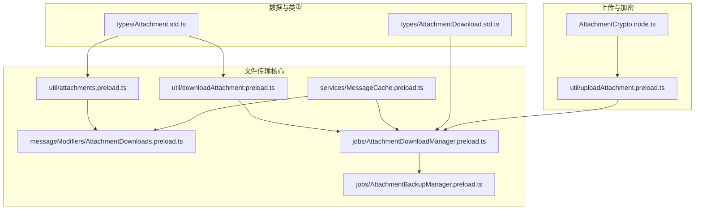
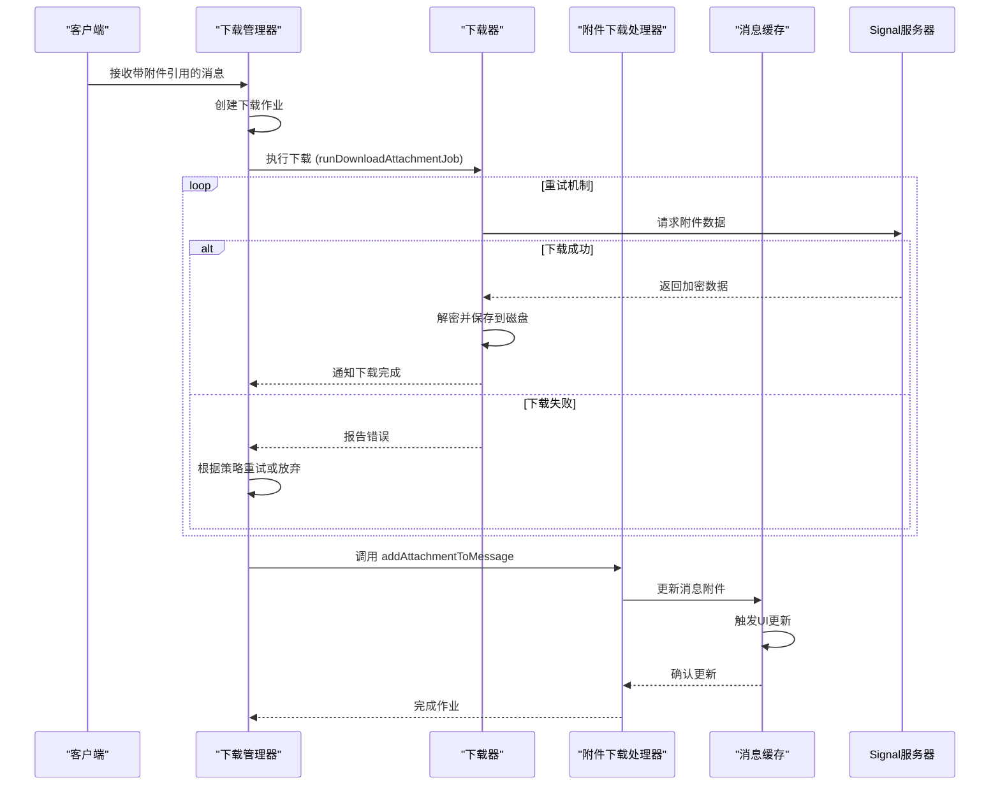
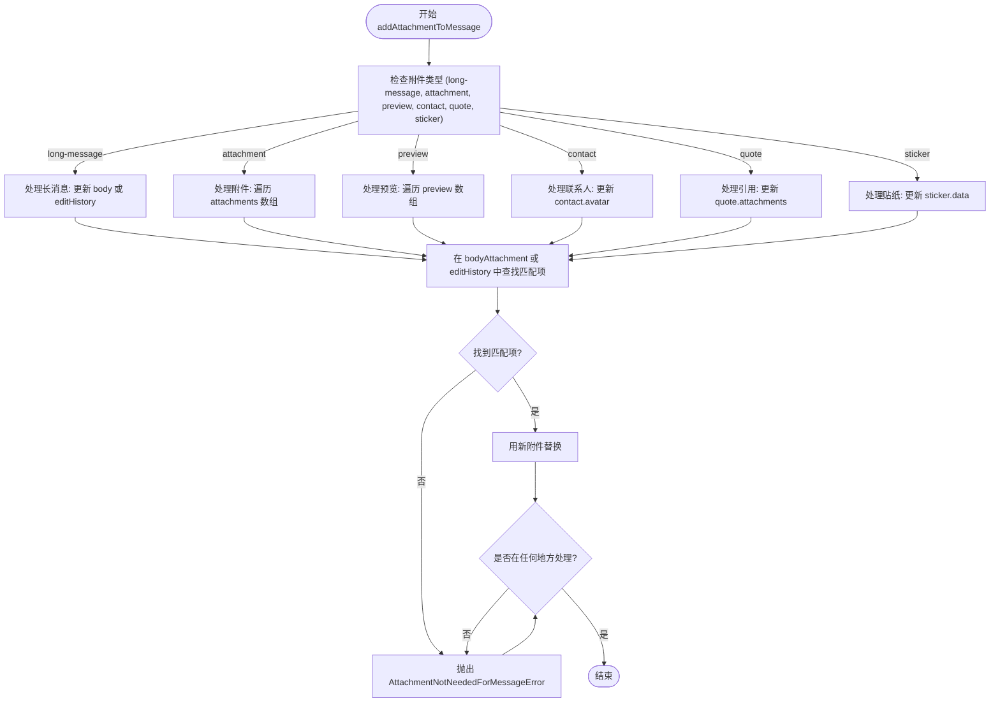
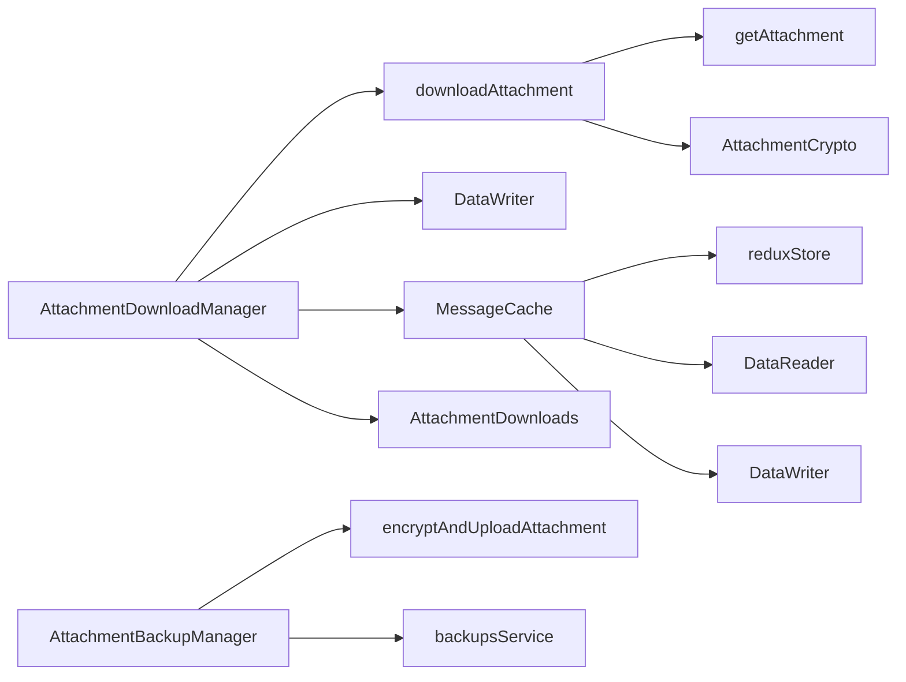

# 文件传输实现

<cite>
**本文档引用的文件**   
- [attachments.preload.ts](file://ts/util/attachments.preload.ts)
- [processAttachment.preload.ts](file://ts/util/attachments.preload.ts)
- [AttachmentDownloads.preload.ts](file://ts/messageModifiers/AttachmentDownloads.preload.ts)
- [MessageCache.preload.ts](file://ts/services/MessageCache.preload.ts)
- [AttachmentDownloadManager.preload.ts](file://ts/jobs/AttachmentDownloadManager.preload.ts)
- [AttachmentBackupManager.preload.ts](file://ts/jobs/AttachmentBackupManager.preload.ts)
- [downloadAttachment.preload.ts](file://ts/util/downloadAttachment.preload.ts)
- [uploadAttachment.preload.ts](file://ts/util/uploadAttachment.preload.ts)
- [Attachment.std.ts](file://ts/util/Attachment.std.ts)
- [AttachmentDownload.std.ts](file://ts/types/AttachmentDownload.std.ts)
</cite>

## 目录
1. [简介](#简介)
2. [项目结构](#项目结构)
3. [核心组件](#核心组件)
4. [架构概述](#架构概述)
5. [详细组件分析](#详细组件分析)
6. [依赖分析](#依赖分析)
7. [性能考虑](#性能考虑)
8. [故障排除指南](#故障排除指南)
9. [结论](#结论)

## 简介
本文档详细阐述了Signal-Desktop应用程序中的文件传输实现机制。文档深入探讨了文件上传、下载、缓存和分块传输的核心技术细节，重点分析了`attachments.preload.ts`中的附件处理逻辑、`processAttachment.preload.ts`中的预处理流程以及`AttachmentDownloads.preload.ts`中的下载管理。同时，文档记录了文件传输接口的参数配置、进度报告和错误恢复机制，并解释了`MessageCache.preload.ts`在附件缓存管理中的关键作用。为解决实际问题，文档提供了文件传输状态转换图，并针对大文件传输超时、网络中断恢复和存储空间不足等常见问题提出了相应的解决方案，旨在为初学者和经验丰富的开发者提供全面的技术参考。

## 项目结构
Signal-Desktop的文件传输功能主要分布在`ts`目录下的多个子模块中。核心逻辑位于`util`、`messageModifiers`和`jobs`目录。`util`目录包含基础的附件处理和下载工具，如`attachments.preload.ts`和`downloadAttachment.preload.ts`。`messageModifiers`目录下的`AttachmentDownloads.preload.ts`负责管理下载完成后的附件与消息的关联。`jobs`目录中的`AttachmentDownloadManager.preload.ts`和`AttachmentBackupManager.preload.ts`是两个核心的作业管理器，分别负责下载和备份任务的调度与执行。此外，`services`目录下的`MessageCache.preload.ts`在消息和附件的内存缓存管理中扮演着重要角色。

**Diagram sources**
- [attachments.preload.ts](file://ts/util/attachments.preload.ts)
- [AttachmentDownloads.preload.ts](file://ts/messageModifiers/AttachmentDownloads.preload.ts)
- [downloadAttachment.preload.ts](file://ts/util/downloadAttachment.preload.ts)
- [AttachmentDownloadManager.preload.ts](file://ts/jobs/AttachmentDownloadManager.preload.ts)
- [AttachmentBackupManager.preload.ts](file://ts/jobs/AttachmentBackupManager.preload.ts)
- [MessageCache.preload.ts](file://ts/services/MessageCache.preload.ts)
- [Attachment.std.ts](file://ts/types/Attachment.std.ts)
- [AttachmentDownload.std.ts](file://ts/types/AttachmentDownload.std.ts)

**Section sources**
- [attachments.preload.ts](file://ts/util/attachments.preload.ts)
- [AttachmentDownloads.preload.ts](file://ts/messageModifiers/AttachmentDownloads.preload.ts)
- [downloadAttachment.preload.ts](file://ts/util/downloadAttachment.preload.ts)
- [AttachmentDownloadManager.preload.ts](file://ts/jobs/AttachmentDownloadManager.preload.ts)
- [AttachmentBackupManager.preload.ts](file://ts/jobs/AttachmentBackupManager.preload.ts)
- [MessageCache.preload.ts](file://ts/services/MessageCache.preload.ts)

## 核心组件
文件传输的核心组件包括附件下载管理器（`AttachmentDownloadManager`）、附件备份管理器（`AttachmentBackupManager`）、附件下载处理器（`AttachmentDownloads`）和消息缓存（`MessageCache`）。`AttachmentDownloadManager`是一个基于作业队列的系统，负责管理所有传入附件的下载任务，它根据优先级和系统状态（如是否在通话中）来调度下载。`AttachmentBackupManager`则负责将已下载的附件安全地备份到云端。`AttachmentDownloads`模块在附件下载完成后，将其与对应的消息进行关联。`MessageCache`作为内存中的消息缓存，极大地提升了附件状态更新和UI渲染的性能。

**Section sources**
- [AttachmentDownloadManager.preload.ts](file://ts/jobs/AttachmentDownloadManager.preload.ts)
- [AttachmentBackupManager.preload.ts](file://ts/jobs/AttachmentBackupManager.preload.ts)
- [AttachmentDownloads.preload.ts](file://ts/messageModifiers/AttachmentDownloads.preload.ts)
- [MessageCache.preload.ts](file://ts/services/MessageCache.preload.ts)

## 架构概述
Signal-Desktop的文件传输架构是一个分层的、基于事件和作业队列的系统。当接收到包含附件引用的消息时，系统会创建一个下载作业并提交给`AttachmentDownloadManager`。该管理器根据预设的策略（如并发数限制、重试机制）执行下载。下载成功后，`AttachmentDownloads`模块会将下载的附件数据与内存中的消息对象关联。整个过程中，`MessageCache`负责维护消息的最新状态，确保UI能实时响应。对于上传，`uploadAttachment.preload.ts`模块负责加密和上传文件，并将元数据附加到消息中。

**Diagram sources**
- [AttachmentDownloadManager.preload.ts](file://ts/jobs/AttachmentDownloadManager.preload.ts)
- [downloadAttachment.preload.ts](file://ts/util/downloadAttachment.preload.ts)
- [AttachmentDownloads.preload.ts](file://ts/messageModifiers/AttachmentDownloads.preload.ts)
- [MessageCache.preload.ts](file://ts/services/MessageCache.preload.ts)

## 详细组件分析

### attachments.preload.ts 中的附件处理逻辑
`attachments.preload.ts`文件主要包含两个核心函数：`downscaleOutgoingAttachment`和`copyCdnFields`。`downscaleOutgoingAttachment`函数在消息发送前被调用，用于对即将发送的图片附件进行进一步的降尺度处理，以优化传输效率和存储空间。该函数会检查附件是否可以被转码（主要是图片），然后使用`scaleImageToLevel`工具将其缩小到“低质量”级别，并将处理后的数据替换原始的`data`字段，同时清除`path`字段以保持数据一致性。`copyCdnFields`函数则用于从已上传的附件元数据中提取关键的CDN（内容分发网络）字段，如`cdnId`、`digest`、`key`等，并将其复制到新的附件对象中，这些字段是后续下载和验证所必需的。

**Section sources**
- [attachments.preload.ts](file://ts/util/attachments.preload.ts)

### processAttachment.preload.ts 中的附件预处理流程
在Signal-Desktop的代码库中，没有名为`processAttachment.preload.ts`的文件。与附件预处理最相关的文件是`attachments.preload.ts`。其预处理流程主要体现在`downscaleOutgoingAttachment`函数中。该流程的触发点是消息发送前，具体步骤如下：1. 检查附件是否为可转码的图片类型；2. 将附件的`data`（内存中的二进制数据）或`path`（磁盘上的文件路径）封装成一个`Blob`或URL，作为缩放操作的输入；3. 调用`scaleImageToLevel`进行降尺度处理；4. 将处理后的`Blob`转换回`ArrayBuffer`，并创建一个新的附件对象，用新的`data`和`size`替换旧值，同时将`path`置为`undefined`，以确保附件数据与存储位置的一致性。

**Section sources**
- [attachments.preload.ts](file://ts/util/attachments.preload.ts)

### AttachmentDownloads.preload.ts 中的下载管理
`AttachmentDownloads.preload.ts`是管理下载完成后附件与消息关联的核心模块。其主要功能由`addAttachmentToMessage`函数实现。该函数接收一个已下载的附件和一个消息ID，然后在消息对象中找到与该附件匹配的占位符，并用实际的附件数据替换它。匹配的依据是附件的`digest`或`plaintextHash`。该函数支持多种附件类型，包括普通附件、长消息文本、预览图、联系人头像、引用消息中的缩略图和贴纸。它会遍历消息的`attachments`、`preview`、`contact`、`quote`等属性，找到匹配项并进行替换。如果在消息的任何位置都找不到匹配的附件，函数会抛出`AttachmentNotNeededForMessageError`错误。此外，该文件还包含`markAttachmentAsCorrupted`函数，用于标记损坏的附件。

**Diagram sources**
- [AttachmentDownloads.preload.ts](file://ts/messageModifiers/AttachmentDownloads.preload.ts)

### 文件传输接口的参数配置、进度报告和错误恢复机制
文件传输接口的参数配置主要体现在`AttachmentDownloadManager`和`downloadAttachment`函数中。`AttachmentDownloadManager`通过`MAX_CONCURRENT_JOBS`（最大并发作业数）和`DEFAULT_RETRY_CONFIG`（默认重试配置）等常量进行配置。重试策略采用指数退避算法，初始重试间隔为30秒，乘数为10，最大退避时间为6小时。对于需要备份的附件，重试次数为无限次，最大退避时间为3天。

进度报告通过`onSizeUpdate`回调函数实现。在`downloadAttachment`函数中，一旦确定了附件的大小，就会立即调用`onSizeUpdate(attachment.size)`，通知上层UI可以显示进度条。由于Signal采用流式加密和下载，精确的实时进度较难获取，因此目前的实现是先报告总大小，让用户知道需要下载的数据量。

错误恢复机制非常完善。`AttachmentDownloadManager`的`runDownloadAttachmentJob`函数捕获所有下载错误，并根据错误类型进行不同的处理：
- **`AttachmentSizeError`**: 附件过大，标记为`wasTooBig`。
- **`AttachmentNotNeededForMessageError`**: 附件与消息不匹配，清理磁盘上的临时文件。
- **`isIncrementalMacVerificationError`**: 增量MAC验证失败，移除`incrementalMac`字段后重试（放弃流式播放）。
- **`AttachmentPermanentlyUndownloadableError`**: 附件永久无法下载，标记为`permanentlyErrored`。
- **HTTP 404/403错误**: 如果附件可能仍在备份层，则等待；否则标记为永久无法下载。
- **其他错误**: 记录日志，如果不是最后一次尝试，则按重试策略进行重试。

**Section sources**
- [AttachmentDownloadManager.preload.ts](file://ts/jobs/AttachmentDownloadManager.preload.ts)
- [downloadAttachment.preload.ts](file://ts/util/downloadAttachment.preload.ts)

### MessageCache.preload.ts 在附件缓存管理中的作用
`MessageCache.preload.ts`是Signal-Desktop性能优化的关键。它是一个基于`LRUCache`的内存缓存，用于存储最近访问过的`MessageModel`对象。其在附件管理中的作用至关重要：
1.  **状态同步**: 当附件下载完成并更新到消息对象后，`AttachmentDownloads`模块会调用`MessageCache`的`_updateCaches`方法。该方法会更新缓存中消息的`attachments`属性，并触发Redux状态更新，从而高效地刷新UI。
2.  **性能提升**: 通过将消息对象保留在内存中，避免了频繁地从数据库读取和解析消息，极大地提升了附件状态变化（如下载中、下载完成、下载失败）时的UI响应速度。
3.  **内存管理**: `MessageCache`实现了`deleteExpiredMessages`方法，会定期清理长时间未访问且不在当前活动会话中的消息，防止内存泄漏。
4.  **唯一性保证**: `register`方法确保了每个消息ID在缓存中只存在一个`MessageModel`实例，避免了状态不一致的问题。

**Section sources**
- [MessageCache.preload.ts](file://ts/services/MessageCache.preload.ts)

## 依赖分析
文件传输功能依赖于多个内部和外部模块。核心依赖关系如下：
- `AttachmentDownloadManager` 依赖于 `downloadAttachment` 进行实际下载，依赖于 `DataWriter` 进行作业的持久化存储，依赖于 `MessageCache` 和 `AttachmentDownloads` 来更新消息状态。
- `downloadAttachment` 依赖于 `textsecure/WebAPI.preload.js` 中的 `getAttachment` 函数与Signal服务器通信，依赖于 `AttachmentCrypto.node.js` 进行解密。
- `AttachmentBackupManager` 依赖于 `encryptAndUploadAttachment` 进行加密上传，依赖于 `backupsService` 处理备份相关的凭证和元数据。
- `MessageCache` 依赖于 `reduxStore` 来触发UI更新，依赖于 `DataReader` 和 `DataWriter` 进行数据库操作。

**Diagram sources**
- [AttachmentDownloadManager.preload.ts](file://ts/jobs/AttachmentDownloadManager.preload.ts)
- [downloadAttachment.preload.ts](file://ts/util/downloadAttachment.preload.ts)
- [AttachmentBackupManager.preload.ts](file://ts/jobs/AttachmentBackupManager.preload.ts)
- [MessageCache.preload.ts](file://ts/services/MessageCache.preload.ts)

## 性能考虑
Signal-Desktop在文件传输方面进行了多项性能优化：
1.  **并发控制**: `AttachmentDownloadManager`将最大并发下载数限制为3，避免过多的网络请求影响应用性能和用户体验。
2.  **内存缓存**: `MessageCache`显著减少了数据库I/O，使附件状态更新近乎实时。
3.  **批处理**: `AttachmentDownloadManager`使用`createBatcher`对作业的保存操作进行批处理，减少了对数据库的频繁写入。
4.  **流式处理**: 上传和下载都支持流式处理（通过`PassThrough`流），允许在数据传输的同时进行加密/解密，而无需将整个文件加载到内存中，这对于大文件至关重要。
5.  **Throttling**: 对于频繁的状态更新（如Redux更新），使用了`throttle`函数进行节流，防止UI过度渲染。

## 故障排除指南

### 大文件传输超时
**问题**: 上传或下载大文件时，连接超时。
**解决方案**: 
- **上传**: Signal使用TUS协议（支持断点续传）上传到CDN 3。如果上传中断，TUS客户端会自动尝试从断点继续。
- **下载**: 下载作业有完善的重试机制。如果网络不稳定，系统会按指数退避策略自动重试。用户也可以手动重新下载。

### 网络中断恢复
**问题**: 在传输过程中网络连接中断。
**解决方案**: 
- **上传**: 如上所述，TUS协议原生支持断点续传。
- **下载**: `AttachmentDownloadManager`的作业系统会捕获网络错误，并在后台自动重试。作业的状态（如已尝试次数）被持久化在数据库中，即使应用重启，未完成的下载任务也会被恢复并继续。

### 存储空间不足
**问题**: 下载或备份附件时，本地磁盘空间不足。
**解决方案**: 
- **备份导入**: `AttachmentDownloadManager`在开始备份导入作业前，会调用`#checkFreeDiskSpaceForBackupImport`检查磁盘空间。如果空间不足，会暂停备份下载，并通过`showLowDiskSpaceBackupImportModal`向用户显示低磁盘空间警告模态框，提示用户清理空间。

## 结论
Signal-Desktop的文件传输实现是一个设计精良、健壮且高效的系统。它通过`AttachmentDownloadManager`和`AttachmentBackupManager`这两个作业管理器，实现了对下载和备份任务的精细化控制。`MessageCache`的引入极大地提升了用户体验。系统具备完善的错误处理和恢复机制，能够应对网络不稳定、存储空间不足等各种现实问题。分块传输（通过增量MAC）和流式处理确保了大文件传输的可行性。整体架构清晰，模块职责分明，为安全、可靠的文件传输提供了坚实的基础。