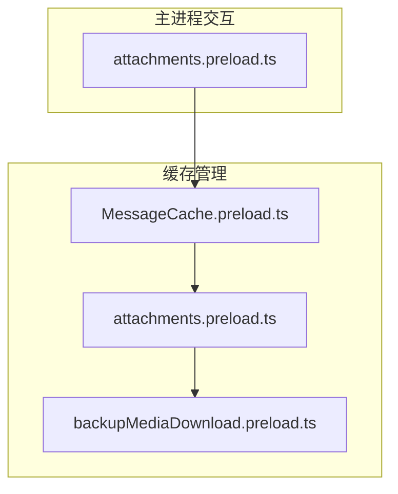
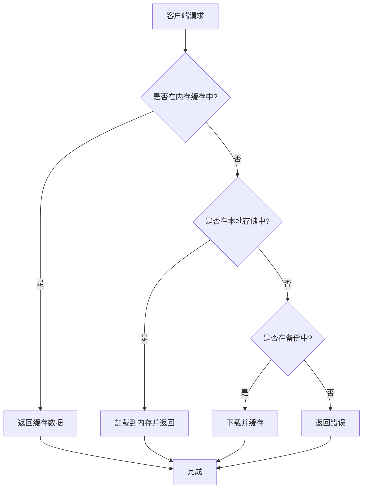
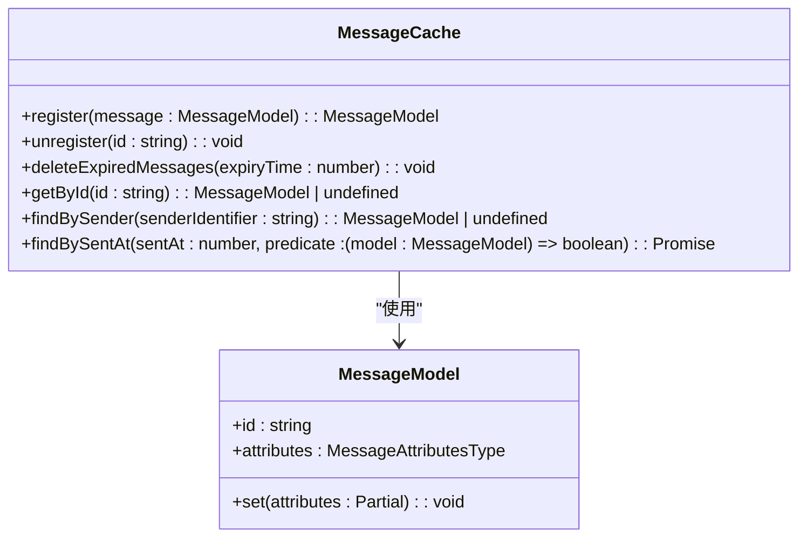
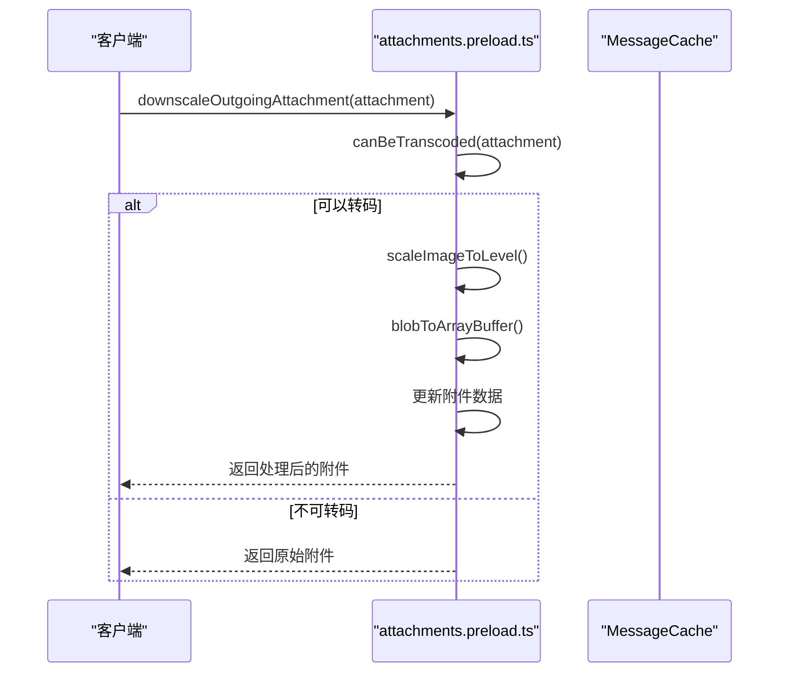
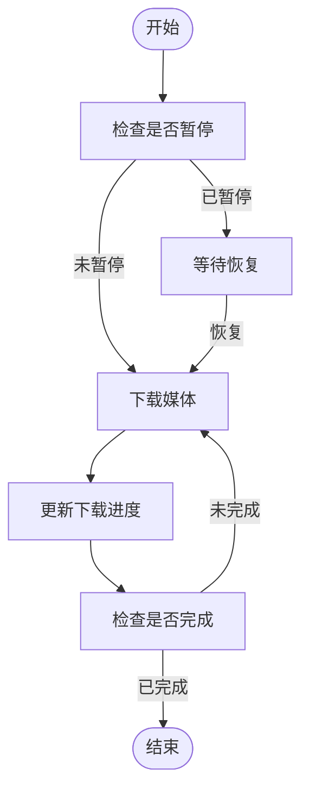
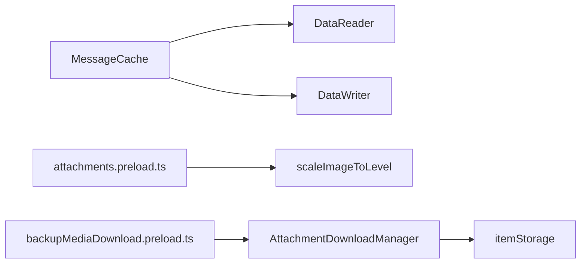

# 附件缓存管理

<cite>
**本文档引用的文件**  
- [MessageCache.preload.ts](file://ts/services/MessageCache.preload.ts)
- [attachments.preload.ts](file://ts/util/attachments.preload.ts)
- [backupMediaDownload.preload.ts](file://ts/util/backupMediaDownload.preload.ts)
- [attachments.preload.ts](file://ts/windows/main/attachments.preload.ts)
- [messageStateCleanup.preload.ts](file://ts/services/messageStateCleanup.preload.ts)
- [AttachmentDownloadManager.preload.ts](file://ts/jobs/AttachmentDownloadManager.preload.ts)
</cite>

## 目录
1. [简介](#简介)
2. [项目结构](#项目结构)
3. [核心组件](#核心组件)
4. [架构概述](#架构概述)
5. [详细组件分析](#详细组件分析)
6. [依赖分析](#依赖分析)
7. [性能考虑](#性能考虑)
8. [故障排除指南](#故障排除指南)
9. [结论](#结论)

## 简介
Signal-Desktop 的附件缓存管理系统旨在高效管理消息附件的存储、访问和生命周期。该系统通过内存缓存、本地文件存储和备份媒体下载机制，确保附件在需要时快速可用，同时优化存储空间和性能。本文件详细解释了 `MessageCache.preload.ts` 中的缓存存储结构、淘汰策略和内存管理机制，以及如何与 `attachments.preload.ts` 和 `backupMediaDownload.preload.ts` 协同工作。

## 项目结构
Signal-Desktop 的附件缓存管理功能分布在多个模块中，主要涉及以下目录：
- `ts/services/`: 包含 `MessageCache.preload.ts`，负责消息和附件的内存缓存管理。
- `ts/util/`: 包含 `attachments.preload.ts` 和 `backupMediaDownload.preload.ts`，分别处理附件的识别和本地备份媒体的缓存。
- `ts/windows/main/`: 包含与主进程交互的附件处理逻辑。

**Diagram sources**
- [MessageCache.preload.ts](file://ts/services/MessageCache.preload.ts)
- [attachments.preload.ts](file://ts/util/attachments.preload.ts)
- [backupMediaDownload.preload.ts](file://ts/util/backupMediaDownload.preload.ts)
- [attachments.preload.ts](file://ts/windows/main/attachments.preload.ts)

**Section sources**
- [MessageCache.preload.ts](file://ts/services/MessageCache.preload.ts)
- [attachments.preload.ts](file://ts/util/attachments.preload.ts)
- [backupMediaDownload.preload.ts](file://ts/util/backupMediaDownload.preload.ts)

## 核心组件
附件缓存管理的核心组件包括 `MessageCache` 类，它使用 `Map` 和 `LRUCache` 来存储消息和附件数据。`MessageCache` 负责注册、查找和注销消息，同时维护消息的最后访问时间以实现缓存淘汰策略。

**Section sources**
- [MessageCache.preload.ts](file://ts/services/MessageCache.preload.ts)

## 架构概述
Signal-Desktop 的附件缓存管理架构分为三层：内存缓存、本地存储和备份下载。内存缓存由 `MessageCache` 管理，本地存储由 `attachments.preload.ts` 处理，备份下载由 `backupMediaDownload.preload.ts` 控制。

**Diagram sources**
- [MessageCache.preload.ts](file://ts/services/MessageCache.preload.ts)
- [attachments.preload.ts](file://ts/util/attachments.preload.ts)
- [backupMediaDownload.preload.ts](file://ts/util/backupMediaDownload.preload.ts)

## 详细组件分析

### MessageCache 分析
`MessageCache` 类通过 `register` 和 `unregister` 方法管理消息的生命周期。它使用 `Map` 存储消息，并通过 `lastAccessedAt` 记录每条消息的最后访问时间，以便在 `deleteExpiredMessages` 方法中根据过期时间删除未访问的消息。

**Diagram sources**
- [MessageCache.preload.ts](file://ts/services/MessageCache.preload.ts)
- [models/messages.preload.js](file://ts/models/messages.preload.js)

**Section sources**
- [MessageCache.preload.ts](file://ts/services/MessageCache.preload.ts)

### attachments.preload.ts 分析
`attachments.preload.ts` 提供了 `downscaleOutgoingAttachment` 函数，用于在发送前对附件进行降尺度处理。该函数检查附件是否可以转码，然后根据需要调整图像质量并更新附件数据。

**Diagram sources**
- [attachments.preload.ts](file://ts/util/attachments.preload.ts)
- [MessageCache.preload.ts](file://ts/services/MessageCache.preload.ts)

**Section sources**
- [attachments.preload.ts](file://ts/util/attachments.preload.ts)

### backupMediaDownload.preload.ts 分析
`backupMediaDownload.preload.ts` 提供了启动、暂停、恢复和取消备份媒体下载的功能。它通过 `AttachmentDownloadManager` 管理下载任务，并使用 `itemStorage` 存储下载状态。

**Diagram sources**
- [backupMediaDownload.preload.ts](file://ts/util/backupMediaDownload.preload.ts)
- [AttachmentDownloadManager.preload.ts](file://ts/jobs/AttachmentDownloadManager.preload.ts)

**Section sources**
- [backupMediaDownload.preload.ts](file://ts/util/backupMediaDownload.preload.ts)

## 依赖分析
附件缓存管理系统的依赖关系如下图所示，`MessageCache` 依赖于 `DataReader` 和 `DataWriter` 进行数据持久化，`attachments.preload.ts` 依赖于 `scaleImageToLevel` 进行图像处理，`backupMediaDownload.preload.ts` 依赖于 `AttachmentDownloadManager` 进行下载管理。

**Diagram sources**
- [MessageCache.preload.ts](file://ts/services/MessageCache.preload.ts)
- [attachments.preload.ts](file://ts/util/attachments.preload.ts)
- [backupMediaDownload.preload.ts](file://ts/util/backupMediaDownload.preload.ts)
- [AttachmentDownloadManager.preload.ts](file://ts/jobs/AttachmentDownloadManager.preload.ts)

**Section sources**
- [MessageCache.preload.ts](file://ts/services/MessageCache.preload.ts)
- [attachments.preload.ts](file://ts/util/attachments.preload.ts)
- [backupMediaDownload.preload.ts](file://ts/util/backupMediaDownload.preload.ts)

## 性能考虑
为了优化性能，`MessageCache` 使用 `throttle` 函数限制 Redux 更新频率，避免频繁的 UI 更新。此外，`AttachmentDownloadManager` 使用批处理机制保存下载任务，减少磁盘 I/O 操作。

## 故障排除指南
常见问题包括缓存占用过多存储空间、缓存一致性维护和缓存数据损坏。解决方案包括定期清理过期缓存、使用事务确保数据一致性，以及在数据损坏时重新下载附件。

**Section sources**
- [MessageCache.preload.ts](file://ts/services/MessageCache.preload.ts)
- [AttachmentDownloadManager.preload.ts](file://ts/jobs/AttachmentDownloadManager.preload.ts)

## 结论
Signal-Desktop 的附件缓存管理系统通过多层次的缓存策略和高效的管理机制，确保了附件的快速访问和存储优化。通过深入理解 `MessageCache.preload.ts`、`attachments.preload.ts` 和 `backupMediaDownload.preload.ts` 的实现，开发者可以更好地优化和维护该系统。