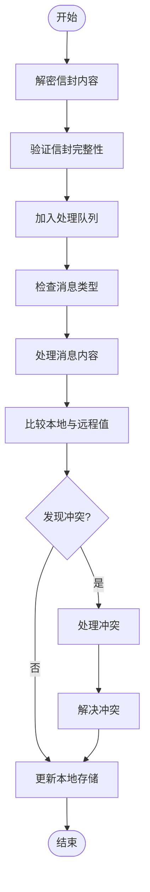
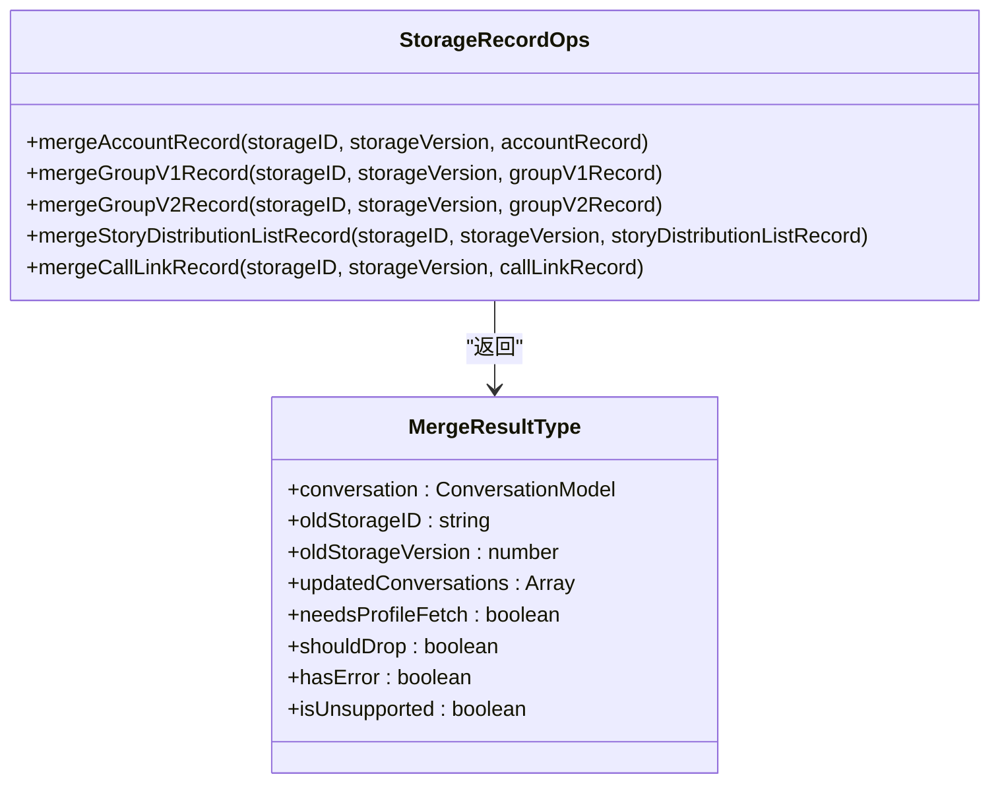
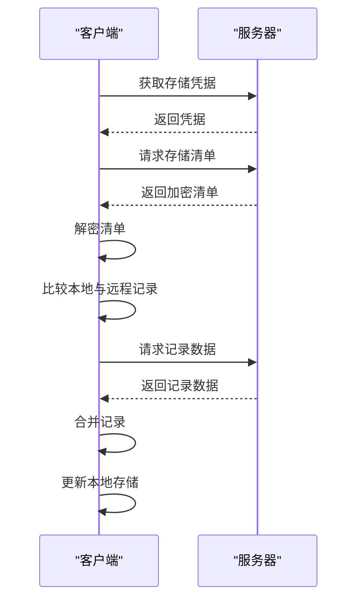
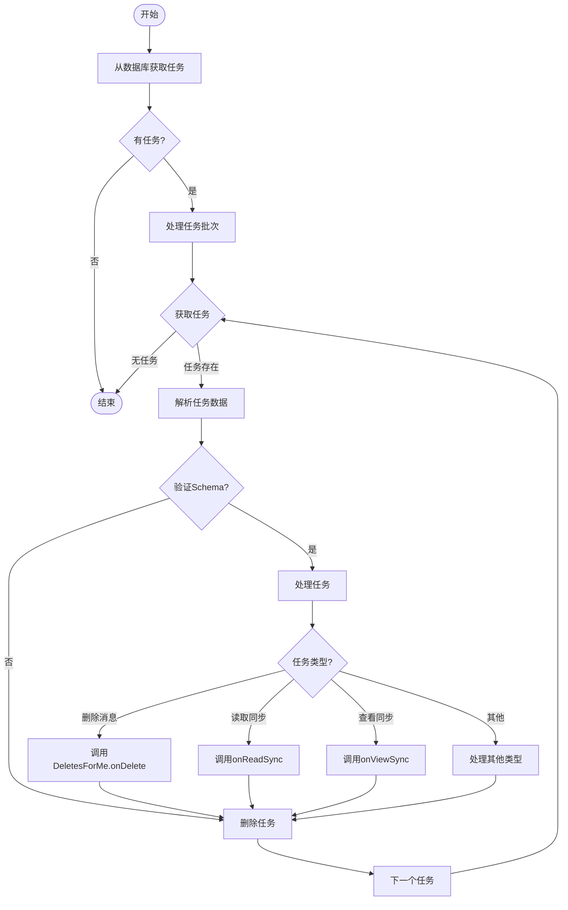
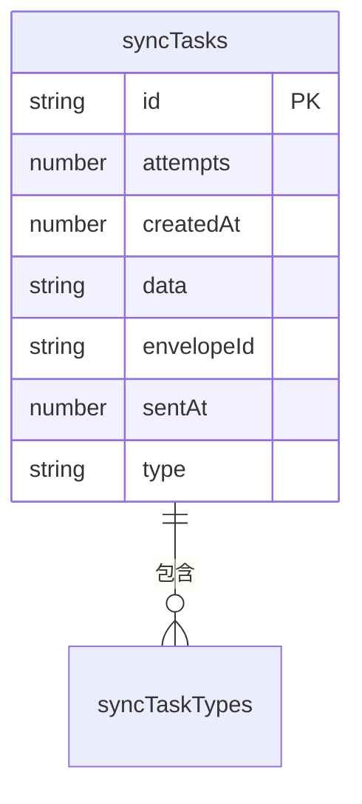
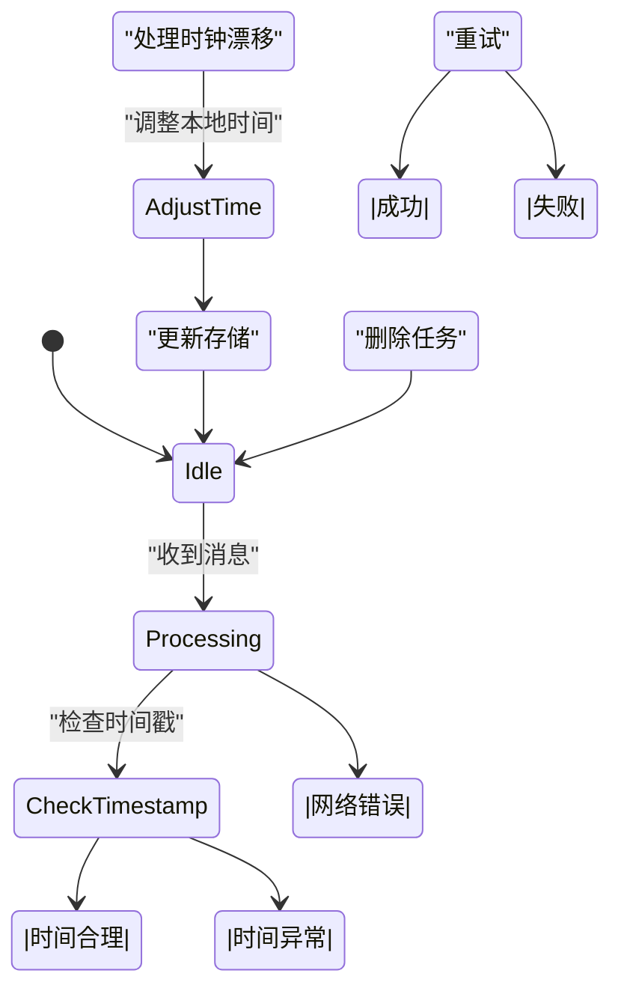
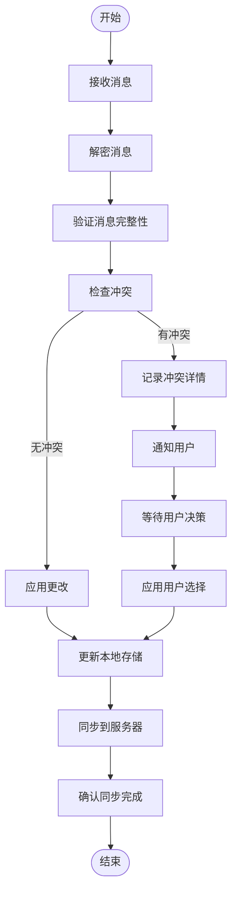

# 冲突解决策略

<cite>
**本文档引用的文件**   
- [MessageReceiver.preload.ts](file://ts/textsecure/MessageReceiver.preload.ts)
- [syncTasks.preload.ts](file://ts/util/syncTasks.preload.ts)
- [storage.preload.ts](file://ts/services/storage.preload.ts)
- [storageRecordOps.preload.ts](file://ts/services/storageRecordOps.preload.ts)
- [1260-sync-tasks-rowid.std.ts](file://ts/sql/migrations/1260-sync-tasks-rowid.std.ts)
- [1330-sync-tasks-type-index.std.ts](file://ts/sql/migrations/1330-sync-tasks-type-index.std.ts)
- [Server.node.ts](file://ts/sql/Server.node.ts)
</cite>

## 目录
1. [简介](#简介)
2. [冲突检测机制](#冲突检测机制)
3. [数据合并策略](#数据合并策略)
4. [最终一致性保证](#最终一致性保证)
5. [冲突解决任务调度](#冲突解决任务调度)
6. [SQL迁移与数据结构支持](#sql迁移与数据结构支持)
7. [时钟漂移与网络延迟处理](#时钟漂移与网络延迟处理)
8. [用户干预机制](#用户干预机制)
9. [冲突解决流程图](#冲突解决流程图)
10. [结论](#结论)

## 简介
Signal-Desktop采用多设备同步架构，允许多个设备同时访问用户的聊天数据。这种架构带来了并发操作导致的数据冲突问题。本文档详细阐述Signal-Desktop的冲突解决策略，包括冲突检测、操作日志合并、最终一致性保证等核心机制。系统通过时间戳比较、操作日志合并和最终一致性保证来解决多设备并发操作导致的数据冲突，确保用户在不同设备上获得一致的体验。

**Section sources**
- [MessageReceiver.preload.ts](file://ts/textsecure/MessageReceiver.preload.ts#L1-L100)

## 冲突检测机制
Signal-Desktop的冲突检测主要在`MessageReceiver.preload.ts`中实现。系统通过比较本地存储和远程存储的数据差异来检测冲突。当接收到新的存储服务消息时，系统会解密并验证信封内容，然后将其加入处理队列。在处理过程中，系统会检查消息的类型和内容，确保其符合预期格式。

冲突检测的关键在于比较本地值和远程值的差异。系统会遍历所有需要比较的键，检查它们的值是否相等。对于特殊字段如昵称，系统会使用专门的比较函数。如果值为null或零值，系统会进行特殊处理，避免误判为冲突。系统还会检查时间戳，确保消息的顺序正确。

**Diagram sources **
- [MessageReceiver.preload.ts](file://ts/textsecure/MessageReceiver.preload.ts#L100-L200)

**Section sources**
- [MessageReceiver.preload.ts](file://ts/textsecure/MessageReceiver.preload.ts#L100-L300)

## 数据合并策略
Signal-Desktop的数据合并策略在`storageRecordOps.preload.ts`中实现。系统采用基于时间戳的合并算法，优先保留最新版本的数据。当检测到冲突时，系统会记录冲突详情，包括哪些字段被添加、删除或修改。

对于不同的数据类型，系统采用不同的合并策略。例如，对于联系人记录，系统会比较昵称、头像等字段；对于群组记录，系统会比较成员列表、群组名称等字段。系统还会处理特殊情况，如null值和零值的比较，确保不会误判为冲突。

**Diagram sources **
- [storageRecordOps.preload.ts](file://ts/services/storageRecordOps.preload.ts#L1000-L1200)

**Section sources**
- [storageRecordOps.preload.ts](file://ts/services/storageRecordOps.preload.ts#L1000-L1200)

## 最终一致性保证
Signal-Desktop通过存储服务（Storage Service）实现最终一致性。系统定期从服务器获取最新的存储清单（Manifest），并与本地存储进行比较。如果发现差异，系统会下载并合并远程记录，确保本地存储与服务器保持一致。

在`storage.preload.ts`中，系统实现了完整的同步流程。首先，系统会获取存储凭据，然后下载加密的存储清单。解密后，系统会解析清单内容，获取所有记录的标识符。接着，系统会比较本地和远程的记录集合，确定需要插入、更新或删除的记录。

**Diagram sources **
- [storage.preload.ts](file://ts/services/storage.preload.ts#L800-L1200)

**Section sources**
- [storage.preload.ts](file://ts/services/storage.preload.ts#L800-L1200)

## 冲突解决任务调度
Signal-Desktop的冲突解决任务调度在`syncTasks.preload.ts`中实现。系统使用任务队列来管理同步任务，确保任务按顺序执行。每个同步任务都有一个唯一的ID、创建时间、尝试次数等属性。

系统会定期从数据库中获取最旧的同步任务，并按批次处理。处理过程中，系统会根据任务类型调用相应的处理函数。例如，删除消息任务会调用`DeletesForMe.onDelete`，读取同步任务会调用`onReadSync`。任务处理成功后，系统会从数据库中删除该任务。

**Diagram sources **
- [syncTasks.preload.ts](file://ts/util/syncTasks.preload.ts#L50-L200)

**Section sources**
- [syncTasks.preload.ts](file://ts/util/syncTasks.preload.ts#L50-L200)

## SQL迁移与数据结构支持
Signal-Desktop使用SQL迁移文件来支持冲突解决的数据结构。在`ts/sql/migrations/`目录下，有多个迁移文件用于创建和修改`syncTasks`表。这些迁移确保了同步任务表的结构能够支持冲突解决的需求。

`1260-sync-tasks-rowid.std.ts`迁移文件创建了`syncTasks_delete`索引，用于按尝试次数降序排列任务，便于快速删除过期任务。`1330-sync-tasks-type-index.std.ts`迁移文件创建了`syncTasks_type`索引，用于按任务类型查询任务，提高查询效率。

**Diagram sources **
- [1260-sync-tasks-rowid.std.ts](file://ts/sql/migrations/1260-sync-tasks-rowid.std.ts#L1-L13)
- [1330-sync-tasks-type-index.std.ts](file://ts/sql/migrations/1330-sync-tasks-type-index.std.ts#L1-L12)

**Section sources**
- [1260-sync-tasks-rowid.std.ts](file://ts/sql/migrations/1260-sync-tasks-rowid.std.ts#L1-L13)
- [1330-sync-tasks-type-index.std.ts](file://ts/sql/migrations/1330-sync-tasks-type-index.std.ts#L1-L12)

## 时钟漂移与网络延迟处理
Signal-Desktop通过多种机制处理时钟漂移和网络延迟问题。系统在`MessageReceiver.preload.ts`中计算消息年龄（messageAgeSec），即消息在服务器上停留的时间。这个值用于判断消息的新鲜度，避免因时钟漂移导致的排序错误。

系统还实现了重试机制，当网络连接不稳定时，会自动重试失败的同步任务。在`Server.node.ts`中，`dequeueOldestSyncTasks`函数会删除尝试次数过多且创建时间过久的任务，防止任务队列积压。

**Diagram sources **
- [MessageReceiver.preload.ts](file://ts/textsecure/MessageReceiver.preload.ts#L700-L800)
- [Server.node.ts](file://ts/sql/Server.node.ts#L2450-L2500)

**Section sources**
- [MessageReceiver.preload.ts](file://ts/textsecure/MessageReceiver.preload.ts#L700-L800)
- [Server.node.ts](file://ts/sql/Server.node.ts#L2450-L2500)

## 用户干预机制
Signal-Desktop在某些情况下需要用户干预来解决冲突。当系统无法自动解决冲突时，会记录冲突详情并通知用户。用户可以通过界面查看冲突信息，并选择如何解决冲突。

系统会将冲突记录存储在`storage-service-unknown-records`中，便于后续处理。当用户做出选择后，系统会根据用户的选择更新本地存储，并同步到其他设备。

**Section sources**
- [storage.preload.ts](file://ts/services/storage.preload.ts#L2090-L2130)

## 冲突解决流程图
以下是Signal-Desktop冲突解决的完整流程图，展示了从冲突检测到最终解决的全过程。

**Diagram sources **
- [MessageReceiver.preload.ts](file://ts/textsecure/MessageReceiver.preload.ts#L100-L300)
- [storage.preload.ts](file://ts/services/storage.preload.ts#L800-L1200)

## 结论
Signal-Desktop通过综合运用时间戳比较、操作日志合并和最终一致性保证等技术，有效解决了多设备并发操作导致的数据冲突问题。系统采用分层架构，将冲突检测、数据合并、任务调度等功能分离，提高了代码的可维护性和可扩展性。通过SQL迁移文件支持数据结构演进，确保系统能够适应未来的需求变化。整体设计充分考虑了时钟漂移、网络延迟等现实问题，为用户提供了一致可靠的跨设备体验。