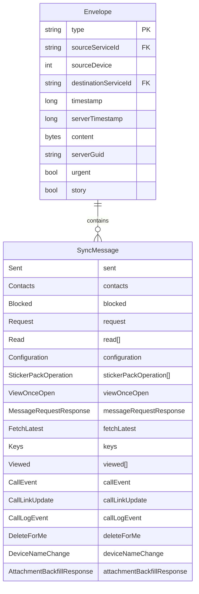
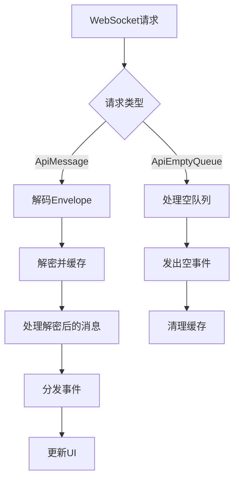
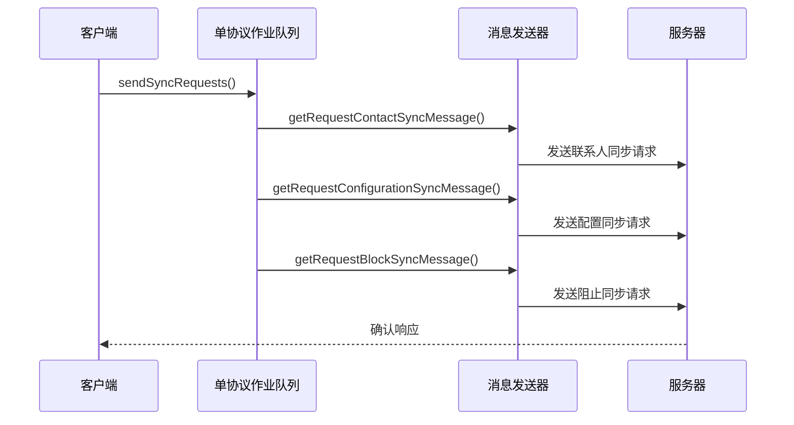
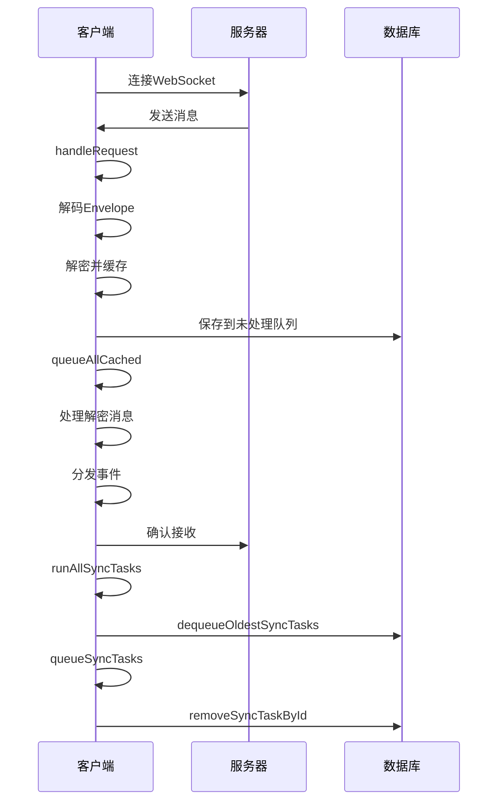
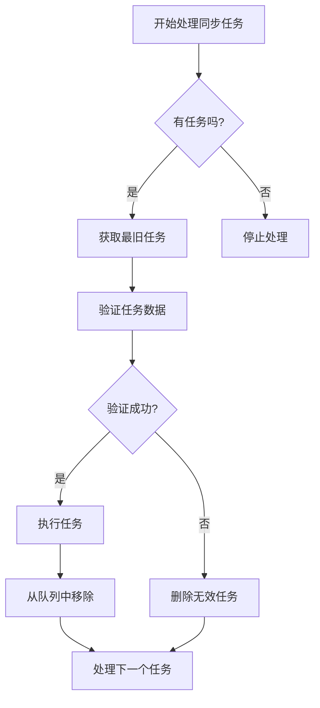

# 增量同步机制

<cite>
**本文档中引用的文件**
- [MessageReceiver.preload.ts](file://ts/textsecure/MessageReceiver.preload.ts)
- [syncRequests.preload.ts](file://ts/textsecure/syncRequests.preload.ts)
- [syncTasks.preload.ts](file://ts/util/syncTasks.preload.ts)
- [Server.node.ts](file://ts/sql/Server.node.ts)
- [SignalService.proto](file://protos/SignalService.proto)
</cite>

## 目录
1. [引言](#引言)
2. [增量同步协议与数据格式](#增量同步协议与数据格式)
3. [消息接收器处理流程](#消息接收器处理流程)
4. [同步请求的构建与发送](#同步请求的构建与发送)
5. [同步任务队列管理](#同步任务队列管理)
6. [增量同步时序图](#增量同步时序图)
7. [常见问题与解决方案](#常见问题与解决方案)
8. [性能优化与可靠性保障](#性能优化与可靠性保障)
9. [结论](#结论)

## 引言
Signal-Desktop的增量同步机制是确保客户端与服务器之间数据一致性的核心功能。该机制通过基于游标的增量数据同步策略，高效地处理消息更新、配置变更和状态同步。本文档深入解析了增量同步的实现细节，包括消息接收器如何处理增量更新、同步请求的构建与发送机制，以及同步任务队列的管理。通过分析MessageReceiver.preload.ts、syncRequests.preload.ts和syncTasks.preload.ts等关键文件，全面揭示了增量同步的内部工作原理。

## 增量同步协议与数据格式
增量同步机制依赖于SignalService.proto中定义的协议格式。同步消息通过`SyncMessage`类型在客户端之间传递，包含多种同步事件，如联系人同步、已读状态同步、配置同步等。每个同步消息都封装在`Envelope`中，包含消息类型、时间戳、源设备和服务ID等元数据。



**Diagram sources**
- [SignalService.proto](file://protos/SignalService.proto)

**Section sources**
- [SignalService.proto](file://protos/SignalService.proto)

## 消息接收器处理流程
`MessageReceiver`类负责处理从服务器接收到的所有消息。它通过`handleRequest`方法接收WebSocket请求，并将加密的消息体解码为`Envelope`对象。消息处理流程分为多个队列，确保消息按顺序处理且不会阻塞主线程。



**Diagram sources**
- [MessageReceiver.preload.ts](file://ts/textsecure/MessageReceiver.preload.ts)

**Section sources**
- [MessageReceiver.preload.ts](file://ts/textsecure/MessageReceiver.preload.ts)

## 同步请求的构建与发送
同步请求的构建由`syncRequests.preload.ts`文件中的`sendSyncRequests`函数负责。该函数通过`MessageSender`创建并发送多种同步请求，包括联系人同步、配置同步和阻止列表同步。



**Diagram sources**
- [syncRequests.preload.ts](file://ts/textsecure/syncRequests.preload.ts)

**Section sources**
- [syncRequests.preload.ts](file://ts/textsecure/syncRequests.preload.ts)

## 同步任务队列管理
同步任务队列管理是增量同步机制的核心部分，由`syncTasks.preload.ts`文件实现。该机制使用数据库表`syncTasks`来持久化同步任务，并通过`runAllSyncTasks`函数按批次处理任务。

```mermaid
classDiagram
class SyncTaskType {
+string id
+number attempts
+number createdAt
+unknown data
+string envelopeId
+number sentAt
+string type
}
class DataWriter {
+dequeueOldestSyncTasks(options) Promise~{tasks, lastRowId}~
+removeSyncTaskById(id) Promise~void~
}
class syncTasks {
+queueSyncTasks(tasks, removeSyncTaskById) Promise~void~
+runAllSyncTasks() Promise~void~
}
DataWriter --> syncTasks : 使用
syncTasks --> SyncTaskType : 处理
```

**Diagram sources**
- [syncTasks.preload.ts](file://ts/util/syncTasks.preload.ts)
- [Server.node.ts](file://ts/sql/Server.node.ts)

**Section sources**
- [syncTasks.preload.ts](file://ts/util/syncTasks.preload.ts)
- [Server.node.ts](file://ts/sql/Server.node.ts)

## 增量同步时序图
以下时序图展示了客户端与服务器之间的增量同步交互流程：



**Diagram sources**
- [MessageReceiver.preload.ts](file://ts/textsecure/MessageReceiver.preload.ts)
- [syncTasks.preload.ts](file://ts/util/syncTasks.preload.ts)

## 常见问题与解决方案
增量同步机制中常见的问题包括数据遗漏、重复处理和版本冲突。以下是这些问题的解决方案：

1. **数据遗漏**：通过`dequeueOldestSyncTasks`函数确保所有任务都被处理，即使处理过程中断也会在下次启动时继续。
2. **重复处理**：使用`removeSyncTaskById`在任务成功处理后立即从数据库中删除，防止重复执行。
3. **版本冲突**：通过`incrementAllSyncTaskAttempts`函数跟踪任务重试次数，超过最大尝试次数后删除过期任务。



**Diagram sources**
- [syncTasks.preload.ts](file://ts/util/syncTasks.preload.ts)

**Section sources**
- [syncTasks.preload.ts](file://ts/util/syncTasks.preload.ts)

## 性能优化与可靠性保障
为了确保增量同步的性能和可靠性，Signal-Desktop采用了多种优化策略：

1. **批处理**：使用`decryptAndCacheBatcher`和`cacheRemoveBatcher`对解密和缓存操作进行批处理，减少数据库交互次数。
2. **并发控制**：通过`PQueue`限制并发任务数量，避免资源耗尽。
3. **错误处理**：在`queueSyncTasks`函数中捕获并处理各种异常情况，确保系统稳定性。
4. **断点续传**：通过`previousRowId`参数实现断点续传，确保在网络中断后能从上次中断处继续处理。

## 结论
Signal-Desktop的增量同步机制通过精心设计的协议格式、高效的消息处理流程和可靠的队列管理，实现了客户端与服务器之间的数据一致性。该机制不仅保证了数据的完整性和一致性，还通过批处理和并发控制等优化策略提升了系统性能。对于开发者而言，理解这一机制有助于更好地维护和扩展Signal-Desktop的功能。