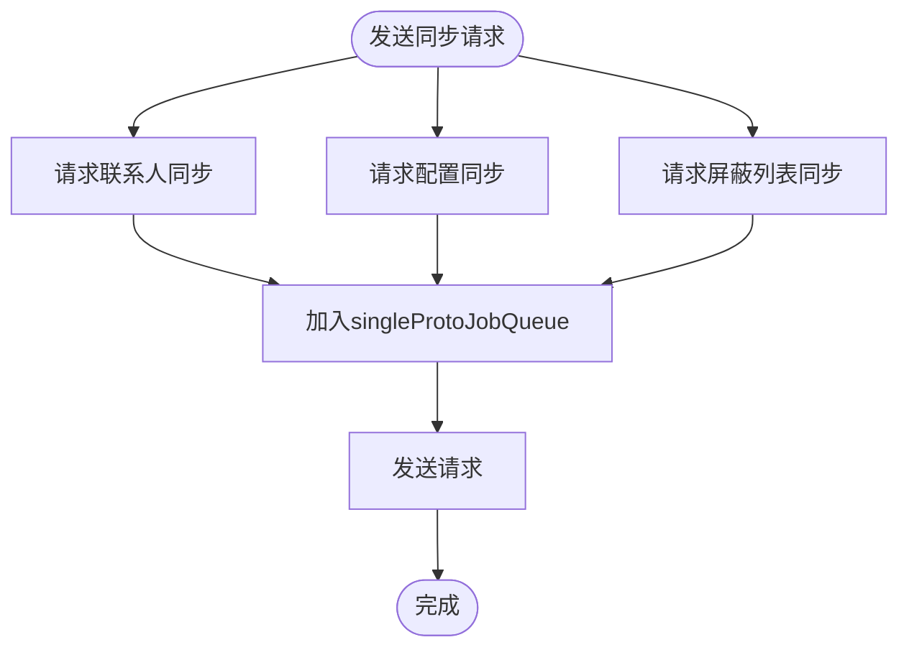
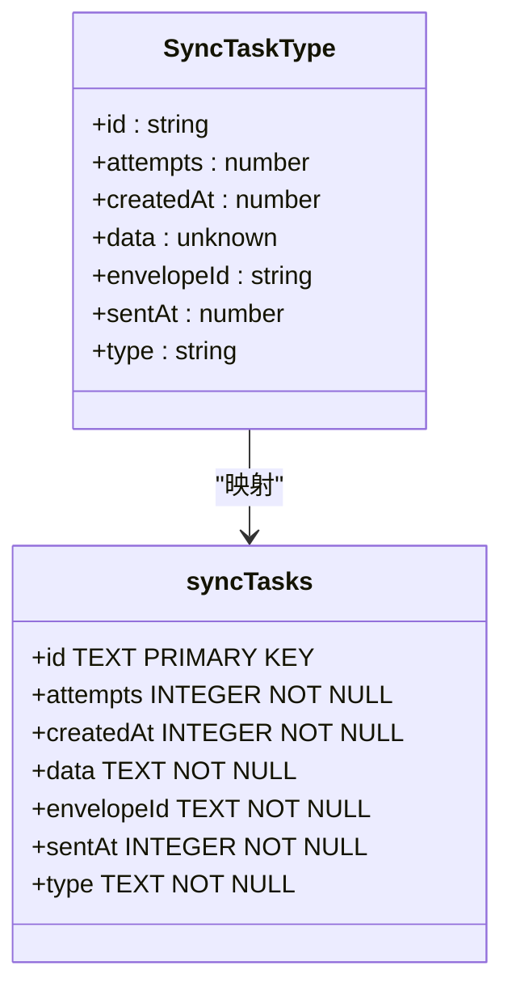
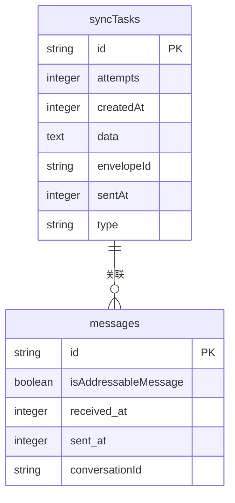
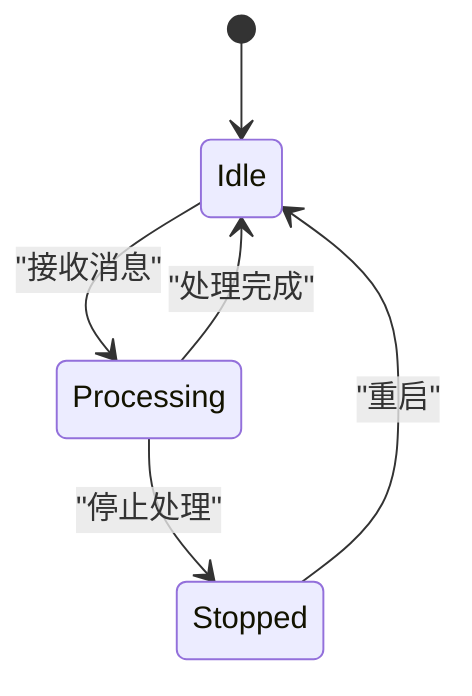

# 消息同步策略

<cite>
**本文档中引用的文件**  
- [MessageReceiver.preload.ts](file://ts\textsecure\MessageReceiver.preload.ts)
- [syncRequests.preload.ts](file://ts\textsecure\syncRequests.preload.ts)
- [updateListener.preload.ts](file://ts\services\updateListener.preload.ts)
- [syncTasks.preload.ts](file://ts\util\syncTasks.preload.ts)
- [syncIdentifiers.preload.ts](file://ts\util\syncIdentifiers.preload.ts)
- [1060-addressable-messages-and-sync-tasks.std.ts](file://ts\sql\migrations\1060-addressable-messages-and-sync-tasks.std.ts)
- [1260-sync-tasks-rowid.std.ts](file://ts\sql\migrations\1260-sync-tasks-rowid.std.ts)
- [1330-sync-tasks-type-index.std.ts](file://ts\sql\migrations\1330-sync-tasks-type-index.std.ts)
</cite>

## 目录
1. [简介](#简介)
2. [核心同步机制](#核心同步机制)
3. [消息接收处理流程](#消息接收处理流程)
4. [同步请求构建](#同步请求构建)
5. [更新监听逻辑](#更新监听逻辑)
6. [同步任务处理](#同步任务处理)
7. [同步协议接口与数据格式](#同步协议接口与数据格式)
8. [SQL迁移与数据结构演进](#sql迁移与数据结构演进)
9. [设备间同步状态机](#设备间同步状态机)
10. [常见问题与解决方案](#常见问题与解决方案)
11. [性能优化与可靠性保障](#性能优化与可靠性保障)

## 简介
Signal-Desktop的消息同步策略旨在确保用户在多设备间无缝同步消息、状态和元数据。该策略通过增量同步、状态同步和冲突解决机制，保证数据一致性。系统采用基于信封（envelope）的异步处理模型，结合加密队列和解密队列，实现高效、安全的消息处理。同步过程涉及消息接收、请求构建、状态监听和任务队列管理，确保所有设备在不同网络条件下都能可靠地保持同步。

## 核心同步机制
Signal-Desktop的同步机制基于增量同步和状态同步。增量同步通过信封（envelope）传递新消息，而状态同步则通过同步消息（sync message）传递已读、已查看等状态变更。系统使用`MessageReceiver`类处理所有传入消息，通过加密队列和解密队列分离处理流程，确保消息解密不影响主应用队列。同步任务（sync tasks）用于处理延迟操作，如删除消息、更新已读状态等，确保操作最终一致性。

**Section sources**
- [MessageReceiver.preload.ts](file://ts\textsecure\MessageReceiver.preload.ts#L1-L800)

## 消息接收处理流程
`MessageReceiver.preload.ts`是消息同步的核心组件，负责接收、解密和分发消息。处理流程如下：
1. 接收WebSocket请求，解析信封（envelope）。
2. 将信封加入加密队列进行解密。
3. 解密后将消息加入解密队列进行处理。
4. 分发消息事件，如消息、已读、已查看等。

该流程通过`#decryptAndCacheBatcher`批处理解密请求，提高性能。`#queueAllCached`方法在启动时处理缓存消息，确保离线期间的消息不丢失。

**Section sources**
- [MessageReceiver.preload.ts](file://ts\textsecure\MessageReceiver.preload.ts#L800-L1599)

## 同步请求构建
`syncRequests.preload.ts`负责构建和发送同步请求。系统在启动时自动发送三种同步请求：联系人同步、配置同步和屏蔽列表同步。这些请求通过`singleProtoJobQueue`队列发送，确保请求按顺序处理。同步请求使用`MessageSender`类生成，包含必要的元数据和认证信息。

**Diagram sources**
- [syncRequests.preload.ts](file://ts\textsecure\syncRequests.preload.ts#L1-L29)

**Section sources**
- [syncRequests.preload.ts](file://ts\textsecure\syncRequests.preload.ts#L1-L29)

## 更新监听逻辑
`updateListener.preload.ts`负责监听应用更新事件。通过Electron的`ipcRenderer`，监听`show-update-dialog`事件，触发更新对话框。该逻辑确保用户在应用有新版本时能及时收到通知。更新监听器初始化后，持续监听更新事件，提供无缝的用户体验。

**Section sources**
- [updateListener.preload.ts](file://ts\services\updateListener.preload.ts#L1-L26)

## 同步任务处理
`syncTasks.preload.ts`管理所有同步任务，包括删除消息、更新已读状态等。同步任务存储在`syncTasks`表中，包含任务ID、尝试次数、创建时间、数据、信封ID、发送时间和类型。系统通过`queueSyncTasks`函数处理任务，根据任务类型调用相应处理器。`runAllSyncTasks`函数在启动时运行，确保所有待处理任务被处理。

**Diagram sources**
- [syncTasks.preload.ts](file://ts\util\syncTasks.preload.ts#L1-L263)
- [1060-addressable-messages-and-sync-tasks.std.ts](file://ts\sql\migrations\1060-addressable-messages-and-sync-tasks.std.ts#L1-L39)

**Section sources**
- [syncTasks.preload.ts](file://ts\util\syncTasks.preload.ts#L1-L263)
- [syncIdentifiers.preload.ts](file://ts\util\syncIdentifiers.preload.ts#L1-L196)

## 同步协议接口与数据格式
同步协议定义了消息同步的接口和数据格式。主要接口包括：
- `queueSyncTasks`: 处理同步任务。
- `findMatchingMessage`: 根据条件查找匹配消息。
- `getConversationFromTarget`: 根据目标获取会话。

数据格式使用Zod库定义，确保类型安全。例如，`syncTaskDataSchema`联合了所有可能的同步任务数据格式，包括删除消息、删除会话、已读同步等。

**Section sources**
- [syncTasks.preload.ts](file://ts\util\syncTasks.preload.ts#L38-L47)
- [syncIdentifiers.preload.ts](file://ts\util\syncIdentifiers.preload.ts#L103-L133)

## SQL迁移与数据结构演进
SQL迁移文件记录了同步数据结构的演进。`1060-addressable-messages-and-sync-tasks.std.ts`添加了`isAddressableMessage`列和`syncTasks`表，支持地址化消息和同步任务。`1260-sync-tasks-rowid.std.ts`优化了`syncTasks`表的索引，提高查询性能。`1330-sync-tasks-type-index.std.ts`为`syncTasks`表添加了类型索引，加速按类型查询。

**Diagram sources**
- [1060-addressable-messages-and-sync-tasks.std.ts](file://ts\sql\migrations\1060-addressable-messages-and-sync-tasks.std.ts#L1-L39)
- [1260-sync-tasks-rowid.std.ts](file://ts\sql\migrations\1260-sync-tasks-rowid.std.ts#L1-L14)
- [1330-sync-tasks-type-index.std.ts](file://ts\sql\migrations\1330-sync-tasks-type-index.std.ts)

**Section sources**
- [1060-addressable-messages-and-sync-tasks.std.ts](file://ts\sql\migrations\1060-addressable-messages-and-sync-tasks.std.ts#L1-L39)
- [1260-sync-tasks-rowid.std.ts](file://ts\sql\migrations\1260-sync-tasks-rowid.std.ts#L1-L14)
- [1330-sync-tasks-type-index.std.ts](file://ts\sql\migrations\1330-sync-tasks-type-index.std.ts)

## 设备间同步状态机
设备间同步状态机描述了不同设备状态下的同步行为。状态包括：空闲、处理中、停止处理。事件包括：接收消息、处理完成、队列为空。转换规则确保系统在不同状态下正确处理消息和同步任务。

**Diagram sources**
- [MessageReceiver.preload.ts](file://ts\textsecure\MessageReceiver.preload.ts#L311-L323)

## 常见问题与解决方案
### 同步延迟
同步延迟可能由网络问题或设备性能引起。解决方案包括优化队列处理、增加超时重试机制。

### 数据不一致
数据不一致通常由同步任务失败引起。系统通过`MAX_SYNC_TASK_ATTEMPTS`限制重试次数，确保任务最终完成。

### 网络中断恢复
网络中断后，系统通过`#queueAllCached`重新处理缓存消息，确保消息不丢失。

**Section sources**
- [MessageReceiver.preload.ts](file://ts\textsecure\MessageReceiver.preload.ts#L958-L972)
- [syncTasks.types.std.ts](file://ts\util\syncTasks.types.std.ts#L1-L5)

## 性能优化与可靠性保障
性能优化包括批处理解密请求、使用索引加速查询。可靠性保障通过事务处理、错误重试和日志记录实现。系统使用`PQueue`管理队列，确保任务按序执行。`createBatcher`批处理器减少数据库操作次数，提高性能。

**Section sources**
- [MessageReceiver.preload.ts](file://ts\textsecure\MessageReceiver.preload.ts#L359-L372)
- [syncTasks.preload.ts](file://ts\util\syncTasks.preload.ts#L234-L262)