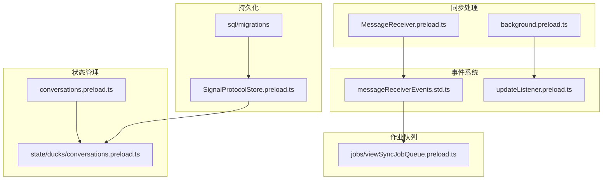
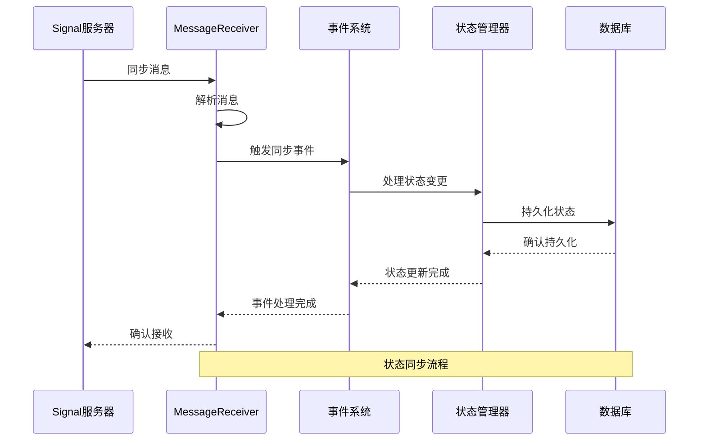
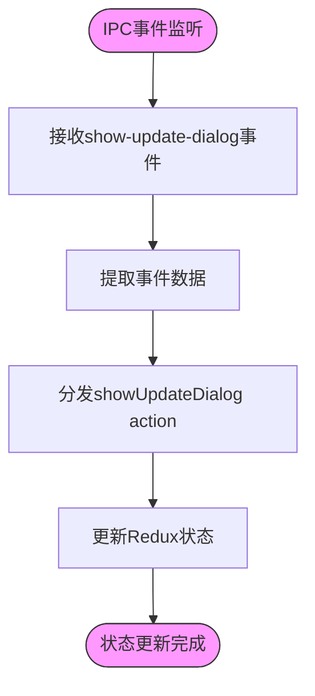
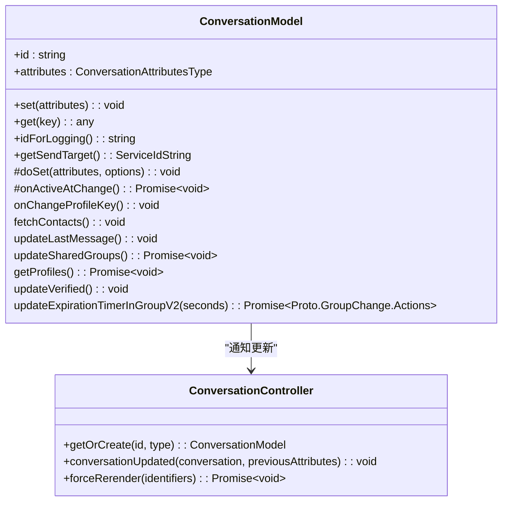
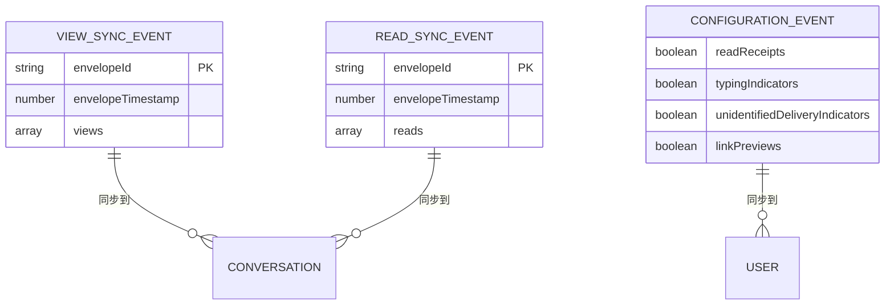
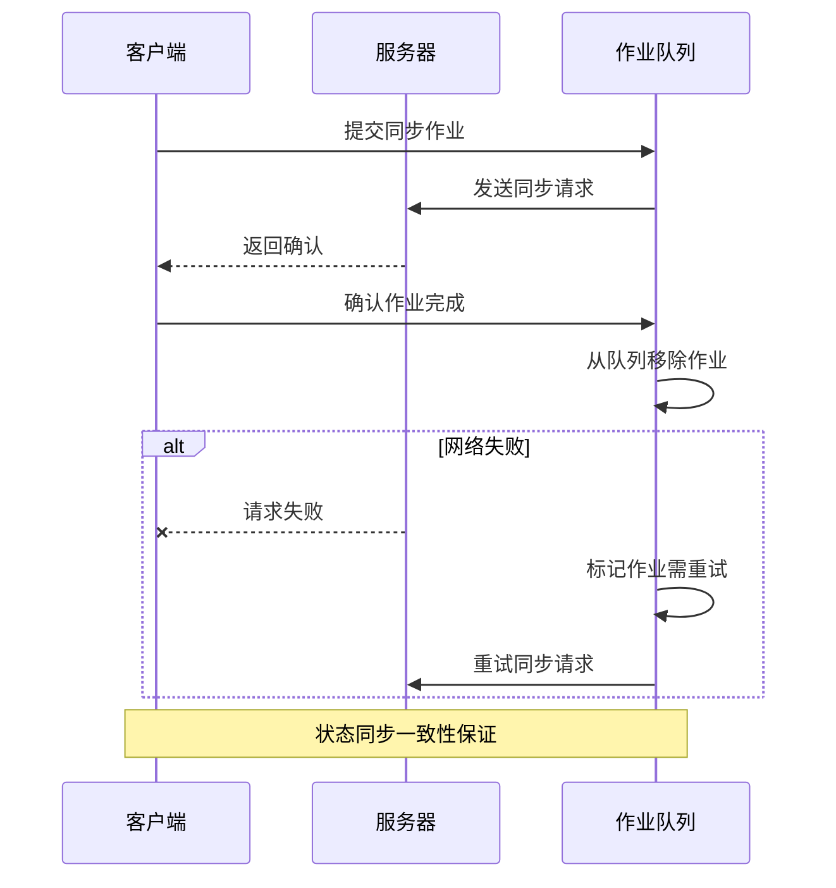
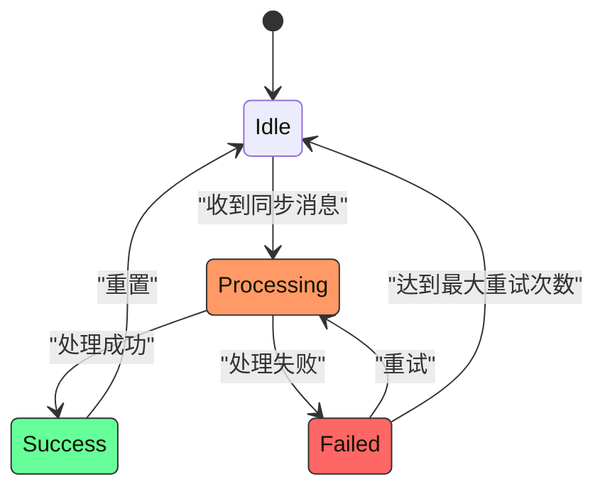
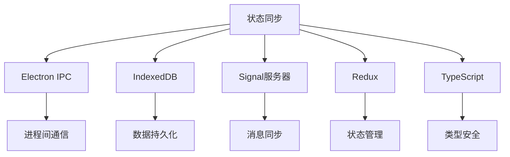

# 状态同步机制

<cite>
**本文档引用的文件**   
- [updateListener.preload.ts](file://ts/services/updateListener.preload.ts)
- [conversations.preload.ts](file://ts/models/conversations.preload.ts)
- [conversations.preload.ts](file://ts/state/ducks/conversations.preload.ts)
- [SignalProtocolStore.preload.ts](file://ts/SignalProtocolStore.preload.ts)
- [MessageReceiver.preload.ts](file://ts/textsecure/MessageReceiver.preload.ts)
- [messageReceiverEvents.std.ts](file://ts/textsecure/messageReceiverEvents.std.ts)
- [viewSyncJobQueue.preload.ts](file://ts/jobs/viewSyncJobQueue.preload.ts)
- [background.preload.ts](file://ts/background.preload.ts)
- [sql/migrations](file://ts/sql/migrations)
</cite>

## 目录
1. [简介](#简介)
2. [项目结构](#项目结构)
3. [核心组件](#核心组件)
4. [架构概述](#架构概述)
5. [详细组件分析](#详细组件分析)
6. [依赖分析](#依赖分析)
7. [性能考虑](#性能考虑)
8. [故障排除指南](#故障排除指南)
9. [结论](#结论)
10. [附录](#附录)

## 简介
Signal-Desktop的状态同步机制是确保多设备间会话状态、阅读状态和配置状态一致性的核心系统。该机制通过监听状态变更、广播更新和持久化数据来实现跨设备的实时同步。系统采用事件驱动架构，通过IPC通信和数据库操作来协调不同组件之间的状态变更。状态同步不仅包括消息的读取状态，还涵盖用户配置、群组信息和会话元数据的同步。本文档将深入分析状态同步的实现细节，包括状态更新的监听与分发机制、SQL迁移文件在状态数据结构演进中的作用，以及会话状态的管理策略。

## 项目结构
Signal-Desktop的项目结构清晰地组织了状态同步相关的代码。核心状态管理逻辑位于`ts/models`和`ts/state/ducks`目录下，而同步事件处理则分布在`ts/textsecure`和`ts/services`目录中。数据库迁移文件位于`ts/sql/migrations`目录，按版本号排序，记录了状态数据结构的演进过程。预加载脚本（preload.ts）文件负责在应用启动时初始化状态同步机制。

**图表来源**
- [conversations.preload.ts](file://ts/models/conversations.preload.ts)
- [state/ducks/conversations.preload.ts](file://ts/state/ducks/conversations.preload.ts)
- [MessageReceiver.preload.ts](file://ts/textsecure/MessageReceiver.preload.ts)
- [background.preload.ts](file://ts/background.preload.ts)
- [messageReceiverEvents.std.ts](file://ts/textsecure/messageReceiverEvents.std.ts)
- [updateListener.preload.ts](file://ts/services/updateListener.preload.ts)
- [sql/migrations](file://ts/sql/migrations)
- [SignalProtocolStore.preload.ts](file://ts/SignalProtocolStore.preload.ts)
- [viewSyncJobQueue.preload.ts](file://ts/jobs/viewSyncJobQueue.preload.ts)

**章节来源**
- [ts/models/conversations.preload.ts](file://ts/models/conversations.preload.ts)
- [ts/state/ducks/conversations.preload.ts](file://ts/state/ducks/conversations.preload.ts)
- [ts/textsecure/MessageReceiver.preload.ts](file://ts/textsecure/MessageReceiver.preload.ts)
- [ts/background.preload.ts](file://ts/background.preload.ts)
- [ts/textsecure/messageReceiverEvents.std.ts](file://ts/textsecure/messageReceiverEvents.std.ts)
- [ts/services/updateListener.preload.ts](file://ts/services/updateListener.preload.ts)
- [ts/sql/migrations](file://ts/sql/migrations)
- [ts/SignalProtocolStore.preload.ts](file://ts/SignalProtocolStore.preload.ts)
- [ts/jobs/viewSyncJobQueue.preload.ts](file://ts/jobs/viewSyncJobQueue.preload.ts)

## 核心组件
Signal-Desktop的状态同步机制由多个核心组件构成，包括状态更新监听器、会话管理器、协议存储和消息接收器。这些组件协同工作，确保状态变更能够被正确捕获、处理和持久化。状态更新监听器负责接收来自Electron IPC的更新事件，而会话管理器则维护会话的当前状态。协议存储组件管理加密会话和密钥，消息接收器处理来自服务器的同步消息。这些组件通过事件总线和作业队列进行通信，形成一个松耦合但高度协调的系统。

**章节来源**
- [updateListener.preload.ts](file://ts/services/updateListener.preload.ts)
- [conversations.preload.ts](file://ts/models/conversations.preload.ts)
- [SignalProtocolStore.preload.ts](file://ts/SignalProtocolStore.preload.ts)
- [MessageReceiver.preload.ts](file://ts/textsecure/MessageReceiver.preload.ts)

## 架构概述
Signal-Desktop的状态同步架构采用分层设计，从底层的数据库持久化到上层的应用状态管理。系统通过事件驱动的方式处理状态变更，确保变更能够被正确广播和处理。状态同步的核心是消息接收器（MessageReceiver），它负责处理来自Signal服务器的同步消息，并将其转换为本地事件。这些事件随后被分发到相应的处理器，如阅读状态同步、配置同步等。作业队列系统确保了同步操作的可靠性和顺序性，即使在网络不稳定的情况下也能保证最终一致性。

**图表来源**
- [MessageReceiver.preload.ts](file://ts/textsecure/MessageReceiver.preload.ts)
- [messageReceiverEvents.std.ts](file://ts/textsecure/messageReceiverEvents.std.ts)
- [conversations.preload.ts](file://ts/models/conversations.preload.ts)
- [SignalProtocolStore.preload.ts](file://ts/SignalProtocolStore.preload.ts)

## 详细组件分析
### updateListener.preload.ts中的状态更新监听与分发
`updateListener.preload.ts`文件实现了状态更新的监听与分发机制。该组件通过Electron的IPC系统监听来自主进程的更新事件，并将其分发到Redux状态管理器。这种设计实现了主进程和渲染进程之间的解耦，确保状态更新能够安全地跨进程传递。监听器注册了"show-update-dialog"事件，当收到更新通知时，会调用相应的action creator来更新应用状态。

**图表来源**
- [updateListener.preload.ts](file://ts/services/updateListener.preload.ts)

**章节来源**
- [updateListener.preload.ts](file://ts/services/updateListener.preload.ts)

### conversations.preload.ts中的会话状态管理
`conversations.preload.ts`文件中的`ConversationModel`类负责管理会话状态。该类封装了会话的所有属性和行为，包括状态变更的监听、持久化和广播。当会话属性发生变化时，`set`方法会触发相应的处理逻辑，如更新最后消息、获取用户资料等。状态变更通过`conversationUpdated`方法通知控制器，从而触发UI更新。这种设计确保了状态变更的集中管理和一致性。

**图表来源**
- [conversations.preload.ts](file://ts/models/conversations.preload.ts)
- [ConversationController.preload.ts](file://ts/ConversationController.preload.ts)

**章节来源**
- [conversations.preload.ts](file://ts/models/conversations.preload.ts)

### SQL迁移文件在状态数据结构演进中的作用
SQL迁移文件记录了状态数据结构的演进过程，确保数据库模式能够随着应用版本的更新而平滑升级。每个迁移文件对应一个版本号，按顺序执行，修改数据库表结构或数据。例如，`1150-expire-timer-version.std.ts`文件添加了过期计时器版本字段，支持更精确的消息过期控制。迁移系统通过`index.node.ts`文件管理，确保所有迁移按正确顺序执行，维护数据一致性。

**章节来源**
- [ts/sql/migrations](file://ts/sql/migrations)

### 状态同步事件类型与数据格式
Signal-Desktop的状态同步涉及多种事件类型，每种类型都有特定的数据格式和处理逻辑。主要事件类型包括：
- **ConfigurationEvent**: 配置同步事件，同步已读回执、输入指示器等用户设置
- **ViewSyncEvent**: 阅读状态同步事件，同步消息的查看状态
- **ReadSyncEvent**: 已读状态同步事件，同步消息的已读状态
- **KeysEvent**: 密钥同步事件，同步加密密钥
- **StickerPackEvent**: 贴纸包同步事件，同步贴纸包的安装/移除状态

这些事件通过`messageReceiverEvents.std.ts`文件定义，使用TypeScript接口描述数据结构，确保类型安全。

**图表来源**
- [messageReceiverEvents.std.ts](file://ts/textsecure/messageReceiverEvents.std.ts)
- [conversations.preload.ts](file://ts/models/conversations.preload.ts)

**章节来源**
- [messageReceiverEvents.std.ts](file://ts/textsecure/messageReceiverEvents.std.ts)

### 状态同步一致性保证机制
Signal-Desktop通过多种机制保证状态同步的一致性。首先，使用作业队列系统（如`viewSyncJobQueue`）确保同步操作的顺序执行和重试。其次，采用事务性操作和版本控制来避免竞态条件。例如，`SignalProtocolStore`中的`withZone`方法提供了事务性上下文，确保相关操作的原子性。此外，系统使用确认机制（confirmable events）确保消息的可靠传递，只有在确认接收后才会从队列中移除。

**图表来源**
- [viewSyncJobQueue.preload.ts](file://ts/jobs/viewSyncJobQueue.preload.ts)
- [MessageReceiver.preload.ts](file://ts/textsecure/MessageReceiver.preload.ts)

**章节来源**
- [viewSyncJobQueue.preload.ts](file://ts/jobs/viewSyncJobQueue.preload.ts)
- [MessageReceiver.preload.ts](file://ts/textsecure/MessageReceiver.preload.ts)

### 状态同步状态机图
状态同步系统可以建模为一个状态机，描述不同设备状态变更的传播路径。初始状态为"Idle"，当收到同步消息时进入"Processing"状态。处理成功后进入"Success"状态，失败则进入"Failed"状态。系统会自动重试失败的操作，直到成功或达到最大重试次数。

**图表来源**
- [MessageReceiver.preload.ts](file://ts/textsecure/MessageReceiver.preload.ts)
- [viewSyncJobQueue.preload.ts](file://ts/jobs/viewSyncJobQueue.preload.ts)

**章节来源**
- [MessageReceiver.preload.ts](file://ts/textsecure/MessageReceiver.preload.ts)
- [viewSyncJobQueue.preload.ts](file://ts/jobs/viewSyncJobQueue.preload.ts)

## 依赖分析
状态同步机制依赖于多个核心组件和外部服务。主要依赖包括：
- **Electron IPC**: 用于主进程和渲染进程之间的通信
- **IndexedDB**: 用于持久化存储会话状态和消息
- **Signal服务器**: 提供同步消息和状态更新
- **Redux**: 用于应用状态管理
- **TypeScript**: 提供类型安全和代码质量保证

这些依赖通过明确的接口和抽象层进行管理，确保系统的可维护性和可扩展性。

**图表来源**
- [updateListener.preload.ts](file://ts/services/updateListener.preload.ts)
- [conversations.preload.ts](file://ts/models/conversations.preload.ts)
- [MessageReceiver.preload.ts](file://ts/textsecure/MessageReceiver.preload.ts)
- [state/ducks/conversations.preload.ts](file://ts/state/ducks/conversations.preload.ts)

**章节来源**
- [updateListener.preload.ts](file://ts/services/updateListener.preload.ts)
- [conversations.preload.ts](file://ts/models/conversations.preload.ts)
- [MessageReceiver.preload.ts](file://ts/textsecure/MessageReceiver.preload.ts)
- [state/ducks/conversations.preload.ts](file://ts/state/ducks/conversations.preload.ts)

## 性能考虑
状态同步机制在设计时充分考虑了性能因素。首先，使用批量操作减少数据库访问次数，如`queueAttachmentDownloads`方法批量处理附件下载。其次，采用节流（throttle）和防抖（debounce）技术减少不必要的状态更新，如`throttledUpdateUnread`方法限制未读状态更新频率。此外，系统使用缓存机制减少重复计算，如`cachedProps`字段缓存会话的渲染属性。

**章节来源**
- [conversations.preload.ts](file://ts/models/conversations.preload.ts)
- [util/queueAttachmentDownloads.preload.ts](file://ts/util/queueAttachmentDownloads.preload.ts)

## 故障排除指南
状态同步可能遇到的问题包括状态不一致、竞态条件和网络分区。解决这些问题的策略包括：
- **状态不一致**: 通过强制重新渲染（forceRerender）和数据库修复来解决
- **竞态条件**: 使用事务性操作和版本控制避免
- **网络分区**: 使用作业队列和重试机制确保最终一致性

对于初学者，建议从理解基本的事件流开始，逐步深入到复杂的同步逻辑。对于经验丰富的开发者，应重点关注高可用性和数据一致性保障的技术细节，如事务管理、错误处理和性能优化。

**章节来源**
- [ConversationController.preload.ts](file://ts/ConversationController.preload.ts)
- [viewSyncJobQueue.preload.ts](file://ts/jobs/viewSyncJobQueue.preload.ts)
- [MessageReceiver.preload.ts](file://ts/textsecure/MessageReceiver.preload.ts)

## 结论
Signal-Desktop的状态同步机制是一个复杂而精密的系统，通过事件驱动架构、作业队列和事务性操作确保了多设备间状态的一致性。该机制不仅处理消息的读取状态，还涵盖了用户配置、群组信息和会话元数据的同步。通过深入分析核心组件、事件类型和一致性保证机制，我们可以更好地理解Signal如何实现安全、可靠的状态同步。未来的工作可以进一步优化性能，增强错误处理，并探索新的同步策略以适应不断变化的用户需求。

## 附录
### 状态同步事件类型参考
| 事件类型 | 数据格式 | 用途 |
|--------|--------|-----|
| ConfigurationEvent | {readReceipts, typingIndicators, ...} | 同步用户配置 |
| ViewSyncEvent | {views: [{timestamp, senderAci}]} | 同步消息查看状态 |
| ReadSyncEvent | {reads: [{timestamp, senderAci}]} | 同步消息已读状态 |
| KeysEvent | {masterKey, accountEntropyPool, ...} | 同步加密密钥 |
| StickerPackEvent | {stickerPacks: [{id, key, isInstall}]} | 同步贴纸包状态 |

### 常见问题解答
**Q: 如何调试状态同步问题？**
A: 可以启用详细的日志记录，检查`viewSyncJobQueue`中的作业状态，或使用`forceRerender`方法强制重新同步。

**Q: 状态同步如何处理网络中断？**
A: 使用作业队列系统，将未完成的同步操作持久化到数据库，网络恢复后自动重试。

**Q: 如何确保状态同步的安全性？**
A: 所有同步消息都经过端到端加密，使用Signal协议确保只有授权设备能够解密和处理同步数据。