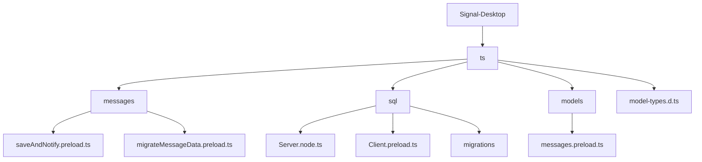
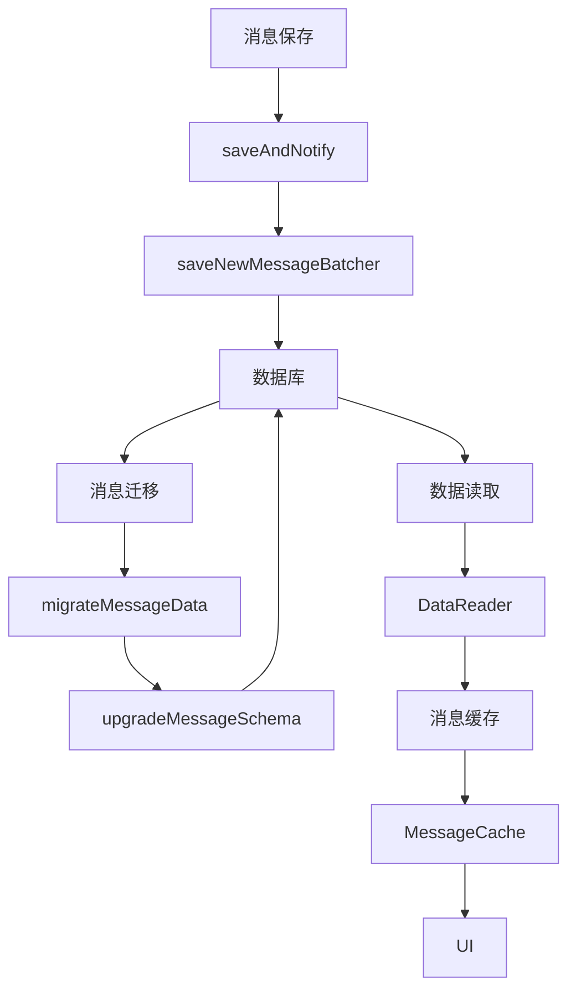
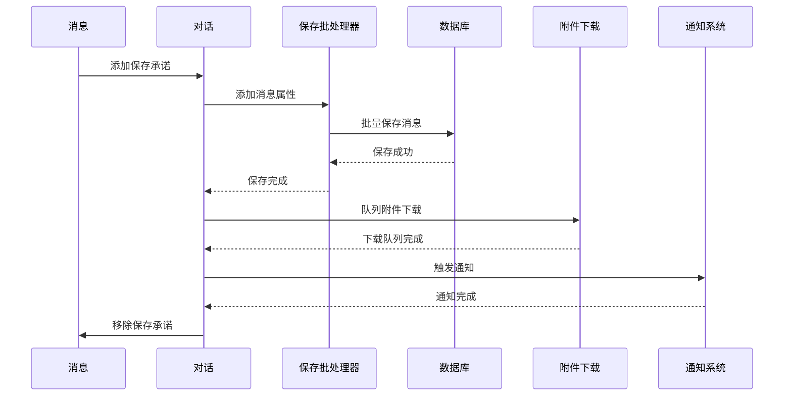
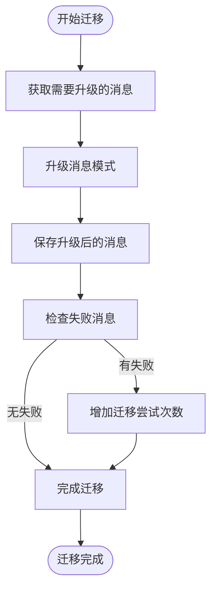
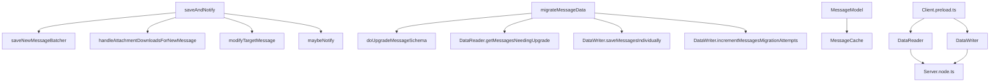

# 消息持久化

<cite>
**本文档中引用的文件**  
- [saveAndNotify.preload.ts](file://ts/messages/saveAndNotify.preload.ts)
- [migrateMessageData.preload.ts](file://ts/messages/migrateMessageData.preload.ts)
- [Server.node.ts](file://ts/sql/Server.node.ts)
- [Client.preload.ts](file://ts/sql/Client.preload.ts)
- [messages.preload.ts](file://ts/models/messages.preload.ts)
- [model-types.d.ts](file://ts/model-types.d.ts)
- [migrations/index.node.ts](file://ts/sql/migrations/index.node.ts)
</cite>

## 目录
1. [引言](#引言)
2. [项目结构](#项目结构)
3. [核心组件](#核心组件)
4. [架构概述](#架构概述)
5. [详细组件分析](#详细组件分析)
6. [依赖分析](#依赖分析)
7. [性能考虑](#性能考虑)
8. [故障排除指南](#故障排除指南)
9. [结论](#结论)

## 引言
本文档深入探讨Signal-Desktop应用程序中消息持久化的实现。文档详细解释了消息持久化的设计原理、存储策略和数据迁移机制。重点分析了`saveAndNotify.preload.ts`中的消息保存流程、数据库事务处理和错误恢复机制，以及`migrateMessageData.preload.ts`在数据结构演进中的作用。此外，文档还涵盖了消息数据的加密存储、完整性验证和备份策略，并提供了数据库表结构图。最后，文档解决了数据丢失、数据损坏和迁移失败等常见问题及其解决方案。

## 项目结构
Signal-Desktop项目的结构清晰地组织了其功能模块。消息持久化相关的代码主要位于`ts/messages`和`ts/sql`目录中。`ts/messages`目录包含消息处理逻辑，而`ts/sql`目录则负责数据库操作和迁移。



**图表来源**
- [saveAndNotify.preload.ts](file://ts/messages/saveAndNotify.preload.ts)
- [migrateMessageData.preload.ts](file://ts/messages/migrateMessageData.preload.ts)
- [Server.node.ts](file://ts/sql/Server.node.ts)
- [Client.preload.ts](file://ts/sql/Client.preload.ts)
- [messages.preload.ts](file://ts/models/messages.preload.ts)
- [model-types.d.ts](file://ts/model-types.d.ts)

**章节来源**
- [saveAndNotify.preload.ts](file://ts/messages/saveAndNotify.preload.ts)
- [migrateMessageData.preload.ts](file://ts/messages/migrateMessageData.preload.ts)

## 核心组件
本节深入分析消息持久化的核心组件，包括消息保存、数据迁移和数据库操作。

**章节来源**
- [saveAndNotify.preload.ts](file://ts/messages/saveAndNotify.preload.ts#L23-L70)
- [migrateMessageData.preload.ts](file://ts/messages/migrateMessageData.preload.ts#L49-L194)
- [Server.node.ts](file://ts/sql/Server.node.ts#L3192-L3201)

## 架构概述
Signal-Desktop的消息持久化架构基于SQLite数据库，通过一系列精心设计的组件和流程确保数据的可靠性和一致性。



**图表来源**
- [saveAndNotify.preload.ts](file://ts/messages/saveAndNotify.preload.ts#L23-L70)
- [migrateMessageData.preload.ts](file://ts/messages/migrateMessageData.preload.ts#L49-L194)
- [Client.preload.ts](file://ts/sql/Client.preload.ts#L615-L645)

## 详细组件分析
本节详细分析每个关键组件的实现细节。

### 消息保存流程分析
`saveAndNotify`函数是消息持久化的核心，负责将新消息保存到数据库并触发相关通知。



**图表来源**
- [saveAndNotify.preload.ts](file://ts/messages/saveAndNotify.preload.ts#L23-L70)

**章节来源**
- [saveAndNotify.preload.ts](file://ts/messages/saveAndNotify.preload.ts#L23-L70)

### 数据迁移机制分析
`migrateMessageData`函数负责确保数据库中的消息符合最新的模式版本，处理数据结构的演进。



**图表来源**
- [migrateMessageData.preload.ts](file://ts/messages/migrateMessageData.preload.ts#L49-L194)

**章节来源**
- [migrateMessageData.preload.ts](file://ts/messages/migrateMessageData.preload.ts#L49-L194)

### 消息模型分析
`MessageModel`类封装了消息的所有属性和操作，是消息持久化的基础数据结构。

```mermaid
classDiagram
class MessageModel {
+id : string
+attributes : MessageAttributesType
+get~T~(key : string) : T
+set(attributes : Partial~MessageAttributesType~, options : {noTrigger? : boolean}) : void
+resetAllAttributes(attributes : MessageAttributesType) : void
}
class MessageAttributesType {
+id : string
+body : string
+conversationId : string
+sent_at : number
+received_at : number
+schemaVersion : number
+expireTimer : number
+attachments : AttachmentType[]
}
MessageModel --> MessageAttributesType : "包含"
```

**图表来源**
- [messages.preload.ts](file://ts/models/messages.preload.ts#L13-L75)
- [model-types.d.ts](file://ts/model-types.d.ts#L183-L200)

**章节来源**
- [messages.preload.ts](file://ts/models/messages.preload.ts#L13-L75)

## 依赖分析
本节分析消息持久化组件之间的依赖关系。



**图表来源**
- [saveAndNotify.preload.ts](file://ts/messages/saveAndNotify.preload.ts)
- [migrateMessageData.preload.ts](file://ts/messages/migrateMessageData.preload.ts)
- [Client.preload.ts](file://ts/sql/Client.preload.ts)
- [Server.node.ts](file://ts/sql/Server.node.ts)

**章节来源**
- [saveAndNotify.preload.ts](file://ts/messages/saveAndNotify.preload.ts)
- [migrateMessageData.preload.ts](file://ts/messages/migrateMessageData.preload.ts)
- [Client.preload.ts](file://ts/sql/Client.preload.ts)

## 性能考虑
消息持久化系统在设计时考虑了多种性能优化策略：
- 使用批处理来减少数据库操作次数
- 通过索引优化查询性能
- 采用异步处理避免阻塞主线程
- 实现消息缓存减少数据库访问频率

## 故障排除指南
本节提供常见问题的解决方案。

**章节来源**
- [Server.node.ts](file://ts/sql/Server.node.ts#L1833-L1876)
- [mainWorker.node.ts](file://ts/sql/mainWorker.node.ts#L104-L143)
- [errors.std.ts](file://ts/sql/errors.std.ts#L1-L37)

### 数据库错误处理
当遇到数据库错误时，系统会采取以下措施：
1. 记录错误日志
2. 尝试自动恢复
3. 如果无法恢复，通知用户并提供选项

### 数据迁移失败
如果数据迁移失败，系统会：
1. 记录失败的消息ID
2. 增加迁移尝试次数
3. 在下次启动时重试

### 数据完整性验证
系统通过以下方式确保数据完整性：
- 在备份导入时验证MAC
- 定期检查数据库完整性
- 使用事务确保操作的原子性

## 结论
Signal-Desktop的消息持久化系统通过精心设计的架构和实现，确保了消息数据的可靠存储和高效访问。系统采用了多种技术来保证数据的一致性和完整性，包括事务处理、数据迁移、加密存储和完整性验证。对于初学者，系统提供了清晰的概念框架；对于经验丰富的开发者，则提供了丰富的优化和调优选项。