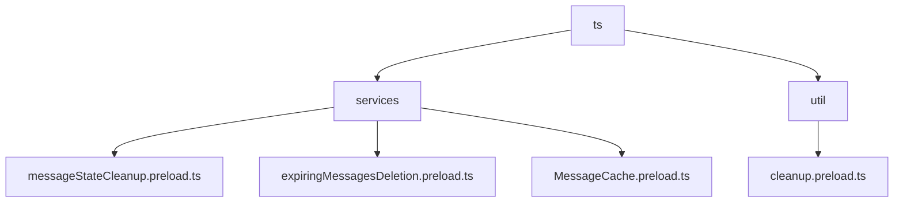
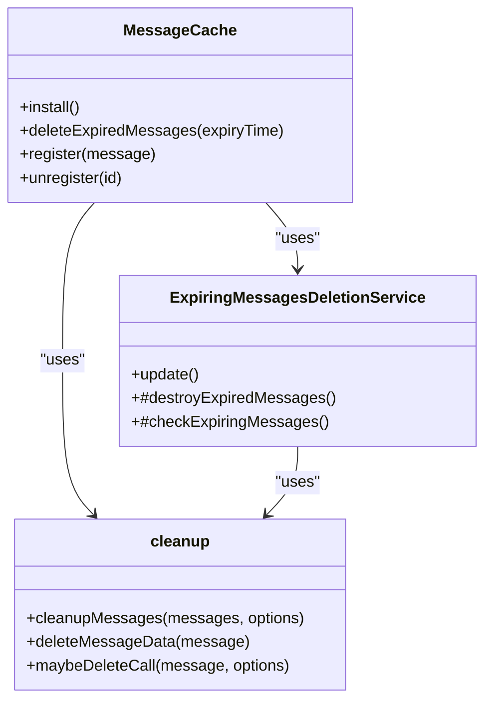
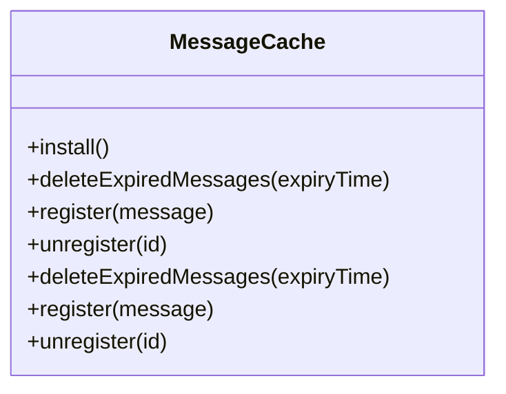
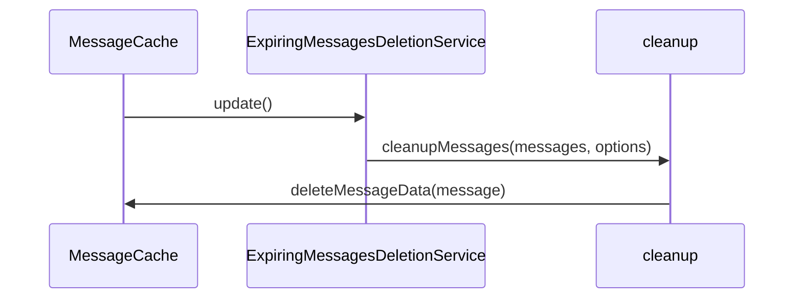
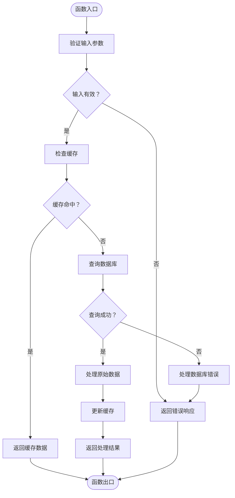
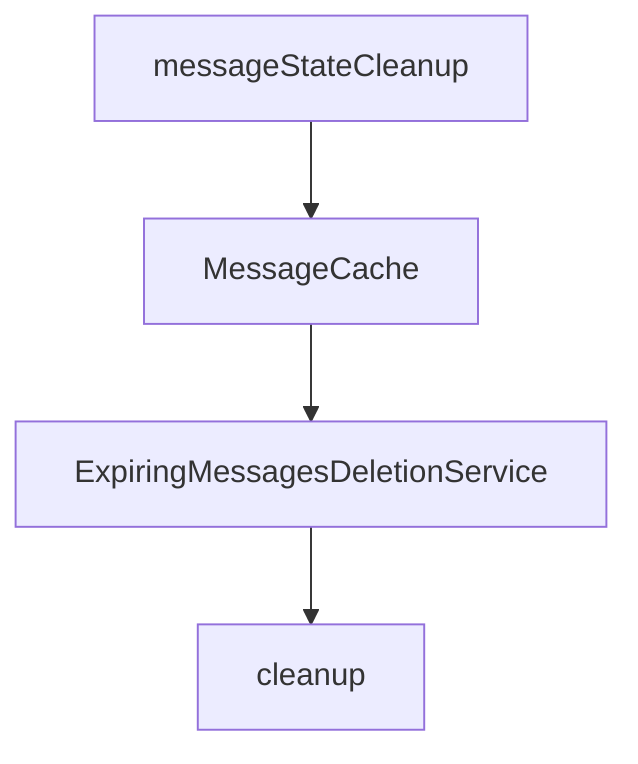

# 消息清理策略

<cite>
**本文档中引用的文件**  
- [messageStateCleanup.preload.ts](file://ts/services/messageStateCleanup.preload.ts)
- [expiringMessagesDeletion.preload.ts](file://ts/services/expiringMessagesDeletion.preload.ts)
- [MessageCache.preload.ts](file://ts/services/MessageCache.preload.ts)
- [cleanup.preload.ts](file://ts/util/cleanup.preload.ts)
- [RemoteConfig.dom.js](file://ts/RemoteConfig.dom.js)
</cite>

## 目录
1. [简介](#简介)
2. [项目结构](#项目结构)
3. [核心组件](#核心组件)
4. [架构概述](#架构概述)
5. [详细组件分析](#详细组件分析)
6. [依赖分析](#依赖分析)
7. [性能考虑](#性能考虑)
8. [故障排除指南](#故障排除指南)
9. [结论](#结论)

## 简介
Signal-Desktop 的消息清理策略旨在确保用户隐私和系统性能。该策略通过自动删除过期消息和清理资源来实现这一目标。本文件详细解释了消息清理的设计原理、触发机制和执行流程。

## 项目结构
Signal-Desktop 的项目结构清晰地组织了各个功能模块。消息清理相关的文件主要位于 `ts/services` 和 `ts/util` 目录下。

**Diagram sources**
- [messageStateCleanup.preload.ts](file://ts/services/messageStateCleanup.preload.ts)
- [expiringMessagesDeletion.preload.ts](file://ts/services/expiringMessagesDeletion.preload.ts)
- [cleanup.preload.ts](file://ts/util/cleanup.preload.ts)
- [MessageCache.preload.ts](file://ts/services/MessageCache.preload.ts)

**Section sources**
- [messageStateCleanup.preload.ts](file://ts/services/messageStateCleanup.preload.ts)
- [expiringMessagesDeletion.preload.ts](file://ts/services/expiringMessagesDeletion.preload.ts)
- [cleanup.preload.ts](file://ts/util/cleanup.preload.ts)
- [MessageCache.preload.ts](file://ts/services/MessageCache.preload.ts)

## 核心组件
消息清理策略的核心组件包括 `messageStateCleanup.preload.ts`、`expiringMessagesDeletion.preload.ts`、`MessageCache.preload.ts` 和 `cleanup.preload.ts`。这些文件共同实现了消息的定时清理、过期处理和资源回收。

**Section sources**
- [messageStateCleanup.preload.ts](file://ts/services/messageStateCleanup.preload.ts)
- [expiringMessagesDeletion.preload.ts](file://ts/services/expiringMessagesDeletion.preload.ts)
- [MessageCache.preload.ts](file://ts/services/MessageCache.preload.ts)
- [cleanup.preload.ts](file://ts/util/cleanup.preload.ts)

## 架构概述
消息清理策略的架构主要包括定时清理逻辑、过期消息处理和资源回收机制。`messageStateCleanup.preload.ts` 文件中的 `initMessageCleanup` 函数负责初始化定时清理任务。

**Diagram sources**
- [MessageCache.preload.ts](file://ts/services/MessageCache.preload.ts)
- [expiringMessagesDeletion.preload.ts](file://ts/services/expiringMessagesDeletion.preload.ts)
- [cleanup.preload.ts](file://ts/util/cleanup.preload.ts)

## 详细组件分析
### 消息状态清理分析
`messageStateCleanup.preload.ts` 文件中的 `initMessageCleanup` 函数通过 `setInterval` 定期调用 `window.MessageCache.deleteExpiredMessages` 方法，清理过期的消息。

#### 对象导向组件

**Diagram sources**
- [MessageCache.preload.ts](file://ts/services/MessageCache.preload.ts)

#### API/服务组件

**Diagram sources**
- [messageStateCleanup.preload.ts](file://ts/services/messageStateCleanup.preload.ts)
- [expiringMessagesDeletion.preload.ts](file://ts/services/expiringMessagesDeletion.preload.ts)
- [cleanup.preload.ts](file://ts/util/cleanup.preload.ts)

#### 复杂逻辑组件

**Diagram sources**
- [cleanup.preload.ts](file://ts/util/cleanup.preload.ts)

**Section sources**
- [messageStateCleanup.preload.ts](file://ts/services/messageStateCleanup.preload.ts)
- [expiringMessagesDeletion.preload.ts](file://ts/services/expiringMessagesDeletion.preload.ts)
- [MessageCache.preload.ts](file://ts/services/MessageCache.preload.ts)
- [cleanup.preload.ts](file://ts/util/cleanup.preload.ts)

## 依赖分析
消息清理策略依赖于多个组件，包括 `MessageCache`、`ExpiringMessagesDeletionService` 和 `cleanup`。这些组件之间的依赖关系确保了消息清理的高效性和可靠性。

**Diagram sources**
- [messageStateCleanup.preload.ts](file://ts/services/messageStateCleanup.preload.ts)
- [MessageCache.preload.ts](file://ts/services/MessageCache.preload.ts)
- [expiringMessagesDeletion.preload.ts](file://ts/services/expiringMessagesDeletion.preload.ts)
- [cleanup.preload.ts](file://ts/util/cleanup.preload.ts)

**Section sources**
- [messageStateCleanup.preload.ts](file://ts/services/messageStateCleanup.preload.ts)
- [MessageCache.preload.ts](file://ts/services/MessageCache.preload.ts)
- [expiringMessagesDeletion.preload.ts](file://ts/services/expiringMessagesDeletion.preload.ts)
- [cleanup.preload.ts](file://ts/util/cleanup.preload.ts)

## 性能考虑
消息清理策略在设计时充分考虑了性能影响。通过使用 `setInterval` 和 `debounce` 技术，减少了不必要的资源消耗。此外，`MessageCache` 使用 LRU 缓存机制，提高了消息访问的效率。

## 故障排除指南
### 清理不及时
如果消息清理不及时，可以检查 `messageStateCleanup.preload.ts` 中的 `initMessageCleanup` 函数是否正确初始化了定时任务。

### 资源泄漏
资源泄漏可能是由于 `cleanupMessages` 函数未能正确清理消息数据。检查 `cleanup.preload.ts` 中的 `deleteMessageData` 函数是否正确执行了资源回收。

### 性能下降
性能下降可能是由于频繁的数据库查询或缓存未命中。优化 `MessageCache` 的缓存策略，减少数据库查询次数。

**Section sources**
- [messageStateCleanup.preload.ts](file://ts/services/messageStateCleanup.preload.ts)
- [cleanup.preload.ts](file://ts/util/cleanup.preload.ts)
- [MessageCache.preload.ts](file://ts/services/MessageCache.preload.ts)

## 结论
Signal-Desktop 的消息清理策略通过定时清理、过期处理和资源回收机制，确保了用户隐私和系统性能。通过深入分析核心组件和依赖关系，我们可以更好地理解和优化这一策略。