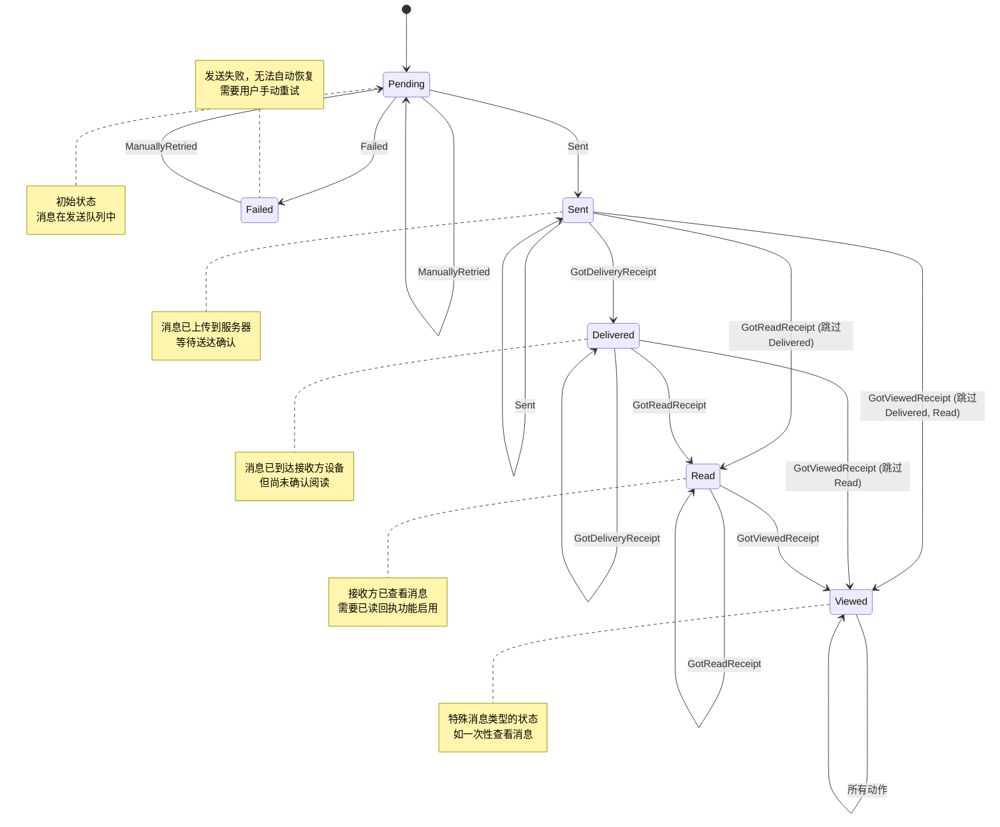

# 消息状态机

<cite>
**本文档引用的文件**  
- [MessageSendState.std.ts](file://ts/messages/MessageSendState.std.ts)
- [MessageReadStatus.std.ts](file://ts/messages/MessageReadStatus.std.ts)
- [handleDataMessage.preload.ts](file://ts/messages/handleDataMessage.preload.ts)
- [expiringMessagesDeletion.preload.ts](file://ts/services/expiringMessagesDeletion.preload.ts)
- [MessageReceipts.preload.ts](file://ts/messageModifiers/MessageReceipts.preload.ts)
- [migrateLegacySendAttributes.preload.ts](file://ts/messages/migrateLegacySendAttributes.preload.ts)
</cite>

## 目录
1. [引言](#引言)
2. [消息状态机设计原理](#消息状态机设计原理)
3. [核心状态定义](#核心状态定义)
4. [状态转换逻辑](#状态转换逻辑)
5. [消息生命周期](#消息生命周期)
6. [业务规则与约束](#业务规则与约束)
7. [状态转换图](#状态转换图)
8. [常见问题与解决方案](#常见问题与解决方案)
9. [结论](#结论)

## 引言

Signal-Desktop消息状态机是确保消息传递可靠性与状态一致性的核心组件。该状态机跟踪每条消息在不同接收者之间的发送状态，从创建到最终过期的完整生命周期。状态机设计遵循严格的状态转换规则，确保消息状态只能向前推进，不能回退，从而维护了消息传递的可靠性。本文档将深入分析消息状态机的设计原理、状态定义、转换逻辑以及相关业务规则。

## 消息状态机设计原理

消息状态机的设计基于有限状态机（FSM）模式，每个消息对每个接收者都有独立的状态跟踪。状态机的核心设计原则是状态的单向性，即状态只能从较低级别向较高级别转换，不能回退。这种设计确保了消息状态的一致性和可预测性。

状态机通过`sendStateReducer`函数实现状态转换，该函数接收当前状态和触发动作，返回新的状态。状态转换基于预定义的映射表`STATE_TRANSITIONS`，确保所有转换都符合业务规则。状态机还支持时间戳记录，可以追踪状态变更的具体时间。

状态机的设计考虑了多种异常情况，如网络中断、消息重发等。通过`Failed`状态和`ManuallyRetried`动作，系统能够处理发送失败的情况并支持手动重试。此外，状态机还支持批量处理和去重，通过`summarizeMessageSendStatuses`函数优化大规模群组消息的状态管理性能。

**Section sources**
- [MessageSendState.std.ts](file://ts/messages/MessageSendState.std.ts#L1-L278)

## 核心状态定义

消息状态机定义了多个核心状态，每个状态代表消息传递过程中的一个关键阶段：

- **Pending**：消息尚未发送，系统正在尝试发送
- **Sent**：消息已成功发送到服务器
- **Delivered**：已收到送达回执，消息已到达接收方设备
- **Read**：已收到已读回执，接收方已查看消息
- **Viewed**：已收到已阅回执，适用于一次性查看消息等特殊类型
- **Failed**：发送失败，无法恢复
- **Skipped**：跳过状态，用于特定场景

每个状态都有明确的业务含义和转换条件。例如，`Pending`状态表示消息正在发送队列中，而`Sent`状态表示消息已成功上传到Signal服务器。状态之间通过数字优先级进行比较，确保状态只能向前推进。

除了发送状态，系统还定义了阅读状态`ReadStatus`，包括`Unread`、`Read`和`Viewed`，用于跟踪本地消息的阅读情况。这两种状态系统相互独立但又协同工作，共同构成了完整的消息状态管理体系。

**Section sources**
- [MessageSendState.std.ts](file://ts/messages/MessageSendState.std.ts#L29-L36)
- [MessageReadStatus.std.ts](file://ts/messages/MessageReadStatus.std.ts#L13-L17)

## 状态转换逻辑

消息状态机的状态转换遵循严格的规则，确保状态只能向前推进，不能回退。转换逻辑通过`sendStateReducer`函数实现，该函数根据当前状态和触发动作计算新状态。

主要转换路径如下：
- `Pending` → `Failed`：当发送失败且无法恢复时
- `Pending` → `Sent`：当消息成功发送到服务器时
- `Sent` → `Delivered`：当收到送达回执时
- `Delivered` → `Read`：当收到已读回执时
- `Read` → `Viewed`：当收到已阅回执时

特殊情况下，状态转换可能跳过中间状态。例如，如果系统先收到已读回执再收到送达回执，状态会直接从`Sent`跳到`Read`，跳过`Delivered`状态。这种设计提高了系统的灵活性和效率。

状态转换还支持错误恢复机制。当消息处于`Failed`状态时，通过`ManuallyRetried`动作可以将其重置为`Pending`状态，重新尝试发送。这种机制为用户提供了解决发送问题的手动干预途径。

**Section sources**
- [MessageSendState.std.ts](file://ts/messages/MessageSendState.std.ts#L111-L134)

## 消息生命周期

消息的完整生命周期从创建开始，经历发送、传递、阅读等阶段，最终可能过期或被删除。生命周期的每个阶段都由状态机精确跟踪和管理。

消息创建时处于`Pending`状态，系统开始尝试发送。一旦消息成功上传到服务器，状态变为`Sent`。当接收方设备确认收到消息后，发送方会收到送达回执，状态升级为`Delivered`。

当接收方打开并查看消息时，如果启用了已读回执功能，发送方会收到已读回执，状态变为`Read`。对于一次性查看消息等特殊类型，当接收方实际查看内容后，状态会进一步升级为`Viewed`。

消息还可能设置自动销毁计时器。`expiringMessagesDeletion`服务负责监控即将过期的消息，并在计时器到期后自动删除消息内容。这个过程独立于状态机，但与消息生命周期密切相关。

在整个生命周期中，系统通过`MessageCache`管理消息的内存状态，确保状态变更能够及时反映在用户界面中。同时，所有状态变更都会持久化到数据库，保证跨设备同步的一致性。

**Section sources**
- [handleDataMessage.preload.ts](file://ts/messages/handleDataMessage.preload.ts#L1-L824)
- [expiringMessagesDeletion.preload.ts](file://ts/services/expiringMessagesDeletion.preload.ts#L1-L125)

## 业务规则与约束

消息状态机的实现遵循一系列严格的业务规则和约束条件，确保系统的可靠性和一致性。

首要规则是状态的单向性约束：状态只能向前推进，不能回退。这一规则通过`maxStatus`函数强制执行，该函数总是返回两个状态中较高级别的那个。例如，一旦消息达到`Read`状态，任何试图将其降级为`Delivered`或`Sent`的操作都会被忽略。

并发更新协调是另一个重要约束。由于消息可能同时收到来自多个接收方的回执，系统需要处理并发状态更新。通过使用`sendStateByConversationId`对象，系统为每个对话维护独立的状态，避免了竞争条件。状态更新操作是原子的，确保了数据的一致性。

消息重发机制遵循特定的业务规则。只有处于`Failed`状态的消息才能被手动重试，重试后状态重置为`Pending`。系统会记录重试次数和时间，防止无限重试循环。重发过程中，原有的成功状态（如`Delivered`）会被保留，确保不会丢失已有的传递信息。

状态回滚处理被严格限制。正常情况下不允许状态回滚，但在数据迁移或修复场景下，系统提供了特殊的处理路径。`migrateLegacySendAttributes`函数负责将旧版本的状态数据迁移到新的状态机模型，确保向后兼容性。

**Section sources**
- [MessageSendState.std.ts](file://ts/messages/MessageSendState.std.ts#L67-L83)
- [migrateLegacySendAttributes.preload.ts](file://ts/messages/migrateLegacySendAttributes.preload.ts#L1-L143)

## 状态转换图

**Diagram sources**
- [MessageSendState.std.ts](file://ts/messages/MessageSendState.std.ts#L29-L36)
- [MessageSendState.std.ts](file://ts/messages/MessageSendState.std.ts#L136-L143)

## 常见问题与解决方案

在消息状态机的实际运行中，可能会遇到几种常见问题，系统提供了相应的解决方案。

状态不一致问题是首要挑战。由于网络延迟或设备离线，不同设备间的状态可能出现暂时不一致。解决方案是采用最终一致性模型，通过定期同步和状态合并确保所有设备最终达到一致状态。`summarizeMessageSendStatuses`函数的缓存机制也帮助减少了状态查询的开销。

状态丢失问题可能发生在应用崩溃或数据损坏的情况下。系统通过持久化存储和事务性操作来预防状态丢失。所有状态变更都会立即写入数据库，并通过`MessageCache`保持内存与存储的一致性。在启动时，系统会验证和修复可能损坏的状态数据。

状态冲突通常出现在并发更新场景中。当多个回执几乎同时到达时，系统需要协调这些更新。解决方案是采用最后写入获胜（Last Write Wins）策略，结合时间戳来确定更新顺序。`sendStateReducer`函数的幂等性确保了即使重复应用相同的状态更新，结果也是一致的。

对于大规模群组消息，性能问题是一个挑战。系统通过批处理和去重优化性能。`processReceiptBatcher`批量处理回执，减少数据库操作次数。`summarizeMessageSendStatuses`的memoization缓存避免了重复计算，显著提升了大规模群组的性能表现。

**Section sources**
- [MessageReceipts.preload.ts](file://ts/messageModifiers/MessageReceipts.preload.ts#L1-L575)
- [MessageSendState.std.ts](file://ts/messages/MessageSendState.std.ts#L244-L277)

## 结论

Signal-Desktop消息状态机是一个精心设计的系统，确保了消息传递的可靠性和状态的一致性。通过严格的单向状态转换规则、完善的错误处理机制和高效的性能优化，状态机能够应对各种复杂的网络环境和使用场景。

状态机的设计体现了高内聚、低耦合的原则，各个组件职责明确，相互协作。`SendStatus`枚举定义了清晰的状态语义，`sendStateReducer`函数实现了确定性的状态转换，而辅助函数提供了丰富的状态查询和管理能力。

对于开发者而言，理解状态机的工作原理有助于更好地维护和扩展消息系统。状态机的模块化设计使得添加新状态或修改转换规则相对简单，同时保持了系统的稳定性和可靠性。未来可以考虑引入更智能的重试策略和更精细的状态监控，进一步提升用户体验。