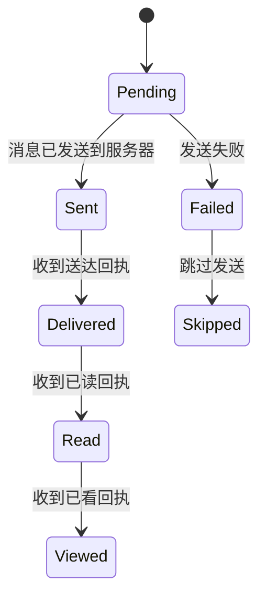
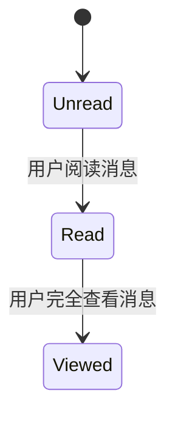
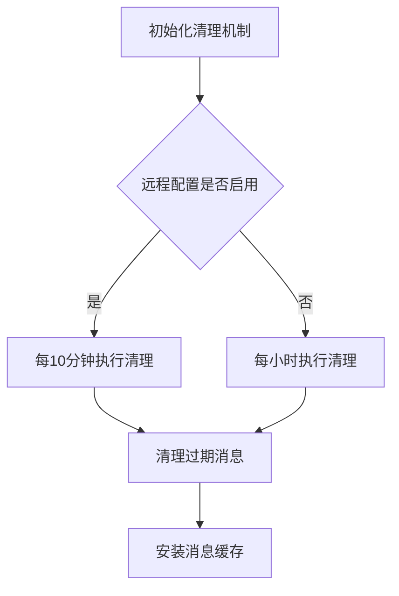
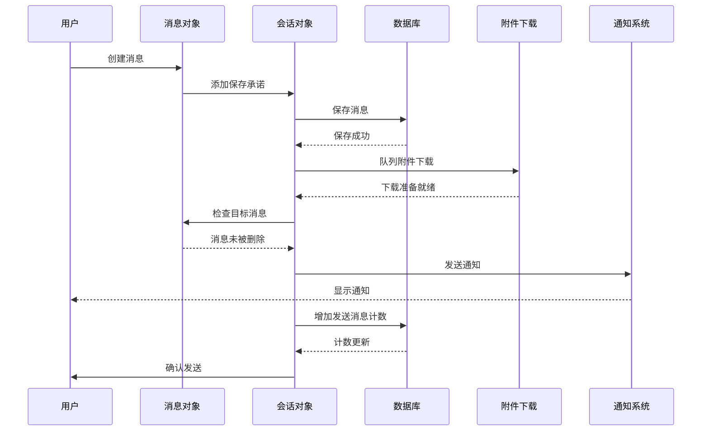
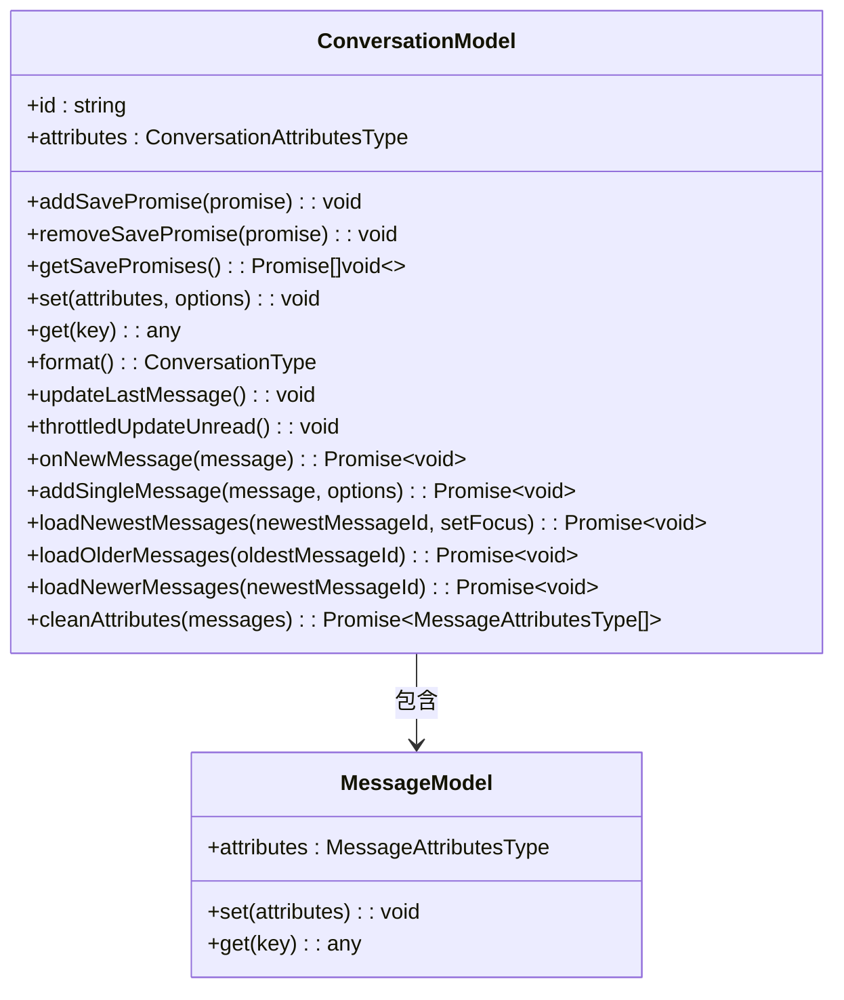
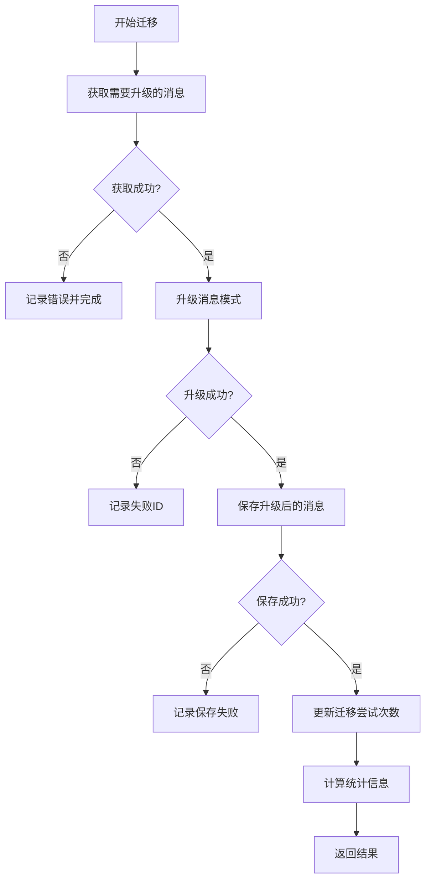

# 消息状态管理

<cite>
**本文档中引用的文件**   
- [messageStateCleanup.preload.ts](file://ts/services/messageStateCleanup.preload.ts)
- [saveAndNotify.preload.ts](file://ts/messages/saveAndNotify.preload.ts)
- [conversations.preload.ts](file://ts/models/conversations.preload.ts)
- [migrateMessageData.preload.ts](file://ts/messages/migrateMessageData.preload.ts)
- [MessageSendState.std.ts](file://ts/messages/MessageSendState.std.ts)
- [MessageReadStatus.std.ts](file://ts/messages/MessageReadStatus.std.ts)
</cite>

## 目录
1. [简介](#简介)
2. [消息生命周期与状态机](#消息生命周期与状态机)
3. [状态清理策略](#状态清理策略)
4. [消息持久化流程](#消息持久化流程)
5. [会话状态管理](#会话状态管理)
6. [数据结构演进](#数据结构演进)
7. [常见问题与解决方案](#常见问题与解决方案)
8. [结论](#结论)

## 简介
本文档深入探讨Signal-Desktop应用中的消息状态管理机制。文档详细解释了消息的生命周期管理、状态转换和清理策略，重点分析了`messageStateCleanup.preload.ts`中的状态清理逻辑、`saveAndNotify.preload.ts`中的消息持久化流程以及`conversations.preload.ts`中的会话状态管理。同时，文档记录了消息状态机的各个状态、转换条件和触发事件，解释了`migrateMessageData.preload.ts`在数据结构演进中的作用，并提供了消息状态转换图，展示从草稿到已发送、已读的完整状态变迁。此外，文档还解决了状态不一致、消息丢失和清理不及时等常见问题及其解决方案，为初学者提供消息状态流程的概述，同时为经验丰富的开发者提供状态机设计和性能优化的技术细节。

## 消息生命周期与状态机
Signal-Desktop中的消息状态管理基于一个复杂的状态机，该状态机定义了消息从创建到最终状态的完整生命周期。消息状态机的核心是`SendStatus`和`ReadStatus`两个枚举类型，它们分别管理消息的发送状态和阅读状态。

### 发送状态 (SendStatus)
`SendStatus`枚举定义了消息发送过程中的各个状态，这些状态代表了消息在传输过程中的不同阶段：

**Diagram sources**
- [MessageSendState.std.ts](file://ts/messages/MessageSendState.std.ts#L29-L37)

`SendStatus`的状态转换遵循严格的顺序，确保消息状态的正确性和一致性。每个状态都有其特定的含义：
- **Pending**: 消息尚未发送，系统正在尝试发送
- **Sent**: 消息已成功发送到服务器
- **Delivered**: 服务器已确认消息送达目标设备
- **Read**: 目标用户已打开并阅读消息
- **Viewed**: 对于特定类型的消息（如语音消息），用户已完全查看
- **Failed**: 发送过程中发生不可恢复的错误
- **Skipped**: 在特定情况下跳过发送（如故事消息的去重）

### 阅读状态 (ReadStatus)
`ReadStatus`枚举管理消息的本地阅读状态，反映了用户对消息的查看情况：

**Diagram sources**
- [MessageReadStatus.std.ts](file://ts/messages/MessageReadStatus.std.ts#L13-L17)

`ReadStatus`的状态转换同样遵循单向原则，确保状态不会倒退。值得注意的是，`ReadStatus`的设计中，`Unread`对应值1，`Read`对应值0，这是为了与旧版系统中的"unread"字段保持兼容。

### 状态转换条件与触发事件
消息状态的转换由多种事件触发，主要包括：
- **用户操作**: 用户发送消息、阅读消息等
- **网络事件**: 收到服务器回执、网络连接变化等
- **定时任务**: 周期性检查和清理任务
- **系统事件**: 应用启动、关闭、同步等

状态转换遵循严格的规则，确保不会出现状态倒退的情况。例如，一旦消息状态从"Pending"变为"Sent"，就不可能再回到"Pending"状态。这种单向状态转换机制保证了消息状态的一致性和可靠性。

**Section sources**
- [MessageSendState.std.ts](file://ts/messages/MessageSendState.std.ts#L29-L37)
- [MessageReadStatus.std.ts](file://ts/messages/MessageReadStatus.std.ts#L13-L17)

## 状态清理策略
Signal-Desktop通过`messageStateCleanup.preload.ts`文件实现消息状态的清理策略，确保系统资源的有效利用和性能优化。

### 状态清理逻辑
`messageStateCleanup.preload.ts`文件中的`initMessageCleanup`函数负责初始化消息清理机制：

**Diagram sources**
- [messageStateCleanup.preload.ts](file://ts/services/messageStateCleanup.preload.ts#L10-L17)

该清理机制的核心是`MessageCache.deleteExpiredMessages`方法，它定期清理过期的消息缓存。清理频率由远程配置`desktop.messageCleanup`控制，如果配置启用，则每10分钟执行一次清理；否则，每小时执行一次清理。

### 清理策略的实现
消息清理策略的实现考虑了多个因素：
- **性能影响**: 清理操作的频率需要平衡清理效果和系统性能
- **用户体验**: 频繁的清理可能影响用户体验，需要在后台静默执行
- **资源管理**: 有效管理内存和存储资源，防止资源泄漏

清理机制通过`setInterval`定时器实现，确保清理任务能够周期性执行。同时，通过`MessageCache.install()`方法安装消息缓存，为清理操作提供基础支持。

**Section sources**
- [messageStateCleanup.preload.ts](file://ts/services/messageStateCleanup.preload.ts#L10-L17)

## 消息持久化流程
`saveAndNotify.preload.ts`文件定义了消息的持久化流程，这是消息状态管理中的关键环节。

### 持久化流程分析
消息持久化流程是一个复杂的异步操作序列，确保消息在各种情况下都能正确保存和通知：

**Diagram sources**
- [saveAndNotify.preload.ts](file://ts/messages/saveAndNotify.preload.ts#L23-L70)

### 流程关键步骤
消息持久化流程包含以下关键步骤：
1. **添加保存承诺**: 通过`addSavePromise`方法将保存操作添加到会话的保存承诺队列中
2. **保存到数据库**: 使用`saveNewMessageBatcher.add`方法将消息属性批量保存到数据库
3. **队列附件下载**: 调用`handleAttachmentDownloadsForNewMessage`方法为新消息队列附件下载
4. **检查目标消息**: 通过`modifyTargetMessage`方法检查消息是否被删除
5. **发送通知**: 调用`maybeNotify`方法处理消息通知
6. **更新计数**: 如果是出站消息，调用`incrementSentMessageCount`方法增加发送消息计数
7. **确认发送**: 调用`confirm`回调函数确认消息发送完成

该流程通过`try-finally`块确保所有操作都能正确完成，即使发生异常也能正确清理资源。

**Section sources**
- [saveAndNotify.preload.ts](file://ts/messages/saveAndNotify.preload.ts#L23-L70)

## 会话状态管理
`conversations.preload.ts`文件是会话状态管理的核心，它定义了会话对象的完整状态管理和操作。

### 会话状态管理机制
会话状态管理通过`ConversationModel`类实现，该类提供了丰富的状态管理功能：

**Diagram sources**
- [conversations.preload.ts](file://ts/models/conversations.preload.ts#L300-L363)
- [conversations.preload.ts](file://ts/models/conversations.preload.ts#L2333-L2334)

### 核心功能分析
会话状态管理的核心功能包括：

#### 状态持久化
`ConversationModel`通过`set`和`get`方法提供状态的读写接口，确保状态变更能够正确反映到UI层。`addSavePromise`和`removeSavePromise`方法管理保存操作的承诺队列，确保所有保存操作都能正确完成。

#### 消息管理
会话对象提供了完整的消息管理功能，包括：
- `onNewMessage`: 处理新消息到达事件
- `addSingleMessage`: 添加单个消息到会话
- `loadNewestMessages`: 加载最新消息
- `loadOlderMessages`: 加载更早的消息
- `loadNewerMessages`: 加载更新的消息

#### 状态更新
会话状态管理通过节流（throttle）机制优化性能，避免频繁的状态更新：
- `throttledUpdateUnread`: 节流的未读状态更新
- `debouncedUpdateLastMessage`: 防抖的最后消息更新

这些机制确保在高频率的消息交互中，系统性能不会受到影响。

**Section sources**
- [conversations.preload.ts](file://ts/models/conversations.preload.ts#L300-L363)
- [conversations.preload.ts](file://ts/models/conversations.preload.ts#L2333-L2334)

## 数据结构演进
`migrateMessageData.preload.ts`文件负责消息数据结构的演进，确保系统在版本升级过程中数据的兼容性和完整性。

### 数据结构演进机制
消息数据结构演进通过`_migrateMessageData`函数实现，该函数确保数据库中的消息都处于正确的模式版本：

**Diagram sources**
- [migrateMessageData.preload.ts](file://ts/messages/migrateMessageData.preload.ts#L49-L159)

### 演进策略分析
数据结构演进策略包含以下关键要素：

#### 批量处理
演进过程采用批量处理策略，通过`numMessagesPerBatch`参数控制每次处理的消息数量，避免一次性处理大量数据导致性能问题。

#### 并发控制
使用`PQueue`队列确保迁移批次不会并发执行，通过`MAX_CONCURRENCY`参数控制升级过程中的并发度，平衡处理速度和系统负载。

#### 错误处理
演进过程包含完善的错误处理机制：
- 获取消息失败时记录错误并继续处理
- 升级消息失败时记录失败ID并继续处理
- 保存消息失败时记录失败索引并继续处理
- 最终统计成功、失败和处理的总数量

#### 迁移完成
通过`done`标志判断迁移是否完成，当处理的消息数量少于批次大小时，认为迁移完成。

**Section sources**
- [migrateMessageData.preload.ts](file://ts/messages/migrateMessageData.preload.ts#L49-L159)

## 常见问题与解决方案
在消息状态管理过程中，可能会遇到一些常见问题，本节提供相应的解决方案。

### 状态不一致问题
**问题描述**: 消息状态在不同设备或组件之间出现不一致。

**解决方案**:
1. 使用统一的状态机管理所有状态转换
2. 通过`sendStateReducer`函数确保状态转换的原子性和一致性
3. 在状态变更时触发全局事件，确保所有监听器都能及时更新

### 消息丢失问题
**问题描述**: 消息在发送或接收过程中丢失。

**解决方案**:
1. 实现消息重试机制，对于发送失败的消息自动重试
2. 使用`saveAndNotify`流程确保消息在保存到数据库后才确认发送
3. 实现消息确认机制，确保消息送达后才更新状态

### 清理不及时问题
**问题描述**: 过期消息未能及时清理，占用系统资源。

**解决方案**:
1. 优化清理频率，根据系统负载动态调整清理间隔
2. 实现增量清理，每次只清理少量过期消息，避免一次性清理大量数据
3. 使用`MessageCache`机制缓存消息，减少数据库查询压力

**Section sources**
- [messageStateCleanup.preload.ts](file://ts/services/messageStateCleanup.preload.ts#L10-L17)
- [saveAndNotify.preload.ts](file://ts/messages/saveAndNotify.preload.ts#L23-L70)
- [conversations.preload.ts](file://ts/models/conversations.preload.ts#L300-L363)

## 结论
Signal-Desktop的消息状态管理是一个复杂而精密的系统，它通过状态机、持久化流程、会话管理和数据结构演进等多个组件协同工作，确保消息在各种情况下的正确性和可靠性。系统设计考虑了性能、用户体验和资源管理等多个方面，通过节流、防抖、批量处理等技术优化系统性能。对于开发者而言，理解这些机制有助于更好地维护和扩展系统功能；对于初学者而言，这些设计模式提供了优秀的学习范例。