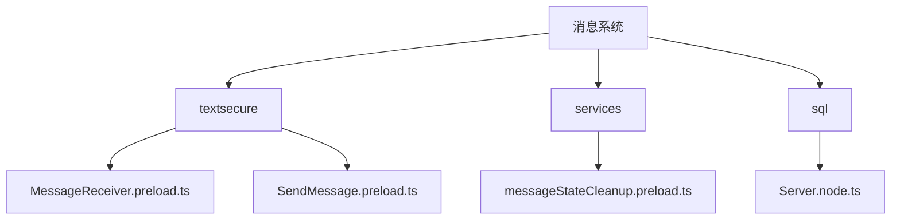
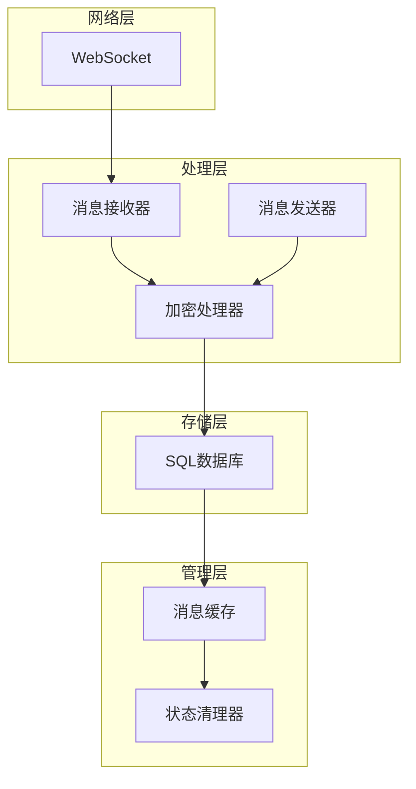
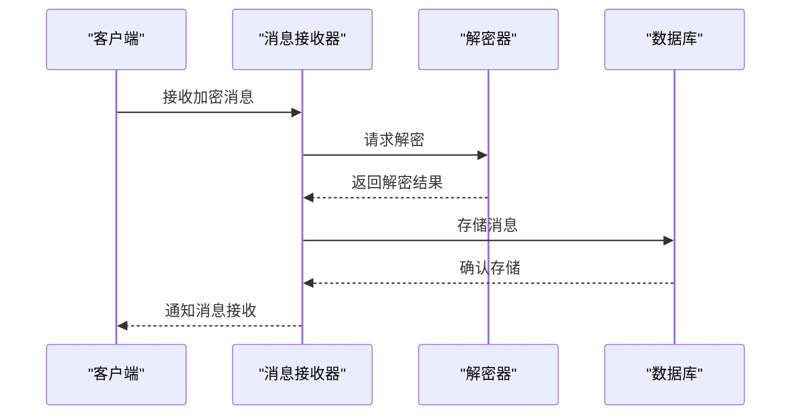
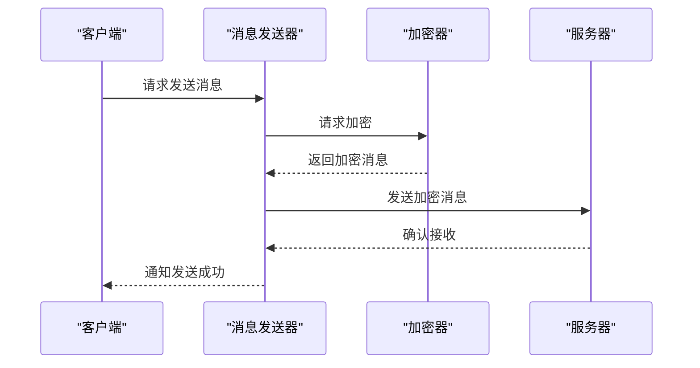
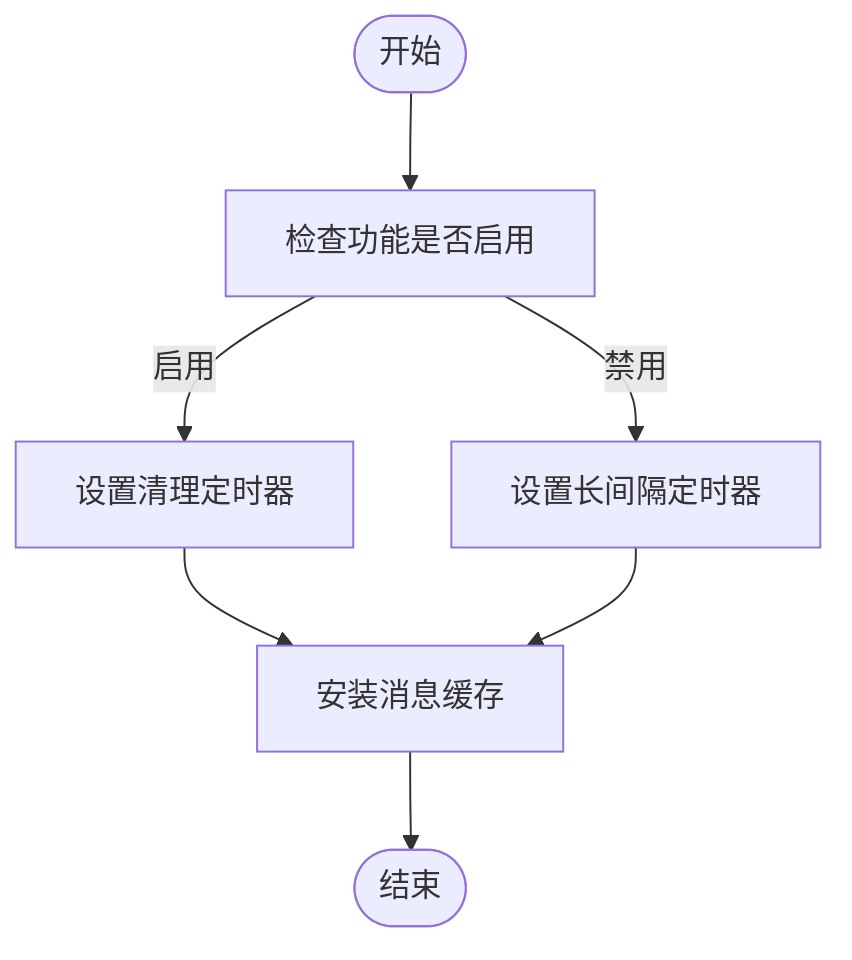
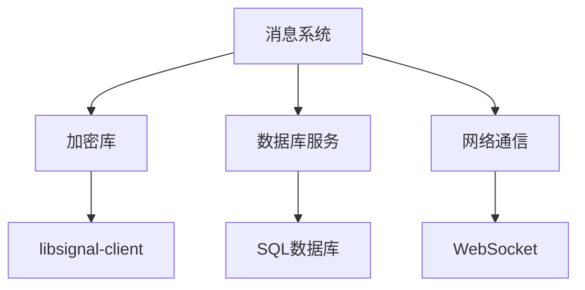

# 消息系统

<cite>
**本文档中引用的文件**  
- [MessageReceiver.preload.ts](file://ts\textsecure\MessageReceiver.preload.ts)
- [SendMessage.preload.ts](file://ts\textsecure\SendMessage.preload.ts)
- [messageStateCleanup.preload.ts](file://ts\services\messageStateCleanup.preload.ts)
- [Server.node.ts](file://ts\sql\Server.node.ts)
- [MessageCache.preload.ts](file://ts\services\MessageCache.preload.ts)
</cite>

## 目录
1. [引言](#引言)
2. [项目结构](#项目结构)
3. [核心组件](#核心组件)
4. [架构概述](#架构概述)
5. [详细组件分析](#详细组件分析)
6. [依赖分析](#依赖分析)
7. [性能考虑](#性能考虑)
8. [故障排除指南](#故障排除指南)
9. [结论](#结论)

## 引言
本文档深入探讨Signal-Desktop消息系统的实现细节，重点分析端到端加密机制、消息同步策略、文件传输实现和消息状态管理。文档涵盖消息接收处理、发送流程和状态清理逻辑的具体实现，并记录消息加密接口、同步参数和传输返回值。同时，文档解释消息系统与数据库(sql)、用户界面(components)和网络服务(textsecure)的集成关系，并提供针对消息丢失、同步延迟和加密失败等常见问题的解决方案。

## 项目结构
Signal-Desktop项目采用模块化结构，主要分为以下几个核心目录：
- `_locales`：多语言支持文件
- `app`：主应用程序逻辑
- `components`：UI组件
- `config`：配置文件
- `protos`：协议缓冲区定义
- `ts`：TypeScript源代码，包含核心功能实现

消息系统的核心功能主要分布在`ts`目录下的`textsecure`、`services`和`sql`子目录中。

**图表来源**
- [MessageReceiver.preload.ts](file://ts\textsecure\MessageReceiver.preload.ts)
- [SendMessage.preload.ts](file://ts\textsecure\SendMessage.preload.ts)
- [messageStateCleanup.preload.ts](file://ts\services\messageStateCleanup.preload.ts)
- [Server.node.ts](file://ts\sql\Server.node.ts)

## 核心组件
消息系统的核心组件包括消息接收器(MessageReceiver)、消息发送器(SendMessage)和消息状态清理器(messageStateCleanup)。这些组件协同工作，确保消息的安全传输和状态管理。

**章节来源**
- [MessageReceiver.preload.ts](file://ts\textsecure\MessageReceiver.preload.ts#L1-L4208)
- [SendMessage.preload.ts](file://ts\textsecure\SendMessage.preload.ts#L1-L2603)
- [messageStateCleanup.preload.ts](file://ts\services\messageStateCleanup.preload.ts#L1-L18)

## 架构概述
Signal-Desktop消息系统采用分层架构，主要包括消息接收层、加密处理层、数据库存储层和状态管理层。系统通过WebSocket接收消息，经过解密处理后存储到本地数据库，并通过状态管理机制确保消息的完整性和一致性。

**图表来源**
- [MessageReceiver.preload.ts](file://ts\textsecure\MessageReceiver.preload.ts#L1-L4208)
- [SendMessage.preload.ts](file://ts\textsecure\SendMessage.preload.ts#L1-L2603)
- [messageStateCleanup.preload.ts](file://ts\services\messageStateCleanup.preload.ts#L1-L18)
- [Server.node.ts](file://ts\sql\Server.node.ts#L3095-L3303)

## 详细组件分析

### 消息接收处理
消息接收器负责处理从服务器接收到的消息，包括解密、验证和分发。系统支持多种消息类型，包括普通消息、同步消息和预密钥消息。

**图表来源**
- [MessageReceiver.preload.ts](file://ts\textsecure\MessageReceiver.preload.ts#L1851-L1936)

### 消息发送流程
消息发送器负责构建和发送消息，包括消息加密、签名和传输。系统支持单播和组播消息发送，确保消息的安全性和可靠性。

**图表来源**
- [SendMessage.preload.ts](file://ts\textsecure\SendMessage.preload.ts#L1531-L1577)

### 状态清理逻辑
消息状态清理器负责定期清理过期的消息状态，确保系统性能和存储效率。清理过程包括删除过期消息和更新缓存状态。

**图表来源**
- [messageStateCleanup.preload.ts](file://ts\services\messageStateCleanup.preload.ts#L10-L17)

## 依赖分析
消息系统依赖于多个核心模块，包括加密库、数据库服务和网络通信模块。这些依赖关系确保了系统的安全性和可靠性。

**图表来源**
- [MessageReceiver.preload.ts](file://ts\textsecure\MessageReceiver.preload.ts#L1-L4208)
- [SendMessage.preload.ts](file://ts\textsecure\SendMessage.preload.ts#L1-L2603)
- [Server.node.ts](file://ts\sql\Server.node.ts#L3095-L3303)

**章节来源**
- [MessageReceiver.preload.ts](file://ts\textsecure\MessageReceiver.preload.ts#L1-L4208)
- [SendMessage.preload.ts](file://ts\textsecure\SendMessage.preload.ts#L1-L2603)
- [Server.node.ts](file://ts\sql\Server.node.ts#L3095-L3303)

## 性能考虑
消息系统在设计时充分考虑了性能因素，包括消息处理的并发性、数据库操作的优化和内存使用的效率。系统采用批量处理和缓存机制来提高性能。

## 故障排除指南
针对消息系统可能出现的问题，提供以下解决方案：

1. **消息丢失**：检查网络连接和服务器状态，确保消息发送和接收的可靠性。
2. **同步延迟**：优化网络通信和消息处理流程，减少同步时间。
3. **加密失败**：验证加密密钥和证书的有效性，确保加密过程的正确性。

**章节来源**
- [MessageReceiver.preload.ts](file://ts\textsecure\MessageReceiver.preload.ts#L3001-L3240)
- [SendMessage.preload.ts](file://ts\textsecure\SendMessage.preload.ts#L322-L481)

## 结论
Signal-Desktop消息系统通过精心设计的架构和实现，确保了消息的安全传输和高效管理。系统采用端到端加密、消息同步和状态管理等技术，为用户提供可靠的消息服务。