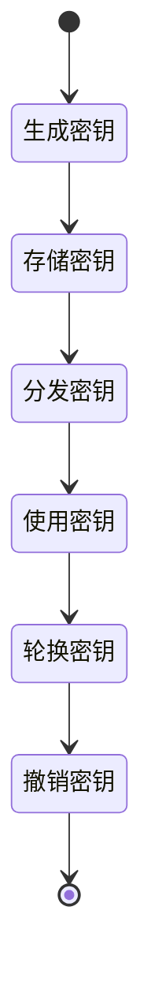
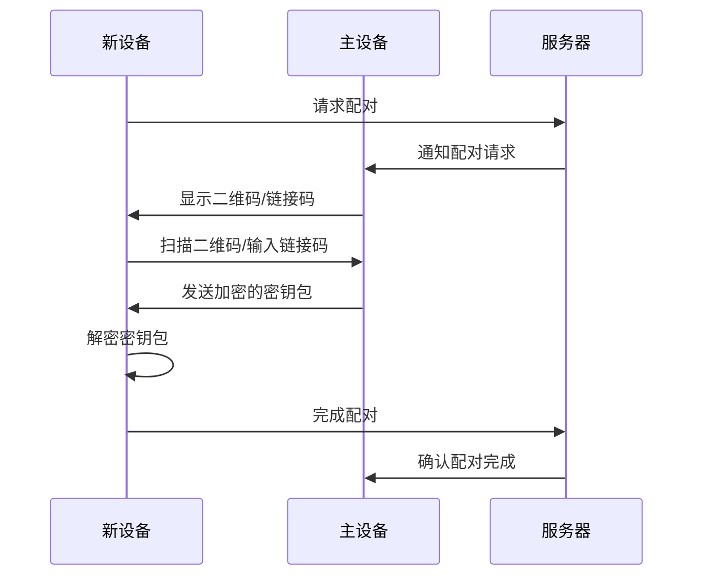
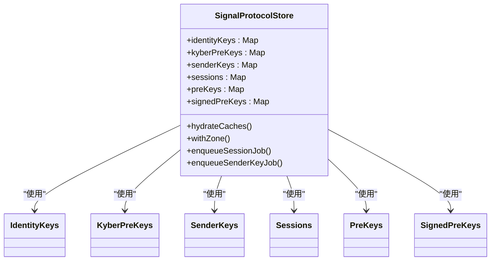
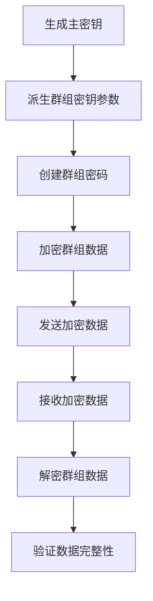
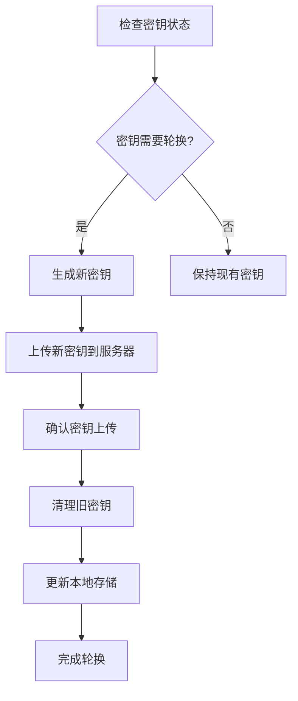

# 密钥管理

<cite>
**本文档中引用的文件**   
- [ProvisioningCipher.node.ts](file://ts/textsecure/ProvisioningCipher.node.ts)
- [SignalProtocolStore.preload.ts](file://ts/SignalProtocolStore.preload.ts)
- [zkgroup.node.ts](file://ts/util/zkgroup.node.ts)
- [LibSignalStores.preload.ts](file://ts/LibSignalStores.preload.ts)
- [AccountManager.preload.ts](file://ts/textsecure/AccountManager.preload.ts)
- [Crypto.node.ts](file://ts/Crypto.node.ts)
</cite>

## 目录
1. [简介](#简介)
2. [密钥类型与生命周期](#密钥类型与生命周期)
3. [密钥协商过程](#密钥协商过程)
4. [密钥持久化策略](#密钥持久化策略)
5. [零知识证明群组加密](#零知识证明群组加密)
6. [密钥轮换与撤销](#密钥轮换与撤销)
7. [常见问题与解决方案](#常见问题与解决方案)
8. [安全审计要点](#安全审计要点)

## 简介
Signal-Desktop的密钥管理系统基于Signal协议，实现了端到端加密通信的安全保障。该系统管理着长期密钥、短期密钥和会话密钥的完整生命周期，确保通信的机密性、完整性和身份验证。本文档详细解释了密钥生成、存储、同步和轮换的机制，重点关注ProvisioningCipher.node.ts中的密钥协商过程、SignalProtocolStore.preload.ts中的密钥持久化策略以及zkgroup.node.ts中的零知识证明群组加密实现。

## 密钥类型与生命周期

Signal-Desktop的密钥管理系统管理着多种类型的密钥，每种密钥都有其特定的用途和生命周期。

### 长期密钥
长期密钥（Identity Key）是用户身份的核心标识，由公钥和私钥对组成。这些密钥在用户注册时生成，并在整个账户生命周期内保持不变。长期密钥用于验证用户身份和建立安全通信。

### 短期密钥
短期密钥（PreKey）是用于建立新会话的临时密钥。系统会预先生成一批短期密钥并上传到服务器，当其他用户需要与该用户建立通信时，会从服务器获取一个短期密钥来启动密钥协商过程。短期密钥在使用一次后即被标记为已使用并从服务器移除。

### 会话密钥
会话密钥（Session Key）是在密钥协商过程中生成的临时密钥，用于加密和解密特定会话中的消息。每个会话都有独立的会话密钥，即使同一对用户之间的多个会话也使用不同的会话密钥，这实现了前向保密性。

**Diagram sources**
- [AccountManager.preload.ts](file://ts/textsecure/AccountManager.preload.ts#L344-L367)
- [SignalProtocolStore.preload.ts](file://ts/SignalProtocolStore.preload.ts#L374-L382)

## 密钥协商过程

密钥协商过程是Signal协议的核心，它允许两个用户在不安全的通信渠道上建立共享的会话密钥。

### ProvisioningCipher实现
ProvisioningCipher.node.ts文件实现了设备配对过程中的密钥协商机制。当新设备需要加入用户的Signal网络时，会通过二维码或链接码进行配对，这个过程涉及到密钥的协商和交换。

**Diagram sources**
- [ProvisioningCipher.node.ts](file://ts/textsecure/ProvisioningCipher.node.ts#L49-L142)
- [AccountManager.preload.ts](file://ts/textsecure/AccountManager.preload.ts#L1072-L1086)

**Section sources**
- [ProvisioningCipher.node.ts](file://ts/textsecure/ProvisioningCipher.node.ts#L1-L171)

## 密钥持久化策略

SignalProtocolStore.preload.ts文件实现了密钥的持久化存储策略，确保密钥在应用重启后仍然可用。

### 缓存机制
系统使用内存缓存来提高密钥访问性能。SignalProtocolStore类维护了多个缓存映射，包括identityKeys、kyberPreKeys、senderKeys、sessions、preKeys和signedPreKeys。这些缓存通过hydrateCaches方法在应用启动时从数据库加载。

### 事务处理
为了确保数据一致性，系统实现了基于Zone的事务处理机制。withZone方法允许在特定区域内执行操作，确保在操作完成前其他操作不会干扰。这在处理会话密钥和发送者密钥时尤为重要，避免了并发修改导致的数据不一致。

**Diagram sources**
- [SignalProtocolStore.preload.ts](file://ts/SignalProtocolStore.preload.ts#L237-L372)
- [LibSignalStores.preload.ts](file://ts/LibSignalStores.preload.ts#L57-L331)

**Section sources**
- [SignalProtocolStore.preload.ts](file://ts/SignalProtocolStore.preload.ts#L1-L2856)

## 零知识证明群组加密

zkgroup.node.ts文件实现了零知识证明群组加密功能，这是Signal群组通信安全的核心。

### 核心功能
零知识证明群组加密允许用户在不暴露其身份的情况下加入群组。系统使用zkgroup库提供的ClientZkGroupCipher、ClientZkAuthOperations和ClientZkProfileOperations类来实现各种加密操作。

### 实现细节
系统通过deriveGroupSecretParams方法从主密钥派生群组密钥参数，然后使用这些参数创建群组密码。encryptGroupBlob和decryptGroupBlob方法用于加密和解密群组数据，而encryptServiceId和decryptServiceId方法则用于处理用户ID的加密和解密。

**Diagram sources**
- [zkgroup.node.ts](file://ts/util/zkgroup.node.ts#L1-L321)
- [AccountManager.preload.ts](file://ts/textsecure/AccountManager.preload.ts#L348-L351)

**Section sources**
- [zkgroup.node.ts](file://ts/util/zkgroup.node.ts#L1-L321)

## 密钥轮换与撤销

密钥轮换和撤销是维护系统安全的重要机制，Signal-Desktop实现了自动化的密钥管理策略。

### 轮换策略
系统定期轮换短期密钥以增强安全性。AccountManager.preload.ts文件中的maybeUpdateKeys方法负责检查密钥状态并触发轮换。当预密钥数量低于阈值（PRE_KEY_MINIMUM = 10）或超过最大数量（PRE_KEY_MAX_COUNT = 200）时，系统会生成新的密钥集。

### 撤销机制
已使用的密钥会被立即从服务器撤销，确保前向保密性。系统通过removePreKeys、removeKyberPreKeys和removeSignedPreKeys等方法实现密钥撤销。对于长期未使用的密钥，系统会在一定时间后自动清理，防止密钥积累过多。

**Diagram sources**
- [AccountManager.preload.ts](file://ts/textsecure/AccountManager.preload.ts#L475-L587)
- [SignalProtocolStore.preload.ts](file://ts/SignalProtocolStore.preload.ts#L582-L618)

**Section sources**
- [AccountManager.preload.ts](file://ts/textsecure/AccountManager.preload.ts#L1-L1410)

## 常见问题与解决方案

### 密钥同步失败
密钥同步失败通常发生在网络不稳定或服务器响应超时时。系统通过重试机制和错误处理来解决此问题。当遇到410错误时，系统会重新获取设备信息并重试发送。

### 设备密钥冲突
设备密钥冲突可能发生在多设备同步时。系统通过维护每个设备的唯一注册ID和会话状态来避免冲突。当检测到冲突时，系统会自动归档旧会话并建立新会话。

### 密钥存储安全
密钥存储安全通过多层加密保护。主密钥用于派生存储服务密钥，而存储服务密钥又用于加密实际的密钥数据。此外，系统使用安全存储后端（如safeStorage）来保护数据库密钥。

**Section sources**
- [AccountManager.preload.ts](file://ts/textsecure/AccountManager.preload.ts#L634-L647)
- [main.main.ts](file://app/main.main.ts#L1627-L1738)

## 安全审计要点

### 密钥生成
- 确保密钥生成使用安全的随机数源
- 验证密钥长度符合安全标准
- 检查密钥生成过程是否有侧信道攻击风险

### 密钥存储
- 审查密钥存储的加密算法和密钥派生函数
- 验证内存中密钥的安全处理（如及时清除）
- 检查数据库加密的实现细节

### 密钥传输
- 审查密钥协商过程的安全性
- 验证前向保密性的实现
- 检查密钥传输过程中的完整性保护

### 性能优化建议
- 优化密钥缓存策略以减少数据库访问
- 实现批量密钥操作以提高效率
- 监控密钥轮换频率以平衡安全性和性能

**Section sources**
- [Crypto.node.ts](file://ts/Crypto.node.ts#L166-L216)
- [SignalProtocolStore.preload.ts](file://ts/SignalProtocolStore.preload.ts#L1209-L1313)