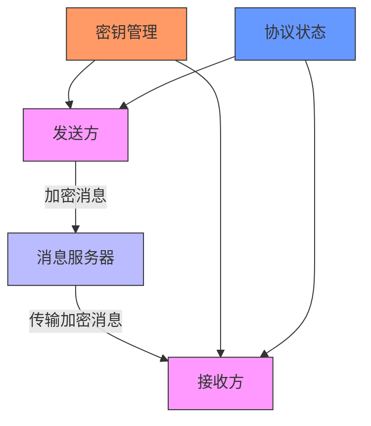
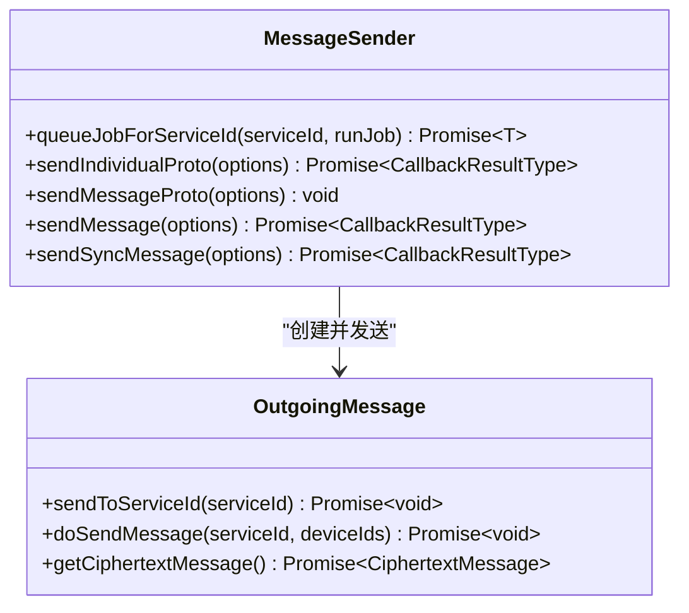
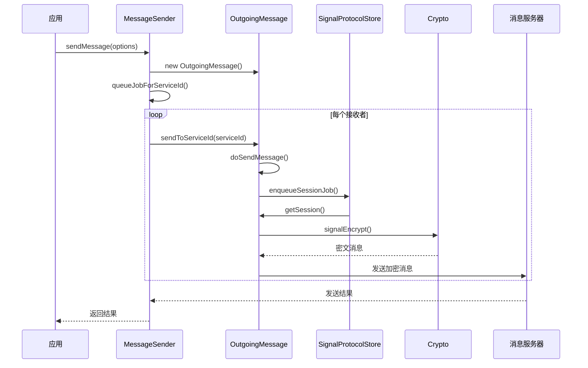
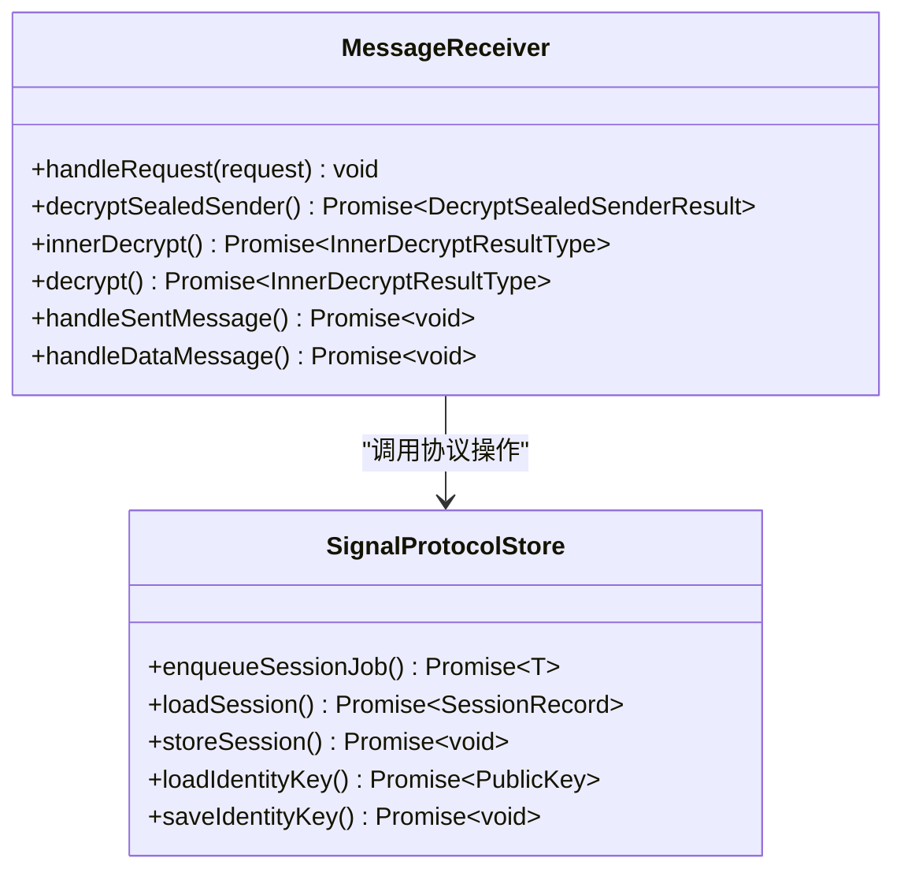
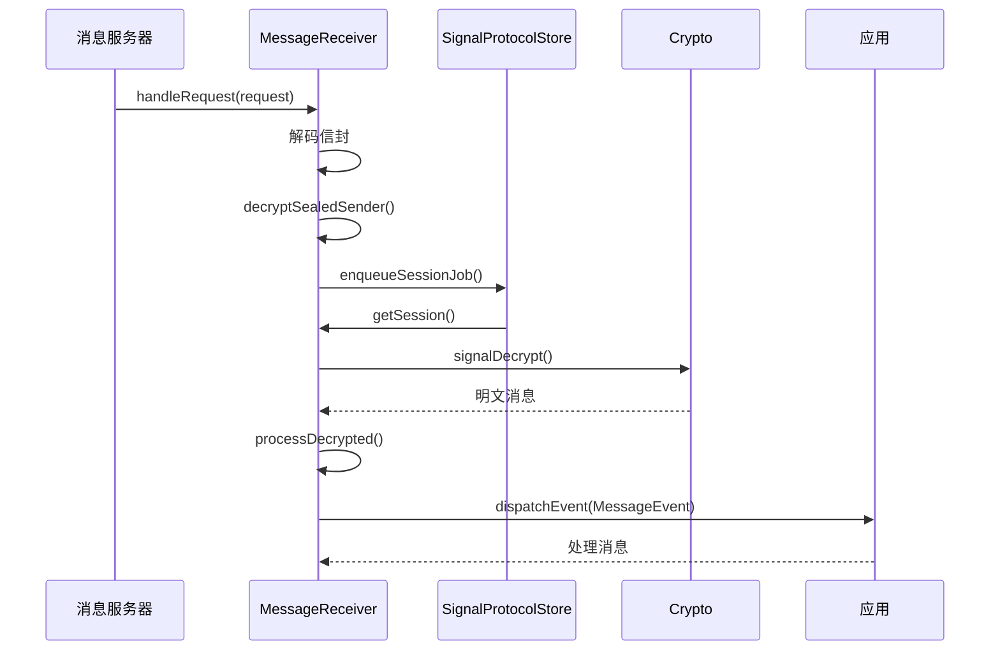
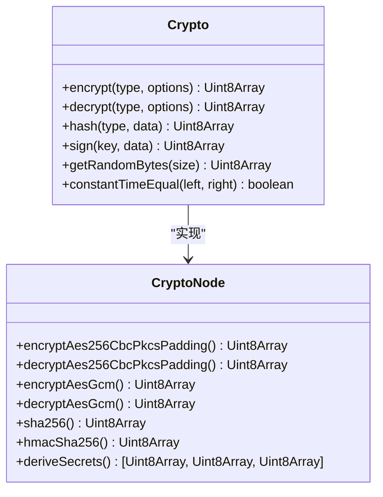
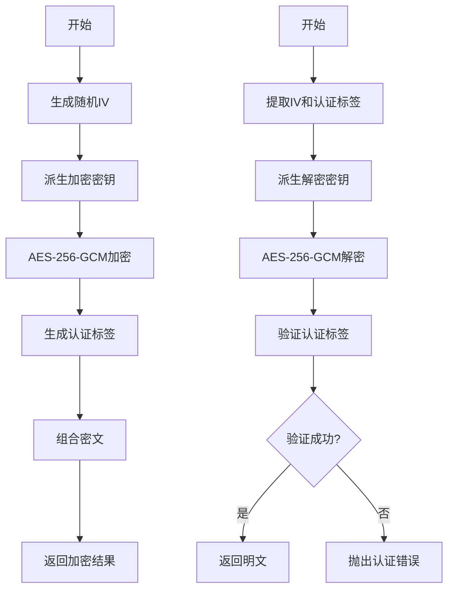
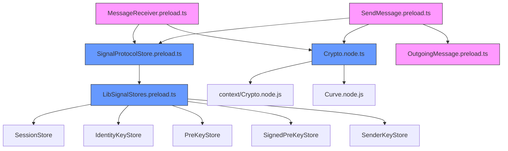

# 消息加密

<cite>
**Referenced Files in This Document**   
- [SendMessage.preload.ts](file://ts\textsecure\SendMessage.preload.ts)
- [MessageReceiver.preload.ts](file://ts\textsecure\MessageReceiver.preload.ts)
- [Crypto.node.ts](file://ts\Crypto.node.ts)
- [SignalProtocolStore.preload.ts](file://ts\SignalProtocolStore.preload.ts)
- [OutgoingMessage.preload.ts](file://ts\textsecure\OutgoingMessage.preload.ts)
- [LibSignalStores.preload.ts](file://ts\LibSignalStores.preload.ts)
</cite>

## 目录
1. [简介](#简介)
2. [项目结构](#项目结构)
3. [核心组件](#核心组件)
4. [架构概述](#架构概述)
5. [详细组件分析](#详细组件分析)
6. [依赖分析](#依赖分析)
7. [性能考虑](#性能考虑)
8. [故障排除指南](#故障排除指南)
9. [结论](#结论)

## 简介
本文件详细阐述了Signal-Desktop应用程序中的消息加密流程。文档深入解释了消息体的加密和解密实现，包括对称加密算法的选择、加密模式的应用和消息认证码的生成。详细描述了SendMessage.preload.ts中的消息加密流程和MessageReceiver.preload.ts中的消息解密逻辑。记录了消息加密接口的参数、返回值和异常处理机制。解释了加密上下文管理、随机数生成和加密会话状态维护。提供了消息加密解密的时序图，展示从消息创建到传输再到接收的完整加密过程。解决了加密算法不兼容、消息认证失败和性能瓶颈等常见问题及其解决方案。为初学者提供了消息加密概念的概述，同时为经验丰富的开发者提供了协议细节和安全审计要点。

## 项目结构
Signal-Desktop项目的结构遵循模块化设计，主要组件包括应用核心、加密服务、协议处理和用户界面。核心加密逻辑位于`ts/textsecure`目录下，其中`SendMessage.preload.ts`和`MessageReceiver.preload.ts`文件分别处理消息的发送和接收加密流程。加密算法实现位于`ts/Crypto.node.ts`，而协议状态管理则由`ts/SignalProtocolStore.preload.ts`负责。项目使用TypeScript编写，依赖于`@signalapp/libsignal-client`库实现Signal协议的核心功能。

**Diagram sources**
- [SendMessage.preload.ts](file://ts\textsecure\SendMessage.preload.ts)
- [MessageReceiver.preload.ts](file://ts\textsecure\MessageReceiver.preload.ts)
- [Crypto.node.ts](file://ts\Crypto.node.ts)

**Section sources**
- [SendMessage.preload.ts](file://ts\textsecure\SendMessage.preload.ts)
- [MessageReceiver.preload.ts](file://ts\textsecure\MessageReceiver.preload.ts)
- [Crypto.node.ts](file://ts\Crypto.node.ts)

## 核心组件
Signal-Desktop的消息加密系统由几个核心组件构成：消息发送器（MessageSender）、消息接收器（MessageReceiver）、加密服务（Crypto）和协议存储（SignalProtocolStore）。这些组件协同工作，确保消息在传输过程中的机密性和完整性。

**Section sources**
- [SendMessage.preload.ts](file://ts\textsecure\SendMessage.preload.ts)
- [MessageReceiver.preload.ts](file://ts\textsecure\MessageReceiver.preload.ts)
- [Crypto.node.ts](file://ts\Crypto.node.ts)
- [SignalProtocolStore.preload.ts](file://ts\SignalProtocolStore.preload.ts)

## 架构概述
Signal-Desktop采用端到端加密架构，使用Signal协议确保通信安全。消息在发送方设备上加密，在接收方设备上解密，服务器无法访问明文内容。系统使用双棘轮算法（Double Ratchet Algorithm）提供前向安全性和后向保密性。

**Diagram sources**
- [SendMessage.preload.ts](file://ts\textsecure\SendMessage.preload.ts)
- [MessageReceiver.preload.ts](file://ts\textsecure\MessageReceiver.preload.ts)
- [SignalProtocolStore.preload.ts](file://ts\SignalProtocolStore.preload.ts)

## 详细组件分析

### 消息发送分析
消息发送流程从应用层调用开始，经过加密处理后发送到服务器。`SendMessage.preload.ts`中的`MessageSender`类负责协调整个发送过程。

#### 消息发送器类分析

**Diagram sources**
- [SendMessage.preload.ts](file://ts\textsecure\SendMessage.preload.ts)
- [OutgoingMessage.preload.ts](file://ts\textsecure\OutgoingMessage.preload.ts)

#### 消息发送流程

**Diagram sources**
- [SendMessage.preload.ts](file://ts\textsecure\SendMessage.preload.ts)
- [OutgoingMessage.preload.ts](file://ts\textsecure\OutgoingMessage.preload.ts)
- [SignalProtocolStore.preload.ts](file://ts\SignalProtocolStore.preload.ts)
- [Crypto.node.ts](file://ts\Crypto.node.ts)

### 消息接收分析
消息接收流程从服务器接收加密消息开始，经过解密处理后传递给应用层。`MessageReceiver.preload.ts`中的`MessageReceiver`类负责处理接收到的消息。

#### 消息接收器类分析

**Diagram sources**
- [MessageReceiver.preload.ts](file://ts\textsecure\MessageReceiver.preload.ts)
- [SignalProtocolStore.preload.ts](file://ts\SignalProtocolStore.preload.ts)

#### 消息接收流程

**Diagram sources**
- [MessageReceiver.preload.ts](file://ts\textsecure\MessageReceiver.preload.ts)
- [SignalProtocolStore.preload.ts](file://ts\SignalProtocolStore.preload.ts)
- [Crypto.node.ts](file://ts\Crypto.node.ts)

### 加密服务分析
加密服务提供了底层的加密算法实现，包括对称加密、哈希函数和密钥派生功能。

#### 加密服务类分析

**Diagram sources**
- [Crypto.node.ts](file://ts\Crypto.node.ts)

#### 加密算法流程

**Diagram sources**
- [Crypto.node.ts](file://ts\Crypto.node.ts)

## 依赖分析
Signal-Desktop的消息加密系统依赖于多个核心组件和外部库。主要依赖关系如下：

**Diagram sources**
- [SendMessage.preload.ts](file://ts\textsecure\SendMessage.preload.ts)
- [MessageReceiver.preload.ts](file://ts\textsecure\MessageReceiver.preload.ts)
- [SignalProtocolStore.preload.ts](file://ts\SignalProtocolStore.preload.ts)
- [Crypto.node.ts](file://ts\Crypto.node.ts)
- [LibSignalStores.preload.ts](file://ts\LibSignalStores.preload.ts)

## 性能考虑
消息加密系统的性能主要受以下几个因素影响：加密算法的选择、密钥协商的频率、消息大小和网络延迟。Signal-Desktop通过以下方式优化性能：

1. **会话复用**：使用双棘轮算法，避免每次消息都进行完整的密钥协商。
2. **批量处理**：对多个消息进行批量加密和解密操作。
3. **缓存机制**：缓存会话状态和密钥材料，减少重复计算。
4. **异步处理**：使用队列系统处理加密操作，避免阻塞主线程。

**Section sources**
- [SignalProtocolStore.preload.ts](file://ts\SignalProtocolStore.preload.ts)
- [MessageReceiver.preload.ts](file://ts\textsecure\MessageReceiver.preload.ts)

## 故障排除指南
### 常见问题及解决方案

| 问题 | 可能原因 | 解决方案 |
|------|---------|---------|
| 消息发送失败 | 密钥过期 | 更新密钥并重试 |
| 消息无法解密 | 会话损坏 | 重置会话并重新协商密钥 |
| 性能低下 | 大量小消息 | 合并消息或优化加密流程 |
| 认证失败 | 密钥不匹配 | 验证密钥一致性并重新同步 |

**Section sources**
- [SendMessage.preload.ts](file://ts\textsecure\SendMessage.preload.ts)
- [MessageReceiver.preload.ts](file://ts\textsecure\MessageReceiver.preload.ts)
- [Crypto.node.ts](file://ts\Crypto.node.ts)

## 结论
Signal-Desktop的消息加密系统实现了安全、高效的端到端加密通信。通过使用Signal协议和先进的加密技术，系统确保了消息的机密性、完整性和前向安全性。文档详细分析了加密流程的各个组件和交互过程，为开发者提供了深入的理解和参考。未来可以进一步优化性能，增强对新攻击向量的防护能力。