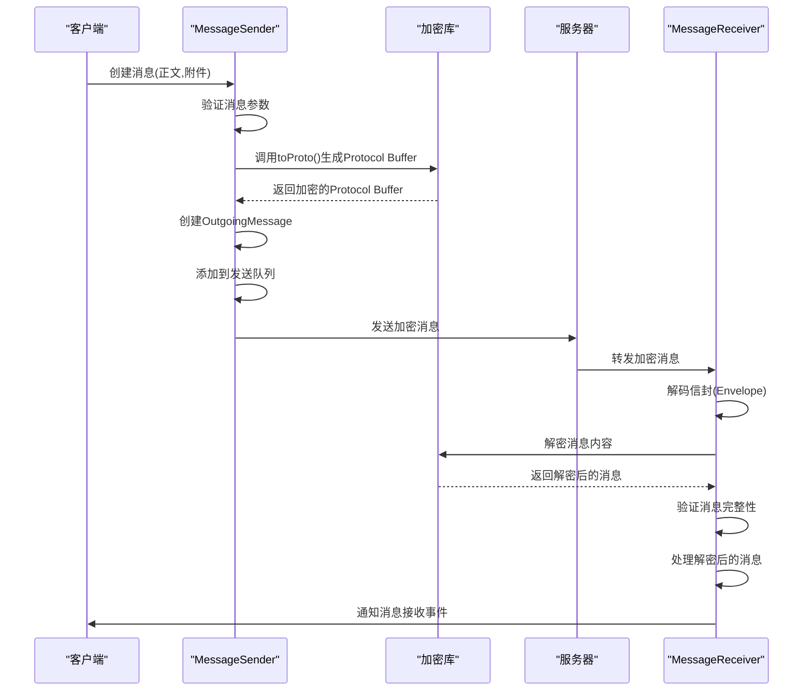

# 端到端加密机制

<cite>
**本文档引用的文件**   
- [ProvisioningCipher.node.ts](file://ts\textsecure\ProvisioningCipher.node.ts)
- [MessageReceiver.preload.ts](file://ts\textsecure\MessageReceiver.preload.ts)
- [SendMessage.preload.ts](file://ts\textsecure\SendMessage.preload.ts)
- [AttachmentCrypto.node.ts](file://ts\AttachmentCrypto.node.ts)
- [Crypto.node.ts](file://ts\Crypto.node.ts)
</cite>

## 目录
1. [引言](#引言)
2. [会话管理与密钥协商](#会话管理与密钥协商)
3. [消息加密流程](#消息加密流程)
4. [消息解密流程](#消息解密流程)
5. [附件加密机制](#附件加密机制)
6. [加密接口与异常处理](#加密接口与异常处理)
7. [消息加密生命周期时序图](#消息加密生命周期时序图)
8. [常见问题与解决方案](#常见问题与解决方案)
9. [结论](#结论)

## 引言
Signal-Desktop的端到端加密机制基于Signal协议实现，确保了消息传输的机密性、完整性和身份验证。该机制涵盖了从设备配对、会话建立、密钥交换到消息加密和解密的完整流程。系统使用双棘轮算法（Double Ratchet Algorithm）来实现前向安全性和后向安全性，即使长期密钥泄露，也无法解密过去的通信内容。本文档将深入分析Signal-Desktop的加密实现，重点关注ProvisioningCipher.node.ts中的密钥协商过程、MessageReceiver.preload.ts中的消息解密逻辑以及SendMessage.preload.ts中的消息加密流程。

## 会话管理与密钥协商
Signal-Desktop的会话管理始于设备配对过程，通过ProvisioningCipher.node.ts文件中的ProvisioningCipher类实现密钥协商。该过程使用椭圆曲线Diffie-Hellman（ECDH）密钥交换协议，确保通信双方能够安全地建立共享密钥。

在设备配对阶段，ProvisioningCipher类首先生成一个临时的椭圆曲线密钥对。当接收到包含公钥的ProvisionEnvelope时，系统使用calculateAgreement函数计算ECDH共享密钥。这个共享密钥随后通过deriveSecrets函数派生出用于AES-256-CBC加密的密钥和用于HMAC-SHA256验证的密钥。

密钥协商过程的关键步骤包括：
1. 验证ProvisionEnvelope的版本号和完整性
2. 提取公钥和加密消息体
3. 计算ECDH共享密钥
4. 派生加密和验证密钥
5. 使用HMAC-SHA256验证消息完整性
6. 解密并解析ProvisionMessage

此过程确保了只有持有正确私钥的设备才能完成配对，从而建立了安全的通信通道。生成的密钥对包括ACI（Account Identifier）密钥对和PNI（Phone Number Identifier）密钥对，用于后续的消息加密和身份验证。

**Section sources**
- [ProvisioningCipher.node.ts](file://ts\textsecure\ProvisioningCipher.node.ts#L49-L170)

## 消息加密流程
消息加密流程在SendMessage.preload.ts文件中实现，主要由MessageSender类负责。该流程将明文消息转换为加密的Protocol Buffer格式，确保消息在传输过程中的安全性。

消息加密的核心是Message类，它封装了所有消息相关数据，包括正文、附件、联系人信息、预览、引用等。当创建Message实例时，系统会进行严格的参数验证，确保所有字段符合预期格式和类型。

加密过程的关键步骤包括：
1. 构造MessageOptionsType对象，包含所有消息属性
2. 创建Message实例并进行参数验证
3. 调用toProto()方法将消息转换为Protocol Buffer格式
4. 使用Signal协议进行端到端加密

在toProto()方法中，系统会根据消息类型设置相应的Protocol Buffer字段。例如，对于包含引用的消息，会设置quote字段；对于包含预览的消息，会设置preview字段。所有敏感数据都会被加密，只有接收方才能解密。

消息发送通过sendMessageProto方法实现，该方法创建OutgoingMessage实例并将其添加到发送队列中。系统使用P-Queue库管理发送队列，确保消息按顺序发送，同时处理发送失败的情况。

**Section sources**
- [SendMessage.preload.ts](file://ts\textsecure\SendMessage.preload.ts#L255-L689)

## 消息解密流程
消息解密流程在MessageReceiver.preload.ts文件中实现，由MessageReceiver类负责处理接收到的加密消息。该流程从WebSocket接收到加密消息开始，经过解密、验证和处理等多个步骤。

解密流程的核心是#decryptAndCacheBatch方法，它在一个事务性区域内批量处理加密消息。系统首先从缓存中获取所有未处理的消息，然后使用signalProtocolStore.withZone方法确保解密过程的原子性。

解密过程的关键步骤包括：
1. 从WebSocket请求中提取加密消息
2. 解码Protocol Buffer格式的信封（Envelope）
3. 验证消息的版本号和完整性
4. 使用会话密钥解密消息内容
5. 验证解密后的消息完整性
6. 将解密后的消息添加到处理队列

对于密封发送者（Sealed Sender）消息，系统使用sealedSenderDecryptToUsmc函数进行解密。该函数验证发送者证书，并提取原始消息内容。解密后的消息会被重新封装为UnsealedEnvelope，包含发送者信息和消息内容。

系统还实现了#handleDecryptedEnvelope方法，用于处理解密后的消息。该方法会根据消息类型分发到相应的处理器，如processDataMessage、processSyncMessage等。

**Section sources**
- [MessageReceiver.preload.ts](file://ts\textsecure\MessageReceiver.preload.ts#L989-L1133)

## 附件加密机制
附件加密机制在AttachmentCrypto.node.ts文件中实现，负责处理消息中包含的文件附件的加密和解密。该机制使用AES-256-CBC加密算法和HMAC-SHA256消息认证码，确保附件的机密性和完整性。

附件加密的核心是encryptAttachmentV2函数，它接受明文附件数据并返回加密后的结果。系统使用Node.js的crypto模块创建加密流，通过pipeline函数将多个流操作连接起来。

加密过程的关键步骤包括：
1. 生成随机的初始化向量（IV）和加密密钥
2. 计算明文哈希值用于完整性验证
3. 添加填充数据以满足块加密要求
4. 使用AES-256-CBC算法加密数据
5. 计算加密数据的哈希值
6. 生成并附加消息认证码（MAC）

解密过程由decryptAttachmentV2函数实现，它验证加密附件的完整性，然后使用相应的密钥进行解密。系统会验证MAC值以确保数据未被篡改，并检查哈希值以验证解密结果的正确性。

附件加密机制还支持增量MAC（Message Authentication Code）计算，允许在不完全解密的情况下验证数据完整性。这对于大文件的流式处理特别有用，可以提高性能并减少内存使用。

**Section sources**
- [AttachmentCrypto.node.ts](file://ts\AttachmentCrypto.node.ts#L144-L274)

## 加密接口与异常处理
Signal-Desktop提供了清晰的加密接口，定义了参数、返回值和异常处理机制。这些接口主要分布在SendMessage.preload.ts、MessageReceiver.preload.ts和AttachmentCrypto.node.ts等文件中。

主要加密接口包括：
- MessageSender.sendMessage：发送加密消息
- MessageReceiver.handleRequest：处理接收到的加密消息
- encryptAttachmentV2：加密附件
- decryptAttachmentV2：解密附件

这些接口使用TypeScript的类型系统定义了严格的参数类型和返回值类型。例如，MessageOptionsType定义了消息发送所需的所有参数，包括时间戳、正文、附件、预览等。

异常处理机制通过try-catch块和Promise的错误处理实现。系统定义了多种错误类型，如MessageError、SendMessageProtoError和NoSenderKeyError，用于区分不同类型的加密错误。错误信息会被记录到日志中，并通过事件系统通知上层应用。

对于关键的加密操作，系统使用createTaskWithTimeout函数设置超时限制，防止长时间阻塞。如果操作超时，会抛出相应的错误并进行重试。

**Section sources**
- [SendMessage.preload.ts](file://ts\textsecure\SendMessage.preload.ts#L1198-L1352)
- [MessageReceiver.preload.ts](file://ts\textsecure\MessageReceiver.preload.ts#L404-L476)
- [AttachmentCrypto.node.ts](file://ts\AttachmentCrypto.node.ts#L144-L274)

## 消息加密生命周期时序图

**Diagram sources **
- [SendMessage.preload.ts](file://ts\textsecure\SendMessage.preload.ts#L1198-L1352)
- [MessageReceiver.preload.ts](file://ts\textsecure\MessageReceiver.preload.ts#L404-L476)

## 常见问题与解决方案
在使用Signal-Desktop的端到端加密机制时，可能会遇到一些常见问题。以下是这些问题及其解决方案：

**密钥同步失败**
问题：设备之间的密钥无法同步，导致消息无法解密。
解决方案：检查网络连接，确保所有设备都能访问Signal服务器。尝试重新配对设备，或手动触发密钥更新。

**加密算法不兼容**
问题：不同版本的客户端使用不兼容的加密算法。
解决方案：确保所有客户端都更新到最新版本。Signal协议设计为向后兼容，但某些新特性可能需要更新客户端。

**性能瓶颈**
问题：大附件加密和解密导致性能下降。
解决方案：使用流式加密处理大文件，避免将整个文件加载到内存中。优化加密参数，如选择合适的块大小。

**消息丢失**
问题：加密消息在传输过程中丢失。
解决方案：实现可靠的消息重传机制。Signal使用WebSocket保持长连接，减少消息丢失的可能性。

**存储空间不足**
问题：加密附件占用大量存储空间。
解决方案：实现附件的自动清理策略，定期删除过期的附件。使用增量MAC验证，避免重复存储。

**Section sources**
- [SendMessage.preload.ts](file://ts\textsecure\SendMessage.preload.ts#L1198-L1352)
- [MessageReceiver.preload.ts](file://ts\textsecure\MessageReceiver.preload.ts#L404-L476)
- [AttachmentCrypto.node.ts](file://ts\AttachmentCrypto.node.ts#L144-L274)

## 结论
Signal-Desktop的端到端加密机制基于Signal协议实现，提供了强大的安全保障。通过双棘轮算法、前向安全性和后向安全性，确保了通信的机密性和完整性。系统使用Protocol Buffer格式进行消息序列化，结合AES-256-CBC加密和HMAC-SHA256验证，实现了高效的安全通信。

密钥协商过程通过ProvisioningCipher类实现，确保了设备配对的安全性。消息加密和解密流程分别由MessageSender和MessageReceiver类管理，保证了消息传输的可靠性。附件加密机制使用流式处理，有效处理大文件的加密需求。

尽管存在一些性能和兼容性挑战，但通过合理的优化和更新策略，可以有效解决这些问题。Signal-Desktop的加密实现展示了现代安全通信系统的最佳实践，为用户提供了可靠的隐私保护。