# 附件加密

<cite>
**本文档中引用的文件**  
- [AttachmentCrypto.node.ts](file://ts/AttachmentCrypto.node.ts)
- [encryptLegacyAttachment.preload.ts](file://ts/util/encryptLegacyAttachment.preload.ts)
- [Crypto.std.ts](file://ts/types/Crypto.std.ts)
- [AttachmentCrypto.std.ts](file://ts/util/AttachmentCrypto.std.ts)
- [appendMacStream.node.ts](file://ts/util/appendMacStream.node.ts)
- [getMacAndUpdateHmac.node.ts](file://ts/util/getMacAndUpdateHmac.node.ts)
- [finalStream.node.ts](file://ts/util/finalStream.node.ts)
</cite>

## 目录
1. [简介](#简介)
2. [核心加密机制](#核心加密机制)
3. [分块加密策略](#分块加密策略)
4. [加密密钥派生](#加密密钥派生)
5. [加密元数据管理](#加密元数据管理)
6. [向后兼容性处理](#向后兼容性处理)
7. [接口参数与返回值](#接口参数与返回值)
8. [性能优化策略](#性能优化策略)
9. [加密流处理与内存管理](#加密流处理与内存管理)
10. [错误恢复机制](#错误恢复机制)
11. [附件上传加密流程](#附件上传加密流程)
12. [常见问题与解决方案](#常见问题与解决方案)
13. [安全审计要点](#安全审计要点)

## 简介
Signal-Desktop的附件加密机制采用先进的加密算法和流式处理技术，确保用户文件在传输和存储过程中的安全性。该系统实现了分块加密、增量消息认证码（MAC）计算和向后兼容性支持，为不同版本的附件提供统一的安全保障。本文档深入分析了`AttachmentCrypto.node.ts`中的加密实现和`encryptLegacyAttachment.preload.ts`中的兼容性处理，为开发者提供全面的技术参考。

## 核心加密机制
Signal-Desktop的附件加密系统基于AES-256-CBC算法，结合HMAC-SHA256进行完整性验证。系统采用流式处理架构，通过Node.js的stream管道实现高效的数据处理，避免了大文件加载到内存导致的内存溢出问题。加密过程包括多个阶段：明文哈希计算、填充、加密、IV前缀添加、MAC附加和摘要计算。

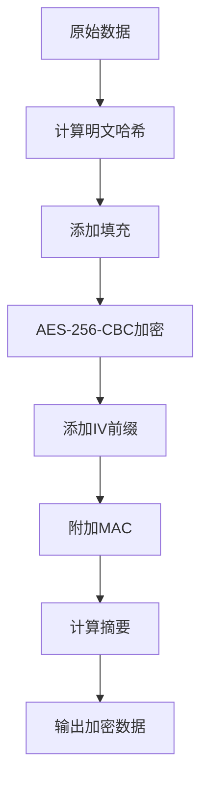

**图源**  
- [AttachmentCrypto.node.ts](file://ts/AttachmentCrypto.node.ts#L215-L236)

**本节来源**  
- [AttachmentCrypto.node.ts](file://ts/AttachmentCrypto.node.ts#L144-L274)

## 分块加密策略
对于大文件附件，Signal-Desktop采用分块加密策略，通过增量MAC计算实现高效的数据完整性验证。系统根据附件大小动态选择合适的块大小，使用`inferChunkSize`函数确定最佳分块方案。`DigestingPassThrough`类在加密流中实时计算增量MAC，允许在不完全下载文件的情况下验证数据完整性。

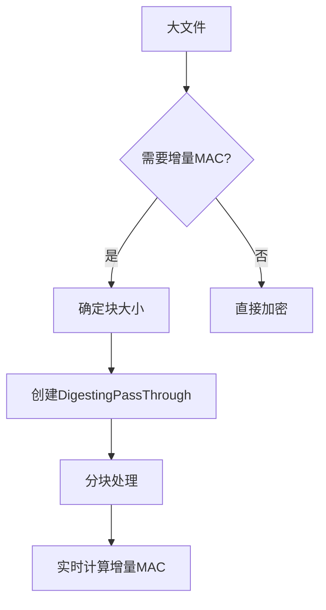

**图源**  
- [AttachmentCrypto.node.ts](file://ts/AttachmentCrypto.node.ts#L202-L213)

**本节来源**  
- [AttachmentCrypto.node.ts](file://ts/AttachmentCrypto.node.ts#L202-L213)
- [AttachmentCrypto.std.ts](file://ts/util/AttachmentCrypto.std.ts#L26-L44)

## 加密密钥派生
附件加密使用256位AES密钥和256位HMAC密钥的密钥集，总长度为64字节。`generateAttachmentKeys`函数通过`randomBytes(KEY_SET_LENGTH)`生成安全的随机密钥。`splitKeys`函数将密钥集拆分为AES加密密钥（前32字节）和HMAC验证密钥（后32字节），确保加密和完整性验证使用独立的密钥材料。

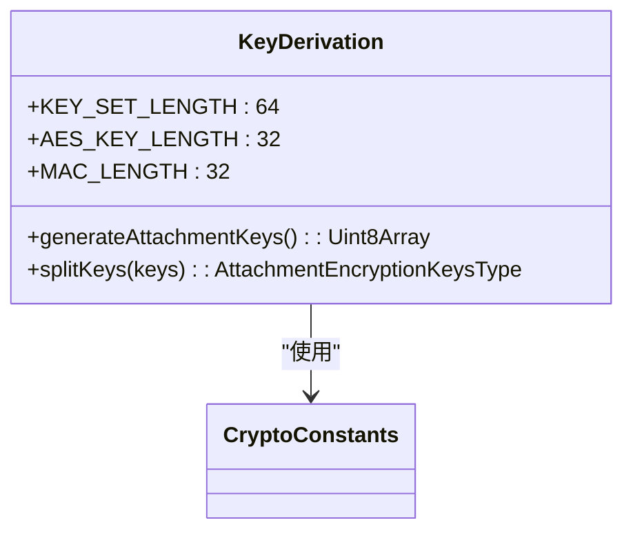

**图源**  
- [AttachmentCrypto.node.ts](file://ts/AttachmentCrypto.node.ts#L71-L73)
- [Crypto.std.ts](file://ts/types/Crypto.std.ts#L31-L32)

**本节来源**  
- [AttachmentCrypto.node.ts](file://ts/AttachmentCrypto.node.ts#L71-L73)
- [Crypto.std.ts](file://ts/types/Crypto.std.ts#L19-L32)

## 加密元数据管理
加密过程生成多种元数据，包括IV、摘要、增量MAC和明文哈希。这些元数据用于解密验证和完整性检查。`EncryptedAttachmentV2`类型定义了加密附件的元数据结构，包含块大小、摘要、增量MAC、IV、明文哈希和密文大小等信息。系统通过`checkIntegrity`函数验证数据完整性，支持基于加密摘要和明文哈希的两种验证模式。

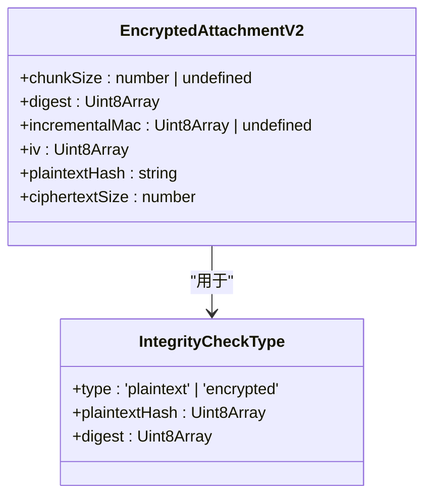

**图源**  
- [AttachmentCrypto.node.ts](file://ts/AttachmentCrypto.node.ts#L75-L91)
- [AttachmentCrypto.node.ts](file://ts/AttachmentCrypto.node.ts#L276-L278)

**本节来源**  
- [AttachmentCrypto.node.ts](file://ts/AttachmentCrypto.node.ts#L75-L91)
- [AttachmentCrypto.node.ts](file://ts/AttachmentCrypto.node.ts#L276-L278)

## 向后兼容性处理
为了支持旧版本附件，Signal-Desktop实现了向后兼容性处理机制。`encryptLegacyAttachment.preload.ts`文件中的`encryptLegacyAttachment`函数负责将v1附件升级到v2格式。系统使用LRU缓存避免重复加密，通过`doEncrypt`函数执行实际的加密转换。当检测到大量孤立附件时，系统会自动调度清理任务，维护存储效率。

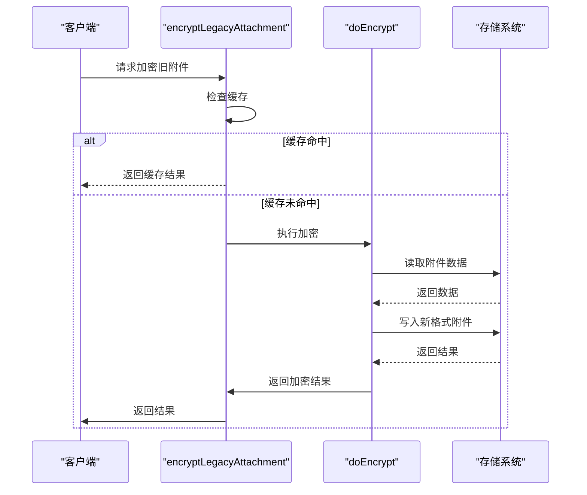

**图源**  
- [encryptLegacyAttachment.preload.ts](file://ts/util/encryptLegacyAttachment.preload.ts#L39-L72)

**本节来源**  
- [encryptLegacyAttachment.preload.ts](file://ts/util/encryptLegacyAttachment.preload.ts#L39-L72)

## 接口参数与返回值
附件加密系统提供了一系列清晰的接口，包括`encryptAttachmentV2ToDisk`、`decryptAttachmentV2`和`decryptAndReencryptLocally`等函数。这些接口采用类型化参数，确保类型安全。`EncryptAttachmentV2OptionsType`定义了加密选项，包括密钥、是否需要增量MAC和明文源等参数。返回值包含加密结果和必要的元数据，便于后续处理。

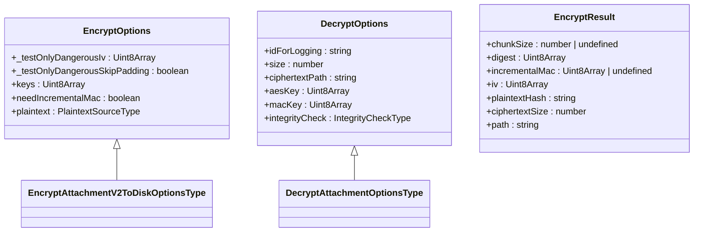

**图源**  
- [AttachmentCrypto.node.ts](file://ts/AttachmentCrypto.node.ts#L104-L116)
- [AttachmentCrypto.node.ts](file://ts/AttachmentCrypto.node.ts#L280-L319)

**本节来源**  
- [AttachmentCrypto.node.ts](file://ts/AttachmentCrypto.node.ts#L104-L116)
- [AttachmentCrypto.node.ts](file://ts/AttachmentCrypto.node.ts#L280-L319)

## 性能优化策略
Signal-Desktop的附件加密系统采用多种性能优化策略。流式处理避免了大文件的内存加载，`pipeline`函数确保数据在管道中高效流动。系统使用`measureSize`转换流实时跟踪加密进度，`peekAndUpdateHash`转换流在不修改数据流的情况下计算哈希值。对于双层加密场景，系统跳过外层加密的填充，减少不必要的计算开销。

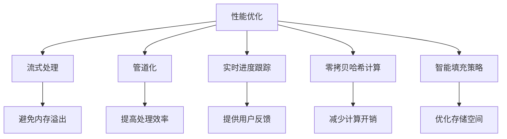

**图源**  
- [AttachmentCrypto.node.ts](file://ts/AttachmentCrypto.node.ts#L652-L674)
- [AttachmentCrypto.node.ts](file://ts/AttachmentCrypto.node.ts#L639-L649)

**本节来源**  
- [AttachmentCrypto.node.ts](file://ts/AttachmentCrypto.node.ts#L652-L674)
- [AttachmentCrypto.node.ts](file://ts/AttachmentCrypto.node.ts#L639-L649)

## 加密流处理与内存管理
加密系统采用Node.js流式处理架构，有效管理内存使用。`createReadStream`和`createWriteStream`用于文件的流式读写，`pipeline`函数连接多个转换流。系统通过背压机制（backpressure）调节数据流速，防止内存积压。`PassThrough`流用于在管道中传递数据，`Transform`流用于执行各种处理操作，如哈希计算和加密。

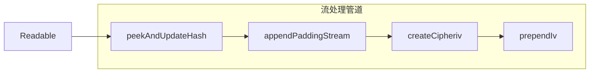

**图源**  
- [AttachmentCrypto.node.ts](file://ts/AttachmentCrypto.node.ts#L215-L235)

**本节来源**  
- [AttachmentCrypto.node.ts](file://ts/AttachmentCrypto.node.ts#L215-L235)

## 错误恢复机制
系统实现了完善的错误恢复机制，确保加密过程的可靠性。`safeUnlink`函数在加密失败时安全删除临时文件，避免残留垃圾文件。异常处理代码捕获并记录错误，同时确保资源正确释放。`try-catch`块包围关键操作，`finally`块确保文件描述符关闭。系统区分可恢复错误（如中止错误）和不可恢复错误，采取不同的处理策略。

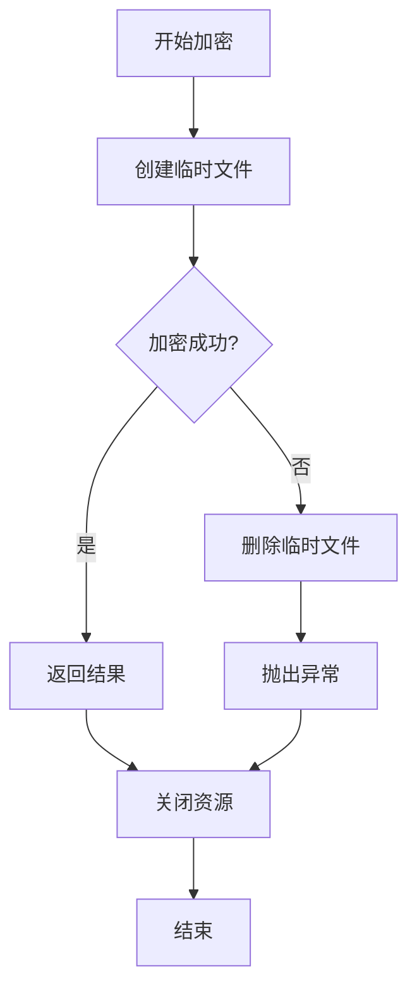

**图源**  
- [AttachmentCrypto.node.ts](file://ts/AttachmentCrypto.node.ts#L134-L137)
- [AttachmentCrypto.node.ts](file://ts/AttachmentCrypto.node.ts#L539-L540)

**本节来源**  
- [AttachmentCrypto.node.ts](file://ts/AttachmentCrypto.node.ts#L134-L137)
- [AttachmentCrypto.node.ts](file://ts/AttachmentCrypto.node.ts#L539-L540)

## 附件上传加密流程
附件上传加密流程从文件选择开始，经过分块加密处理，最终传输到服务器。流程包括：文件读取、明文哈希计算、填充添加、AES加密、IV前缀、MAC附加、摘要计算和网络传输。系统在加密过程中实时计算各种哈希值，确保数据完整性和安全性。

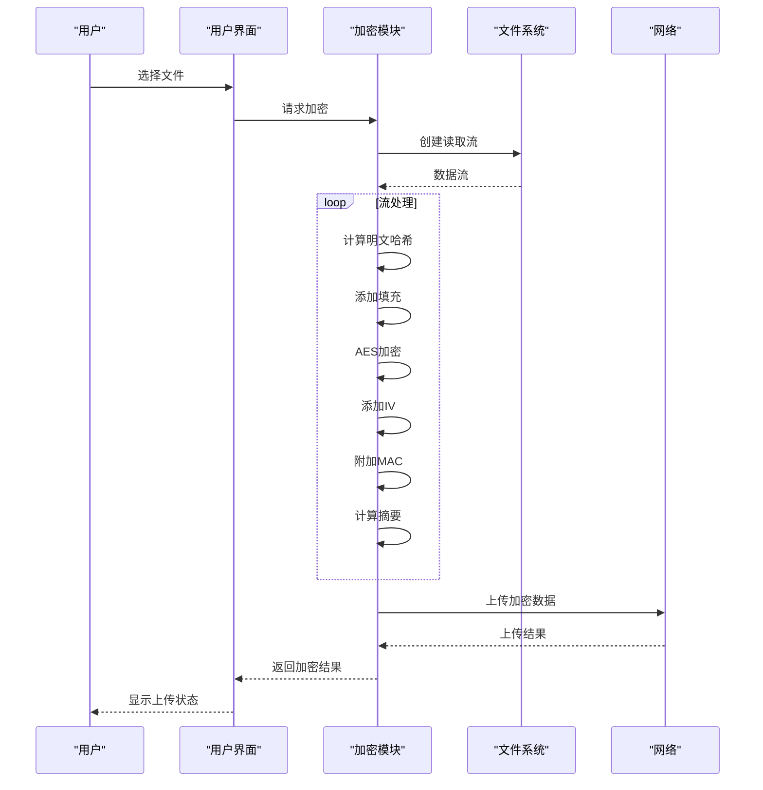

**图源**  
- [AttachmentCrypto.node.ts](file://ts/AttachmentCrypto.node.ts#L118-L143)

**本节来源**  
- [AttachmentCrypto.node.ts](file://ts/AttachmentCrypto.node.ts#L118-L143)

## 常见问题与解决方案
### 大文件加密内存溢出
**问题**：大文件加密可能导致内存溢出。
**解决方案**：采用流式处理架构，避免将整个文件加载到内存中。使用Node.js的流式API进行分块处理。

### 加密速度慢
**问题**：大文件加密速度较慢。
**解决方案**：优化流式处理管道，减少不必要的转换操作。使用高效的加密算法实现。

### 兼容性问题
**问题**：新旧版本附件格式不兼容。
**解决方案**：实现向后兼容性处理，自动升级旧格式附件。使用LRU缓存避免重复转换。

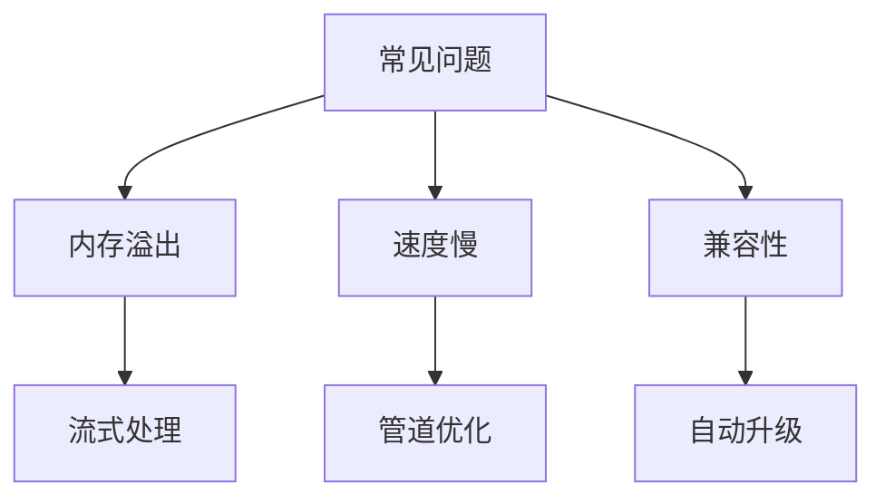

**本节来源**  
- [AttachmentCrypto.node.ts](file://ts/AttachmentCrypto.node.ts)
- [encryptLegacyAttachment.preload.ts](file://ts/util/encryptLegacyAttachment.preload.ts)

## 安全审计要点
1. **密钥管理**：确保密钥生成使用安全的随机数生成器，密钥存储符合安全规范。
2. **算法选择**：验证使用AES-256-CBC和HMAC-SHA256等经过充分验证的加密算法。
3. **完整性验证**：确认MAC计算和验证过程正确实现，防止篡改攻击。
4. **侧信道防护**：检查是否存在时序侧信道漏洞，使用恒定时间比较函数。
5. **错误处理**：验证错误处理机制不会泄露敏感信息，临时文件被安全删除。
6. **依赖安全**：审计第三方依赖库的安全性，确保没有已知漏洞。

**本节来源**  
- [AttachmentCrypto.node.ts](file://ts/AttachmentCrypto.node.ts)
- [Crypto.std.ts](file://ts/types/Crypto.std.ts)