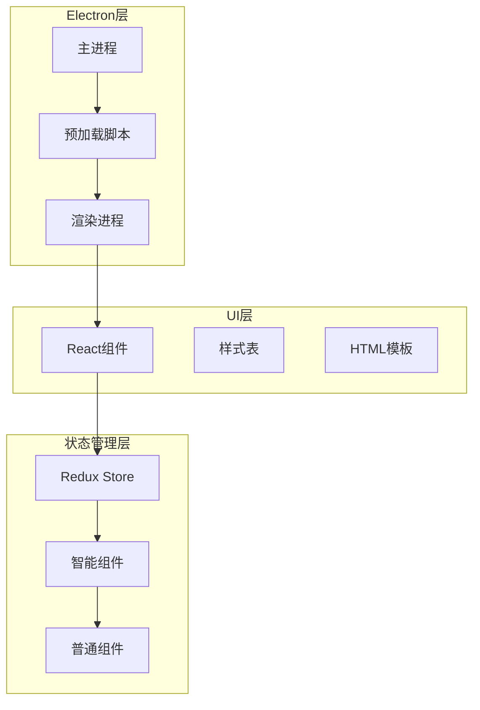
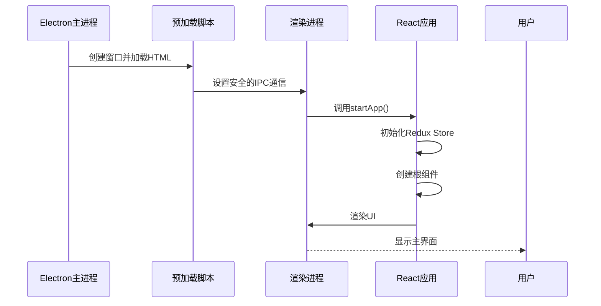
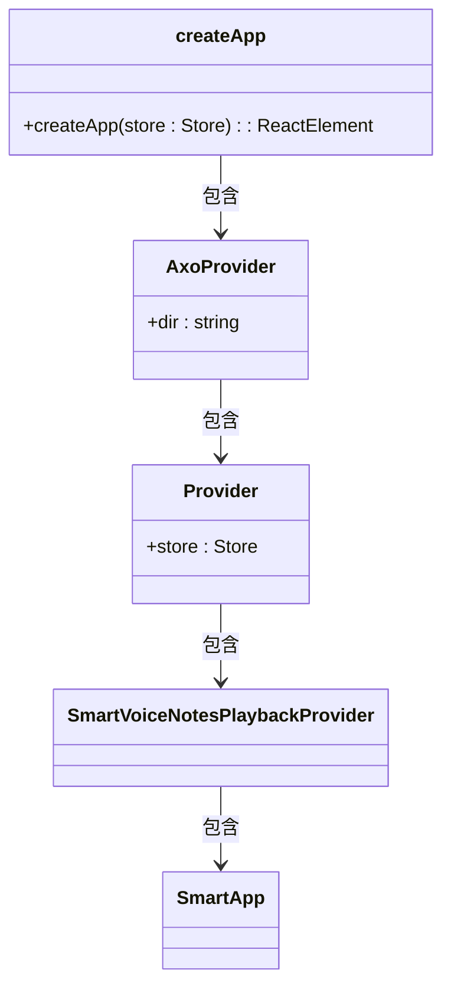
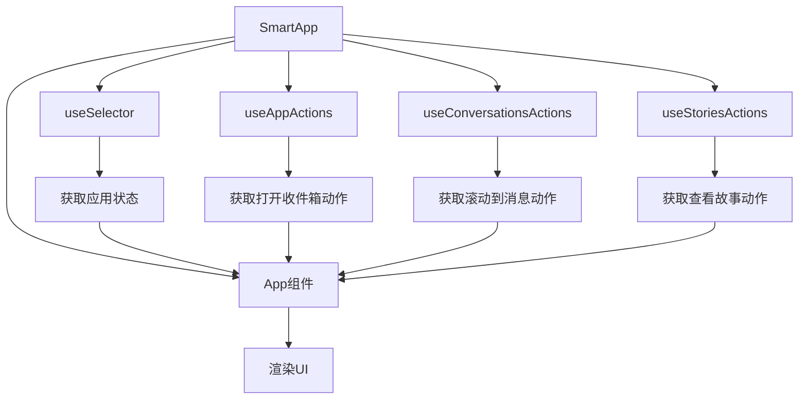
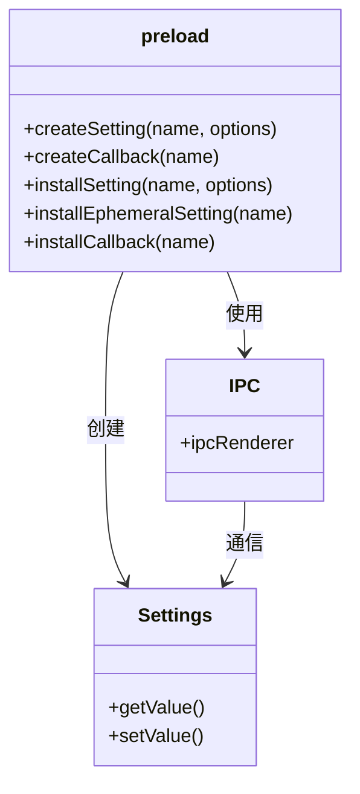
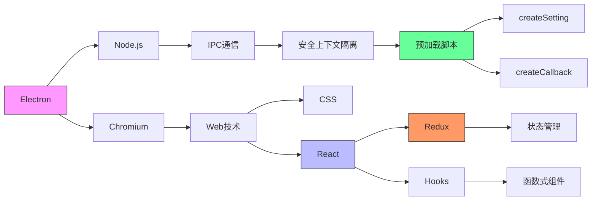

# UI架构

<cite>
**本文档中引用的文件**  
- [createApp.preload.tsx](file://ts/state/roots/createApp.preload.tsx)
- [App.preload.tsx](file://ts/components/App.preload.tsx)
- [SmartApp.preload.tsx](file://ts/state/smart/App.preload.tsx)
- [preload.preload.ts](file://ts/util/preload.preload.ts)
- [background.html](file://background.html)
- [loading.html](file://loading.html)
- [preload.wrapper.ts](file://preload.wrapper.ts)
- [main.main.ts](file://app/main.main.ts)
- [start.preload.ts](file://ts/windows/main/start.preload.ts)
</cite>

## 目录
1. [项目结构](#项目结构)
2. [核心组件](#核心组件)
3. [架构概述](#架构概述)
4. [详细组件分析](#详细组件分析)
5. [依赖分析](#依赖分析)
6. [性能考虑](#性能考虑)
7. [故障排除指南](#故障排除指南)

## 项目结构

Signal-Desktop的UI架构基于React构建，采用Electron作为桌面应用框架。项目结构清晰地分离了UI组件、状态管理、服务逻辑和预加载脚本。

**图源**  
- [background.html](file://background.html#L1-L140)
- [loading.html](file://loading.html#L1-L37)

**本节来源**  
- [background.html](file://background.html#L1-L140)
- [loading.html](file://loading.html#L1-L37)

## 核心组件

Signal-Desktop的UI架构核心由三个关键文件构成：`createApp.preload.tsx`、`App.preload.tsx`和`preload.preload.ts`。这些文件共同实现了应用根组件的初始化、智能组件与普通组件的区分以及预加载上下文的设置。

`createApp.preload.tsx`负责创建应用的根组件，使用React的Provider模式注入Redux store，并包含AxoProvider和SmartVoiceNotesPlaybackProvider等上下文提供者。

`App.preload.tsx`是主要的UI组件，根据应用状态（Installer、Standalone、Inbox或Blank）渲染不同的内容。它还负责管理主题、窗口状态和操作系统特定的CSS类。

`preload.preload.ts`实现了Electron渲染进程与主进程之间的IPC通信机制，提供了设置获取、回调创建和事件监听等功能。

**本节来源**  
- [createApp.preload.tsx](file://ts/state/roots/createApp.preload.tsx#L1-L23)
- [App.preload.tsx](file://ts/components/App.preload.tsx#L1-L155)
- [SmartApp.preload.tsx](file://ts/state/smart/App.preload.tsx#L1-L146)

## 架构概述

Signal-Desktop的UI架构遵循典型的Electron应用模式，采用分层架构设计。应用启动流程从Electron主进程开始，通过预加载脚本建立安全的通信通道，最终在渲染进程中初始化React应用。

**图源**  
- [preload.wrapper.ts](file://preload.wrapper.ts#L1-L82)
- [main.main.ts](file://app/main.main.ts#L989-L2360)

**本节来源**  
- [preload.wrapper.ts](file://preload.wrapper.ts#L1-L82)
- [main.main.ts](file://app/main.main.ts#L989-L2360)

## 详细组件分析

### 应用根组件初始化

`createApp.preload.tsx`文件中的`createApp`函数是应用UI的入口点。它接收Redux store作为参数，并返回一个包含多个上下文提供者的React元素树。

**图源**  
- [createApp.preload.tsx](file://ts/state/roots/createApp.preload.tsx#L1-L23)

**本节来源**  
- [createApp.preload.tsx](file://ts/state/roots/createApp.preload.tsx#L1-L23)

### 智能组件与普通组件区分

在Signal-Desktop中，智能组件（Smart Components）和普通组件（Dumb Components）有明确的区分。智能组件负责与Redux store交互，获取状态和分发动作，而普通组件仅负责UI渲染。

`SmartApp`组件是一个典型的智能组件，它使用`useSelector`钩子从Redux store中选择所需的状态，并使用`useAppActions`等钩子获取动作创建函数。然后将这些状态和函数作为props传递给`App`这个普通组件。

**图源**  
- [SmartApp.preload.tsx](file://ts/state/smart/App.preload.tsx#L1-L146)

**本节来源**  
- [SmartApp.preload.tsx](file://ts/state/smart/App.preload.tsx#L1-L146)

### 预加载上下文设置

`preload.preload.ts`文件实现了Electron渲染进程的预加载上下文设置，为渲染进程提供了安全访问主进程功能的机制。

**图源**  
- [preload.preload.ts](file://ts/util/preload.preload.ts#L1-L193)

**本节来源**  
- [preload.preload.ts](file://ts/util/preload.preload.ts#L1-L193)

## 依赖分析

Signal-Desktop的UI架构依赖于多个关键技术栈和库，形成了一个复杂的依赖网络。

**图源**  
- [preload.preload.ts](file://ts/util/preload.preload.ts#L1-L193)
- [main.main.ts](file://app/main.main.ts#L989-L2360)

**本节来源**  
- [preload.preload.ts](file://ts/util/preload.preload.ts#L1-L193)
- [main.main.ts](file://app/main.main.ts#L989-L2360)

## 性能考虑

Signal-Desktop在UI架构设计中考虑了多项性能优化措施：

1. 使用`React.memo`对`SmartApp`组件进行记忆化，避免不必要的重新渲染
2. 通过`useSelector`精确选择Redux store中的状态片段，减少组件重渲染
3. 在预加载阶段并行执行窗口创建和数据库初始化，缩短启动时间
4. 使用CSS类切换而非内联样式来管理主题和窗口状态
5. 通过IPC通信的批量处理减少进程间通信开销

此外，应用还实现了主题系统、窗口管理和响应式布局的高效更新机制，确保用户界面的流畅性。

## 故障排除指南

在开发和调试Signal-Desktop UI时，可能会遇到以下常见问题：

1. **IPC通信失败**：检查预加载脚本是否正确安装了设置和回调
2. **状态更新延迟**：确保`useSelector`选择器函数是高效的，避免创建新的对象引用
3. **主题不生效**：验证`document.body`的CSS类是否正确更新
4. **窗口状态不同步**：检查主进程和渲染进程之间的全屏和最大化状态同步
5. **组件重复渲染**：使用React DevTools分析组件渲染原因，确保props和状态的稳定性

错误边界处理在`ErrorBoundary.dom.tsx`中实现，为应用提供了优雅的错误处理机制，确保单个组件的错误不会导致整个应用崩溃。