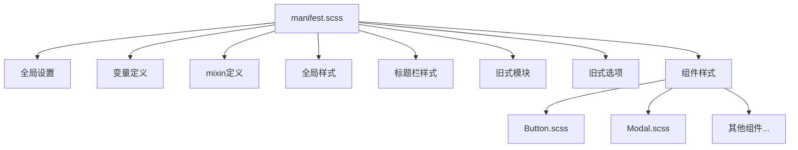
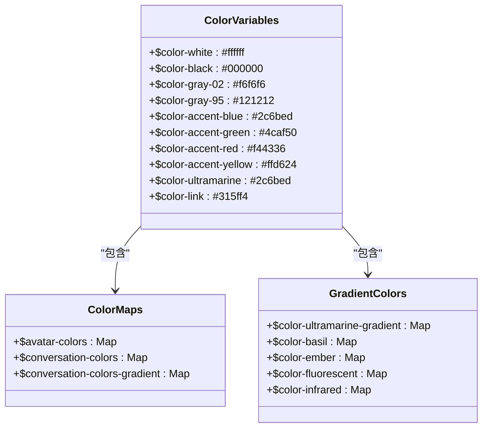
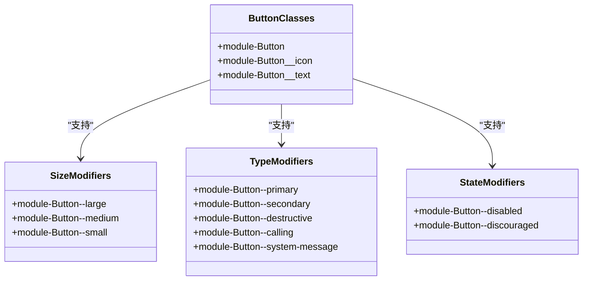
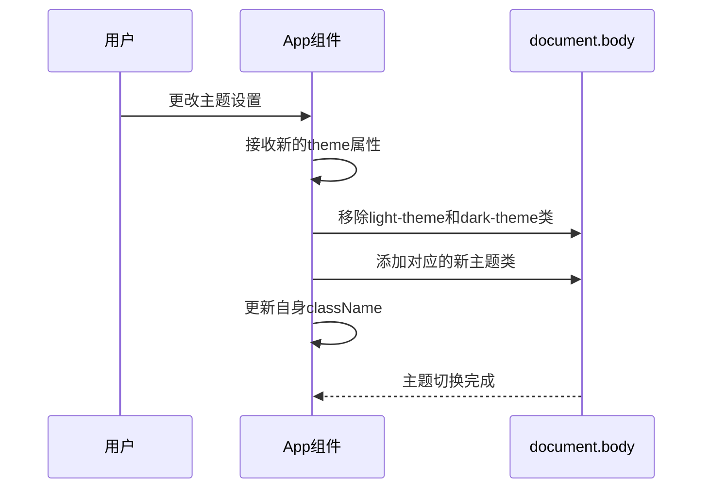
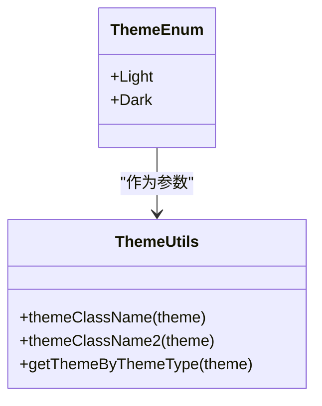
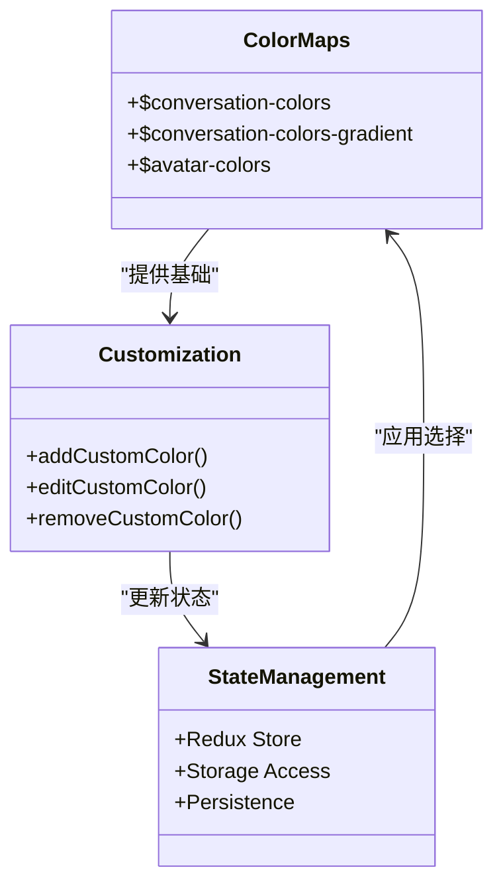
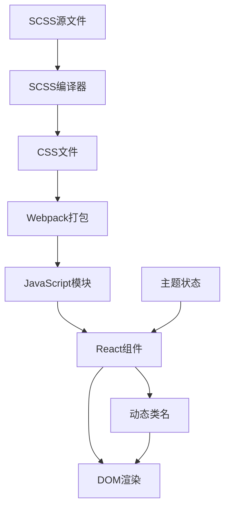
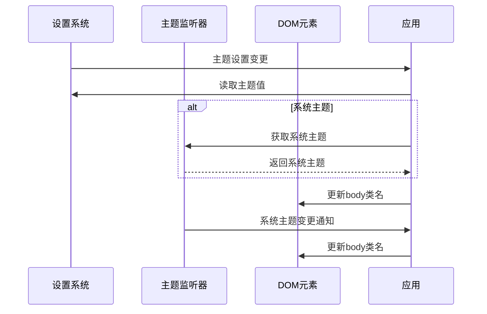
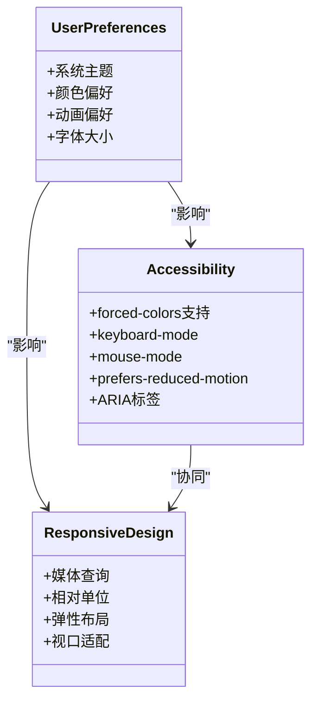

# 主题系统

<cite>
**本文档引用的文件**   
- [manifest.scss](file://stylesheets/manifest.scss)
- [_variables.scss](file://stylesheets/_variables.scss)
- [_mixins.scss](file://stylesheets/_mixins.scss)
- [_global.scss](file://stylesheets/_global.scss)
- [App.preload.tsx](file://ts/components/App.preload.tsx)
- [theme.std.ts](file://ts/util/theme.std.ts)
- [applyTheme.dom.ts](file://ts/windows/applyTheme.dom.ts)
- [createNativeThemeListener.std.ts](file://ts/context/createNativeThemeListener.std.ts)
- [Button.scss](file://stylesheets/components/Button.scss)
- [Modal.scss](file://stylesheets/components/Modal.scss)
</cite>

## 目录
1. [简介](#简介)
2. [SCSS样式架构](#scss样式架构)
3. [主题变量与色彩系统](#主题变量与色彩系统)
4. [CSS类命名规范](#css类命名规范)
5. [动态主题切换机制](#动态主题切换机制)
6. [主题状态管理](#主题状态管理)
7. [暗色模式支持](#暗色模式支持)
8. [自定义主题实现](#自定义主题实现)
9. [样式注入与CSS-in-JS集成](#样式注入与css-in-js集成)
10. [主题配置存储与同步](#主题配置存储与同步)
11. [响应式设计与可访问性](#响应式设计与可访问性)
12. [性能优化策略](#性能优化策略)

## 简介
Signal-Desktop的主题系统采用基于SCSS的现代化样式架构，实现了灵活的主题管理和动态主题切换功能。该系统通过SCSS变量、mixin和模块化导入机制构建了一套完整的样式体系，支持亮色模式、暗色模式以及系统主题自动适配。主题系统不仅提供了丰富的色彩配置选项，还确保了跨平台的视觉一致性，同时兼顾了可访问性和性能优化。

**Section sources**
- [manifest.scss](file://stylesheets/manifest.scss#L1-L208)
- [_variables.scss](file://stylesheets/_variables.scss#L1-L328)
- [_mixins.scss](file://stylesheets/_mixins.scss#L1-L800)

## SCSS样式架构
Signal-Desktop的样式架构采用模块化SCSS设计，以`manifest.scss`作为主入口文件，通过`@use`指令导入各个样式模块。这种架构实现了样式的解耦和复用，提高了代码的可维护性。

主样式文件`manifest.scss`按照功能划分导入了多个子模块：
- 全局设置、变量和mixin：`fontfaces`、`variables`、`mixins`、`global`、`titlebar`
- 旧式模块：`modules`、`options`
- 新式组件：通过`@use 'components/ComponentName.scss'`方式导入各个组件的样式文件

这种分层架构使得样式管理更加清晰，新组件采用独立的SCSS文件，而旧式模块则保持向后兼容。



**Diagram sources **
- [manifest.scss](file://stylesheets/manifest.scss#L1-L208)

**Section sources**
- [manifest.scss](file://stylesheets/manifest.scss#L1-L208)

## 主题变量与色彩系统
主题系统的核心是`_variables.scss`文件中定义的SCSS变量，这些变量构成了整个应用的色彩体系。系统采用V3颜色规范，定义了丰富的颜色变量和色彩映射。

主要颜色变量包括：
- 基础颜色：`$color-white`、`$color-black`、`$color-gray-*`系列灰度色
- 强调色：`$color-accent-blue`、`$color-accent-green`、`$color-accent-red`、`$color-accent-yellow`
- 主题色：`$color-ultramarine-*`系列蓝色调
- 语义色：`$color-crimson`、`$color-vermilion`等具有特定含义的颜色

系统还定义了渐变色映射，如`$color-ultramarine-gradient`、`$color-basil`等，用于创建丰富的视觉效果。此外，还建立了头像颜色映射`$avatar-colors`和会话颜色映射`$conversation-colors`，为不同场景提供预设的色彩方案。



**Diagram sources **
- [_variables.scss](file://stylesheets/_variables.scss#L1-L328)

**Section sources**
- [_variables.scss](file://stylesheets/_variables.scss#L1-L328)

## CSS类命名规范
主题系统遵循BEM（Block-Element-Modifier）命名规范，确保CSS类名的语义化和可维护性。所有组件样式类都以`module-`前缀开头，避免命名冲突。

主要命名规则：
- 组件块：`module-ComponentName`（如`module-Button`）
- 元素：`module-ComponentName__element`（如`module-Button__icon`）
- 修饰符：`module-ComponentName--modifier`（如`module-Button--primary`）

对于按钮组件，系统定义了多种样式变体：
- 尺寸修饰符：`--large`、`--medium`、`--small`
- 类型修饰符：`--primary`、`--secondary`、`--destructive`
- 状态修饰符：`--disabled`、`--discouraged`

这种命名规范使得样式类的用途一目了然，便于开发人员理解和使用。



**Diagram sources **
- [Button.scss](file://stylesheets/components/Button.scss#L1-L374)

**Section sources**
- [Button.scss](file://stylesheets/components/Button.scss#L1-L374)

## 动态主题切换机制
主题切换机制通过CSS类名控制实现，核心是`light-theme`和`dark-theme`两个CSS类。系统在运行时根据用户设置动态添加相应的类名到DOM元素上，从而应用不同的样式规则。

`App.preload.tsx`文件中的主题应用逻辑是主题切换的核心：
1. 接收`theme`属性作为`ThemeType`枚举值
2. 使用`useEffect`监听主题变化
3. 动态更新`document.body`的类名
4. 同时更新应用根容器的类名

这种机制确保了主题切换的即时性和一致性，即使是在React组件树之外的元素也能正确应用主题样式。



**Diagram sources **
- [App.preload.tsx](file://ts/components/App.preload.tsx#L110-L122)

**Section sources**
- [App.preload.tsx](file://ts/components/App.preload.tsx#L110-L154)

## 主题状态管理
主题状态管理由`theme.std.ts`文件中的`Theme`枚举和相关工具函数实现。系统定义了`Theme`枚举类型，包含`Light`和`Dark`两个值，用于表示主题状态。

`theme.std.ts`提供了三个核心函数：
- `themeClassName(theme: Theme)`: 根据主题枚举返回对应的CSS类名
- `themeClassName2(theme: ThemeType)`: 根据`ThemeType`类型返回CSS类名
- `getThemeByThemeType(theme: ThemeType)`: 将`ThemeType`转换为`Theme`枚举

这些函数实现了主题状态与CSS类名之间的映射，确保了主题管理的一致性和类型安全性。同时，系统还提供了单元测试验证这些函数的正确性。



**Diagram sources **
- [theme.std.ts](file://ts/util/theme.std.ts#L1-L44)

**Section sources**
- [theme.std.ts](file://ts/util/theme.std.ts#L1-L44)

## 暗色模式支持
暗色模式支持通过`_mixins.scss`文件中的`dark-theme()` mixin实现。该mixin定义了暗色主题下的样式规则，通过`.dark-theme &`选择器应用样式。

系统在多个层面实现了暗色模式支持：
- 全局样式：在`_global.scss`中定义了`.dark-theme`类的全局样式
- 组件样式：各个组件SCSS文件中使用`@include dark-theme()`应用暗色模式样式
- 图标处理：使用`color-svg-themed` mixin为图标提供主题适配

暗色模式的实现考虑了可访问性要求，确保文本与背景的对比度符合WCAG标准。同时，系统还支持强制颜色模式（forced-colors），以适应操作系统的高对比度设置。

```mermaid
classDiagram
class ThemeMixins {
+light-theme()
+dark-theme()
+explicit-light-theme()
+any-theme()
}
class GlobalStyles {
+.light-theme
+.dark-theme
+body.light-theme
+body.dark-theme
}
class ComponentStyles {
+@include dark-theme{}
+@include light-theme{}
}
ThemeMixins --> GlobalStyles : "应用于"
ThemeMixins --> ComponentStyles : "应用于"
```

**Diagram sources **
- [_mixins.scss](file://stylesheets/_mixins.scss#L147-L170)
- [_global.scss](file://stylesheets/_global.scss#L14-L20)

**Section sources**
- [_mixins.scss](file://stylesheets/_mixins.scss#L147-L170)
- [_global.scss](file://stylesheets/_global.scss#L14-L20)

## 自定义主题实现
自定义主题实现基于`_variables.scss`中定义的颜色映射和`_mixins.scss`中的样式工具。系统提供了`$conversation-colors`和`$conversation-colors-gradient`映射，允许用户为不同会话设置自定义颜色。

自定义主题的实现机制：
1. 定义颜色映射：在SCSS中预定义可用的颜色选项
2. 组件适配：使用mixin和条件样式支持不同颜色主题
3. 状态管理：通过Redux存储用户选择的主题颜色
4. 动态应用：在运行时根据用户选择应用相应的CSS类

系统还支持自定义颜色编辑器，允许用户创建和管理自定义颜色方案，这些方案存储在应用状态中并持久化到本地。



**Section sources**
- [_variables.scss](file://stylesheets/_variables.scss#L234-L260)
- [state/ducks/items.preload.ts](file://ts/state/ducks/items.preload.ts#L76-L88)

## 样式注入与CSS-in-JS集成
样式注入机制通过SCSS编译和Webpack打包实现。系统使用SCSS预处理器编译样式文件，生成CSS后通过模块化方式注入到应用中。

CSS-in-JS集成主要体现在：
- 使用`classNames`库动态生成CSS类名
- React组件中通过props控制样式类
- 样式与组件逻辑紧密结合

`App.preload.tsx`中的`classNames`函数调用展示了这一集成方式，根据主题属性动态生成相应的CSS类名，实现了样式与组件状态的同步。



**Diagram sources **
- [App.preload.tsx](file://ts/components/App.preload.tsx#L140-L144)

**Section sources**
- [App.preload.tsx](file://ts/components/App.preload.tsx#L140-L144)

## 主题配置存储与同步
主题配置的存储与同步由`applyTheme.dom.ts`文件实现。该文件负责从设置系统读取主题配置，并将其应用到DOM中。

实现机制包括：
1. 读取设置：从`window.SignalContext.Settings`获取主题设置
2. 系统主题适配：当设置为"system"时，使用`nativeThemeListener`获取系统主题
3. DOM更新：动态修改`document.body`的类名
4. 事件监听：订阅设置变化和系统主题变化事件

系统还实现了持久化机制，确保主题设置在应用重启后仍然有效。通过`waitForChange()`监听设置变化，实现了主题的实时同步。



**Diagram sources **
- [applyTheme.dom.ts](file://ts/windows/applyTheme.dom.ts#L4-L33)

**Section sources**
- [applyTheme.dom.ts](file://ts/windows/applyTheme.dom.ts#L4-L33)

## 响应式设计与可访问性
主题系统充分考虑了响应式设计和可访问性要求。通过媒体查询和响应式单位实现不同屏幕尺寸的适配，同时遵循WCAG可访问性标准。

可访问性特性包括：
- 高对比度模式支持：通过`forced-colors`媒体查询适配操作系统设置
- 键盘导航：提供`keyboard-mode` mixin支持键盘操作的视觉反馈
- 屏幕阅读器支持：合理的ARIA标签和语义化HTML
- 动画偏好：尊重用户的`prefers-reduced-motion`设置

响应式设计方面，系统使用相对单位和弹性布局，确保在不同设备上都能提供良好的用户体验。



**Section sources**
- [_mixins.scss](file://stylesheets/_mixins.scss#L317-L339)
- [_global.scss](file://stylesheets/_global.scss#L20)

## 性能优化策略
主题系统的性能优化策略主要包括：
- SCSS编译优化：使用`@use`替代`@import`减少重复编译
- CSS类名复用：通过mixin实现样式复用，减少CSS文件大小
- 按需加载：组件样式按需导入，避免不必要的样式加载
- 内存优化：及时清理不再使用的样式类

系统还通过`smooth-scroll` mixin实现了平滑滚动的条件启用，尊重用户的`prefers-reduced-motion`设置，在提供良好用户体验的同时避免不必要的性能开销。

```mermaid
flowchart TD
A[SCSS编译优化] --> B[使用@use指令]
A --> C[减少重复编译]
D[CSS优化] --> E[样式复用]
D --> F[减少文件大小]
G[加载优化] --> H[按需导入]
G --> I[避免冗余加载]
J[运行时优化] --> K[及时清理类名]
J --> L[条件启用动画]
B --> M[性能提升]
C --> M
E --> M
F --> M
H --> M
I --> M
K --> M
L --> M
```

**Section sources**
- [_mixins.scss](file://stylesheets/_mixins.scss#L179-L185)
- [manifest.scss](file://stylesheets/manifest.scss#L5-L208)