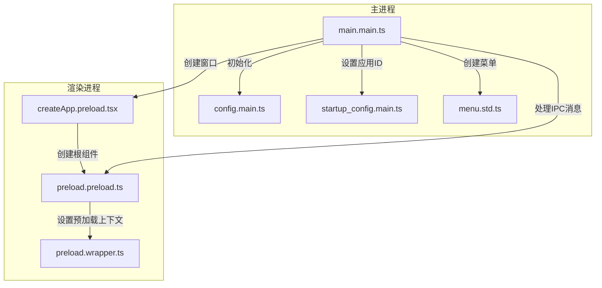
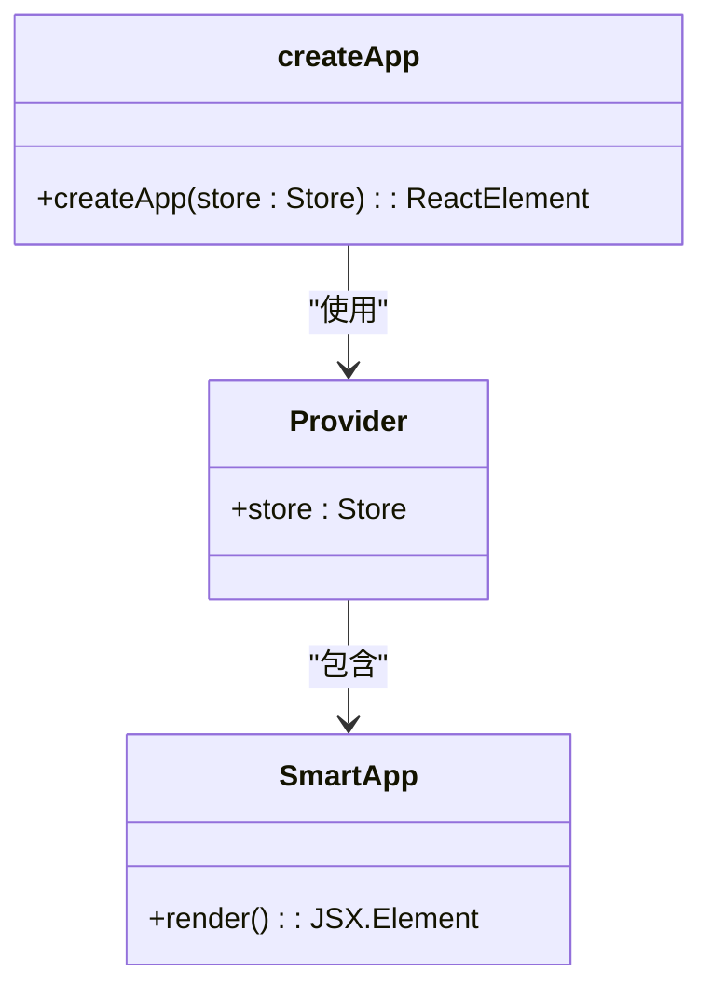
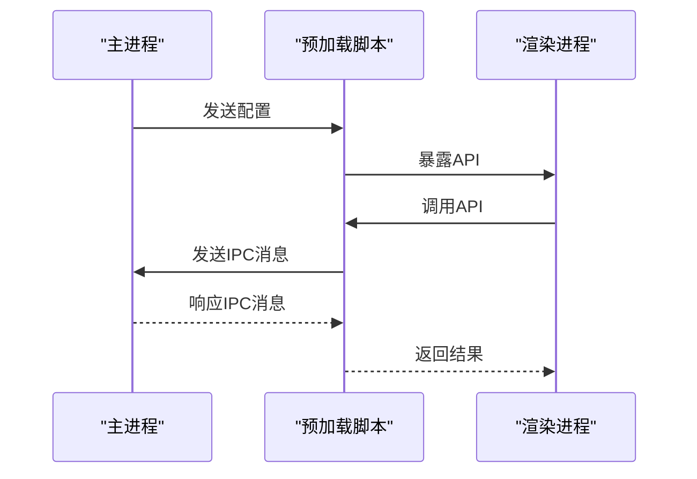
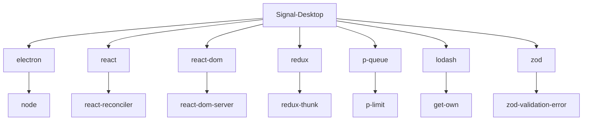

# 应用初始化流程

<cite>
**本文档引用的文件**   
- [main.main.ts](file://app/main.main.ts)
- [preload.wrapper.ts](file://preload.wrapper.ts)
- [createApp.preload.tsx](file://ts/state/roots/createApp.preload.tsx)
- [preload.preload.ts](file://ts/util/preload.preload.ts)
- [config.main.ts](file://app/config.main.ts)
- [startup_config.main.ts](file://app/startup_config.main.ts)
- [menu.std.ts](file://app/menu.std.ts)
- [preload.bundle.js](file://preload.bundle.js)
</cite>

## 目录
1. [简介](#简介)
2. [项目结构](#项目结构)
3. [核心组件](#核心组件)
4. [架构概述](#架构概述)
5. [详细组件分析](#详细组件分析)
6. [依赖分析](#依赖分析)
7. [性能考虑](#性能考虑)
8. [故障排除指南](#故障排除指南)
9. [结论](#结论)

## 简介
Signal-Desktop应用的初始化流程从Electron主进程启动开始，经过一系列复杂的步骤，最终完成UI的渲染。该流程涉及主进程和渲染进程的协同工作，确保应用能够安全、高效地启动。

## 项目结构
Signal-Desktop项目结构清晰，主要分为以下几个部分：
- `_locales`：包含多语言支持的JSON文件。
- `app`：包含主进程的TypeScript文件。
- `components`：包含Web组件和音频录制库。
- `config`：包含不同环境的配置文件。
- `danger`：包含代码审查规则。
- `fixtures`：包含测试用例的固定数据。
- `js`：包含调用工具和WebAudioRecorder库。
- `packages`：包含Mute State Change包。
- `patches`：包含各种依赖包的补丁。
- `protos`：包含Protocol Buffer定义文件。
- `reproducible-builds`：包含可重复构建的Docker配置。
- `scripts`：包含构建和准备脚本。
- `sticker-creator`：包含贴纸创建器的源代码。
- `stylesheets`：包含样式表文件。
- `test`：包含测试文件。
- `ts`：包含TypeScript源代码。
- 根目录文件：包含各种配置文件和HTML模板。

**Section sources**
- [main.main.ts](file://app/main.main.ts#L1-L3387)
- [package.json](file://package.json#L1-L714)

## 核心组件
Signal-Desktop的核心组件包括主进程的`main.main.ts`、预加载脚本的`preload.wrapper.ts`、根组件创建的`createApp.preload.tsx`以及预加载上下文设置的`preload.preload.ts`。这些组件共同协作，确保应用的顺利启动和运行。

**Section sources**
- [main.main.ts](file://app/main.main.ts#L1-L3387)
- [preload.wrapper.ts](file://preload.wrapper.ts#L1-L83)
- [createApp.preload.tsx](file://ts/state/roots/createApp.preload.tsx#L1-L23)
- [preload.preload.ts](file://ts/util/preload.preload.ts#L1-L193)

## 架构概述
Signal-Desktop采用Electron框架，结合React进行UI开发。主进程负责管理应用的生命周期和系统资源，而渲染进程则负责UI的渲染和用户交互。通过IPC（Inter-Process Communication）机制，主进程和渲染进程可以安全地交换数据和消息。

**Diagram sources **
- [main.main.ts](file://app/main.main.ts#L1-L3387)
- [config.main.ts](file://app/config.main.ts#L1-L77)
- [startup_config.main.ts](file://app/startup_config.main.ts#L1-L23)
- [menu.std.ts](file://app/menu.std.ts#L1-L200)
- [createApp.preload.tsx](file://ts/state/roots/createApp.preload.tsx#L1-L23)
- [preload.preload.ts](file://ts/util/preload.preload.ts#L1-L193)
- [preload.wrapper.ts](file://preload.wrapper.ts#L1-L83)

## 详细组件分析

### 主进程初始化
主进程的初始化从`main.main.ts`文件开始。首先，通过`app.requestSingleInstanceLock()`确保应用的单实例运行。然后，加载配置文件并设置应用的用户模型ID（AUMID）。接着，创建主窗口并设置其属性，如标题栏样式、背景颜色等。最后，通过`safeLoadURL`加载主页面。

**Section sources**
- [main.main.ts](file://app/main.main.ts#L1-L3387)

### 根组件创建
根组件的创建在`createApp.preload.tsx`文件中完成。该文件定义了一个`createApp`函数，用于创建React应用的根组件。通过`Provider`组件将Redux store注入到应用中，并使用`SmartApp`组件作为应用的主界面。

**Diagram sources **
- [createApp.preload.tsx](file://ts/state/roots/createApp.preload.tsx#L1-L23)

### 预加载上下文设置
预加载上下文的设置在`preload.preload.ts`文件中完成。该文件通过`contextBridge.exposeInMainWorld`将特定的API暴露给渲染进程，确保渲染进程可以安全地访问主进程的功能。例如，`installSetting`函数用于安装设置相关的IPC事件处理器。

**Diagram sources **
- [preload.preload.ts](file://ts/util/preload.preload.ts#L1-L193)
- [preload.wrapper.ts](file://preload.wrapper.ts#L1-L83)

### 应用配置加载
应用配置的加载在`config.main.ts`文件中完成。该文件通过`require('config')`加载配置文件，并根据环境变量设置不同的配置。例如，生产环境会禁用一些调试功能，以提高安全性。

**Section sources**
- [config.main.ts](file://app/config.main.ts#L1-L77)

### 状态初始化
状态初始化在`main.main.ts`文件中完成。通过`sql`模块初始化数据库连接，并加载用户的窗口配置。此外，还设置了拼写检查、主题设置等用户偏好。

**Section sources**
- [main.main.ts](file://app/main.main.ts#L1-L3387)

### 服务注册
服务注册在`main.main.ts`文件中完成。通过`ipc.handle`和`ipc.on`注册各种IPC事件处理器，以便主进程和渲染进程之间可以进行通信。例如，`database-ready`事件处理器用于通知渲染进程数据库已准备好。

**Section sources**
- [main.main.ts](file://app/main.main.ts#L1-L3387)

### 窗口创建
窗口创建在`main.main.ts`文件中完成。通过`BrowserWindow`类创建主窗口，并设置其属性，如宽度、高度、位置等。此外，还设置了窗口的事件处理器，如`resize`、`move`等，以捕获窗口的变化。

**Section sources**
- [main.main.ts](file://app/main.main.ts#L1-L3387)

## 依赖分析
Signal-Desktop的依赖关系复杂，涉及多个第三方库和模块。主要依赖包括：
- `electron`：用于创建桌面应用。
- `react` 和 `react-dom`：用于UI开发。
- `redux`：用于状态管理。
- `p-queue`：用于任务队列管理。
- `lodash`：用于实用函数。
- `zod`：用于数据验证。

**Diagram sources **
- [package.json](file://package.json#L1-L714)

## 性能考虑
为了优化启动性能，Signal-Desktop采取了多种措施：
- **预加载缓存**：通过`preload.bundle.cache`文件缓存预加载脚本，减少启动时间。
- **异步加载**：通过`safeLoadURL`异步加载主页面，避免阻塞主进程。
- **资源压缩**：通过`esbuild`工具压缩和打包资源文件，减少文件大小。

**Section sources**
- [preload.wrapper.ts](file://preload.wrapper.ts#L1-L83)
- [main.main.ts](file://app/main.main.ts#L1-L3387)
- [esbuild.js](file://scripts/esbuild.js#L1-L232)

## 故障排除指南
在初始化过程中，可能会遇到一些常见问题。以下是一些故障排除建议：
- **启动失败**：检查`main.main.ts`中的错误日志，确保所有依赖项都已正确安装。
- **窗口不显示**：检查`createWindow`函数中的窗口配置，确保`show`属性为`true`。
- **IPC通信失败**：检查`ipc.handle`和`ipc.on`的事件名称是否匹配，确保主进程和渲染进程之间的通信正常。

**Section sources**
- [main.main.ts](file://app/main.main.ts#L1-L3387)
- [preload.preload.ts](file://ts/util/preload.preload.ts#L1-L193)

## 结论
Signal-Desktop的初始化流程是一个复杂但有序的过程，涉及多个组件和步骤。通过合理的架构设计和优化措施，确保了应用的高效启动和稳定运行。理解这一流程有助于开发者更好地维护和扩展应用。