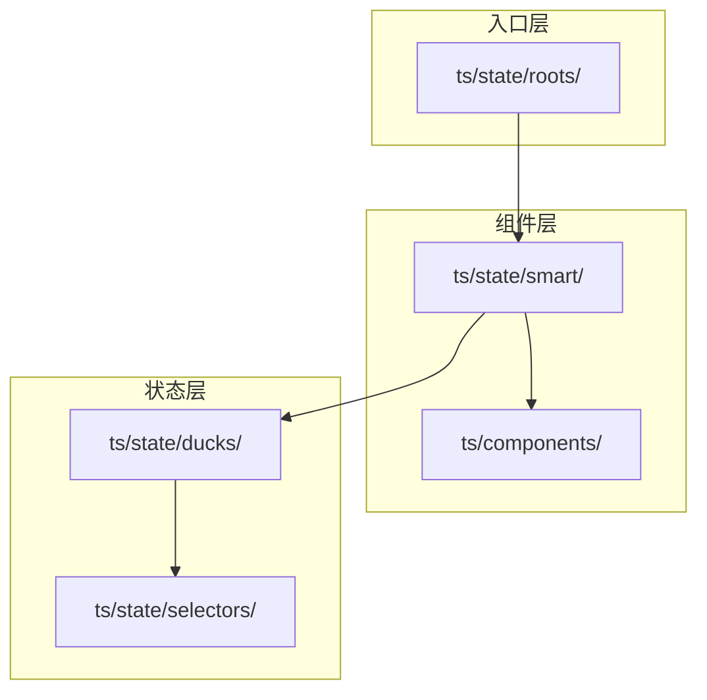
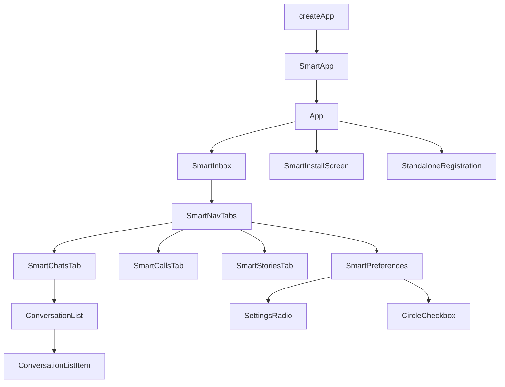
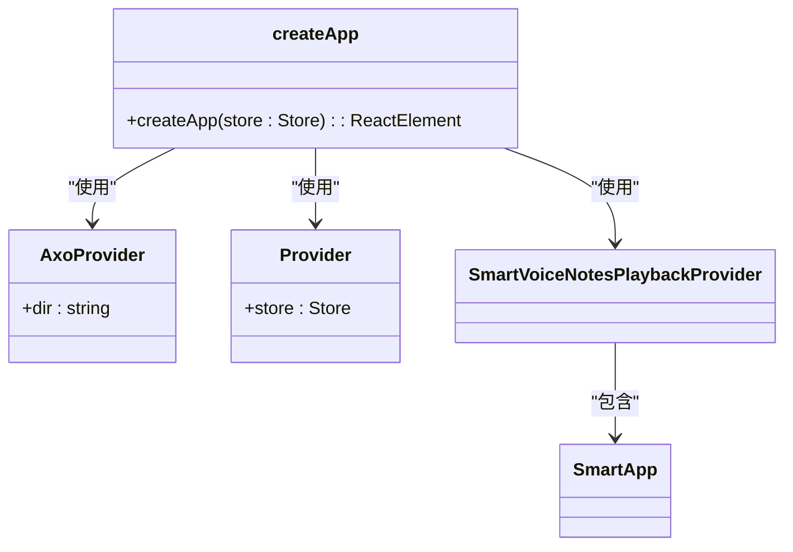
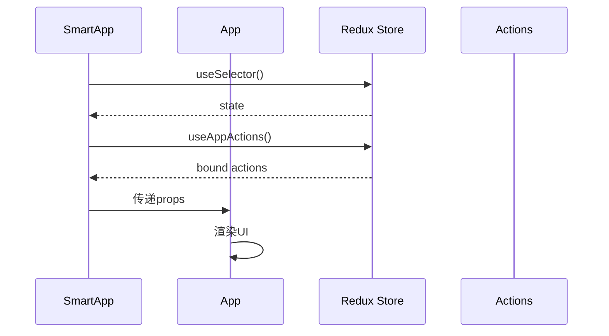
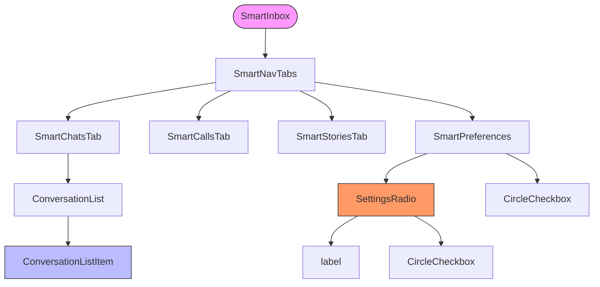

# 组件层次结构

<cite>
**本文档中引用的文件**  
- [createApp.preload.tsx](file://ts/state/roots/createApp.preload.tsx)
- [App.preload.tsx](file://ts/components/App.preload.tsx)
- [App.preload.tsx](file://ts/state/smart/App.preload.tsx)
- [Inbox.preload.tsx](file://ts/state/smart/Inbox.preload.tsx)
- [ConversationPanel.preload.tsx](file://ts/state/smart/ConversationPanel.preload.tsx)
- [Preferences.preload.tsx](file://ts/state/smart/Preferences.preload.tsx)
</cite>

## 目录
1. [简介](#简介)
2. [项目结构](#项目结构)
3. [核心组件](#核心组件)
4. [架构概览](#架构概览)
5. [详细组件分析](#详细组件分析)
6. [依赖分析](#依赖分析)
7. [性能考虑](#性能考虑)
8. [故障排除指南](#故障排除指南)
9. [结论](#结论)

## 简介
本文档详细描述Signal-Desktop应用程序的React组件层次结构。重点介绍基于Redux的状态管理与组件职责分离的设计模式，涵盖从根组件创建到UI区域构成的完整组件树结构。文档解释智能组件与展示组件的分层设计、数据流机制以及主要UI区域的嵌套关系。

## 项目结构
Signal-Desktop采用分层的组件组织结构，将UI组件与状态逻辑分离。核心React组件位于`ts/components/`目录，而连接Redux状态的智能组件位于`ts/state/smart/`目录。应用入口和根组件定义在`ts/state/roots/`中，形成清晰的分层架构。



**Diagram sources**
- [createApp.preload.tsx](file://ts/state/roots/createApp.preload.tsx)
- [App.preload.tsx](file://ts/components/App.preload.tsx)

**Section sources**
- [createApp.preload.tsx](file://ts/state/roots/createApp.preload.tsx)
- [App.preload.tsx](file://ts/components/App.preload.tsx)

## 核心组件
Signal-Desktop的核心组件体系以React-Redux架构为基础，通过`createApp.preload.tsx`创建根组件，使用Provider模式注入Redux store。组件树采用智能组件（Smart Components）与展示组件（Presentational Components）分离的设计模式，实现关注点分离。

**Section sources**
- [createApp.preload.tsx](file://ts/state/roots/createApp.preload.tsx)
- [App.preload.tsx](file://ts/components/App.preload.tsx)

## 架构概览
Signal-Desktop的组件架构采用分层设计，从根组件到具体UI组件形成清晰的层次结构。根组件通过Redux store管理全局状态，智能组件负责状态订阅和动作分发，展示组件专注于UI渲染。



**Diagram sources**
- [createApp.preload.tsx](file://ts/state/roots/createApp.preload.tsx)
- [App.preload.tsx](file://ts/components/App.preload.tsx)
- [App.preload.tsx](file://ts/state/smart/App.preload.tsx)

## 详细组件分析
Signal-Desktop的组件系统采用严格的分层设计，确保关注点分离和代码可维护性。

### 根组件创建过程
`createApp.preload.tsx`文件定义了应用根组件的创建过程，通过函数式组件接收Redux store并返回包装后的React元素树。该过程使用AxoProvider提供国际化支持，Provider注入Redux store，SmartVoiceNotesPlaybackProvider管理语音笔记播放状态。



**Diagram sources**
- [createApp.preload.tsx](file://ts/state/roots/createApp.preload.tsx)

**Section sources**
- [createApp.preload.tsx](file://ts/state/roots/createApp.preload.tsx)

### 智能组件与展示组件职责分离
`App.preload.tsx`作为展示组件接收来自`SmartApp`的所有props，而`SmartApp`作为智能组件负责从Redux store中选择状态并绑定动作创建器。这种分离模式确保UI渲染与状态管理逻辑解耦。



**Diagram sources**
- [App.preload.tsx](file://ts/components/App.preload.tsx)
- [App.preload.tsx](file://ts/state/smart/App.preload.tsx)

**Section sources**
- [App.preload.tsx](file://ts/components/App.preload.tsx)
- [App.preload.tsx](file://ts/state/smart/App.preload.tsx)

### 主要UI区域组件构成
#### 对话列表区域
对话列表区域由`SmartInbox`组件驱动，通过`renderChatsTab`函数渲染聊天标签页，包含`ConversationList`和`ConversationListItem`组件。

#### 消息面板区域
消息面板区域由`SmartConversationPanel`组件管理，根据当前面板类型动态渲染不同内容，如媒体、聊天颜色编辑器、联系人详情等。

#### 设置界面区域
设置界面由`SmartPreferences`组件实现，使用`SettingsRadio`和`CircleCheckbox`等基础组件构建用户界面。



**Diagram sources**
- [Inbox.preload.tsx](file://ts/state/smart/Inbox.preload.tsx)
- [ConversationPanel.preload.tsx](file://ts/state/smart/ConversationPanel.preload.tsx)
- [Preferences.preload.tsx](file://ts/state/smart/Preferences.preload.tsx)

**Section sources**
- [Inbox.preload.tsx](file://ts/state/smart/Inbox.preload.tsx)
- [ConversationPanel.preload.tsx](file://ts/state/smart/ConversationPanel.preload.tsx)
- [Preferences.preload.tsx](file://ts/state/smart/Preferences.preload.tsx)

## 依赖分析
Signal-Desktop组件系统依赖于React、Redux和TypeScript等核心技术栈。组件间通过props传递数据，智能组件通过useSelector和useActions Hook订阅状态和分发动作。

```mermaid
dependencyDiagram
React --> Redux
Redux --> TypeScript
SmartComponents --> React
SmartComponents --> Redux
PresentationalComponents --> React
Hooks --> React
```

**Diagram sources**
- [createApp.preload.tsx](file://ts/state/roots/createApp.preload.tsx)
- [App.preload.tsx](file://ts/components/App.preload.tsx)

**Section sources**
- [createApp.preload.tsx](file://ts/state/roots/createApp.preload.tsx)
- [App.preload.tsx](file://ts/components/App.preload.tsx)

## 性能考虑
Signal-Desktop通过使用React.memo对智能组件进行记忆化，避免不必要的重新渲染。组件设计遵循单一职责原则，确保每个组件只关注特定功能，提高可测试性和可维护性。

## 故障排除指南
当遇到组件渲染问题时，应检查：
1. Redux store状态是否正确更新
2. 智能组件的useSelector选择器是否正确
3. props是否正确传递到展示组件
4. 组件是否正确使用memo进行优化

**Section sources**
- [App.preload.tsx](file://ts/components/App.preload.tsx)
- [App.preload.tsx](file://ts/state/smart/App.preload.tsx)

## 结论
Signal-Desktop的组件层次结构体现了现代React应用的最佳实践，通过清晰的分层设计、智能组件与展示组件的分离以及合理的状态管理，构建了一个可维护、可扩展的UI架构。这种设计模式确保了代码的可读性和可测试性，为应用的持续发展奠定了坚实基础。