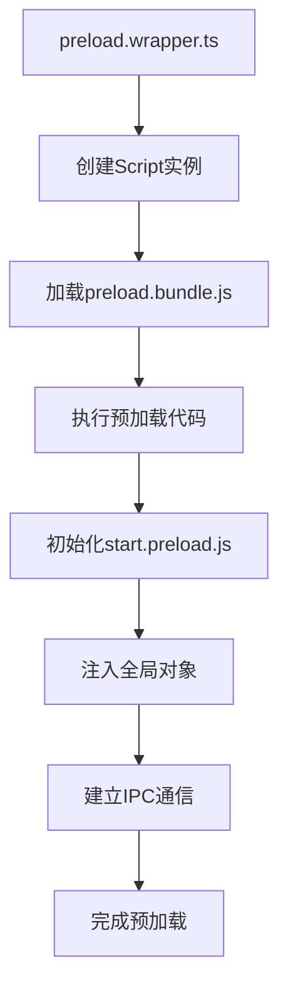
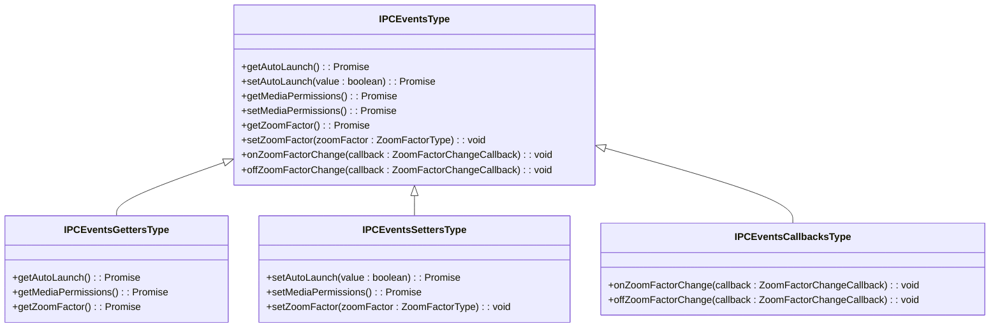
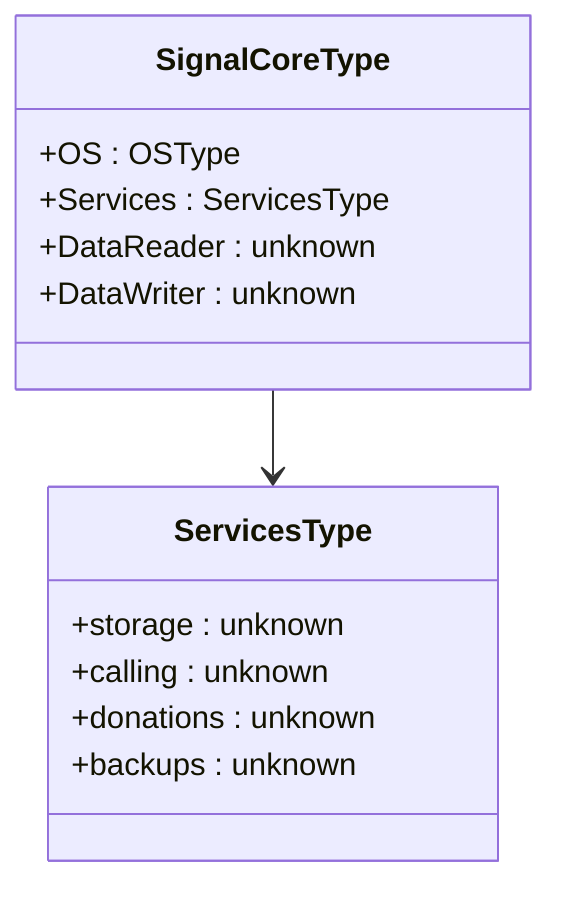
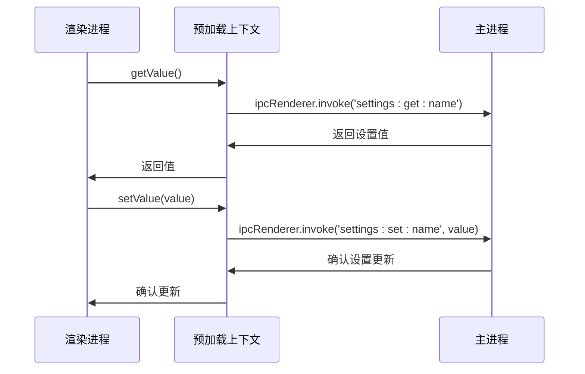
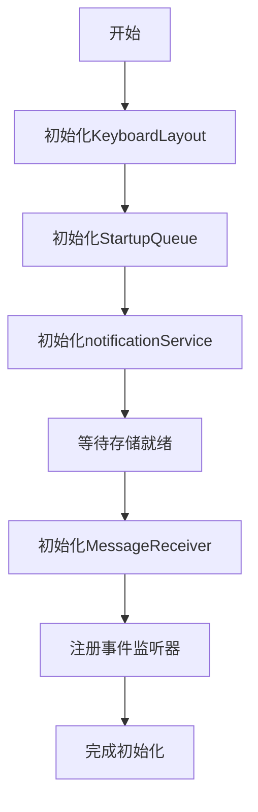

# 预加载上下文

<cite>
**本文档中引用的文件**  
- [preload.wrapper.ts](file://preload.wrapper.ts)
- [ts/windows/main/preload.preload.ts](file://ts/windows/main/preload.preload.ts)
- [ts/util/preload.preload.ts](file://ts/util/preload.preload.ts)
- [ts/signal.preload.ts](file://ts/signal.preload.ts)
- [ts/background.preload.ts](file://ts/background.preload.ts)
- [ts/window.d.ts](file://ts/window.d.ts)
- [ts/util/createIPCEvents.preload.ts](file://ts/util/createIPCEvents.preload.ts)
- [ts/environment.std.ts](file://ts/environment.std.ts)
- [ts/windows/context.preload.ts](file://ts/windows/context.preload.ts)
</cite>

## 目录
1. [引言](#引言)
2. [预加载上下文架构](#预加载上下文架构)
3. [安全机制与沙箱隔离](#安全机制与沙箱隔离)
4. [全局对象注入与API暴露策略](#全局对象注入与api暴露策略)
5. [IPC通信封装与权限控制](#ipc通信封装与权限控制)
6. [配置管理与环境检测](#配置管理与环境检测)
7. [国际化支持实现](#国际化支持实现)
8. [依赖关系与加载时序](#依赖关系与加载时序)
9. [上下文隔离与安全加固](#上下文隔离与安全加固)
10. [主进程与渲染进程交互模式](#主进程与渲染进程交互模式)
11. [最佳实践与安全边界设置](#最佳实践与安全边界设置)

## 引言

Signal-Desktop的预加载上下文是Electron应用安全架构的核心组成部分，负责在渲染进程与主进程之间建立安全的通信桥梁。该上下文通过严格的沙箱隔离、上下文隔离和权限控制机制，确保了渲染进程无法直接访问Node.js API和Electron的敏感功能，从而防止潜在的安全漏洞。预加载脚本在渲染进程初始化时执行，为应用提供了必要的全局对象、IPC通信封装和安全边界设置，同时实现了配置管理、国际化支持和环境检测等关键功能。

**Section sources**
- [ts/windows/main/preload.preload.ts](file://ts/windows/main/preload.preload.ts#L1-L29)

## 预加载上下文架构

Signal-Desktop的预加载上下文采用分层架构设计，通过多个预加载文件协同工作来实现完整的功能。主预加载文件`preload.preload.ts`位于`ts/windows/main/`目录下，负责初始化预加载环境并加载核心模块。该文件通过`require('./start.preload.js')`引入启动脚本，触发整个预加载流程。

预加载上下文的入口点是`preload.wrapper.ts`，该文件负责加载和执行预加载bundle。它使用Node.js的`vm.Script`类来创建一个安全的执行环境，并通过`runInThisContext`方法在当前上下文中执行预加载代码。这种设计允许预加载脚本访问必要的Node.js模块，同时保持与渲染进程的隔离。

**Diagram sources**
- [preload.wrapper.ts](file://preload.wrapper.ts#L1-L83)
- [ts/windows/main/preload.preload.ts](file://ts/windows/main/preload.preload.ts#L1-L29)

**Section sources**
- [preload.wrapper.ts](file://preload.wrapper.ts#L1-L83)
- [ts/windows/main/preload.preload.ts](file://ts/windows/main/preload.preload.ts#L1-L29)

## 安全机制与沙箱隔离

Signal-Desktop的预加载上下文实现了多层次的安全机制和沙箱隔离策略。通过Electron的`contextIsolation`和`sandbox`选项，预加载脚本与渲染进程完全隔离，防止原型污染和跨上下文攻击。预加载脚本运行在独立的上下文中，只能通过明确定义的API与渲染进程通信。

安全机制的核心是`createIPCEvents`函数，它定义了预加载上下文中可用的IPC事件和回调。这些事件经过严格验证和类型检查，确保只有授权的操作才能通过IPC通道执行。例如，`getAutoLaunch`和`setAutoLaunch`方法通过主进程的IPC接口安全地访问系统自动启动设置，而不会暴露底层的Electron API。

**Diagram sources**
- [ts/util/createIPCEvents.preload.ts](file://ts/util/createIPCEvents.preload.ts#L1-L471)

**Section sources**
- [ts/util/createIPCEvents.preload.ts](file://ts/util/createIPCEvents.preload.ts#L1-L471)

## 全局对象注入与API暴露策略

预加载上下文通过精心设计的API暴露策略向渲染进程注入必要的全局对象。`signal.preload.ts`文件中的`setup`函数是全局对象注入的核心，它创建并返回一个包含必要服务和工具的`SignalCoreType`对象。这个对象包含了OS信息、存储服务、通话服务等关键组件，但仅暴露生产环境所需的功能。

API暴露策略遵循最小权限原则，只暴露渲染进程必需的功能。例如，在生产环境中，`DataReader`和`DataWriter`等数据库访问对象仅在非生产环境下暴露，以防止潜在的安全风险。这种条件性暴露通过`isProduction`函数实现，确保开发和测试环境的功能不会意外暴露在生产环境中。

**Diagram sources**
- [ts/signal.preload.ts](file://ts/signal.preload.ts#L1-L40)

**Section sources**
- [ts/signal.preload.ts](file://ts/signal.preload.ts#L1-L40)

## IPC通信封装与权限控制

IPC通信封装是预加载上下文的核心功能之一，它通过`util/preload.preload.ts`文件中的`createSetting`和`installSetting`函数实现。这些函数创建了类型安全的设置访问器，允许渲染进程通过IPC通道安全地读取和修改应用设置。每个设置都有明确的getter和setter，通过`settings:get:${name}`和`settings:set:${name}`事件与主进程通信。

权限控制机制确保只有授权的操作才能执行。例如，`installSetting`函数在安装设置时会验证getter和setter的存在性，并在调用失败时返回适当的错误信息。这种设计防止了未经授权的设置访问，同时提供了清晰的错误处理机制。

**Diagram sources**
- [ts/util/preload.preload.ts](file://ts/util/preload.preload.ts#L1-L193)

**Section sources**
- [ts/util/preload.preload.ts](file://ts/util/preload.preload.ts#L1-L193)

## 配置管理与环境检测

预加载上下文通过`environment.std.ts`文件实现了完善的配置管理和环境检测机制。`Environment`枚举定义了应用的四种运行环境：开发、打包应用、预发布和测试。`getEnvironment`函数返回当前环境，而`setEnvironment`函数确保环境只能在应用启动时设置一次，防止运行时篡改。

配置管理还包括对渲染器配置的访问，通过`SignalContext.config`提供对应用配置的只读访问。这种设计确保了配置的一致性和安全性，同时允许根据环境动态调整应用行为。

**Section sources**
- [ts/environment.std.ts](file://ts/environment.std.ts#L1-L61)

## 国际化支持实现

国际化支持通过`windows/context.preload.ts`文件中的`SignalContext`对象实现。该对象提供了`i18n`本地化服务，允许渲染进程访问多语言资源。`getResolvedMessagesLocale`函数返回解析后的消息语言，而`getI18nLocaleMessages`提供对特定语言消息的访问。

预加载上下文还支持动态语言切换，通过`setLocaleOverride`方法允许用户覆盖系统语言设置。这种机制确保了应用能够根据用户偏好显示相应语言的内容，同时保持与主进程的同步。

**Section sources**
- [ts/windows/context.preload.ts](file://ts/windows/context.preload.ts#L1-L88)

## 依赖关系与加载时序

预加载上下文的依赖关系和加载时序经过精心设计，确保各组件按正确顺序初始化。`background.preload.ts`文件展示了复杂的依赖链，其中多个服务和队列按特定顺序初始化。例如，`KeyboardLayout`和`StartupQueue`在早期初始化，而`MessageReceiver`和`notificationService`在存储系统就绪后才启动。

加载时序通过`itemStorage.onready`回调确保，只有在存储系统准备就绪后才执行主要的初始化逻辑。这种设计防止了在依赖项未准备好时进行操作，确保了应用的稳定性和可靠性。

**Diagram sources**
- [ts/background.preload.ts](file://ts/background.preload.ts#L1-L800)

**Section sources**
- [ts/background.preload.ts](file://ts/background.preload.ts#L1-L800)

## 上下文隔离与安全加固

上下文隔离和安全加固措施通过多种技术实现。`window.d.ts`文件定义了预加载上下文中可用的全局对象和类型，确保类型安全和API一致性。`strictAssert`和`assertDev`等断言函数用于在开发和生产环境中验证关键条件，防止潜在的逻辑错误。

安全加固还包括对原型链的保护，防止原型污染攻击。通过使用`Object.create(null)`创建无原型的对象，以及对输入数据的严格验证，预加载上下文最大限度地减少了安全漏洞的可能性。

**Section sources**
- [ts/window.d.ts](file://ts/window.d.ts#L1-L241)

## 主进程与渲染进程交互模式

主进程与渲染进程的交互模式基于Electron的IPC机制，通过预加载上下文作为中介。`IPC`对象暴露了主进程的功能，如`showWindow`、`shutdown`和`setBadge`，而渲染进程通过`Events`对象向主进程发送事件。

这种双向通信模式确保了主进程对关键操作的控制权，同时允许渲染进程请求必要的服务。例如，当用户尝试关闭应用时，渲染进程通过`requestCloseConfirmation`回调与主进程协商，确保在通话等关键操作期间不会意外关闭。

**Section sources**
- [ts/window.d.ts](file://ts/window.d.ts#L1-L241)

## 最佳实践与安全边界设置

预加载上下文的最佳实践包括：使用类型安全的IPC事件、实施最小权限原则、确保上下文隔离、以及对所有外部输入进行验证。安全边界设置通过限制暴露的API、使用沙箱环境、以及实施严格的错误处理机制来实现。

这些实践确保了预加载上下文既能提供必要的功能，又能最大限度地减少安全风险。通过持续的安全审查和代码审计，Signal-Desktop维护了一个既强大又安全的预加载环境。