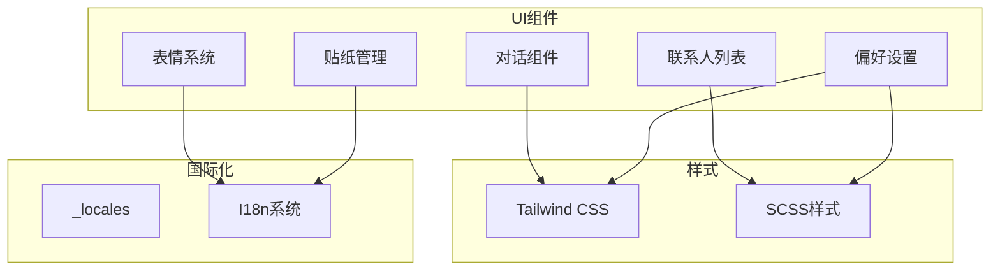
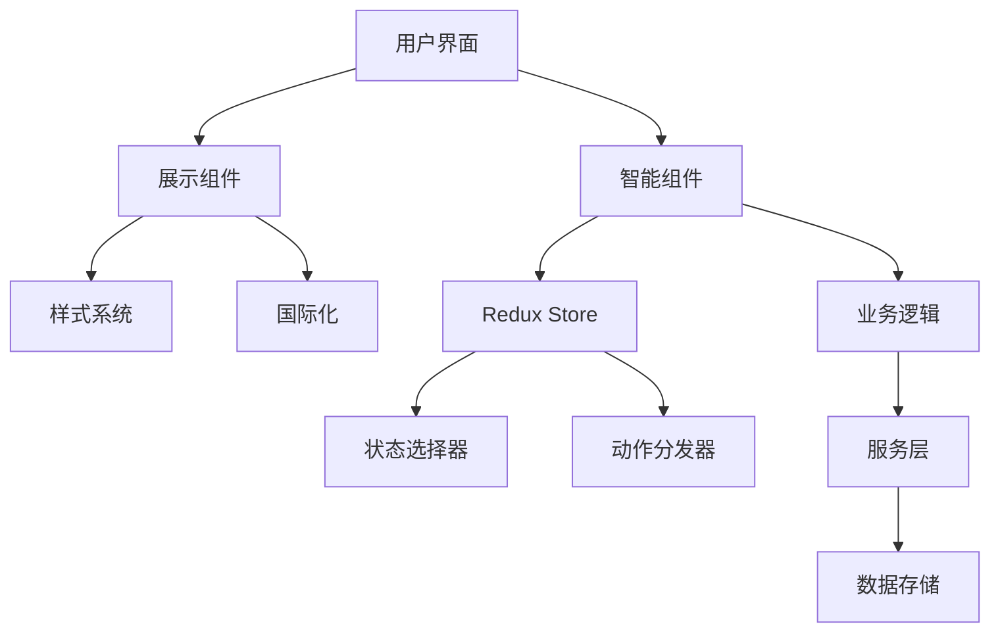
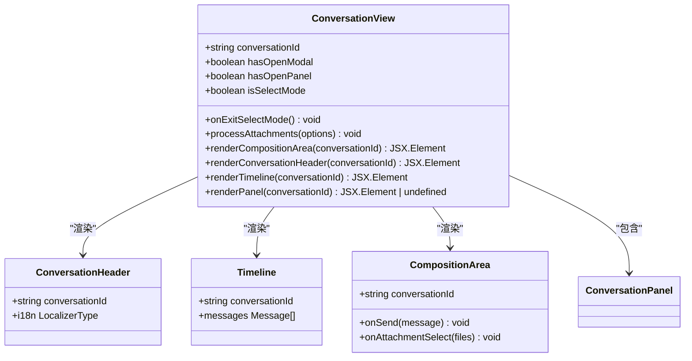
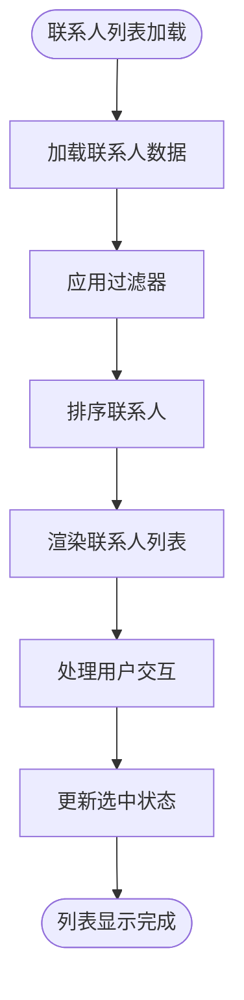
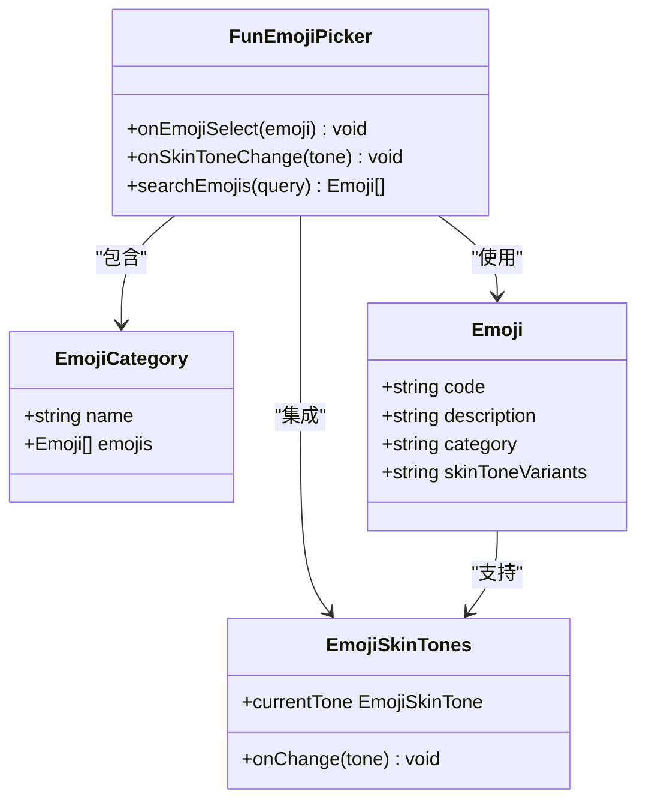
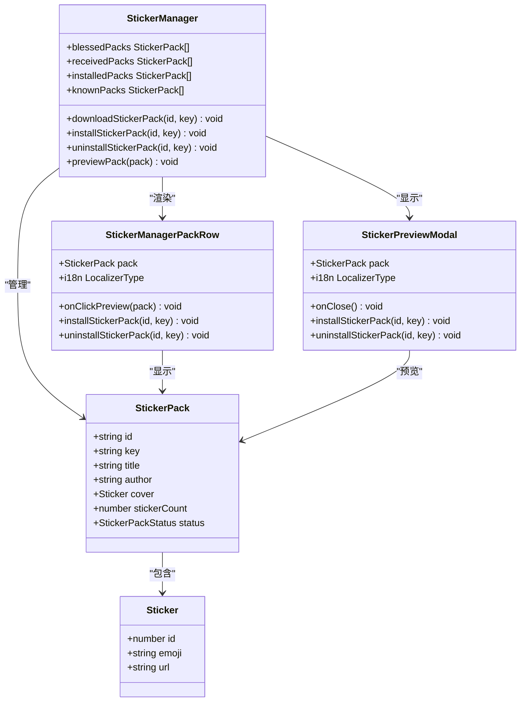
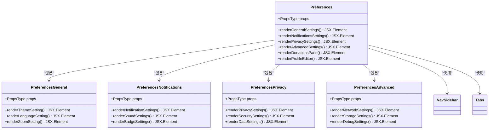
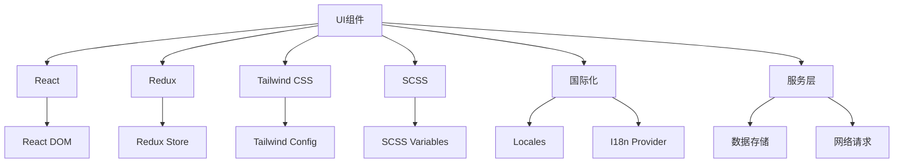

# UI组件

<cite>
**本文档中引用的文件**  
- [ConversationView.dom.tsx](file://ts/components/conversation/ConversationView.dom.tsx)
- [Preferences.dom.tsx](file://ts/components/Preferences.dom.tsx)
- [StickerManager.dom.tsx](file://ts/components/stickers/StickerManager.dom.tsx)
- [FunEmojiPicker.dom.tsx](file://ts/components/fun/FunEmojiPicker.dom.tsx)
- [EmojiPicker.tsx](file://sticker-creator/src/components/EmojiPicker.tsx)
</cite>

## 目录
1. [简介](#简介)
2. [项目结构](#项目结构)
3. [核心组件](#核心组件)
4. [架构概述](#架构概述)
5. [详细组件分析](#详细组件分析)
6. [依赖分析](#依赖分析)
7. [性能考虑](#性能考虑)
8. [故障排除指南](#故障排除指南)
9. [结论](#结论)

## 简介
本文档深入分析Signal-Desktop的核心UI组件，重点介绍对话组件、联系人列表、表情系统、贴纸管理和偏好设置等主要界面组件的实现细节。文档详细解析了conversation目录下的消息渲染逻辑、conversationList中的会话项管理、fun中的表情选择器实现，以及preferences中的设置界面架构。同时提供组件API文档，包括props定义、事件回调和插槽机制，并记录组件的可访问性支持、国际化适配和响应式设计实现。

## 项目结构
Signal-Desktop的UI组件主要分布在ts/components目录下，按功能模块组织。核心UI组件包括对话视图、联系人管理、表情系统、贴纸管理和偏好设置等。项目采用TypeScript和React构建，结合Redux进行状态管理。

**图表来源**  
- [ts/components/conversation/ConversationView.dom.tsx](file://ts/components/conversation/ConversationView.dom.tsx)
- [ts/components/Preferences.dom.tsx](file://ts/components/Preferences.dom.tsx)

**节来源**
- [ts/components/conversation/ConversationView.dom.tsx](file://ts/components/conversation/ConversationView.dom.tsx)
- [ts/components/Preferences.dom.tsx](file://ts/components/Preferences.dom.tsx)

## 核心组件
Signal-Desktop的核心UI组件包括对话视图、联系人列表、表情选择器、贴纸管理器和偏好设置面板。这些组件构成了应用的主要用户界面，提供了消息收发、联系人管理、表情和贴纸使用以及个性化设置等功能。

**节来源**
- [ts/components/conversation/ConversationView.dom.tsx](file://ts/components/conversation/ConversationView.dom.tsx)
- [ts/components/Preferences.dom.tsx](file://ts/components/Preferences.dom.tsx)
- [ts/components/stickers/StickerManager.dom.tsx](file://ts/components/stickers/StickerManager.dom.tsx)

## 架构概述
Signal-Desktop的UI架构采用组件化设计，通过React构建可复用的UI组件。组件间通过props传递数据和回调函数，结合Redux进行全局状态管理。UI组件与业务逻辑分离，通过智能组件（Smart Components）连接状态和展示组件（Dumb Components）。

**图表来源**  
- [ts/components/conversation/ConversationView.dom.tsx](file://ts/components/conversation/ConversationView.dom.tsx)
- [ts/components/Preferences.dom.tsx](file://ts/components/Preferences.dom.tsx)
- [ts/state/smart/ConversationView.preload.tsx](file://ts/state/smart/ConversationView.preload.tsx)

## 详细组件分析
本文档详细分析Signal-Desktop的主要UI组件，包括对话组件、联系人列表、表情系统、贴纸管理和偏好设置等。

### 对话组件分析
对话组件是Signal-Desktop的核心界面，负责显示消息历史、消息输入和会话管理。组件采用模块化设计，包含消息渲染、输入区域、会话头等子组件。

**图表来源**  
- [ts/components/conversation/ConversationView.dom.tsx](file://ts/components/conversation/ConversationView.dom.tsx)
- [ts/components/conversation/ConversationHeader.dom.tsx](file://ts/components/conversation/ConversationHeader.dom.tsx)

**节来源**
- [ts/components/conversation/ConversationView.dom.tsx](file://ts/components/conversation/ConversationView.dom.tsx)

### 联系人列表分析
联系人列表组件管理用户的联系人显示和交互。组件支持联系人搜索、分组显示和批量操作等功能。

**图表来源**  
- [ts/components/conversation/ContactList.dom.tsx](file://ts/components/conversation/ContactList.dom.tsx)
- [ts/components/ContactPills.dom.tsx](file://ts/components/ContactPills.dom.tsx)

**节来源**
- [ts/components/conversation/ContactList.dom.tsx](file://ts/components/conversation/ContactList.dom.tsx)

### 表情系统分析
表情系统提供表情选择和管理功能，支持表情搜索、分类浏览和皮肤色调选择。系统采用模块化设计，便于扩展和维护。

**图表来源**  
- [ts/components/fun/FunEmojiPicker.dom.tsx](file://ts/components/fun/FunEmojiPicker.dom.tsx)
- [ts/components/fun/FunSkinTones.dom.js](file://ts/components/fun/FunSkinTones.dom.js)

**节来源**
- [ts/components/fun/FunEmojiPicker.dom.tsx](file://ts/components/fun/FunEmojiPicker.dom.tsx)

### 贴纸管理分析
贴纸管理器组件提供贴纸包的浏览、安装和预览功能。组件支持已安装、已接收和可用贴纸包的分类管理。

**图表来源**  
- [ts/components/stickers/StickerManager.dom.tsx](file://ts/components/stickers/StickerManager.dom.tsx)
- [ts/components/stickers/StickerManagerPackRow.dom.tsx](file://ts/components/stickers/StickerManagerPackRow.dom.tsx)

**节来源**
- [ts/components/stickers/StickerManager.dom.tsx](file://ts/components/stickers/StickerManager.dom.tsx)

### 偏好设置分析
偏好设置组件提供应用的个性化配置界面，包括常规设置、通知设置、隐私设置和高级设置等。组件采用标签页设计，便于用户导航。

**图表来源**  
- [ts/components/Preferences.dom.tsx](file://ts/components/Preferences.dom.tsx)
- [ts/components/PreferencesUtil.dom.js](file://ts/components/PreferencesUtil.dom.js)

**节来源**
- [ts/components/Preferences.dom.tsx](file://ts/components/Preferences.dom.tsx)

## 依赖分析
Signal-Desktop的UI组件依赖于多个核心库和系统，包括React、Redux、Tailwind CSS和国际化系统。组件间通过清晰的接口进行通信，降低了耦合度。

**图表来源**  
- [ts/components/Preferences.dom.tsx](file://ts/components/Preferences.dom.tsx)
- [ts/state/smart/SmartStickerManager.preload.tsx](file://ts/state/smart/SmartStickerManager.preload.tsx)
- [ts/components/fun/FunEmojiLocalizationProvider.dom.js](file://ts/components/fun/FunEmojiLocalizationProvider.dom.js)

**节来源**
- [ts/components/Preferences.dom.tsx](file://ts/components/Preferences.dom.tsx)
- [ts/state/ducks/stickers.preload.js](file://ts/state/ducks/stickers.preload.js)

## 性能考虑
Signal-Desktop的UI组件在性能方面进行了多项优化，包括组件记忆化、虚拟滚动和懒加载等技术。这些优化确保了在大量数据下的流畅用户体验。

**节来源**
- [ts/components/conversation/ConversationView.dom.tsx](file://ts/components/conversation/ConversationView.dom.tsx)
- [ts/components/stickers/StickerManager.dom.tsx](file://ts/components/stickers/StickerManager.dom.tsx)

## 故障排除指南
当遇到UI组件相关问题时，可以参考以下排查步骤：检查组件props是否正确传递、验证状态管理是否正常工作、确认样式加载是否成功以及检查国际化资源是否存在。

**节来源**
- [ts/components/Preferences.dom.tsx](file://ts/components/Preferences.dom.tsx)
- [ts/components/conversation/ConversationView.dom.tsx](file://ts/components/conversation/ConversationView.dom.tsx)

## 结论
Signal-Desktop的UI组件设计体现了现代前端开发的最佳实践，采用组件化架构、清晰的状态管理和完善的国际化支持。通过深入理解这些组件的实现细节，开发者可以更好地扩展和定制应用功能，为用户提供更优质的通信体验。