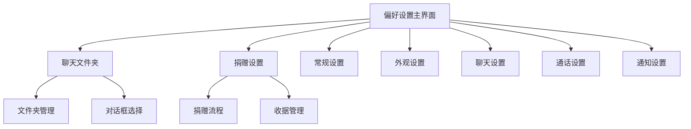
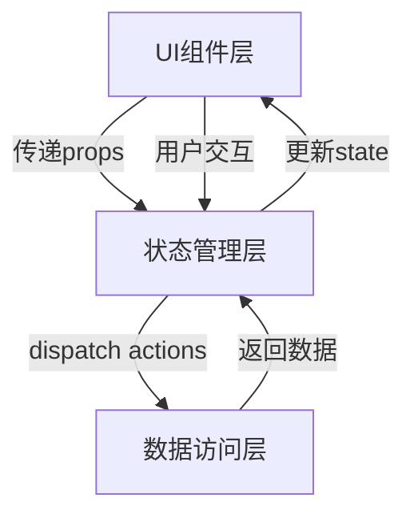
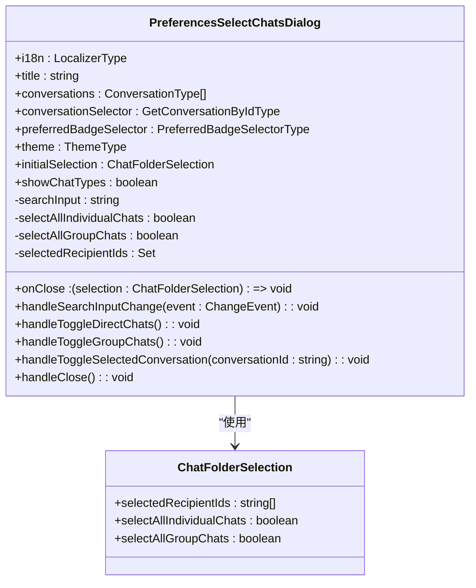
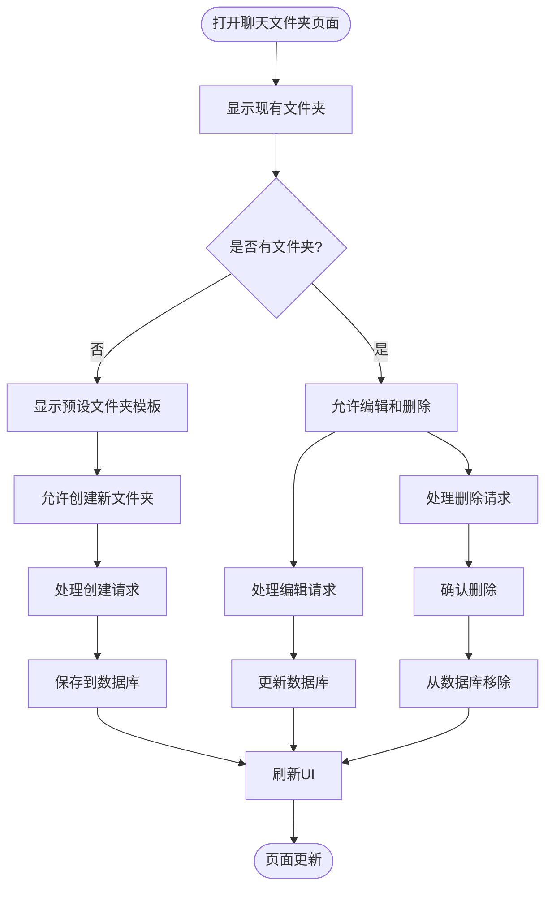
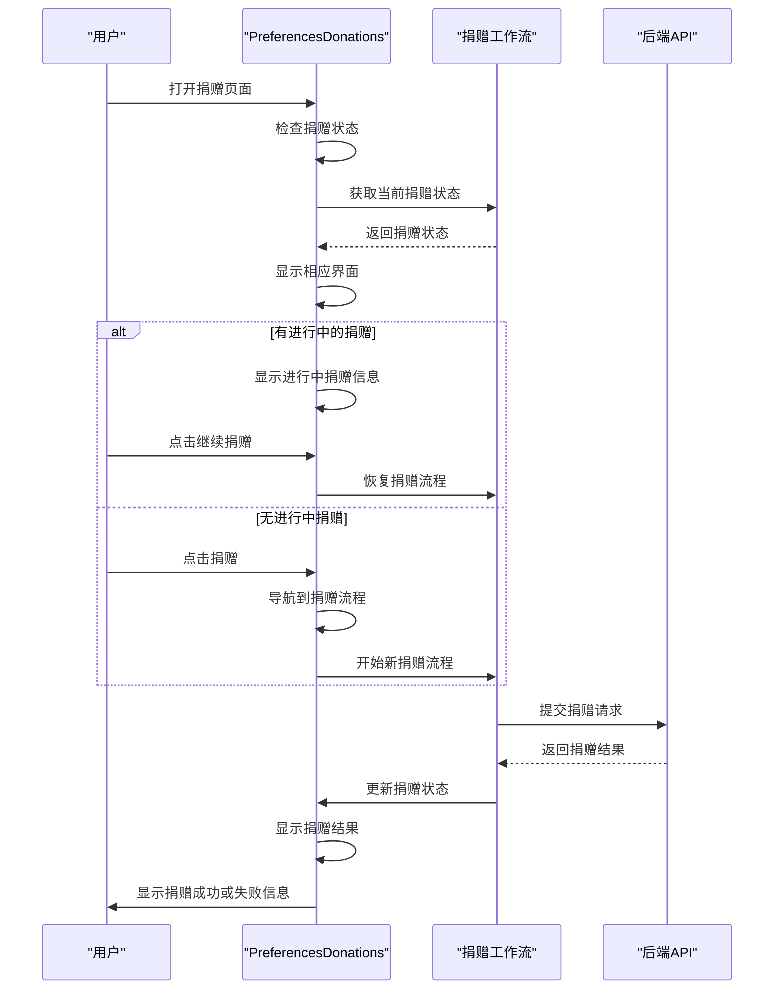
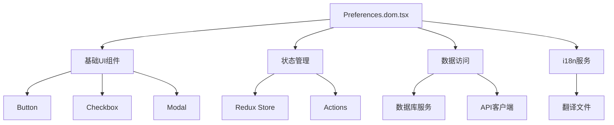

# 偏好设置界面

<cite>
**本文档引用的文件**  
- [Preferences.dom.tsx](file://ts/components/Preferences.dom.tsx)
- [PreferencesSelectChatsDialog.dom.tsx](file://ts/components/preferences/PreferencesSelectChatsDialog.dom.tsx)
- [PreferencesChatFoldersPage.dom.tsx](file://ts/components/preferences/chatFolders/PreferencesChatFoldersPage.dom.tsx)
- [PreferencesEditChatFoldersPage.dom.tsx](file://ts/components/preferences/chatFolders/PreferencesEditChatFoldersPage.dom.tsx)
- [PreferencesDonations.dom.tsx](file://ts/components/PreferencesDonations.dom.tsx)
- [chatFolders.std.ts](file://ts/sql/server/chatFolders.std.ts)
- [chatFolders.preload.ts](file://ts/state/ducks/chatFolders.preload.ts)
- [Preferences.preload.tsx](file://ts/state/smart/Preferences.preload.tsx)
</cite>

## 目录
1. [简介](#简介)
2. [项目结构](#项目结构)
3. [核心组件](#核心组件)
4. [架构概述](#架构概述)
5. [详细组件分析](#详细组件分析)
6. [依赖分析](#依赖分析)
7. [性能考虑](#性能考虑)
8. [故障排除指南](#故障排除指南)
9. [结论](#结论)

## 简介
本文档详细分析Signal-Desktop应用程序的偏好设置界面组件，重点研究聊天文件夹、捐赠设置等核心功能的实现。文档深入探讨PreferencesSelectChatsDialog多选对话框的设计、chatFolders中的文件夹管理逻辑、donations中的捐赠流程集成。提供组件的API文档，包括表单数据绑定、验证规则和状态持久化机制。记录设置界面的导航结构、权限控制和响应式设计实现。包含用户体验细节，如设置更改的实时预览、保存状态反馈和错误提示。

## 项目结构
偏好设置界面的实现分布在多个目录中，主要位于`ts/components/preferences`目录下。该目录包含聊天文件夹和捐赠设置等子功能的独立组件。核心偏好设置组件`Preferences.dom.tsx`位于`ts/components`目录中，负责整体界面的布局和导航。数据管理逻辑分布在`ts/sql/server`和`ts/state/ducks`目录中，处理数据库操作和状态管理。

**Diagram sources**
- [Preferences.dom.tsx](file://ts/components/Preferences.dom.tsx#L379-L800)
- [PreferencesChatFoldersPage.dom.tsx](file://ts/components/preferences/chatFolders/PreferencesChatFoldersPage.dom.tsx#L96-L522)
- [PreferencesDonations.dom.tsx](file://ts/components/PreferencesDonations.dom.tsx#L761-L813)

**Section sources**
- [Preferences.dom.tsx](file://ts/components/Preferences.dom.tsx#L1-L2598)
- [PreferencesChatFoldersPage.dom.tsx](file://ts/components/preferences/chatFolders/PreferencesChatFoldersPage.dom.tsx#L1-L522)

## 核心组件
偏好设置界面的核心组件包括PreferencesSelectChatsDialog、PreferencesChatFoldersPage和PreferencesDonations。PreferencesSelectChatsDialog实现了一个多选对话框，允许用户为聊天文件夹选择对话。PreferencesChatFoldersPage管理聊天文件夹的创建、编辑和删除功能。PreferencesDonations组件处理捐赠流程的集成，包括金额输入、支付信息收集和捐赠状态管理。

**Section sources**
- [PreferencesSelectChatsDialog.dom.tsx](file://ts/components/preferences/PreferencesSelectChatsDialog.dom.tsx#L48-L285)
- [PreferencesChatFoldersPage.dom.tsx](file://ts/components/preferences/chatFolders/PreferencesChatFoldersPage.dom.tsx#L96-L522)
- [PreferencesDonations.dom.tsx](file://ts/components/PreferencesDonations.dom.tsx#L761-L813)

## 架构概述
偏好设置界面采用分层架构设计，由UI组件层、状态管理层和数据访问层组成。UI组件层负责用户界面的渲染和交互，状态管理层管理应用的状态变化，数据访问层处理与数据库的交互。组件之间通过props传递数据和回调函数，实现单向数据流。状态管理使用Redux模式，通过actions和reducers管理应用状态。

**Diagram sources**
- [Preferences.preload.tsx](file://ts/state/smart/Preferences.preload.tsx#L213-L988)
- [Preferences.dom.tsx](file://ts/components/Preferences.dom.tsx#L379-L800)

## 详细组件分析

### PreferencesSelectChatsDialog分析
PreferencesSelectChatsDialog组件实现了一个多选对话框，用于选择聊天文件夹中的对话。该组件支持按聊天类型（个人聊天和群组聊天）进行筛选，并提供搜索功能。用户可以选择特定的对话，也可以选择包含所有个人聊天或所有群组聊天。

#### 对象导向组件：

**Diagram sources**
- [PreferencesSelectChatsDialog.dom.tsx](file://ts/components/preferences/PreferencesSelectChatsDialog.dom.tsx#L30-L285)

**Section sources**
- [PreferencesSelectChatsDialog.dom.tsx](file://ts/components/preferences/PreferencesSelectChatsDialog.dom.tsx#L30-L285)

### 聊天文件夹管理分析
聊天文件夹管理功能包括文件夹的创建、编辑、删除和排序。PreferencesChatFoldersPage组件显示当前的聊天文件夹列表，并支持拖拽排序。用户可以创建自定义文件夹或使用预设的文件夹模板。PreferencesEditChatFoldersPage组件提供文件夹的详细编辑界面。

#### 复杂逻辑组件：

**Diagram sources**
- [PreferencesChatFoldersPage.dom.tsx](file://ts/components/preferences/chatFolders/PreferencesChatFoldersPage.dom.tsx#L96-L522)
- [PreferencesEditChatFoldersPage.dom.tsx](file://ts/components/preferences/chatFolders/PreferencesEditChatFoldersPage.dom.tsx#L1-L500)
- [chatFolders.std.ts](file://ts/sql/server/chatFolders.std.ts#L39-L389)

### 捐赠设置分析
捐赠设置功能通过PreferencesDonations组件实现，提供捐赠流程的完整集成。该组件管理捐赠状态，显示捐赠历史，并处理捐赠流程的导航。捐赠流程包括金额选择、支付信息输入和捐赠确认等步骤。

#### API/服务组件：

**Diagram sources**
- [PreferencesDonations.dom.tsx](file://ts/components/PreferencesDonations.dom.tsx#L187-L813)
- [Preferences.preload.tsx](file://ts/state/smart/Preferences.preload.tsx#L166-L184)

## 依赖分析
偏好设置界面组件依赖于多个其他组件和服务。UI组件依赖于基础组件库，如按钮、复选框和模态框。状态管理依赖于Redux store和相关actions。数据访问依赖于数据库服务和API客户端。国际化功能依赖于i18n服务。

**Diagram sources**
- [Preferences.dom.tsx](file://ts/components/Preferences.dom.tsx#L1-L2598)
- [Preferences.preload.tsx](file://ts/state/smart/Preferences.preload.tsx#L1-L988)

**Section sources**
- [Preferences.dom.tsx](file://ts/components/Preferences.dom.tsx#L1-L2598)
- [Preferences.preload.tsx](file://ts/state/smart/Preferences.preload.tsx#L1-L988)

## 性能考虑
偏好设置界面在性能方面进行了多项优化。组件使用React.memo进行记忆化，避免不必要的重新渲染。列表渲染使用虚拟滚动技术，只渲染可见区域的项目。数据获取采用懒加载策略，只在需要时加载数据。状态更新使用批量处理，减少UI更新次数。

## 故障排除指南
当偏好设置界面出现问题时，可以按照以下步骤进行排查：检查网络连接是否正常，验证用户身份认证状态，确认本地存储是否完整，检查浏览器控制台是否有错误信息，尝试清除缓存并重新加载页面。对于捐赠功能问题，还需检查支付网关连接状态和用户支付信息是否有效。

**Section sources**
- [Preferences.dom.tsx](file://ts/components/Preferences.dom.tsx#L551-L558)
- [PreferencesDonations.dom.tsx](file://ts/components/PreferencesDonations.dom.tsx#L215-L222)

## 结论
Signal-Desktop的偏好设置界面采用现代化的前端架构，实现了良好的用户体验和可维护性。通过组件化设计，界面功能被分解为独立的模块，便于开发和测试。状态管理和数据访问分离，提高了代码的可读性和可维护性。未来可以进一步优化性能，如引入更智能的缓存策略和预加载机制，提升用户交互的流畅性。