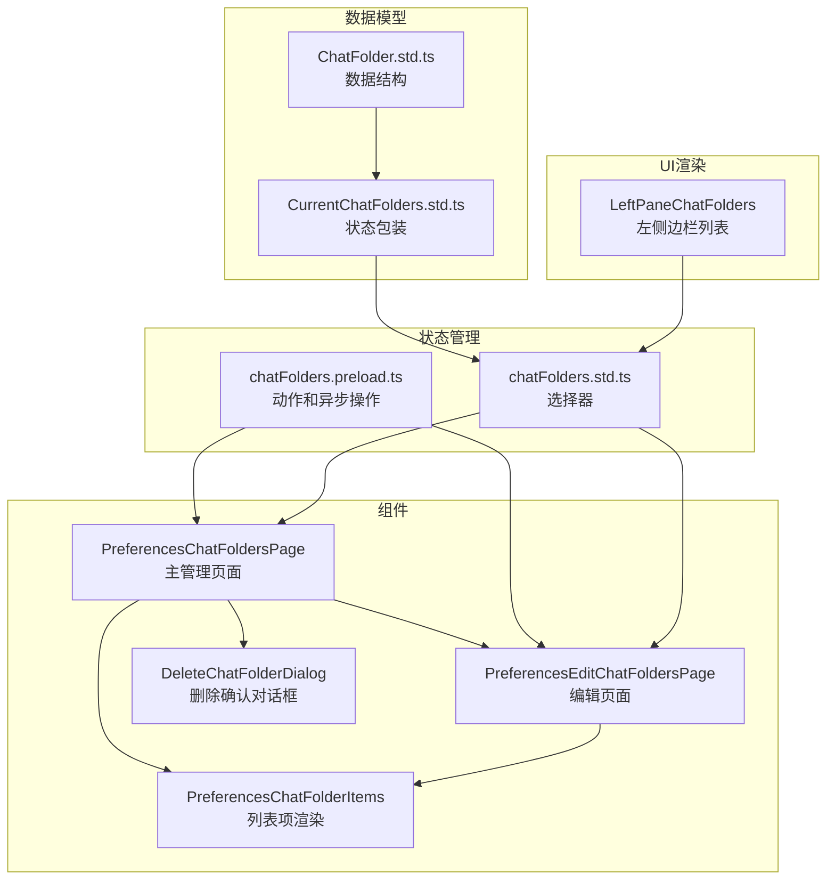
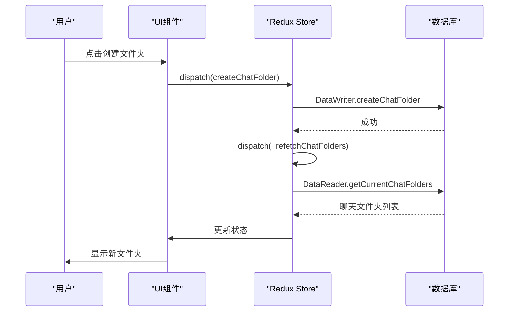
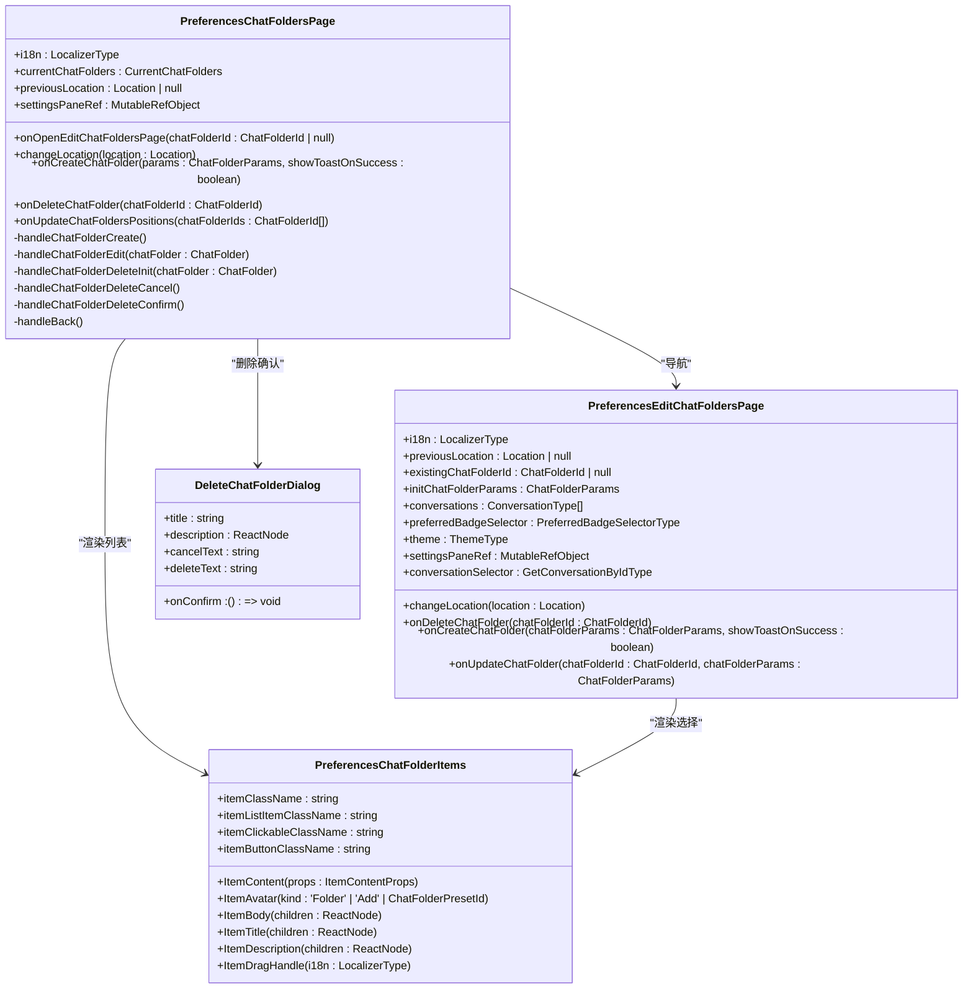
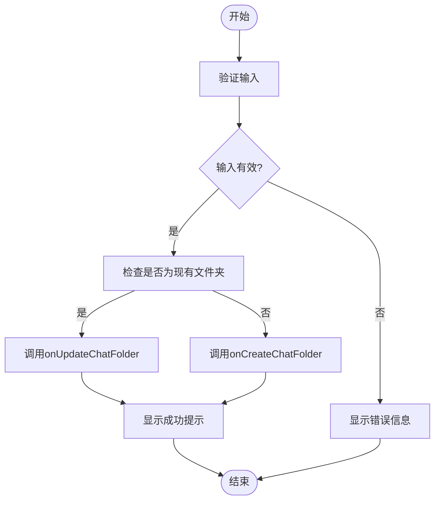
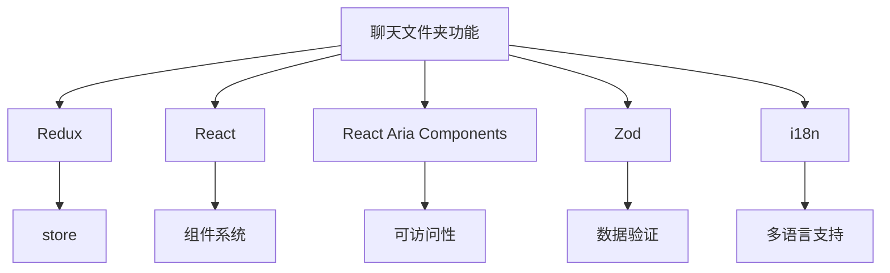

# 聊天文件夹

<cite>
**本文档引用的文件**   
- [PreferencesChatFoldersPage.dom.tsx](file://ts/components/preferences/chatFolders/PreferencesChatFoldersPage.dom.tsx)
- [PreferencesEditChatFoldersPage.dom.tsx](file://ts/components/preferences/chatFolders/PreferencesEditChatFoldersPage.dom.tsx)
- [DeleteChatFolderDialog.dom.tsx](file://ts/components/preferences/chatFolders/DeleteChatFolderDialog.dom.tsx)
- [PreferencesChatFolderItems.dom.tsx](file://ts/components/preferences/chatFolders/PreferencesChatFolderItems.dom.tsx)
- [chatFolders.preload.ts](file://ts/state/ducks/chatFolders.preload.ts)
- [chatFolders.std.ts](file://ts/state/selectors/chatFolders.std.ts)
- [ChatFolder.std.ts](file://ts/types/ChatFolder.std.ts)
- [CurrentChatFolders.std.ts](file://ts/types/CurrentChatFolders.std.ts)
- [LeftPaneChatFolders.dom.tsx](file://ts/components/leftPane/LeftPaneChatFolders.dom.tsx)
- [SmartLeftPaneChatFolders.preload.tsx](file://ts/state/smart/LeftPaneChatFolders.preload.tsx)
</cite>

## 目录
1. [简介](#简介)
2. [项目结构](#项目结构)
3. [核心组件](#核心组件)
4. [架构概述](#架构概述)
5. [详细组件分析](#详细组件分析)
6. [依赖分析](#依赖分析)
7. [性能考虑](#性能考虑)
8. [故障排除指南](#故障排除指南)
9. [结论](#结论)

## 简介
Signal-Desktop的聊天文件夹功能允许用户通过创建自定义文件夹来组织和管理会话。该功能的核心是`PreferencesChatFoldersPage`，作为主管理页面，提供文件夹的创建、编辑、删除和排序功能。用户可以通过`PreferencesEditChatFoldersPage`页面配置文件夹的名称、包含的聊天、排除的聊天以及显示规则。文件夹列表通过`PreferencesChatFolderItems`进行渲染，支持拖拽排序和上下文菜单操作。删除操作通过`DeleteChatFolderDialog`进行确认，确保用户不会误删重要数据。该功能与全局状态store紧密集成，通过Redux管理状态，并与后端数据库同步。

## 项目结构
聊天文件夹功能的代码主要分布在`ts/components/preferences/chatFolders`目录下，包括主管理页面、编辑页面、删除确认对话框和列表项渲染组件。状态管理逻辑位于`ts/state/ducks`和`ts/state/selectors`目录下，数据模型定义在`ts/types`目录下。左侧边栏的文件夹列表由`ts/components/leftPane/LeftPaneChatFolders.dom.tsx`负责渲染。

**图表来源**
- [PreferencesChatFoldersPage.dom.tsx](file://ts/components/preferences/chatFolders/PreferencesChatFoldersPage.dom.tsx)
- [PreferencesEditChatFoldersPage.dom.tsx](file://ts/components/preferences/chatFolders/PreferencesEditChatFoldersPage.dom.tsx)
- [DeleteChatFolderDialog.dom.tsx](file://ts/components/preferences/chatFolders/DeleteChatFolderDialog.dom.tsx)
- [PreferencesChatFolderItems.dom.tsx](file://ts/components/preferences/chatFolders/PreferencesChatFolderItems.dom.tsx)
- [chatFolders.preload.ts](file://ts/state/ducks/chatFolders.preload.ts)
- [chatFolders.std.ts](file://ts/state/selectors/chatFolders.std.ts)
- [ChatFolder.std.ts](file://ts/types/ChatFolder.std.ts)
- [CurrentChatFolders.std.ts](file://ts/types/CurrentChatFolders.std.ts)
- [LeftPaneChatFolders.dom.tsx](file://ts/components/leftPane/LeftPaneChatFolders.dom.tsx)

**章节来源**
- [PreferencesChatFoldersPage.dom.tsx](file://ts/components/preferences/chatFolders/PreferencesChatFoldersPage.dom.tsx)
- [PreferencesEditChatFoldersPage.dom.tsx](file://ts/components/preferences/chatFolders/PreferencesEditChatFoldersPage.dom.tsx)
- [DeleteChatFolderDialog.dom.tsx](file://ts/components/preferences/chatFolders/DeleteChatFolderDialog.dom.tsx)
- [PreferencesChatFolderItems.dom.tsx](file://ts/components/preferences/chatFolders/PreferencesChatFolderItems.dom.tsx)
- [chatFolders.preload.ts](file://ts/state/ducks/chatFolders.preload.ts)
- [chatFolders.std.ts](file://ts/state/selectors/chatFolders.std.ts)
- [ChatFolder.std.ts](file://ts/types/ChatFolder.std.ts)
- [CurrentChatFolders.std.ts](file://ts/types/CurrentChatFolders.std.ts)
- [LeftPaneChatFolders.dom.tsx](file://ts/components/leftPane/LeftPaneChatFolders.dom.tsx)

## 核心组件
聊天文件夹功能的核心组件包括`PreferencesChatFoldersPage`、`PreferencesEditChatFoldersPage`、`DeleteChatFolderDialog`和`PreferencesChatFolderItems`。`PreferencesChatFoldersPage`作为主管理页面，负责展示所有文件夹并提供创建和管理入口。`PreferencesEditChatFoldersPage`处理文件夹的创建和编辑逻辑，包括名称、包含和排除的聊天以及显示规则。`DeleteChatFolderDialog`提供删除确认流程，确保用户操作的安全性。`PreferencesChatFolderItems`负责渲染文件夹列表，支持拖拽排序和上下文菜单操作。

**章节来源**
- [PreferencesChatFoldersPage.dom.tsx](file://ts/components/preferences/chatFolders/PreferencesChatFoldersPage.dom.tsx)
- [PreferencesEditChatFoldersPage.dom.tsx](file://ts/components/preferences/chatFolders/PreferencesEditChatFoldersPage.dom.tsx)
- [DeleteChatFolderDialog.dom.tsx](file://ts/components/preferences/chatFolders/DeleteChatFolderDialog.dom.tsx)
- [PreferencesChatFolderItems.dom.tsx](file://ts/components/preferences/chatFolders/PreferencesChatFolderItems.dom.tsx)

## 架构概述
聊天文件夹功能采用React和Redux架构，组件负责UI渲染，Redux负责状态管理。数据流从全局store通过选择器(selectors)传递到智能组件(smart components)，再传递到展示组件(presentational components)。用户操作通过动作(actions)触发异步操作(thunks)，更新数据库后重新加载状态。整个架构确保了状态的一致性和可预测性。

**图表来源**
- [chatFolders.preload.ts](file://ts/state/ducks/chatFolders.preload.ts)
- [PreferencesChatFoldersPage.dom.tsx](file://ts/components/preferences/chatFolders/PreferencesChatFoldersPage.dom.tsx)
- [PreferencesEditChatFoldersPage.dom.tsx](file://ts/components/preferences/chatFolders/PreferencesEditChatFoldersPage.dom.tsx)

## 详细组件分析

### PreferencesChatFoldersPage分析
`PreferencesChatFoldersPage`是聊天文件夹的主管理页面，负责展示所有文件夹并提供创建和管理功能。页面通过`currentChatFolders`属性接收当前所有文件夹，使用`ListBox`组件渲染可拖拽排序的列表。用户可以通过点击"创建文件夹"按钮进入编辑页面，或通过上下文菜单编辑或删除现有文件夹。页面还显示系统预设的文件夹建议，如未读聊天、个人聊天和群组聊天。

#### 组件关系图

**图表来源**
- [PreferencesChatFoldersPage.dom.tsx](file://ts/components/preferences/chatFolders/PreferencesChatFoldersPage.dom.tsx)
- [PreferencesEditChatFoldersPage.dom.tsx](file://ts/components/preferences/chatFolders/PreferencesEditChatFoldersPage.dom.tsx)
- [DeleteChatFolderDialog.dom.tsx](file://ts/components/preferences/chatFolders/DeleteChatFolderDialog.dom.tsx)
- [PreferencesChatFolderItems.dom.tsx](file://ts/components/preferences/chatFolders/PreferencesChatFolderItems.dom.tsx)

**章节来源**
- [PreferencesChatFoldersPage.dom.tsx](file://ts/components/preferences/chatFolders/PreferencesChatFoldersPage.dom.tsx)

### PreferencesEditChatFoldersPage分析
`PreferencesEditChatFoldersPage`负责处理文件夹的创建和编辑逻辑。页面通过`existingChatFolderId`属性判断是创建新文件夹还是编辑现有文件夹。用户可以设置文件夹名称，通过表情选择器添加表情符号。通过"包含的聊天"和"排除的聊天"按钮，用户可以选择特定的聊天会话。页面还提供两个开关：仅显示未读聊天和包含已静音聊天，用于过滤会话列表。

#### 操作流程图

**图表来源**
- [PreferencesEditChatFoldersPage.dom.tsx](file://ts/components/preferences/chatFolders/PreferencesEditChatFoldersPage.dom.tsx)

**章节来源**
- [PreferencesEditChatFoldersPage.dom.tsx](file://ts/components/preferences/chatFolders/PreferencesEditChatFoldersPage.dom.tsx)

### PreferencesChatFolderItems分析
`PreferencesChatFolderItems`包含一系列用于渲染文件夹列表项的组件。`ItemContent`、`ItemAvatar`、`ItemBody`、`ItemTitle`和`ItemDescription`组件用于构建列表项的各个部分。`ItemDragHandle`组件提供拖拽手柄，支持用户通过拖拽来重新排序文件夹。这些组件通过CSS类名和Tailwind样式进行样式化，确保一致的视觉效果。

**章节来源**
- [PreferencesChatFolderItems.dom.tsx](file://ts/components/preferences/chatFolders/PreferencesChatFolderItems.dom.tsx)

### DeleteChatFolderDialog分析
`DeleteChatFolderDialog`是一个确认对话框，用于防止用户误删文件夹。对话框通过`AxoAlertDialog`组件实现，显示文件夹名称以确认删除操作。用户需要点击"删除"按钮才能确认操作，点击"取消"按钮则关闭对话框。删除操作通过`onDeleteChatFolder`回调函数执行，确保状态管理的一致性。

**章节来源**
- [DeleteChatFolderDialog.dom.tsx](file://ts/components/preferences/chatFolders/DeleteChatFolderDialog.dom.tsx)

## 依赖分析
聊天文件夹功能依赖于多个核心模块和库。状态管理依赖于Redux，通过`useSelector`和`useDispatch`钩子与store交互。UI组件依赖于React和React Aria Components，确保可访问性和交互性。数据验证使用Zod库，确保数据的完整性和正确性。国际化支持通过`i18n`对象实现，支持多语言界面。

**图表来源**
- [chatFolders.preload.ts](file://ts/state/ducks/chatFolders.preload.ts)
- [PreferencesChatFoldersPage.dom.tsx](file://ts/components/preferences/chatFolders/PreferencesChatFoldersPage.dom.tsx)
- [PreferencesEditChatFoldersPage.dom.tsx](file://ts/components/preferences/chatFolders/PreferencesEditChatFoldersPage.dom.tsx)

**章节来源**
- [chatFolders.preload.ts](file://ts/state/ducks/chatFolders.preload.ts)
- [PreferencesChatFoldersPage.dom.tsx](file://ts/components/preferences/chatFolders/PreferencesChatFoldersPage.dom.tsx)
- [PreferencesEditChatFoldersPage.dom.tsx](file://ts/components/preferences/chatFolders/PreferencesEditChatFoldersPage.dom.tsx)

## 性能考虑
聊天文件夹功能在性能方面进行了优化。文件夹列表的重新排序使用`throttle`函数限制频率，避免频繁的数据库操作。状态更新通过`useMemo`和`useCallback`钩子进行优化，减少不必要的重新渲染。数据读取和写入操作通过`DataReader`和`DataWriter`抽象层进行，确保与后端数据库的高效交互。

## 故障排除指南
如果聊天文件夹功能出现问题，可以检查以下方面：确保数据库连接正常，检查Redux store中的`currentChatFolders`状态是否正确加载，验证`PreferencesChatFoldersPage`组件的props是否正确传递。对于删除操作失败，检查`onDeleteChatFolder`回调函数是否正确注册。对于排序问题，检查拖拽事件处理逻辑和`updateChatFoldersPositions`动作的执行情况。

**章节来源**
- [chatFolders.preload.ts](file://ts/state/ducks/chatFolders.preload.ts)
- [PreferencesChatFoldersPage.dom.tsx](file://ts/components/preferences/chatFolders/PreferencesChatFoldersPage.dom.tsx)
- [PreferencesEditChatFoldersPage.dom.tsx](file://ts/components/preferences/chatFolders/PreferencesEditChatFoldersPage.dom.tsx)

## 结论
Signal-Desktop的聊天文件夹功能通过清晰的组件划分和合理的状态管理，为用户提供了一个强大而直观的会话组织工具。主管理页面`PreferencesChatFoldersPage`提供了全面的管理功能，编辑页面`PreferencesEditChatFoldersPage`支持灵活的配置选项，删除确认对话框`DeleteChatFolderDialog`确保了操作的安全性。整个功能与全局状态store紧密集成，通过Redux管理状态，确保了数据的一致性和可预测性。未来可以考虑增加更多预设文件夹类型和更高级的过滤规则，进一步提升用户体验。